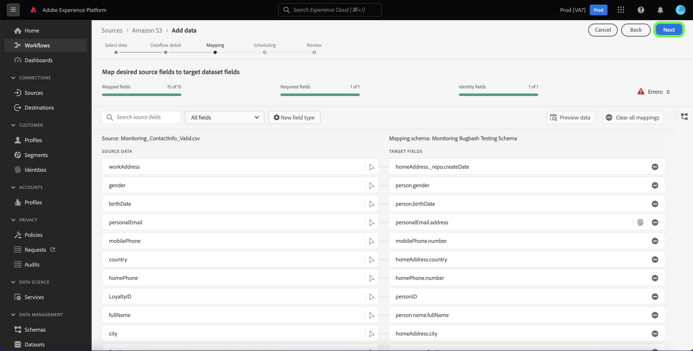
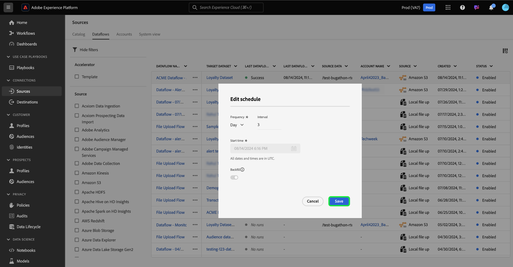

# 更新UI中的数据流

阅读本教程，了解如何使用Adobe Experience Platform用户界面中的源工作区更新现有数据流（包括其计划和映射配置）的步骤。

## 快速入门

本教程需要对以下Experience Platform组件有一定的了解：

* [源](../../home.md)： Experience Platform允许从各种源摄取数据，同时让您能够使用Experience Platform服务来构建、标记和增强传入数据。
* [沙盒](../../../sandboxes/home.md)： Experience Platform提供了将单个Experience Platform实例划分为多个单独的虚拟环境的虚拟沙盒，以帮助开发和改进数字体验应用程序。

## 更新数据流 {#update-dataflows}

>[!CONTEXTUALHELP]
>id="platform_sources_dataflows_daysRemaining"
>title="数据集有效期限"
>abstract="此列指示目标数据集在自动到期之前剩余的天数。 如果目标数据集到期，则数据流将失败。要防止数据流失败，请确保将目标数据集设置为在正确的日期到期。请参阅文档以了解如何更新过期日期。"

在Experience Platform UI中，从左侧导航中选择&#x200B;**[!UICONTROL 源]**，然后从顶部标题中选择&#x200B;**[!UICONTROL 数据流]**。

>[!TIP]
>
>您可以使用过滤功能对数据流进行排序和过滤。 有关详细信息，请阅读在UI[&#128279;](./filter.md)中筛选源对象的指南。

[!UICONTROL 数据流]页面显示组织中所有现有数据流的列表。 找到要更新的数据流，然后选择它旁边的省略号(`...`)。 此时会显示一个下拉菜单，其中显示了可供选择的选项列表，用于对现有数据流进行其他配置。

要更新数据流，请选择&#x200B;**[!UICONTROL 更新数据流]**。

您将进入源工作流，您可以继续更新数据流的各个方面，包括在[!UICONTROL 提供数据流详细信息]步骤中的详细信息。

### 更新映射 {#update-mapping}

>[!NOTE]
>
>以下源当前不支持编辑映射功能： Adobe Analytics、Adobe Audience Manager、HTTP API和[!DNL Marketo Engage]。

在此过程中，您还可以更新与数据流关联的映射集。  映射界面显示数据流的现有映射，而不是新的推荐映射集。 映射更新仅适用于计划在未来运行的数据流。 计划进行一次性摄取的数据流无法更新其映射集。

使用映射接口修改应用于数据流的映射集。 有关如何使用映射界面的完整步骤，请参阅[数据准备UI指南](../../../data-prep/ui/mapping.md)以了解更多信息。

### 更新计划

更新数据流的映射后，您可以继续更新摄取计划，以使用数据流的新映射数据来摄取数据流。 您只能更新配置为按定期计划摄取的数据流的摄取计划。 无法重新计划为一次性摄取配置的数据流。

您还可以使用数据流页面中提供的内联更新选项更新数据流的摄取计划。

从数据流页面中，选择数据流名称旁边的省略号(`...`)，然后从显示的下拉菜单中选择&#x200B;**[!UICONTROL 编辑计划]**。

**[!UICONTROL 编辑计划]**&#x200B;对话框为您提供了更新数据流的摄取频率和间隔率的选项。 设置更新的频率和间隔值后，选择&#x200B;**[!UICONTROL 保存]**。

### 禁用数据流

您可以使用相同的下拉菜单禁用数据流。 要禁用数据流，请选择&#x200B;**[!UICONTROL 禁用数据流]**。

接下来，从出现的弹出窗口中选择[!UICONTROL 禁用]。

如果您稍后重新启用此数据流，Experience Platform将自动安排回填运行，以涵盖禁用此数据流的时段。 例如，如果数据流配置为每小时运行并且禁用了48小时，则重新启用此数据流时，Experience Platform将创建48次回填运行以处理缺失的时间间隔。

## 后续步骤

通过学习本教程，您已成功使用[!UICONTROL 源]工作区来更新数据流的摄取计划和映射集。

有关如何使用[!DNL Flow Service] API以编程方式执行这些操作的步骤，请参阅有关[使用流服务API更新数据流](../../tutorials/api/update-dataflows.md)的教程。
