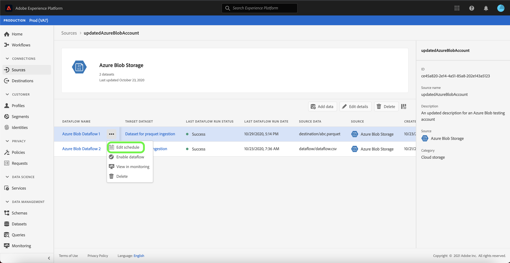

# 在UI中更新帐户详细信息

在某些情况下，可能需要更新现有源帐户的详细信息。 [!UICONTROL Sources]工作区允许您添加、编辑和删除现有批处理或流连接的详细信息，包括其名称、说明和凭据。

[!UICONTROL Sources]工作区还允许您编辑批处理数据流的计划，从而允许您更新其摄取频率和间隔速率。

本教程提供了从[!UICONTROL Sources]工作区更新现有帐户的详细信息和凭据以及更新数据流的摄取计划的步骤。

## 入门指南

本教程需要对Adobe Experience Platform的以下组件有充分的了解：

- [来源](../../home.md):Experience Platform允许从各种来源摄取数据，同时使您能够使用平台服务来构建、标记和增强传入数据。
- [沙箱](../../../sandboxes/home.md):Experience Platform提供将单个平台实例分为单独虚拟环境的虚拟沙箱，以帮助开发和发展数字体验应用程序。

## 更新帐户

登录到[Experience PlatformUI](https://platform.adobe.com)，然后从左侧导航中选择&#x200B;**[!UICONTROL 源]**&#x200B;以访问[!UICONTROL 源]工作区。 从顶部标题中选择&#x200B;**[!UICONTROL 帐户]**&#x200B;以视图现有帐户。

将显示&#x200B;**[!UICONTROL 帐户]**&#x200B;页。 本页是可查看帐户的列表，包括有关其源、用户名、数据流数和创建日期的信息。

选择左上角的过滤器图标以启动排序面板。

排序面板提供所有源的列表。 您可以从列表中选择多个源，以访问与不同源关联的筛选帐户选择。

选择要处理的源，以查看其现有帐户的列表。 确定要更新的帐户后，请选择帐户名称旁边的省略号(`...`)。

此时将显示一个下拉菜单，其中提供了以下选项：**[!UICONTROL 添加数据]**、**[!UICONTROL 编辑详细信息]**&#x200B;和&#x200B;**[!UICONTROL 删除]**。 从菜单中选择&#x200B;**[!UICONTROL 编辑详细信息]**&#x200B;以更新您的帐户。

在&#x200B;**[!UICONTROL 编辑帐户详细信息]**&#x200B;对话框中，可以更新帐户的名称、说明和身份验证凭据。 更新所需信息后，选择&#x200B;**[!UICONTROL 保存]**。

稍后，屏幕底部会显示一个确认框，确认更新成功。

## 编辑计划

可以从&#x200B;**[!UICONTROL 帐户]**&#x200B;页编辑数据流的摄取计划。 在帐户列表中，选择包含要重新计划的数据流的帐户。

此时将显示数据流页。 此页包含与所选帐户关联的现有数据流列表。 选择要重新计划的数据流旁边的省略号(`...`)。

出现下拉菜单，提供以下选项：**[!UICONTROL 编辑计划]**、**[!UICONTROL 启用视图流]**、**[!UICONTROL 监视中的数据流]**&#x200B;和&#x200B;**[!UICONTROL 删除]**。 从菜单中选择&#x200B;**[!UICONTROL 编辑计划]**。

**[!UICONTROL 编辑计划]**&#x200B;对话框为您提供了用于更新数据流的摄取频率和间隔速率的选项。 设置更新的频率和间隔值后，请选择&#x200B;**[!UICONTROL 保存]**。

| 计划 | 描述 |
| ---------- | ----------- |
| 频度 | 数据流收集数据的频率。 可接受的值用于编辑现有数据流的频率计划，包括：`minute`、`hour`、`day`或`week`。 |
| 间隔 | 该间隔指定两个连续流运行之间的周期。 间隔的值应为非零整数，且必须大于或等于`15`。 |

稍后，屏幕底部会显示一个确认框，确认更新成功。

## 后续步骤

通过本教程，您已成功使用[!UICONTROL Sources]工作区更新帐户信息并编辑数据流计划。

有关如何使用[!DNL Flow Service] API以编程方式执行这些操作的步骤，请参阅有关使用流服务API](../../tutorials/api/update.md)更新连接信息的教程。[