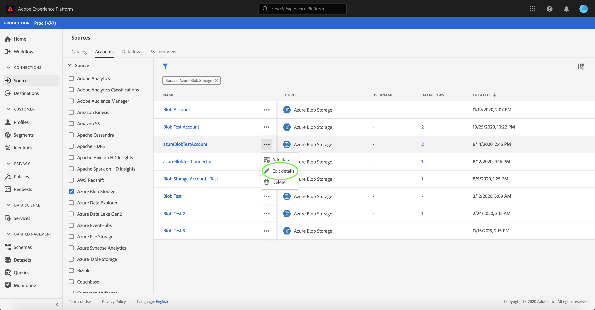

# 在UI中更新帐户详细信息

在某些情况下，可能需要更新现有源帐户的详细信息。 [!UICONTROL 源]工作区允许您添加、编辑和删除现有批次或流连接的详细信息，包括其名称、描述和凭据。

本教程提供了从[!UICONTROL 源]工作区更新现有帐户的详细信息和凭据的步骤。

## 快速入门

本教程需要对以下Adobe Experience Platform组件有一定的了解：

- [源](../../home.md)： Experience Platform允许从各种源摄取数据，同时让您能够使用Experience Platform服务来构建、标记和增强传入数据。
- [沙盒](../../../sandboxes/home.md)： Experience Platform提供了将单个Experience Platform实例划分为多个单独的虚拟环境的虚拟沙盒，以帮助开发和改进数字体验应用程序。

## 更新帐户

登录到[Experience Platform UI](https://platform.adobe.com)，然后从左侧导航中选择&#x200B;**[!UICONTROL 源]**&#x200B;以访问[!UICONTROL 源]工作区。 从顶部标题中选择&#x200B;**[!UICONTROL 帐户]**&#x200B;以查看现有帐户。

此时会显示&#x200B;**[!UICONTROL 帐户]**&#x200B;页面。 本页是可查看帐户的列表，包括有关其源、用户名、数据流数量和创建日期的信息。

选择左上角的过滤器图标以启动排序面板。

排序面板提供所有源的列表。 您可以从列表中选择多个源，以访问与不同源关联的已过滤的帐户选择。

选择要使用的源以查看其现有帐户的列表。 标识要更新的帐户后，选择帐户名称旁边的省略号(`...`)。

出现下拉菜单，为您提供&#x200B;**[!UICONTROL 添加数据]**、**[!UICONTROL 编辑详细信息]**&#x200B;和&#x200B;**[!UICONTROL 删除]**&#x200B;的选项。 从菜单中选择&#x200B;**[!UICONTROL 编辑详细信息]**&#x200B;以更新您的帐户。

通过&#x200B;**[!UICONTROL 编辑帐户详细信息]**&#x200B;对话框，您可以更新帐户的名称、描述和身份验证凭据。 更新所需信息后，选择&#x200B;**[!UICONTROL 保存]**。

片刻后，屏幕底部会显示一个确认框，用于确认更新是否成功。

## 后续步骤

通过完成本教程，您已成功使用[!UICONTROL 源]工作区来更新现有源帐户的信息。

有关如何使用[!DNL Flow Service] API以编程方式执行这些操作的步骤，请参阅有关[使用流服务API更新连接信息的教程](../../tutorials/api/update.md)。
