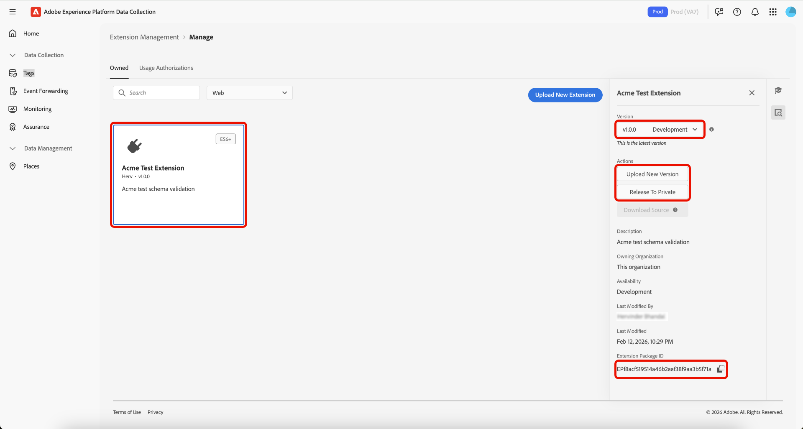

# 标记扩展管理

Adobe Experience Platform允许您管理&#x200B;**[!UICONTROL Owned]**&#x200B;扩展。 您可以上传新扩展，部署新版本，然后将它们发布为私有或公开版本。

## 管理扩展  {#manage-extension}

在本地准备扩展包后，请在数据收集UI中使用&#x200B;**[!UICONTROL Extension Management]**&#x200B;通过&#x200B;**开发**、**专用**&#x200B;和&#x200B;**公共**&#x200B;可用性上载扩展包、验证包和发行版本。 然后，您可以在资产上安装该扩展并将其用于测试。

### 上传扩展 {#upload-extension}

要上传扩展，请导航到数据收集UI，然后从左侧导航中选择&#x200B;**[!UICONTROL Extension Management]**。 从此处选择&#x200B;**[!UICONTROL Owned]**&#x200B;选项卡。 此选项卡显示您或您的组织拥有的任何扩展。 这些扩展由平台分隔，您可以使用下拉菜单查看每个平台上的扩展（Web、移动设备和Edge）。 选择 **[!UICONTROL Upload New Extension]**。

在&#x200B;**上载新扩展**&#x200B;页面上，选择&#x200B;**[!UICONTROL Select Extension Folder]**，导航到包含扩展名的文件夹，选择该文件夹，然后选择&#x200B;**[!UICONTROL Upload]**。

在本地文件夹中选择了

通过选择&#x200B;**[!UICONTROL Upload]**&#x200B;确认将上传的文件数。

将显示将上传的文件数，包括扩展名和版本。 您可以选择执行&#x200B;**[!UICONTROL Dry Run]**，将zip文件下载到本地计算机进行检查。 选择 **[!UICONTROL Validate & Upload]**。

确认您的扩展已成功上传和处理，并显示您的&#x200B;**扩展包ID**。 选择&#x200B;**[!UICONTROL Close]**&#x200B;以返回显示扩展的&#x200B;**[!UICONTROL Owned]**&#x200B;选项卡。

您会返回到显示已上载扩展的[!UICONTROL Owned]选项卡。

>[!IMPORTANT]
>
>扩展在&#x200B;**开发**&#x200B;可用性中上传。 在将&#x200B;**开发**&#x200B;可用性中的扩展发布到&#x200B;**专用**&#x200B;可用性之前，无法共享这些扩展。

### 发布扩展 {#release-extension}

要发布私有的扩展，请选择您的扩展以在右侧显示信息面板。 在这里，您可以看到扩展的以下详细信息：

* **版本** — 显示最新版本及其当前状态。 您可以使用下拉菜单查看扩展的版本历史记录。
* **操作** — 允许您&#x200B;**[!UICONTROL Upload New Version]**&#x200B;扩展和&#x200B;**[!UICONTROL Release To Private]**。
* **扩展包ID** — 显示在底部。 此更改将取决于所选的版本。

选择&#x200B;**[!UICONTROL Release To Private]**，然后再次选择&#x200B;**[!UICONTROL Release To Private]**&#x200B;以确认发布。

一旦扩展成功发布到&#x200B;**Private**&#x200B;可用性，即收到确认。 更新的可用性将显示在右侧面板中。

>[!NOTE]
>
>扩展发布到&#x200B;**Private**&#x200B;后，便可以与其他组织共享。

若要将扩展发布到&#x200B;**Public**&#x200B;可用性，请从右侧面板中选择&#x200B;**[!UICONTROL Request Public Release]**。

**[!UICONTROL Release Extension Package]**&#x200B;屏幕提供了请求表单上所需的详细信息，并提供了复制这些详细信息的选项。 选择 **[!UICONTROL Go To Request Form]**。

此时将打开一个包含请求表单的新浏览器选项卡。 将&#x200B;**[!UICONTROL Release Extension Package]**&#x200B;屏幕中的信息复制并粘贴到相关字段中。 提交已完成的表单以供审查。 一旦扩展被公开，您将会收到通知。

## 与其他组织共享扩展包 {#share-extension}

>[!NOTE]
>
>扩展包必须具有私有或公共的版本，才能通过[!UICONTROL Usage Authorizations]共享。 标记为开发可用性的版本不符合共享条件，将不会显示在授权下拉列表中。 即使已共享早期版本（例如1.0.0）也是如此。 较新的版本（例如1.0.1）必须至少设为私有，接收组织才能授权或安装这些版本。
>
>如果您稍后选择公开私有扩展包，则有关共享私有扩展包的所有指南也将适用。 无论包的可用性状态如何，有关可见性、版本控制、安全性、兼容性、支持和文档的相同考虑因素仍然适用。

**[!UICONTROL Usage Authorizations]**&#x200B;是一项强大的功能，您可以使用它来安全地与受信任的合作伙伴共享私有扩展包，而无需在扩展目录中公开提供它们。 使用此功能可在组织之间创建安全的桥梁，允许您利用彼此的自定义扩展代码，同时维护对专有解决方案的隐私和控制。

组织通常会针对其独特的业务需求开发专门的扩展。 这些扩展可能包含不应公开发布的专有逻辑、自定义集成或敏感配置。 使用授权通过实现以下功能解决了此难题：

* **选择性共享**：仅与受信任的合作伙伴组织共享私有扩展。
* **维护的隐私**：将敏感扩展代码保留在公共目录之外。
* **协作开发**：使受信任的合作伙伴能够从您的自定义解决方案中获益。
* **受控访问**：对谁可以访问和使用您的私有扩展保持完全控制。

共享过程涉及两个关键参与者：

1. **共享组织**：拥有并共享私有扩展包的组织
2. **正在接收组织**：已获得共享扩展的访问权限的受信任组织

共享专用版本时，接收组织将获得对该特定版本的访问权限，从而在这两个组织之间建立直接连接。 如果较新的版本稍后变为私有，接收组织也可以使用该版本，而无需执行任何其他步骤。

### 创建扩展包使用授权 {#package-usage-authorization}

要共享扩展，请导航到数据收集UI，然后从左侧导航中选择&#x200B;**[!UICONTROL Extension Management]**。 从此处选择&#x200B;**[!UICONTROL Usage Authorizations]**&#x200B;选项卡。

在这里，您将看到一个现有共享授权的列表，该列表分为两个类别：

* **已与此组织共享**：其他组织已与您共享的扩展。
* **与其他组织共享**：已与其他组织共享的扩展。

选择 **[!UICONTROL Add Authorization]**。

![显示与此组织共享的扩展列表的[!UICONTROL Usage Authorizations]选项卡，突出显示[!UICONTROL Add Authorization]](../images/shared-extensions/add-authorization.png)

>[!IMPORTANT]
>
>您必须获取目标组织的&#x200B;**`Organization ID`**&#x200B;该组织的所有者。 无法按名称搜索组织。

从下拉菜单中选择要为其授权扩展的&#x200B;**[!UICONTROL Platform]**。 您可以共享&#x200B;**[!UICONTROL Web]**、**[!UICONTROL Mobile]**&#x200B;和&#x200B;**[!UICONTROL Edge]**&#x200B;扩展。

接下来，在下拉菜单中选择要从可用扩展共享的&#x200B;**[!UICONTROL Extension]**。 该列表显示贵组织拥有的扩展及其可用性状态。 最新版本处于&#x200B;**开发**&#x200B;可用性的扩展将不会出现在此列表中。

接下来，输入接收组织的ID，然后选择&#x200B;**[!UICONTROL Save]**。

![显示选定扩展和输入的Adobe组织ID的[!UICONTROL Create extension package usage authorization]页面，突出显示[!UICONTROL Save]](../images/shared-extensions/save-authorization.png)

您将返回到[!UICONTROL Usage Authorizations]选项卡，您可以在其中看到&#x200B;**[!UICONTROL Shared with other orgs]**&#x200B;列表中的扩展。 在接收组织批准授权之前，状态将显示&#x200B;**等待批准**，届时将更新为&#x200B;**已批准**。

![显示与其他组织共享的扩展列表的[!UICONTROL Usage Authorizations]选项卡，突出显示新授权](../images/shared-extensions/new-authorization.png)

>[!TIP]
>
>您还可以直接从&#x200B;**[!UICONTROL Extension Catalog]**&#x200B;中共享扩展，方法是选择扩展卡上的菜单(⋯)，然后从菜单中选择共享选项。

当授权处于活动状态时，共享扩展会在目录中显示&#x200B;***共享***&#x200B;徽章，指示它正在与其他组织共享。

![显示带有徽章的共享扩展的[!UICONTROL Catalog]选项卡](../images/shared-extensions/sharing-badge.png)

### 授权和管理共享扩展 {#manage-shared-extension}

>[!NOTE]
>
>作为接收组织，您只能批准或拒绝共享扩展。 您无法管理或修改授权详细信息，因为这些详细信息由共享组织控制。

要授权贵组织的共享扩展，请导航到数据收集UI，并从左侧导航中选择&#x200B;**[!UICONTROL Extension Management]**，然后选择&#x200B;**[!UICONTROL Usage Authorizations]**&#x200B;选项卡。

您可以在&#x200B;**部分中看到共享扩展的列表，包括那些**&#x200B;等待批准&#x200B;**[!UICONTROL Shared with this org]**。 选择要批准的扩展，然后选择&#x200B;**[!UICONTROL Approve]**。

![该[!UICONTROL Usage Authorizations]选项卡显示与此组织共享的扩展列表，该扩展具有等待批准的选定扩展，突出显示[!UICONTROL Approve]](../images/shared-extensions/approve-authorization.png)

>[!NOTE]
>
>如果您的组织不再需要共享扩展，您还可以在&#x200B;**[!UICONTROL Usage Authorizations]**&#x200B;选项卡中拒绝请求。

在&#x200B;**[!UICONTROL OK]**&#x200B;对话框中选择&#x200B;**[!UICONTROL Authorization Usages]**。

![ [!UICONTROL Authorization Usages]对话框，突出显示[!UICONTROL OK]](../images/shared-extensions/confirmation.png)

返回到[!UICONTROL Usage Authorizations]选项卡，此时可以看到扩展现在显示&#x200B;**已批准**&#x200B;状态。

![显示与此组织共享的扩展列表的[!UICONTROL Usage Authorizations]选项卡，突出显示状态为“已批准”的扩展](../images/shared-extensions/approved-authorization.png)

授权获得批准后，该扩展即可在您的目录中可用，并可像任何其他扩展一样安装和使用。 共享扩展显示&#x200B;***接收***&#x200B;徽章，指示它是其他组织与您共享的扩展。

![显示具有“Receiving”徽章的共享扩展的[!UICONTROL Catalog]选项卡](../images/shared-extensions/receiving-badge.png)

### 撤销授权 {#revoke-authorization}

作为所属组织，您可以随时删除授权，而不考虑其当前状态（“等待审批”、“已拒绝”或“已批准”）。

**如果您的扩展从未公开：**

* 接收组织已安装的任何专用版本将继续显示在其已安装的扩展列表中。
* 如果接收组织从未安装扩展，则扩展将不再出现在其界面中的任何位置。

**如果您的扩展已公开：**

* 接收组织安装的任何专用版本都将在其已安装的扩展列表中保持可见。
* 如果他们从未安装您的专用版本，则仍会在目录中看到最新的公共版本并且可以安装它。
* 如果需要，它们还可以从您的专用版本降级到最新的可用公共版本。

当您撤销授权时，接收组织保留某些保护其现有实施的权限：

* **继续使用**：接收组织可以继续使用他们已安装的任何私有版本，即使在您撤销访问权限之后也是如此。
* **生成保护**：如果接收组织安装了您的私有版本1.0.0，而您稍后发布了私有版本1.0.1，则接收组织将无法看到较新的版本，但可以继续使用v1.0.0进行生成而不会出现中断。
* **未来升级**：如果您稍后将扩展设为公用（例如，公开发布v2.0.0），则接收组织可以从其专用的v1.0.0直接升级到新的公用v2.0.0。

>[!IMPORTANT]
>
>撤销授权不会破坏现有的构建或实施。 接收组织维护对其已安装的任何专用版本的访问权限，以确保业务连续性。

## 后续步骤 {#next-steps}

本文档演示了如何使用Experience Platform中的共享扩展功能。 有关扩展开发的信息，请参阅[扩展开发用户指南](./getting-started.md)。

有关Experience Platform中扩展开发的高级概述，请参阅[概述文档](./overview.md)。
