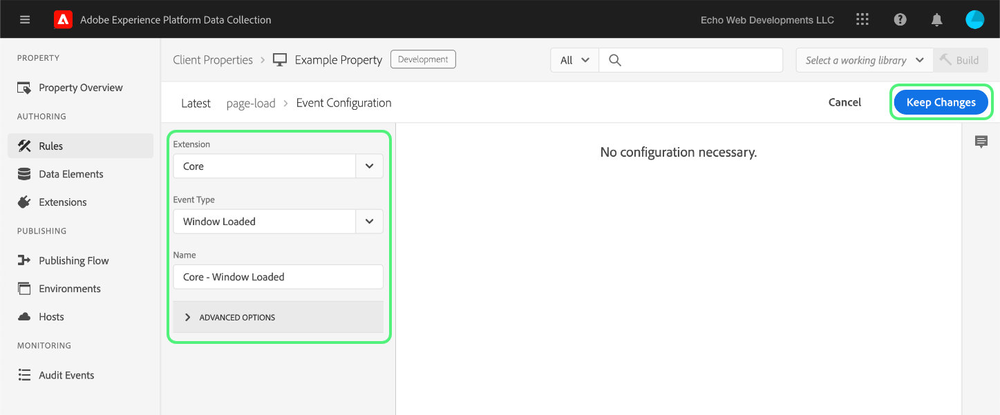

# 上载和实施端到端测试

>[!NOTE]
>
>经过品牌重塑，Adobe Experience Platform Launch 已变为 Adobe Experience Platform 中的一套数据收集技术。因此，产品文档中的术语有一些改动。有关术语更改的综合参考，请参阅以下[文档](../../term-updates.md)。

要在Adobe Experience Platform中测试标记扩展，请使用标记API和/或命令行工具来上传扩展包。 接下来，使用Experience Platform UI或数据收集UI将扩展包安装到资产，并在标记库和内部版本中执行其功能。

本文档介绍如何对扩展实施端到端测试。

>[!NOTE]
>
>本指南假定您正在使用MacOS，其中已安装和提供了Node.js和npm。

## 验证扩展 {#validate}

当您的团队对扩展的性能以及他们在[沙盒](https://www.npmjs.com/package/@adobe/reactor-sandbox#running-the-sandbox)工具中看到的结果感到满意后，您就可以将扩展包上载到标记了。

上载之前，请验证是否存在任何必填字段或设置。例如，最佳做法是（至少）查看[扩展清单](../manifest.md)、[扩展配置](../configuration.md)、[视图](../web/views.md)和[库模块](../web/format.md)。

您的徽标文件就是一个具体示例：向您的`"iconPath": "example.svg",`文件中添加`extension.json`行，并将该徽标图像文件包含在您的项目中。 这是将为扩展显示的图标的相对路径。 它不应以斜杠开头，必须引用一个扩展名为 `.svg` 的 SVG 文件。SVG在呈现正方形时应正常显示，并且可以通过用户界面缩放。 有关更多详细信息，请参阅[如何缩放SVG文章](https://css-tricks.com/scale-svg/)。

>[!NOTE]
>
>对于公共扩展，请在 `extension.json` 中添加一个项目，并包含指向 Exchange 列表的链接。您的[扩展清单](../manifest.md)应包含如下条目：`"exchangeUrl":"https://www.adobeexchange.com/experiencecloud.details.12345.html"`，以指向 Exchange 列表的 URL。

## 创建Adobe I/O集成 {#integration}

要使用API或命令行工具，您需要具有Adobe I/O的技术帐户。您必须在I/O控制台中创建技术帐户，然后使用Uploader工具上载扩展包。

有关创建技术帐户以用于Adobe Experience Platform中的标记的信息，请参阅[Reactor API快速入门](../../api/getting-started.md)指南。

>[!IMPORTANT]
>
>要在Adobe I/O中创建集成，您必须是Experience Cloud组织管理员或Experience Cloud组织开发人员。

如果无法创建集成，则您可能没有正确的权限。 这需要组织管理员为您完成这些步骤或将您指定为开发人员。

## 上载扩展包 {#upload}

现在您有了凭据，可以端到端地测试扩展包了。

首次上载扩展包时，它会进入`development`状态。 这意味着它仅对您自己的组织可见，并且仅对标记为进行扩展开发的资产可见。

使用命令行在包含.zip包的目录中运行以下命令。

```bash
npx @adobe/reactor-uploader
```

`npx`允许您下载和运行npm包，而无需将其实际安装到计算机上。 这是运行 Uploader 的最简单方法。

>[!NOTE]
> 默认情况下，Uploader需要服务器到服务器Oauth流的Adobe I/O凭据。 旧版`jwt-auth`凭据
> > 通过运行`npx @adobe/reactor-uploader@v5.2.0`一直使用到2025年1月1日弃用。 所需的参数
> > `jwt-auth`此处[找到](https://github.com/adobe/reactor-uploader/tree/cdc27f4f0e9fa3136b8cd5ca8c7271428b842452)版本以运行。

上传程序仅要求您输入几条信息。 可以从Adobe I/O控制台检索`clientId`和`clientSecret`。 导航到I/O控制台中的[集成页面](https://console.adobe.io/integrations)。 从下拉列表中选择正确的组织，找到正确的集成，然后选择&#x200B;**[!UICONTROL View]**。

- 您的`clientId`是什么？ 请从I/O控制台复制并粘贴此项。
- 您的`clientSecret`是什么？ 请从I/O控制台复制并粘贴此项。
- 如果从包含 .zip 包的目录中调用 Uploader，则只需从列表中选择该包，而不需要键入路径。

随后将上载扩展包，并且 Uploader 将为您提供 extension_package 的 ID。

>[!NOTE]
>
>在上载或打补丁时，扩展包将处于待处理状态，而系统将异步提取该包并进行部署。在此过程中，您可以使用API和在UI中轮询`extension_package` ID的状态。 您将在目录中看到一个标记为“Pending（待处理）”的扩展卡片。

>[!NOTE]
>
>如果您打算经常运行Uploader，那么每次输入所有这些信息可能会造成负担。 您也可以从命令行将这些信息作为参数传入。 有关更多信息，请参阅 NPM 文档的[命令行参数](https://www.npmjs.com/package/@adobe/reactor-uploader#command-line-arguments)部分。

如果您希望直接使用API管理扩展上传，请在API文档中参阅[创建](../../api/endpoints/extension-packages.md#create)或[更新](../../api/endpoints/extension-packages.md#update)扩展包的示例调用，以获取更多详细信息。

## 创建开发资产 {#property}

登录UI并在左侧导航中选择&#x200B;**[!UICONTROL Tags]**&#x200B;后，将显示[!UICONTROL Properties]屏幕。 资产是要部署的标记的容器，可用于一个或多个网站。


首次登录时，屏幕上不会显示任何资产。 选择 **New Property**，以创建一个资产。输入名称和 URL。使用测试网站或要测试扩展的页面的URL。 此域字段可以由某些扩展使用，也可以由使用核心扩展的条件使用。

>[!NOTE]
>
>`localhost`不能用作URL值。 如果您使用`localhost` URL，请改用任何模拟值进行测试。 例如，example.com。

要将此属性用于扩展开发测试，必须展开&#x200B;**高级OPTIONS**，并确保选中&#x200B;**为扩展开发配置**&#x200B;的框。


选择底部的 **Save**，以保存您的新资产。

出现“Properties（属性）”屏幕。 选择刚刚创建的资产的名称。此时会显示“Property Overview”屏幕。 它提供指向系统每个区域的链接，左侧列中包含全局导航链接。

## 安装扩展 {#install-extension}

要在此属性中安装扩展，请选择左列主导航链接中的&#x200B;**Extensions**&#x200B;链接。 **Core**&#x200B;扩展显示在&#x200B;**Installed**&#x200B;屏幕上。 核心扩展包含数据收集中的所有标记管理功能。


要添加扩展，请选择&#x200B;**目录**&#x200B;选项卡。


目录将显示每个可用扩展的卡图标。如果您的扩展未显示在目录中，请确保您已完成上述“Adobe管理控制台的设置”和“创建扩展包”部分中的步骤。 如果Experience Platform尚未完成初始处理，则扩展包也可能显示为“Pending”。

如果您已执行上述步骤，但仍未在目录中看到“Pending”或“Failed”扩展包，则应直接使用API检查扩展包的状态。 有关如何进行适当API调用的信息，请参阅API文档中的[获取扩展包](../../api/endpoints/extension-packages.md#lookup)。

扩展包处理完毕后，选择卡底部的&#x200B;**安装**。


配置屏幕将打开（如果扩展具有）。 添加配置扩展所需的任何信息，然后选择底部的&#x200B;**保存**。 此处显示的配置屏幕示例使用Facebook扩展，该扩展需要像素ID。


现在，您应该看到 **Installed** 扩展页面中包含 Core 扩展和您的扩展。


## 创建资源以测试扩展 {#resources}

扩展可为Adobe Experience Platform用户提供一些新功能。 这些变量通常显示在数据元素或规则生成器中。

### 数据元素

标记数据元素的目的是帮助用户保留值。 每个数据元素都是到源数据的映射或指示符。单个数据元素是一个变量，可以映射到查询字符串、URL、Cookie值、JavaScript变量等。 从左侧导航栏中选择&#x200B;**数据元素**，然后&#x200B;**创建新数据元素**。


扩展可以根据需要定义数据元素类型，以便扩展运行，或者只是为用户提供方便。当扩展提供数据元素类型时，这些类型会显示在&#x200B;**创建数据元素**&#x200B;屏幕上为用户提供的下拉列表中：


当用户从&#x200B;**Extension**&#x200B;下拉列表中选择您的扩展时，**数据元素类型**&#x200B;下拉列表中将填充您的扩展提供的所有数据元素类型。 然后，用户可以将每个数据元素映射到其源值。接下来，在数据元素更改事件或自定义代码事件中构建规则时，可以使用数据元素来触发要执行的规则。数据元素还可以在数据元素条件或规则中的其他条件、例外或操作中使用。

创建数据元素（设置映射）后，用户只需引用数据元素即可引用源数据。如果值的源发生更改（网站重新设计等），用户只需在UI中更新一次映射，并且所有数据元素都会自动接收新的源值。

### 规则

在左侧导航中选择&#x200B;**规则**&#x200B;链接，然后选择&#x200B;**创建新规则**。


首先，为规则输入一个描述性名称。 **创建规则**&#x200B;屏幕的设置类似于`if-then`语句。


如果事件发生，条件通过评估，并且没有例外，则会触发操作。扩展中也存在相同的流程，您可以在其中创建或利用事件、条件、例外、数据元素或操作。

以Facebook扩展为例，为页面在测试网站上加载的每次添加一个事件。



`Window Loaded` **事件类型**&#x200B;可确保每当页面在测试站点上加载时，都会触发此规则。 选择&#x200B;**保留更改**。 对于此示例，请忽略&#x200B;**Conditions**，因为应该为测试站点上的任何页面触发规则。

在&#x200B;**操作**&#x200B;下，选择&#x200B;**添加**。 将显示&#x200B;**Action Configuration**&#x200B;屏幕。接下来，您必须选择要应用规则的扩展以及触发规则时要发生的操作。 从&#x200B;**扩展**&#x200B;下拉列表中选择&#x200B;**Facebook Pixel**，从&#x200B;**操作类型**&#x200B;下拉列表中选择&#x200B;**发送页面查看**。 在以下&#x200B;**编辑规则**&#x200B;屏幕上选择&#x200B;**保留更改**，然后选择&#x200B;**保存**。


测试扩展时，请选择任何相关的事件、条件等。 扩展提供的任何事件、条件等。

## 发布更改 {#publish}

在主导航中，选择 **Publishing**，然后选择 **Add New Library** 链接：


库是扩展、数据元素和规则如何彼此交互以及如何与网站交互的一组说明。库会被编译为内部版本。一个库可以包含用户希望一次进行或测试的任意多个更改。

在&#x200B;**创建库**&#x200B;屏幕上，在&#x200B;**名称**&#x200B;文本字段中添加名称。 标记提供了一个名为&#x200B;**开发**&#x200B;的默认开发环境。 从&#x200B;**环境**&#x200B;下拉列表中选择&#x200B;**开发**。 为简单起见，请添加所有可用资源。 选择&#x200B;**添加所有更改的资源**，然后选择&#x200B;**保存**。

>[!NOTE]
>
>在将资源添加到库时，将会拍摄该资源截至该确切时间的快照并将其添加到库中。 当您以后对资源进行更改（例如，由于需要进行修复）时，还需要更新库以包含对资源的最新更改。 **Add All Changed Resources** 按钮也可以用于此目的。


现在，所有更改都已包含在新创建的库（在提供的示例中名为&#x200B;**dev**）中，请选择&#x200B;**保存并生成到开发**。


生成过程完成后，库名称旁边会显示一个绿色的&#x200B;**success**&#x200B;指示符。


标记库现已发布并可供使用。 测试页面必须使用新创建的库，才能在浏览器中测试最终用户的页面行为。

## 在测试网站上安装标记 {#install-data-collection-tags}

安装说明可从“环境”选项卡中获取。 此页面显示所有可用的环境，并允许您创建更多环境。 由于库已发布到开发环境，请选择&#x200B;**开发**&#x200B;行上&#x200B;**INSTALL**&#x200B;列中的框图标。


出现开发环境的&#x200B;**Web安装说明**&#x200B;对话框。 选择复制图标以复制整个`<script>`标记。


通过将单个`<script>`标记放入文档或网站模板的`<head>`部分中，完成安装。 接下来，访问测试网站以检查已发布的标记库的行为。

## 测试 {#test}

以下是在测试页面或站点上验证扩展的有用控制台命令列表。

- `_satellite.setDebug(true);`将启用调试模式并将有用的日志记录语句输出到控制台。
- `_satellite._container`对象包含有关已部署库的有用信息，包括有关所包含内部版本、数据元素、规则和扩展的详细信息。

此测试的目的是检查已部署库的功能，并确保扩展包在编译到库之后按预期运行。

当发现需要对扩展包进行更改时，迭代过程与开发过程类似。

1. 对项目中的代码进行更改。
1. 使用沙盒工具验证更改。
1. 使用 Packager 工具创建新的 .zip 包
1. 使用Uploader工具上载新的.zip包。 该过程遵循与之前有关初始上传的相同说明。 但是，您会注意到，由于在开发模式下已存在具有该名称的扩展包，因此此新包将覆盖旧版本，而不是创建新包。

   >[!NOTE]
   >
   >可以在命令行上传递参数，以避免重复输入凭据，从而节省时间。 有关此内容的更多信息，请阅读[reactor-uploader文档](https://www.npmjs.com/package/@adobe/reactor-uploader)。
1. 更新现有包时，可以跳过安装步骤。
1. 修改资源 — 如果任何扩展组件的配置已更改，您将需要在UI中更新这些资源。
1. 将最新更改添加到库中，然后再次构建。
1. 完成另一轮测试。
