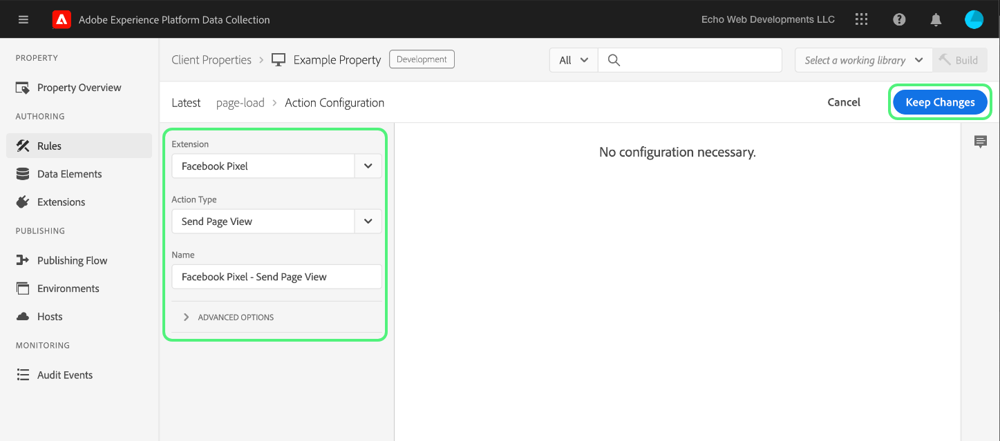

# 上载和实施端到端测试

>[!NOTE]
>
>Adobe Experience Platform Launch已經過品牌重塑，現在是Adobe Experience Platform中的一套資料收集技術。 因此，产品文档中的术语有一些改动。有关术语更改的综合参考，请参阅以下[文档](../../term-updates.md)。

若要在Adobe Experience Platform中測試標籤擴充功能，請使用標籤API和/或命令列工具來上傳您的擴充功能套件。 接下來，使用Platform UI或資料收集UI將您的擴充功能套件安裝至屬性，並在標籤程式庫和組建中執行其功能。

本文介紹如何為擴充功能實作端對端測試。

>[!NOTE]
>
>本指南假設您使用的是MacOS，且已安裝並提供Node.js和npm。

## 验证扩展 {#validate}

如果您的團隊對於擴充功能的效能和結果感到滿意，便可在以下連結中檢視： [Sandbox](https://www.npmjs.com/package/@adobe/reactor-sandbox#running-the-sandbox) 工具，您應該已準備好將擴充功能套件上傳至標籤。

上载之前，请验证是否存在任何必填字段或设置。例如，檢閱您的 [擴充功能資訊清單](../manifest.md)，您的 [擴充功能組態](../configuration.md)，您的 [檢視](../web/views.md)，以及您的 [程式庫模組](../web/format.md) （至少）是良好作法。

您的徽标文件就是一个具体示例：向 `extension.json` 文件中添加 `"iconPath": "example.svg",` 行，并将该徽标图像文件添加到项目中。這是將顯示給擴充功能的圖示相對路徑。 它不应以斜杠开头，必须引用一个扩展名为 `.svg` 的 SVG 文件。SVG在呈現為正方形時應該會正常顯示，並可由使用者介面縮放。 請參閱 [如何縮放SVG文章](https://css-tricks.com/scale-svg/) 以取得更多詳細資料。

>[!NOTE]
>
>对于公共扩展，请在 `extension.json` 中添加一个项目，并包含指向 Exchange 列表的链接。您的[扩展清单](../manifest.md)应包含如下条目：`"exchangeUrl":"https://www.adobeexchange.com/experiencecloud.details.12345.html"`，以指向 Exchange 列表的 URL。

## 创建 Adobe I/O 集成 {#integration}

若要使用API或命令列工具，您需要具有Adobe I/O的技術帳戶。您必須在I/O主控台中建立技術帳戶，然後使用Uploader工具上傳擴充功能套件。

如需建立技術帳戶以用於Adobe Experience Platform標籤的詳細資訊，請參閱 [Reactor API快速入門](../../api/getting-started.md) 指南。

>[!IMPORTANT]
>
>要在 Adobe I/O 中创建集成，您必须是 Experience Cloud 组织管理员或 Experience Cloud 组织开发人员。

如果您無法建立整合，表示您可能沒有正確的許可權。 這需要組織管理員為您完成這些步驟，或將您指派為開發人員。

## 上载扩展包 {#upload}

現在您有了認證，就可以端到端地測試擴充功能套件了。

首次上载扩展包时，它会进入 `development` 状态。這表示它僅對您自己的組織可見，且僅對已標籤為擴充功能開發的屬性可見。

使用命令列在包含.zip套件的目錄中執行下列命令。

```bash
npx @adobe/reactor-uploader
```

`npx` 允许您下载和运行 npm 包，而无需将其实际安装到计算机上。这是运行 Uploader 的最简单方法。

Uploader需要您輸入幾項資訊。 技術帳戶ID、API金鑰和其他一些資訊可以從Adobe I/O主控台擷取。 导航到 I/O 控制台中的[集成页面](https://console.adobe.io/integrations)。從下拉式清單中選取正確的組織，尋找正確的整合，然後選取 **[!UICONTROL 檢視]**.

- 私钥的路径是什么？/path/to/private.key。这是您在上面步骤 2 中保存私钥的位置。
- 您的组织 ID 是什么？請從您先前開啟的I/O主控台概觀頁面複製並貼上此內容。
- 您的技术帐户 ID 是什么？請從I/O主控台複製並貼上此專案。
- 您的 API 密钥是什么？請從I/O主控台複製並貼上此專案。
- 使用者端密碼為何？ 請從I/O主控台複製並貼上此專案。
- 要上载的 extension_package 的路径是什么？/path/to/extension_package.zip。如果从包含 .zip 包的目录中调用 Uploader，则只需从列表中选择该包，而不需要键入路径。

随后将上载扩展包，并且 Uploader 将为您提供 extension_package 的 ID。

>[!NOTE]
>
>在上载或打补丁时，扩展包将处于待处理状态，而系统将异步提取该包并进行部署。在此程式進行時，您可以輪詢 `extension_package` 使用API並在UI中用於其狀態的ID。 您會在目錄中看到標示為「擱置中」的擴充功能卡片。

>[!NOTE]
>
>如果您打算經常執行上傳程式，則每次都輸入這些資訊可能會造成負擔。 您也可以從命令列將這些資訊作為引數傳入。 有关更多信息，请参阅 NPM 文档的[命令行参数](https://www.npmjs.com/package/@adobe/reactor-uploader#command-line-arguments)部分。

## 创建开发资产 {#property}

登入UI並選取 **[!UICONTROL 標籤]** 在左側導覽列中， [!UICONTROL 屬性] 畫面隨即顯示。 资产是要部署的标记的容器，可用于一个或多个网站。


第一次登入時，您的畫面上不會顯示任何屬性。 选择 **New Property**，以创建一个资产。输入名称和 URL。使用測試網站的URL或您要測試擴充功能的頁面。 此網域欄位可供某些擴充功能使用，或供使用核心擴充功能的條件使用。

>[!NOTE]
>
>`localhost` 無法當作URL值使用。 如果您使用，請改為使用任何模擬值進行測試 `localhost` URL。 例如，example.com。

若要將此屬性用於擴充功能開發測試，您必須展開 **進階OPTIONS** 並確保勾選方塊 **針對擴充功能開發進行設定**.


选择底部的 **Save**，以保存您的新资产。

「屬性」畫面隨即顯示。 选择刚刚创建的资产的名称。「屬性概述」畫面隨即顯示。 它提供系統每個區域的連結，左側欄中有全域導覽連結。

## 安装扩展 {#install-extension}

若要在此屬性中安裝您的擴充功能，請選取 **擴充功能** 左側欄中主要導覽連結的連結。 此 **核心** 擴充功能會顯示在 **已安裝** 畫面。 核心擴充功能包含資料收集中的所有標籤管理功能。


若要新增擴充功能，請選取 **目錄** 標籤。


目录将显示每个可用扩展的卡图标。如果您的擴充功能未顯示在目錄中，請確定您已完成Adobe管理主控台設定和建立您的擴充功能套件區段中的上述步驟。 如果平台尚未完成初始處理，您的擴充功能套件也可能會顯示為「擱置中」。

如果您已執行先前步驟，但目錄中仍未顯示「擱置中」或「失敗」擴充功能套件，則應直接使用API檢視擴充功能套件的狀態。 如需如何進行適當API呼叫的詳細資訊，請閱讀 [擷取擴充功能套件](../../api/endpoints/extension-packages.md#lookup) API檔案中。

擴充功能套件處理完畢後，請選取 **安裝** 位於卡片底部。


設定畫面隨即開啟（前提是擴充功能具有擴充功能）。 添加配置扩展所需的任何信息，然后选择底部的 **Save**。這裡所示的設定畫面範例使用Facebook擴充功能，此擴充功能需要畫素ID。


现在，您应该看到 **Installed** 扩展页面中包含 Core 扩展和您的扩展。


## 创建资源以测试扩展 {#resources}

擴充功能可為Adobe Experience Platform的使用者提供新功能。 這些通常顯示在資料元素或規則產生器中。

### 数据元素

標籤資料元素的用途是協助使用者保留值。 每个数据元素都是到源数据的映射或指示符。单个数据元素是一个变量，可以映射到查询字符串、URL、Cookie 值、JavaScript 变量等。選取 **資料元素** 從左側導覽列，以及 **建立新資料元素**.


扩展可以根据需要定义数据元素类型，以便扩展运行，或者只是为用户提供方便。當擴充功能提供資料元素型別時，這些型別會出現在使用者專用的下拉式清單中： **建立資料元素** 畫面：


當使用者選擇您的擴充功能時 **副檔名** 下拉式清單 **資料元素型別** 下拉式清單會填入擴充功能提供的任何資料元素型別。 然后，用户可以将每个数据元素映射到其源值。接下来，在数据元素更改事件或自定义代码事件中构建规则时，可以使用数据元素来触发要执行的规则。資料元素也可用於資料元素條件或規則中的其他條件、例外或動作。

创建数据元素（设置映射）后，用户只需引用数据元素即可引用源数据。如果值的来源发生变化（网站重新设计等），使用者只需在UI中更新一次對應，所有資料元素都會自動接收新的來源值。

### 规则

選取 **規則** 左側導覽中的連結，然後 **建立新規則**.


首先，輸入規則的描述性名稱。 此 **建立規則** 熒幕的設定方式如同 `if-then` 陳述式。


如果事件发生，条件通过评估，并且没有例外，则会触发操作。扩展中也存在相同的流程，您可以在其中创建或利用事件、条件、例外、数据元素或操作。

以Facebook擴充功能為例，針對頁面在測試網站上載入的每次機會新增事件。


此 `Window Loaded` **事件型別** 確保每當頁面載入測試網站時，都會觸發此規則。 选择&#x200B;**保留更改**。在此範例中，忽略 **條件** 因為測試網站上的任何頁面都應該觸發規則。

下 **動作** 選取 **新增**. 此 **動作設定** 熒幕隨即顯示。接下來，您必須選擇要套用規則的擴充功能，以及觸發規則時要發生的動作。 選取 **facebook Pixel** 從 **副檔名** 下拉式清單，以及 **傳送頁面檢視** 從 **動作型別** 下拉式清單。 選取 **保留變更**，然後 **儲存** 於下列專案 **編輯規則** 畫面。



測試擴充功能時，請選取任何相關的事件、條件等。 扩展提供的任何事件、条件等。

## 发布更改 {#publish}

在主导航中，选择 **Publishing**，然后选择 **Add New Library** 链接：


库是扩展、数据元素和规则如何彼此交互以及如何与网站交互的一组说明。库会被编译为内部版本。一个库可以包含用户希望一次进行或测试的任意多个更改。

於 **建立資料庫** 畫面，在中新增名稱 **名稱** 文字欄位。 標籤提供預設開發環境，命名為 **開發**. 選取 **開發** 從 **環境** 下拉式清單。 為簡化起見，請新增所有可用資源。 選取 **新增所有變更的資源**，然後選取 **儲存**.

>[!NOTE]
>
>在将资源添加到库时，将会拍摄该资源截至此确切时间的快照并将其添加到库中。当您稍后对资源进行更改（例如，因为需要进行修复）时，还需要更新库以包含对资源的最新更改。**Add All Changed Resources** 按钮也可以用于此目的。


現在所有變更都已納入新建立的程式庫中(已命名 **開發** 在提供的範例中)，選取 **儲存並建置到開發環境**.


建置流程完成後，綠色的 **成功** 指標會顯示在程式庫名稱旁邊。


標籤庫現已發佈並可供使用。 測試頁面必須使用新建立的程式庫，才能在瀏覽器中測試一般使用者的頁面行為。

## 在測試網站上安裝標籤 {#install-data-collection-tags}

安裝指示可在環境索引標籤中取得。 此頁面會顯示所有可用的環境，並可讓您建立更多環境。 程式庫發佈至開發環境時，請選取 **安裝** 上的欄 **開發** 列。


此 **網頁安裝指示** 隨即顯示開發環境的對話方塊。 選取復製圖示以複製整個 `<script>` 標籤之間。


透過放置此單一完成安裝 `<script>` 標籤內 `<head>` 檔案或網站範本的區段。 接下來，請造訪測試網站，檢查已發佈標籤程式庫的行為。

## 测试 {#test}

以下是在測試頁面或網站上驗證擴充功能的實用主控台命令清單。

- `_satellite.setDebug(true);` 會啟用偵錯模式，並將有用的記錄陳述式輸出至主控台。
- 此 `_satellite._container` 物件包含有關已部署程式庫的實用資訊，包括有關所包含組建、資料元素、規則和擴充功能的詳細資訊。

此測試的目的是檢查已部署程式庫的功能，並確保擴充功能套件在編入程式庫後，會如預期般運作。

当发现需要对扩展包进行更改时，迭代过程与开发过程类似。

1. 更改项目中的代码。
1. 使用沙盒工具验证更改.
1. 使用 Packager 工具创建新的 .zip 包
1. 使用Uploader工具上傳新的.zip套件。 該程式遵循與先前相同的關於初始上傳的指示。 不過，您會注意到，由於在開發模式中已有該名稱的擴充功能套件，因此這個新套件將會覆寫較舊的版本，而非建立新套件。

   >[!NOTE]
   >
   >可在命令列上傳遞引數，以避免重複輸入認證以節省時間。 如需詳細資訊，請閱讀 [reactor-uploader檔案](https://www.npmjs.com/package/@adobe/reactor-uploader).
1. 更新現有套件時，可跳過安裝步驟。
1. 修改資源 — 如果任何擴充功能元件的設定已變更，您將需要在UI中更新這些資源。
1. 将最新更改添加到库，然后再次构建.
1. 完成另一輪測試。
