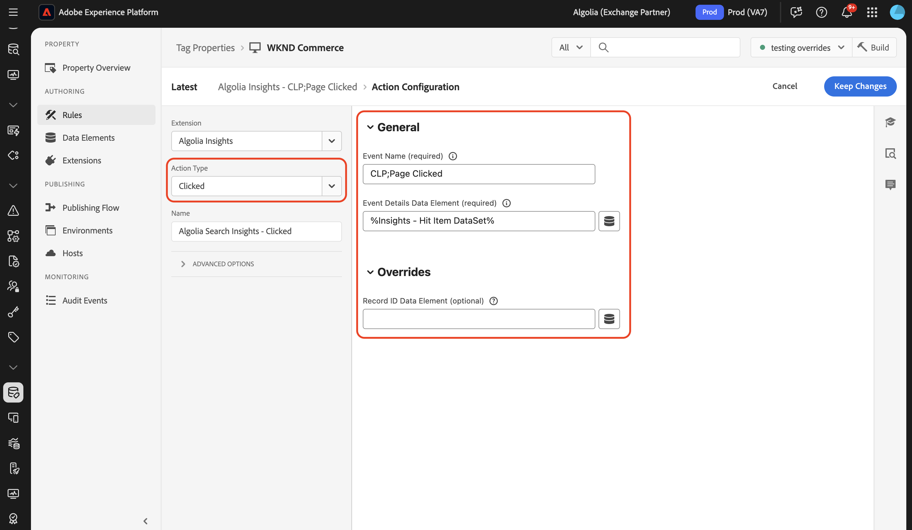
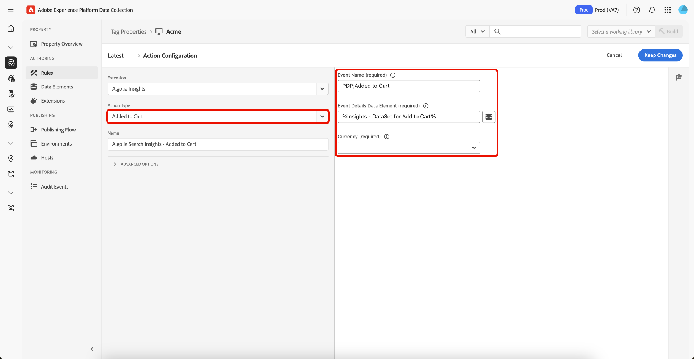

# [!DNL Algolia]标记扩展概述

[!DNL Algolia] Tags扩展使营销人员能够轻松设置规则以将用户交互数据发送到[!DNL Algolia]，从而帮助您提供更加个性化的AI搜索和发现体验。

此扩展由一项关键功能提供支持：

* **[!DNL Algolia]分析**：自动捕获用户交互事件并将其发送到[!DNL Algolia]，这可以实现强大的分析、个性化体验和改进的搜索相关性。

## 先决条件 {#prerequisites}

您必须拥有有效的[!DNL Algolia]帐户才能使用此扩展。 转到[[!DNL Algolia] 注册页面](https://dashboard.algolia.com/users/sign_up)创建帐户（如果尚未创建）。

### 收集所需的配置详细信息 {#configuration-details}

要将[!DNL Algolia]与Adobe Experience Platform连接，您需要以下信息：

| 凭据 | 描述 | 示例 |
| --- | --- | --- |
| 应用程序Id | 您的应用程序ID可在[!DNL Algolia]仪表板的[API密钥](https://www.algolia.com/account/api-keys/all)部分找到。 | 0ABCDEFG12 |
| 搜索API密钥 | 可在[!DNL Algolia]仪表板的[API密钥](https://www.algolia.com/account/api-keys/all)部分中找到您的搜索API密钥。 | 1234a12345678901b1234567890c1ab1 |

## 安装和配置[!DNL Algolia] Insights扩展 {#install-configure}

要安装[!DNL Algolia] Insights扩展，请导航到[!UICONTROL 数据收集UI]，然后从左侧导航中选择&#x200B;**[!UICONTROL 标记]**。 在此处，选择要将扩展添加到的资产，或改为创建新资产。

选择或创建所需的属性后，在左侧导航中选择&#x200B;**[!UICONTROL 扩展]**，然后选择&#x200B;**[!UICONTROL 目录]**&#x200B;选项卡。 搜索[!DNL Algolia]分析卡，然后选择&#x200B;**[!UICONTROL 安装]**。


在显示的配置视图中，必须提供以下详细信息：

| 属性 | 描述 |
| --- | --- |
| 应用程序Id | 输入您之前在[配置详细信息](#configuration-details)部分中收集的[!UICONTROL 应用程序ID]。 |
| 搜索API密钥 | 输入您之前在[配置详细信息](#configuration-details)部分中收集的[!UICONTROL 搜索API密钥]。 |
| 索引名称 | [!UICONTROL 索引名称]包含产品或内容。  此索引将用作默认索引。 |
| 用户令牌数据元素 | 将返回用户令牌的数据元素。 |
| 经过身份验证的用户令牌数据元素 | 设置将返回经过身份验证的用户令牌的数据元素。 |
| 货币 | 选择货币类型。  默认值设置为`USD`。 |


## [!DNL Algolia] Insights扩展操作类型 {#action-types}

[!DNL Algolia]支持一组预定义的标准事件，每个事件都具有特定的上下文和属性。 [!DNL Algolia]扩展中可用的操作与这些事件类型一致，从而可轻松根据发送给[!DNL Algolia]的事件类型分类和配置这些事件。

### 加载分析 {#load-insights}

>[!NOTE]
>
>在大多数情况下，建议在您的网站的每个页面上加载[!DNL Algolia]分析。

根据规则的上下文将&#x200B;**[!UICONTROL 加载分析]**&#x200B;操作添加到最适合加载[!DNL Algolia]分析的标记规则中。 此操作将`search-insights.js`库加载到页面上。

创建新标记规则或打开现有标记规则。 根据您的要求定义条件，然后选择&#x200B;**[!UICONTROL Algolia]**&#x200B;作为[!UICONTROL 扩展]，并选择&#x200B;**[!UICONTROL Load Insights]**&#x200B;作为[!UICONTROL 操作类型]。

| 属性 | 描述 |
| --- | --- |
| [!UICONTROL Insight库版本] | [!DNL Algolia]分析版本。 默认值为 `2.13.0`。 |
| [!UICONTROL 用户选择退出数据元素] | 捕获用户的跟踪首选项的数据元素。 |
| [!UICONTROL 使用用户令牌Cookie] | 选中此框以允许[!DNL Algolia]生成用户令牌Cookie。 默认情况下，此选项设置为`false`。 |


### 已单击 {#clicked}

将&#x200B;**[!UICONTROL Click]**&#x200B;操作添加到标记规则以将点击事件发送到[!DNL Algolia]。 创建新标记规则或打开现有标记规则。 根据您的要求定义条件，然后选择&#x200B;**[!UICONTROL Algolia]**&#x200B;作为[!UICONTROL 扩展]，并选择&#x200B;**[!UICONTROL Clicked]**&#x200B;作为[!UICONTROL 操作类型]。

| 属性 | 描述 |
| --- | --- |
| [!UICONTROL 事件名称] | 事件名称，可用于进一步细化此点击事件。 |
| 事件详细信息数据元素 | 将检索事件详细信息（包括`indexName`、`objectIDs`和可选的`queryID`、`position`）的数据元素。 如果同时包括`queryID`和`position`，则该事件将在搜索&#x200B;*后分类为*&#x200B;点击的对象ID，否则将被视为&#x200B;*点击的对象ID*&#x200B;事件。 如果数据元素不提供索引名称，则在发送事件时将使用默认的索引名称。 |



### 已转换 {#converted}

将&#x200B;**[!UICONTROL Converted]**&#x200B;操作添加到您的标记规则以将转换的事件发送到[!DNL Algolia]。 创建新标记规则或打开现有标记规则。 根据您的要求定义条件，然后选择&#x200B;**[!UICONTROL Algolia]**&#x200B;作为[!UICONTROL 扩展]，并选择&#x200B;**[!UICONTROL 转换的]**&#x200B;作为[!UICONTROL 操作类型]。

| 属性 | 描述 |
| --- | --- |
| 活动名称 | 将用于进一步细化此&#x200B;**转换**&#x200B;事件的事件名称。 |
| 事件详细信息数据元素 | 将检索事件详细信息(包括`indexName`、`objectId`和（可选）`queryId`的数据元素。 如果数据元素包含`queryId`，则该事件将被分类为“搜索&#x200B;*后转换的*”，否则将被视为“转换的&#x200B;*”*&#x200B;事件类。 如果数据元素不提供索引名称，则在发送事件时将使用默认的索引名称。 |


### 已添加到购物车 {#added-to-cart}

将&#x200B;**[!UICONTROL 添加到购物车]**&#x200B;操作添加到您的标记规则，以将添加到购物车事件的操作发送到[!DNL Algolia]。 创建新标记规则或打开现有标记规则。 根据您的要求定义条件，然后选择&#x200B;**[!UICONTROL Algolia]**&#x200B;作为[!UICONTROL 扩展]，并选择&#x200B;**[!UICONTROL 添加到购物车]**&#x200B;作为[!UICONTROL 操作类型]。

| 属性 | 描述 |
| --- | --- |
| 活动名称 | 将用于进一步细化此&#x200B;**转换**&#x200B;事件的事件名称。 |
| 事件详细信息数据元素 | 将检索事件详细信息（包括`indexName`、`objectId`和可选的`queryId`、`objectData`）的数据元素。 如果数据元素包含`queryId`，则该事件将被分类为&#x200B;*在搜索后添加到购物车对象ID*，否则将被视为&#x200B;*已添加到购物车对象ID*&#x200B;事件类。 如果数据元素不提供索引名称，则在发送事件时将使用默认的索引名称。 |
| 货币 | 指定货币类型，如`USD`。 |



### 已购买 {#purchased}

将&#x200B;**[!UICONTROL 添加到购物车]**&#x200B;操作添加到您的标记规则以将已购买的事件发送到[!DNL Algolia]。 创建新标记规则或打开现有标记规则。 根据您的要求定义条件，然后选择&#x200B;**[!UICONTROL Algolia]**&#x200B;作为[!UICONTROL 扩展]，并选择&#x200B;**[!UICONTROL Purchased]**&#x200B;作为[!UICONTROL 操作类型]。

| 属性 | 描述 |
| --- | --- |
| 活动名称 | 将用于进一步细化此&#x200B;**购买**&#x200B;事件的事件名称。 |
| 事件详细信息数据元素 | 将检索事件详细信息(包括`indexName`、`objectId`和（可选）`queryId`的数据元素。 如果数据元素包含`queryId`，则该事件在搜索后将被分类为&#x200B;*已购买对象ID*，否则将被视为&#x200B;*已购买对象ID*&#x200B;事件类。 如果数据元素不提供索引名称，则在发送事件时将使用默认的索引名称。 |


### 已查看 {#viewed}

将&#x200B;**[!UICONTROL 添加到购物车]**&#x200B;操作添加到您的标记规则以将已购买的事件发送到[!DNL Algolia]。 创建新标记规则或打开现有标记规则。 根据您的要求定义条件，然后选择&#x200B;**[!UICONTROL Algolia]**&#x200B;作为[!UICONTROL 扩展]，并选择&#x200B;**[!UICONTROL 已查看]**&#x200B;作为[!UICONTROL 操作类型]。


| 属性 | 描述 |
| --- | --- |
| 活动名称 | 将用于进一步细化此&#x200B;**视图**&#x200B;事件的事件名称。 |
| 事件详细信息数据元素 | 将检索包括`indexName`和`objectId`的事件详细信息的数据元素。 如果`indexName`不可用，则在发送事件时将使用默认索引名称。 |

## [!DNL Algolia]个Insights扩展数据元素 {#data-elements}

[!DNL Algolia]支持一组预定义的数据元素，每个元素都具有特定的上下文和属性。 以下部分介绍了[!DNL Algolia] Insights扩展中可用的数据元素。

### 数据集 {#dataset}

数据集数据元素检索与HTML元素关联的数据，然后这些数据用于[!DNL Algolia]操作。

| 属性 | 描述 |
| --- | --- |
| 点击元素Div/类名称 | 包含数据集属性的HTML元素名称和/或CSS类名称，这些数据集属性包括HTML元素上的`data-insights-object-id`以及可选的`data-insights-query-id`和`data-insights-position`。 |
| 索引名元素Div/类名 | 在HTML元素上具有数据集属性(`data-indexname`)的HTML元素名称和/或CSS类名称。 |


此数据元素返回：

```javascript
{
  timestamp,
    queryID,
    indexName,
    objectIDs,
    positions
}
```

包含数据集的HTML示例：

```html
<div data-indexname="acme_master_default_products" class="instant-search-comp__hits">
  <div class="hit-card"
    data-insights-object-id="${hit.objectID}"
    data-insights-position="${hit.__position}"
    data-insights-query-id="${hit.__queryID}">
    <h4 class="hit-name">...</h4>   
  </div>
</div>
```

### 查询字符串 {#query-string}

查询字符串数据元素从[!DNL Algolia]操作中使用的URL查询字符串中提取数据。

| 属性 | 描述 |
| --- | --- |
| 对象ID参数名称 | 包含对象ID的查询参数名称。 |
| 索引名称参数名称（可选） | 包含“索引名称”的查询参数名称。 |
| 查询ID参数名称（可选） | 包含查询ID的查询参数名称。 |
| 职位参数名称（可选） | 包含职位的查询参数名称。 |


此数据元素返回：

```javascript
{
  timestamp,
    queryID,
    indexName,
    objectIDs
}
```

包含查询参数的HTML示例。

```
<a href="product.html?objectID=${hit.objectID}&queryID=${hit.__queryID}&indexName=${indexName}&position=${hit.position}">Read More</a>
```

### 存储 {#storage}

存储数据元素从会话存储中检索数据以用于[!DNL Algolia]操作。

此数据元素从会话存储中检索事件详细信息。 无需配置。 数据会在&#x200B;*单击*&#x200B;事件操作期间自动添加，并在&#x200B;*转换*&#x200B;事件操作期间删除。


此数据元素返回会话存储中存储的内容。

```javascript
{
  timestamp,
    queryID,
    indexName,
    objectIDs
}
```

## 搜索后已单击或已转换 {#clicked-converted-after-search}

搜索&#x200B;*后点击的*&#x200B;或搜索&#x200B;*后转换的*&#x200B;事件需要`queryId`，搜索&#x200B;*后点击的*&#x200B;也需要`position`。 在InstantSearch和/或自动完成查询参数中启用`insights`标志时，这些属性可用。 请参阅以下资源，了解如何为网站配置Insights：

* [在自动完成时设置分析](https://www.algolia.com/doc/ui-libraries/autocomplete/api-reference/autocomplete-js/autocomplete/#param-insights)
* [在InstantSearch.js中设置分析](https://www.algolia.com/doc/guides/building-search-ui/events/js/#set-the-insights-option-to-true)
* [点击和转化事件入门](https://www.algolia.com/doc/guides/sending-events/implementing/how-to/sending-events-backend/)
* [正在发送 [!DNL Algolia] 分析事件](https://www.algolia.com/doc/ui-libraries/autocomplete/guides/sending-algolia-insights-events/)
* [[!DNL Algolia] Launch扩展GitHub存储库](https://github.com/algolia/algolia-launch-extension)
* [InstantSearch.js文档](https://www.algolia.com/doc/guides/building-search-ui/what-is-instantsearch/js/)
* [[!DNL Algolia] 分析API文档](https://www.algolia.com/doc/rest-api/insights/)

## 后续步骤 {#next-steps}

本指南介绍了如何使用[!DNL Algolia Insights]标记扩展将数据发送到[!DNL Algolia]。 如果您还计划向[!DNL Algolia]发送服务器端事件，则现在可以继续安装和配置[[!DNL Conversions API] 事件转发扩展](../../server/algolia/overview.md)。

有关Experience Platform中标记的详细信息，请参阅[标记概述](../../../home.md)。
