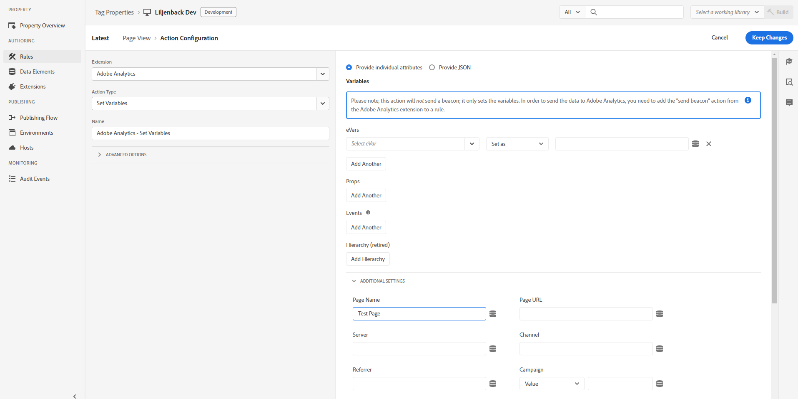

# Adobe Analytics扩展概述

使用本参考可了解有关配置 Adobe Analytics 扩展以及使用此扩展构建规则时可用的选项的信息。

## 配置 Adobe Analytics 扩展

此部分提供有关配置 Adobe Analytics 扩展时可用的选项的参考。

如果尚未安装 Adobe Analytics 扩展，请打开您的资产，选择 **[!UICONTROL Extensions > Catalog]**，将鼠标悬停在 Adobe Analytics 扩展上，然后选择 **[!UICONTROL Install]**。

要配置该扩展，请打开 Extensions 选项卡，将鼠标悬停在该扩展上，然后选择 **[!UICONTROL Configure]**。


## Library Management

从配置页面的 Library Management 部分中选择一个选项。可以使用以下配置选项：

### Manage the library for me

#### Report Suites

为以下每个环境指定一个或多个报表包：

* 开发
* 暂存
* 生产

### Use the library already installed on the page

#### Set the following report suites on tracker

如果选择此选项，则需为以下每个环境指定一个或多个报表包：

* 开发
* 暂存
* 生产

#### 使用 Activity Map 模块

Activity Map 作为单独的模块（与 AAM 模块类似）加载。默认情况下，Activity Map 处于打开状态，但如果您希望关闭它，可以通过取消选中配置中的复选框将其关闭。

#### Tracker is accessible on the global variable named

选中此框后，可以全局使用跟踪器对象。例如，您可以在网站上的任意位置定义变量 `window.s.pageName`。

### Load the library from a custom URL

#### HTTP URL

指定库所在的 URL。

#### HTTPS URL

指定库所在的 URL。

#### Set the following report suites on tracker

如果选择此选项，则需为以下每个环境指定一个或多个报表包：

* 开发
* 暂存
* 生产

#### Tracker is accessible on the global variable named

指定要全局使用的跟踪器对象。

### Let me provide custom library code

#### Open Editor

允许您插入核心[AppMeasurement.js](https://experienceleague.adobe.com/docs/analytics/implementation/js/overview.html?lang=zh-Hans)代码。 使用自动配置方法时会自动填充此代码。

>[!NOTE]
>
>标记代码编辑器中使用的验证器可识别开发人员编写的代码中存在的问题。 经过缩小的代码(例如从代码管理器中下载的AppMeasurement.js代码)可能会被标记验证器错误地标记为存在问题，这通常可以忽略不计。

#### Set the following report suites on tracker

如果选择此选项，则需为以下每个环境指定一个或多个报表包：

* 开发
* 暂存
* 生产

#### Tracker is accessible on the global variable named

指定要全局使用的跟踪器对象。

## General

从配置页面的 General 部分中选择一个选项。可以使用以下配置选项：

### Enable EU compliance for Adobe Analytics

基于 EU 隐私 Cookie，启用或禁用跟踪。

启用“欧盟合规”复选框时，将显示[!UICONTROL Tracking Cookie Name]字段。 跟踪 Cookie 会覆盖默认的跟踪 Cookie 名称。您可以自定义标记在跟踪您的选择退出状态以接收其他Cookie时所使用的名称。

在加载页面时，系统会检查是否设置了名为 sat\_track 的 Cookie（或在 Edit Property 页面中指定的自定义 Cookie 名称）。请考虑以下信息：

* 如果 Cookie 不存在，或者如果 Cookie 存在但设置为 true 之外的其他内容，则启用此设置后将跳过该工具的加载。这表示，使用该工具的规则的任何部分均不适用。如果规则具有启用欧盟合规性的 Analytics 和第三方代码，并且该 Cookie 设置为 false，则第三方代码仍会运行。但是，将不设置 Analytics 变量。
* 如果 Cookie 存在且设置为 true，则会正常加载该工具。

如果访客选择禁用，则由您负责将 sat\_track（或命名的自定义）Cookie 设置为 false。您可以使用以下自定义代码实现此操作：

```javascript
_satellite.cookie.set("sat_track", "false");
```

如果希望访客稍后能够选择加入，则还必须具有一种机制，以将该Cookie设置为true ：

```javascript
_satellite.cookie.set("sat_track", "true");
```

### Character Set

确定图像请求的编码方式。如果您的实施或网站使用非 ASCII 字符，请务必在此处定义字符集。您可以选择预设字符集或指定自定义字符集。Adobe 建议使用与您的网站相同的字符编码。通常，此值为 UTF-8。

可以使用变量 `s.charSet` 在 Analytics 自定义代码中设置字符集。有关字符集的更多信息，请参阅 [charSet 文档](https://experienceleague.adobe.com/docs/analytics/implementation/vars/config-vars/charset.html?lang=zh-Hans)。

### Currency Code

确定要应用于收入和货币事件的转换率。如果您的网站允许访客以多种货币进行购买，则设置货币代码可确保正确转换和存储货币金额。

有关支持的货币代码的更多信息，请参阅 [currencyCode](https://experienceleague.adobe.com/docs/analytics/implementation/vars/config-vars/currencycode.html?lang=zh-Hans)。

### Tracking Server

用于第一方 Cookie 实施，以指示存储第一方 Cookie 的位置。如果您使用 Experience Cloud ID 服务，Adobe 建议不要填充此字段。

可以使用变量 `s.trackingServer` 在 Analytics 自定义代码中设置跟踪服务器。

请参阅“Adobe Analytics 实施指南”中的 [trackingServer](https://experienceleague.adobe.com/docs/analytics/implementation/vars/config-vars/trackingserver.html?lang=zh-Hans)。

### SSL Tracking Server

用于 SSL 第一方 Cookie 实施，以指示存储第一方 Cookie 的位置。如果您使用 Experience Cloud ID 服务，Adobe 建议不要填充此字段。如果未定义，SSL 数据将使用跟踪服务器。

可以使用变量 `s.trackingServerSecure` 在 Analytics 自定义代码中设置 SSL 跟踪服务器。

请参阅 [trackingServerSecure](https://experienceleague.adobe.com/docs/analytics/implementation/vars/config-vars/trackingserversecure.html?lang=zh-Hans)。

## Global Variables

可以使用此部分设置 [eVars 和 Props](https://experienceleague.adobe.com/docs/analytics/implementation/vars/page-vars/evar.html?lang=zh-Hans)，并创建层级。

全局变量是在页面上初始化 Analytics 跟踪对象时在该对象上设置的变量。在每个页面上创建跟踪对象时，将设置您在此处设置的任何变量。设置这些变量后，它们就如同以任何其他方式设置的任何其他变量一样。具体而言，这意味着规则可以修改、更改或清除这些变量。

如果您的 Web 应用程序通常每页发送一个信标，则此部分可以帮助您在一个位置轻松设置变量。如果您的应用程序每页发送多个信标（例如在单页面应用程序中），并且您需要清除变量并使用相同的跟踪对象重置它们，则依赖规则设置和清除变量会更简单。

## Link Tracking

从配置页面的 Link Tracking 部分中选择一个选项。可以使用以下配置选项：

### Enable ClickMap

[ClickMap](https://experienceleague.adobe.com/docs/analytics/analyze/activity-map/activity-map.html?lang=zh-Hans) 是一个适用于 Internet Explorer 和 Firefox 的插件，而且也是“Reports &amp; Analytics”中的一个模块。

### Track download links

跟踪指向网站上可下载文件的链接。

请参阅 [s.trackDownLoadLinks](https://experienceleague.adobe.com/docs/analytics/implementation/vars/config-vars/trackdownloadlinks.html?lang=zh-Hans)。

### Download Extensions

如果启用了 Track Download Links 选项，则可以选择 Downloads Report 中包含的文件链接的扩展名。如果您的网站包含指向具有任何已列出扩展名的文件的链接，则这些链接的 URL 将显示在报表中。

请参阅 [s.linkDownloadFileTypes](https://experienceleague.adobe.com/docs/analytics/implementation/vars/config-vars/linkdownloadfiletypes.html?lang=zh-Hans)。

### Track outbound links

确定任何选择的链接是否为退出链接。

请参阅 [s.trackExternalLinks](https://experienceleague.adobe.com/docs/analytics/implementation/vars/config-vars/trackexternallinks.html?lang=zh-Hans)。

**单页面应用程序注意事项：**&#x200B;由于某些 SPA 网站的编码方式，指向 SPA 网站上页面的内部链接的外观可能与出站链接类似。

您可以使用以下方法之一跟踪来自 SPA 网站的出站链接：

* 如果不希望跟踪来自 SPA 的任何出站链接，则在 Never Track 部分插入一个条目。例如：`http://testsite.com/spa/\#`。指向此主机的所有\#链接都将被忽略。 并跟踪指向其他主机的所有出站链接，如 [https://www.google.com](https://www.google.com)。
* 如果希望跟踪 SPA 上的某些链接，则使用 Always Track 部分。

例如，如果希望跟踪 spa/\#/about 页面，则可以将“about”放置在 Always Track 部分。

“about”页面是唯一跟踪的出站链接。不会跟踪页面上的任何其他链接（例如 [https://www.google.com](https://www.google.com)）。

>[!NOTE]
>
>这两个选项相互排斥。

### Keep URL Parameters

保留查询字符串。

请参阅 [s.linkLeaveQueryString](https://experienceleague.adobe.com/docs/analytics/implementation/vars/config-vars/linkleavequerystring.html?lang=zh-Hans)。

## Cookie

为用于部署 Adobe Analytics 扩展的 Cookie 全局设置配置字段描述。可以使用以下配置选项：

### Visitor ID

唯一值，表示位于在线和离线系统中的客户。

请参阅 [visitorID](https://experienceleague.adobe.com/docs/analytics/implementation/vars/config-vars/visitorid.html?lang=zh-Hans)。

### Visitor Namespace

用于确定设置了 Cookie 的域的变量。

请参阅 [visitorNamespace](https://experienceleague.adobe.com/docs/analytics/implementation/vars/config-vars/visitornamespace.html?lang=zh-Hans)。

### Domain Periods

在域中设置了 Analytics Cookie（`s_cc` 和 `s_sq`），以此来确定页面 URL 的域中句点的数量。某些插件还会使用此变量来确定要设置插件 Cookie 的正确域。

请参阅 [s.cookieDomainPeriods](https://experienceleague.adobe.com/docs/analytics/implementation/vars/config-vars/cookiedomainperiods.html?lang=zh-Hans)。

### First-Party Domain Periods

`fpCookieDomainPeriods` 变量适用于由 JavaScript 设置的内置第一方 Cookie（`s_sq`、`s_cc`、插件），即使您的实施使用的是第三方 2o7.net 或 omtrdc.net 域也是如此。

请参阅 [s.fpCookieDomainPeriods](https://experienceleague.adobe.com/docs/analytics/implementation/vars/config-vars/fpcookiedomainperiods.html?lang=zh-Hans)。

### Cookie Lifetime

确定 Cookie 的生命期限。

请参阅 [s.cookieLifetime](https://experienceleague.adobe.com/docs/analytics/implementation/vars/config-vars/cookielifetime.html?lang=zh-Hans)。

### Secure Cookies

此变量允许 AppMeasurement 编写安全 Cookie。

请参阅 [writeSecureCookies](https://experienceleague.adobe.com/docs/analytics/implementation/vars/config-vars/writesecurecookies.html?lang=zh-Hans)


## Customize Page Code

使用编辑器自定义页面代码。

## Adobe Audience Manager

使用扩展配置的此部分指定 Audience Manager 如何与 Analytics 配合使用。

启用 **Automatically share Analytics data with Audience Manager**。

将显示以下选项：


Audience Manager 子域由 Adobe Audience Manager 分配。它有时称为“合作伙伴名称”或“合作伙伴子域”。如果您不知道自己的合作伙伴名称，请联系您的 Adobe 顾问或 Adobe 客户关怀团队。

您可以通过选择&#x200B;**显示高级设置**&#x200B;并输入首选项来配置高级设置。


有关每个设置的信息，请选择信息图标，或参阅 [Adobe Audience Manager 文档](https://experienceleague.adobe.com/docs/audience-manager/user-guide/aam-home.html?lang=zh-Hans)。

## Analytics 扩展操作类型

此部分介绍 Analytics 扩展中可用的操作类型。

Analytics 扩展提供了以下操作：

* [设置变量](#set-variables)
* [发送信标](#send-beacon)
* [清除变量](#clear-variables)

### 设置变量 {#set-variables}

>[!IMPORTANT]
>
>无法使用“set variables”操作发送信标。 要发送信标，必须选择“发送信标”操作。

您可以在&#x200B;**设置变量**&#x200B;中的两个不同视图之间进行选择：

>[!BEGINTABS]

>[!TAB 提供单个属性]

在此视图中，您可以指定不同的变量，如`eVars`、`Props`、`Events`。



#### eVar

设置一个或多个 [eVar](https://experienceleague.adobe.com/docs/analytics/implementation/vars/page-vars/evar.html?lang=zh-Hans)。

1. 从下拉菜单中选择一个 eVar。
1. 指定是要将 eVar 设置为值 (Set As) 还是复制 (Duplicate From) 其他 eVar。
1. 提供 Set As 值，或选择要复制的 eVar。
1. （可选）选择 Add eVar 以设置更多 eVar。
1. 选择 **[!UICONTROL Keep Changes]**。

#### Prop

设置一个或多个 [prop](https://experienceleague.adobe.com/docs/analytics/implementation/vars/page-vars/prop.html?lang=zh-Hans)。

1. 从下拉菜单中选择一个 prop。
1. 指定是要将 prop 设置为值 (Set As) 还是复制 (Duplicate From) 其他 eVar。
1. 提供 Set As 值，或选择要从中复制 prop 的 eVar。
1. （可选）选择 **[!UICONTROL Add prop]** 以设置更多 prop。
1. 选择 **[!UICONTROL Keep Changes]**。

#### 事件

设置一个或多个[事件](https://experienceleague.adobe.com/docs/analytics/implementation/vars/page-vars/events/events-overview.html?lang=zh-Hans)。

1. 从下拉菜单中选择一个事件。
1. （可选）选择或指定用于[事件序列化](https://experienceleague.adobe.com/docs/analytics/implementation/vars/page-vars/events/event-serialization.html?lang=zh-Hans)的数据元素。
1. （可选）选择 **[!UICONTROL Add event]** 以设置更多事件。
1. 选择 **[!UICONTROL Keep Changes]**。

>[!TAB JSON视图]

在此视图中，您可以查看和编辑&#x200B;**设置变量**&#x200B;操作的JSON版本。


#### JSON

在&#x200B;**设置变量**&#x200B;操作中，使用JSON视图上传、复制或下载JSON数据并将其存储在您的设备上。

但是，存在一些限制：

* **自定义代码**：如果您使用自定义代码填充变量，它不会显示在JSON视图中。 相反，在查看、复制或下载JSON时会显示一个警报，指示通过自定义代码所做的修改将不会包含在内。
* **从URL属性复制**： JSON视图不支持从URL复制值。 将显示一个警报来指示此限制。
* **已弃用的变量**：已弃用或已弃用的变量将显示在JSON视图中，并会显示通知已设置已弃用变量的警报。
* **数据元素**：数据元素在JSON视图中表示。 如果JSON数据复制到另一个Tags属性，则可能未在该属性中定义对应的数据元素，并且在运行时无法正确解析这些数据元素。

>[!ENDTABS]

#### 层级

设置 Analytics [层级](https://experienceleague.adobe.com/docs/analytics/implementation/vars/page-vars/hier.html?lang=zh-Hans)变量。

指定层级中的每个级别。

如果需要，请配置其他层级。

#### 页面名称

此值是指给定页面的名称，对应于Analytics中的[`pageName`变量](https://experienceleague.adobe.com/docs/analytics/implementation/vars/page-vars/pagename.html?lang=zh-Hans)。

>[!IMPORTANT]
>
>在Adobe Experience Manager实施中，此变量可告知AEM将获取的Analytics报表存储在何处。 要确保正确保留报表，必须将页面名称字符串设置为以冒号分隔的网站路径格式。
>
>例如，位于`content/we-retail/language-masters/en/men.html`的网页的页面名称值应为`content:we-retail:language-masters:en:men`。

#### Other information

指定页面使用的其他信息。

这些设置包括：

* Page URL
* Server
* Channel
* Referrer
* Campaign
* Purchase ID

  指定值或查询参数

* State
* Zip
* Transaction ID

通过选中“Additional Settings”复选框，可以在“Global Variables”菜单中找到这些设置。

#### Custom Page Code

**Description**

使用编辑器指定自定义页面代码。

**Settings**

1. 选择 **[!UICONTROL Open Editor]**。
1. 键入自定义代码。
1. 选择 **[!UICONTROL Save]**。

### 发送信标 {#send-beacon}

#### Increment a pageview - s.t()

选择是否要递增一次页面查看。

#### 不要递增页面查看 — s.tl()

选择是否不要递增一次页面查看。

**Settings**

1. 选择链接类型。

   您可以选择以下选项之一：

   * Custom Link
   * Download Link
   * Exit Link

1. 为选定的链接设置参数。
   * Custom Link：指定链接名称。
   * Download Link：指定文件名。
   * Exit Link：指定目标 URL。
1. 选择 **[!UICONTROL Keep Changes]**。

### 清除变量 {#clear-variables}

如果选择 Clear Variables 操作类型，则没有配置选项。
