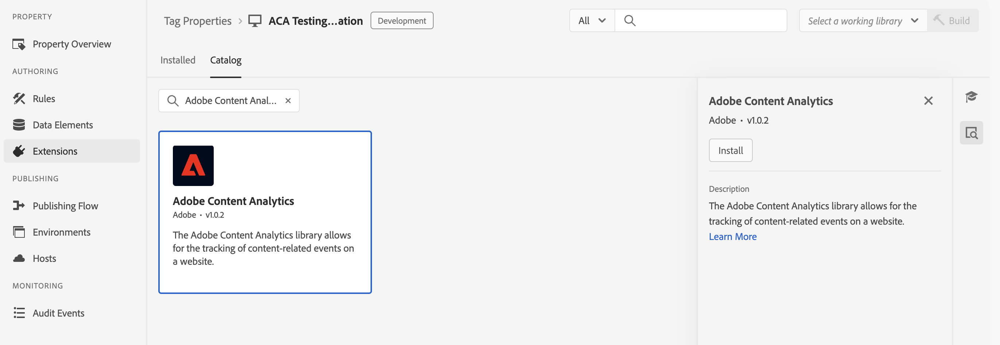

# Adobe Content Analytics扩展概述

[!DNL Adobe Content Analytics]标记扩展允许跟踪网站上的内容相关事件。 该扩展通过Experience Platform Edge Network，将内容数据（体验和资源）从Web资产发送到Adobe Experience Cloud中的数据流。

通过扩展，可将与特定内容相关的事件数据流式传输到Experience Platform，以便在Customer Journey Analytics的内容分析报表中使用这些数据。

本文档介绍如何在标记UI中配置标记扩展。

## 安装Adobe Content Analytics标记扩展 {#install}

>[!NOTE]
>
>Adobe Content Analytics标记扩展作为标记属性的一部分自动安装，在使用[Content Analytics引导式配置向导](https://experienceleague.adobe.com/zh-hans/docs/analytics-platform/using/content-analytics/configuration/guided){target="_blank"}时，将自动创建该标记属性。

### 手动安装

如果手动配置，Adobe Content Analytics标记扩展需要在上安装资产。 如果您尚未这样做，请参阅有关[创建标记属性](https://experienceleague.adobe.com/zh-hans/docs/platform-learn/implement-in-websites/configure-tags/create-a-property)的文档。

创建属性后，或选择使用[Content Analytics引导式配置向导](https://experienceleague.adobe.com/zh-hans/docs/analytics-platform/using/content-analytics/configuration/guided)创建的属性时，请打开该属性并选择左侧栏上的&#x200B;**[!UICONTROL Extensions]**&#x200B;选项卡。

选择&#x200B;**[!UICONTROL 目录]**&#x200B;选项卡。 从可用扩展列表中，找到&#x200B;**[!DNL Adobe Content Analytics]**&#x200B;扩展并选择&#x200B;**[!UICONTROL 安装]**。

选择&#x200B;**[!UICONTROL 安装]**&#x200B;后，您必须配置Adobe Content Analytics标记扩展并保存配置。

<!--
## Configure schema

The [Content Analytics guided configuration wizard](https://experienceleague.adobe.com/zh-hans/docs/analytics-platform/using/content-analytics/configuration/guided) automatically populates the proper value for the **[!UICONTROL Tenant Schema Name]**. 

>[!WARNING]
>
>Do not modify the value for **[!UICONTROL Tenant Schema Name]**.

-->

## 配置数据流

[Content Analytics引导式配置向导](https://experienceleague.adobe.com/zh-hans/docs/analytics-platform/using/content-analytics/configuration/guided)自动为&#x200B;**[!UICONTROL 沙盒]**&#x200B;和&#x200B;**[!UICONTROL 生产数据流]**&#x200B;选择正确的值。 您可以选择配置其他&#x200B;**[!UICONTROL 暂存数据流]**&#x200B;和&#x200B;**[!UICONTROL 开发数据流]**。

如果您希望在其他沙盒上使用Content Analytics并使用不同的数据流，则可以覆盖&#x200B;**[!UICONTROL 沙盒]**&#x200B;和&#x200B;**[!UICONTROL 生产数据流]**&#x200B;的自动选定值。 在执行此操作时，您可以从可用下拉菜单中选择沙盒和数据流，或选择&#x200B;**[!UICONTROL 输入值]**&#x200B;并为每个环境输入自定义数据流ID。

>[!IMPORTANT]
>
>配置另一个沙盒和数据流时，请确保
>
>* 选定的沙盒尚未与其他Content Analytics配置关联，并且
>* 任何选定的数据流都为Experience Platform服务配置了启用的Content Analytics experience event数据集。

请参阅[数据流](../../../../datastreams/overview.md)指南，了解如何配置数据流。

## 配置体验捕获和定义

在&#x200B;**[!UICONTROL 体验捕获和定义]**&#x200B;部分中，您可以启用&#x200B;**[!UICONTROL 包含体验]**&#x200B;以在为Content Analytics收集数据时包含体验。

1. 启用&#x200B;**[!UICONTROL 包含体验]**。
1. （可选） 指定如何在您的网站上呈现内容的参数。 参数是&#x200B;**[!UICONTROL 域正则表达式]**&#x200B;和&#x200B;**[!UICONTROL 查询参数]**&#x200B;的零个或多个组合。
   1. 输入&#x200B;**[!UICONTROL 域正则表达式]**，例如`^(?!.*\b(store|help|admin)\b)`。
   1. 指定&#x200B;**[!UICONTROL 查询参数]**&#x200B;的逗号分隔列表，例如`outdoors, patio, kitchen`。
使用删除单个参数，或使用&#x200B;**[!UICONTROL 全部清除]**&#x200B;删除所有参数。
1. 如果要删除域正则表达式和查询参数的组合，请选择&#x200B;**[!UICONTROL 删除]**。
1. 如果要添加其他正则表达式和查询参数组合，请选择&#x200B;**[!UICONTROL 添加正则表达式]**。

## 配置事件筛选

在&#x200B;**[!UICONTROL 事件筛选]**&#x200B;部分中，您可以修改正则表达式，以便在为Content Analytics收集数据时筛选&#x200B;**[!UICONTROL 页面URL]**&#x200B;和&#x200B;**[!UICONTROL Assets URL]**。 系统会自动填充您在[Content Analytics引导式配置向导](https://experienceleague.adobe.com/zh-hans/docs/analytics-platform/using/content-analytics/configuration/guided)中定义的正则表达式。

### 示例

* 您要从Content Analytics中排除所有文档页面。 使用以下正则表达式： `^(?!.*documentation).*`
* 您要从Content Analytics中排除所有徽标JPEG和SVG图像。 使用以下正则表达式： `^(?!.*(logo\.jpg|\.svg)).*$`

您可以使用&#x200B;**[!UICONTROL Test Regex]**&#x200B;在&#x200B;**[!UICONTROL 正则表达式测试器]**&#x200B;中测试正则表达式。

