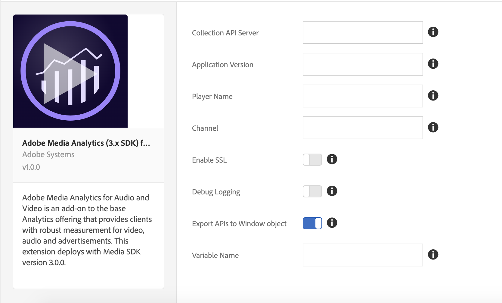

# Adobe Media Analytics (3.x SDK) for Audio and Video扩展概述

使用本文档了解有关安装、配置和实施 Adobe Media Analytics (3.x SDK) for Audio and Video 扩展（Media Analytics 扩展）的信息。其中包括使用此扩展构建规则时可用的选项，以及一些示例和指向示例的链接。

Media Analytics (MA) 扩展添加了核心 JavaScript Media SDK (Media 3.x SDK)。此扩展提供了将`Media`跟踪器实例添加到启用了标记的网站或项目的功能。 MA 扩展需要使用其他两个扩展：

* [Analytics 扩展](../analytics/overview.md)
* [Experience Cloud ID 扩展](../id-service/overview.md)

>[!IMPORTANT]
>
>此扩展随 Media 3.x SDK 一起部署，无法向后兼容 Media 2.x SDK。由于2.x已被弃用，请更新至3.x。

在启用了标记的项目中包含上述所有三个扩展后，可以采用以下两种方法之一继续操作：

* 使用您的 Web 应用程序中的 `Media` API
* 包含或构建特定于播放器的扩展，以便将特定媒体播放器事件映射到 `Media` 跟踪器实例上的 API。此实例将通过 MA 扩展公开。

## 安装和配置 MA 扩展

* **安装：**&#x200B;要安装 MA 扩展，请打开您的扩展资产，选择 **[!UICONTROL Extensions > Catalog]**，将鼠标悬停在 **[!UICONTROL Adobe Media Analytics (3.x SDK) for Audio and Video]** 扩展上方，然后选择 **[!UICONTROL Install]**。

* **配置：**&#x200B;要配置 MA 扩展，请打开 [!UICONTROL Extensions] 选项卡，将鼠标悬停在该扩展上方，然后选择 **[!UICONTROL Configure]**：



### 配置选项：

| 选项 | 描述 |
| :--- | :--- |
| 收集 API 服务器 | 定义媒体收集 API 服务器（请联系 Adobe 代表以获取此服务器） |
| Application Version | 媒体播放器应用程序/SDK 的版本 |
| Player Name | 正在使用的媒体播放器的名称（例如“AVPlayer”、“HTML5 播放器”、“我的自定义视频播放器”） |
| Channel | 渠道名称属性 |
| Debug Logging | 启用或禁用日志记录 |
| Enable SSL | 允许或禁止通过 HTTPS 发送 ping |
| Export APIs to Window Object | 允许或禁止将 Media Analytics API 导出到全局范围 |
| Variable Name | `window` 对象下用于导出 Media Analytics API 的变量 |

**提醒：** MA 扩展要求使用 [Analytics](../analytics/overview.md) 和 [Experience Cloud ID](../id-service/overview.md) 扩展。您还必须将这些扩展添加到您的扩展资产并对其进行配置。

## 使用 MA 扩展

### 通过网页/JS 应用程序使用

MA 扩展通过启用 [!UICONTROL Configuration] 页面中的“Export APIs to Window Object”设置，在全局窗口对象中导出 Media API。它将在配置的变量名称下导出 API。例如，如果变量名称配置为 `ADB`，则 `window.ADB.Media` 可以访问 Media API。

>[!IMPORTANT]
>
>MA 扩展仅在 `window["CONFIGURED_VARIABLE_NAME"]` 未定义时才导出 API，并且不会覆盖现有变量。

1. **Media API：**`window["CONFIGURED_VARIABLE_NAME"].Media`

   这会公开 Media SDK 中的所有 API 和常量：[https://adobe-marketing-cloud.github.io/media-sdks/reference/javascript_3x/APIReference.html](https://adobe-marketing-cloud.github.io/media-sdks/reference/javascript_3x/APIReference.html)

1. **创建媒体跟踪器实例：**`window["CONFIGURED_VARIABLE_NAME"].Media.getInstance`

   **返回值：**&#x200B;用于跟踪媒体会话的 `Media` 跟踪器实例。

   ```javascript
   var Media = window["CONFIGURED_VARIABLE_NAME"].Media;
   
   var tracker = Media.getInstance();
   ```

1. 使用媒体跟踪器实例，按照 [JS API 文档](https://adobe-marketing-cloud.github.io/media-sdks/reference/javascript_3x/index.html)来实施媒体跟踪。

您可在此处获得示例播放器：[MA 示例播放器](https://github.com/Adobe-Marketing-Cloud/media-sdks/tree/master/samples/launch/js/3.x)。示例播放器作为参考，展示了如何使用 MA 扩展直接从 Web 应用程序支持 Media Analytics。


### 通过其他扩展使用

MA扩展会将`media`作为共享模块公开给其他扩展。 （有关共享模块的其他信息，请参阅[共享模块文档](../../../extension-dev/web/shared.md)。）

>[!IMPORTANT]
>
>只能从其他扩展访问共享模块。也就是说，网页/JavaScript 应用程序既无法访问共享模块，也无法在扩展之外使用 `turbine`（请参阅下面的代码示例）。

1. **Media API：**`media`共享模块

   这会公开 Media SDK 中的所有 API 和常量：[https://adobe-marketing-cloud.github.io/media-sdks/reference/javascript_3x/APIReference.html](https://adobe-marketing-cloud.github.io/media-sdks/reference/javascript_3x/APIReference.html)

1. 按如下方式创建媒体跟踪器实例：

   **返回值：**&#x200B;用于跟踪媒体会话的 `Media` 跟踪器实例。

   ```javascript
   var Media =
     turbine.getSharedModule('adobe-media-analytics', 'media');
   
   var tracker = Media.getInstance();
   ```

1. 使用媒体跟踪器实例，按照 [JS API 文档](https://adobe-marketing-cloud.github.io/media-sdks/reference/javascript_3x/index.html)来实施媒体跟踪。

>[!NOTE]
>
>**测试：**&#x200B;对于此版本，要测试您的扩展，必须将其上传到[Experience Platform](../../../extension-dev/submit/upload-and-test.md)，您可以在其中访问所有依赖的扩展。
