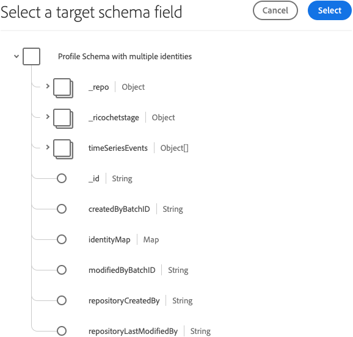

# Adobe Experience Platform 演示扩展

>[!NOTE]
>
>此扩展已弃用，推荐使用[Adobe Experience Platform Web SDK](../web-sdk/overview.md)。

此扩展的功能将移植到新扩展上。以下是当前功能的快速比较。

| Experience Platform演示扩展 | Experience Platform Web SDK |
| ------------------ | ----------- |
| 支持自定义客户 ID | 支持自定义客户 ID |
| XDM的客户端映射UI | 在 ECID 中构建（无需 visitor.js） |
| 能够创建流连接 | 选择加入支持 |
| | XDM 支持作为数据元素 |
| | 第一方域支持 |
| | 内置调试工具 |
| | 自动收集浏览器上下文 |
| | 完全开放源 |

## 配置 Adobe Experience Platform 扩展

此部分提供有关配置 Adobe Experience Platform 扩展时可用的选项的参考。

如果尚未安装 Adobe Experience Platform 扩展，请打开您的资产，选择 **[!UICONTROL Extensions > Catalog]**，将鼠标悬停在 Adobe Experience Platform 扩展上，然后选择 **[!UICONTROL Install]**。

要配置该扩展，请打开 [!UICONTROL Extensions] 选项卡，将鼠标悬停在该扩展上，然后选择 **[!UICONTROL Configure]**。

### 流连接

要开始将数据流式传输到 Adobe Experience Platform，第一步便是选择一个流连接。您可以从流连接组合框中选择一个。流连接为必填字段。如果尚未创建任何流连接，则可以通过选择 **[!UICONTROL Create a streaming connection]** 按钮来创建一个。

如果选择 **[!UICONTROL Create a streaming connection]**，将会显示一个模式窗口。

该模式窗口中包含预先填充了值的字段，您可以根据需要更改这些值。如果您计划创建多个流连接，则应当注意&#x200B;**[!UICONTROL Data Source]**&#x200B;字段必须是唯一的。 因此，在尝试使用已用于其他连接的 **[!UICONTROL Data Source]** 来创建另一个流连接时，操作将会失败。

选择流端点后，您将需要提供流端点 URL 和源。

## Adobe Experience Platform 扩展操作类型

此部分介绍 Adobe Experience Platform 扩展中可用的操作类型。

### 发送信标 {#send-beacon}

这是为将数据发送到 Adobe Experience Platform 而将使用的操作类型。

您首先需要选择一个将存储数据的数据集。通常，数据集表示将存储通过流连接发送的数据的表格。使用此操作类型前，您需要在 Adobe Experience Platform 中创建数据集。

在选择了将要存储数据的数据集后，您将会看到有关已链接到选定数据集的架构的详细信息。

### 架构映射

选择数据集后，您可以定义架构映射。

源值字段可接受值或数据元素。您可以通过选择位于源值字段旁边的数据元素按钮来添加数据元素。

目标架构字段包含数据集架构中定义的XDM字段的路径。 对于在更深层架构层次结构中定义的字段，您可以在路径各部分之间使用点(例如， （例如 timeSeriesEvents.eventType）。

### 架构字段选择器

通过该扩展，还可以使用可视选择器来选择目标架构字段。如果选择位于目标架构字段输入旁边的目标按钮，则将显示一个模式窗口，您会在该窗口中看到数据集的架构树。您可以选择一个字段，然后选择 **Select** 按钮，此时目标架构字段输入将会更新，并包含正确的 XDM 路径。

### Adobe Experience Platform 内的身份标识字段

记录数据架构和时序数据架构可以包含一个或多个标识字段。 身份标识字段可拼合到一起组成一个主体的单一身份标识表示形式，这些字段中包含如下信息：CRM 身份标识符、Experience Cloud ID (ECID)、浏览器 Cookie、广告 ID 或不同域中的其他 ID 等等。

可以通过以下两种方式在架构内定义身份标识字段：

1. 记录架构和时序架构都包含一个名为 `xdm:identityMap` 的特殊字段，该字段中可以包含身份标识映射。
1. 可在架构内将键字段标记为“身份标识”字段。

### Adobe Experience Platform 扩展内的身份标识字段

对于每个定义为身份标识字段的架构字段，都将在架构映射部分中添加一个相应行。添加的每个行中都将包含已填充了相应 XDM 架构路径的目标架构字段。如果您在某个架构字段旁边看到轮廓图标，则可以识别该字段是否还属于身份标识字段。

主身份标识字段始终是必填字段，因此不能从架构映射部分中删除包含这些字段的行。

如果某个架构字段被定义为非主身份标识字段，则会自动将该字段添加到架构映射部分，但源值输入可以保留为空。该字段可以删除。如果该字段对应的源值输入为空，则将丢弃该字段。

在每个不含值的非主身份标识字段旁边，您将看到一个警告图标。

如果您的架构中包含 `xdm:identityMap` 字段，则将显示一个身份标识部分。如果您希望使用 `xdm:identityMap` 发送与身份标识相关的数据，则可以使用此部分。

身份标识映射部分可以包含多个行。每行可以定义一个特定身份标识类型。您可以为标识定义以下属性：类型、已验证状态、主标识和值。

如果身份标识映射部分中有多个身份标识，则只能将一个身份标识标记为主身份标识。

如果您的架构中有一个`xdm:identityMap`字段，同时另一个字段被标记为主标识字段，则不会显示标识映射部分内的主列。

### 必填字段

某些架构将具有顶级必填字段。 最常见的顶级必填字段为 `timestamp` 和 `_id`。如果未定义这两个字段，信标将无法正常运行。您可以在架构映射部分中定义这两个字段。

如果您的架构映射部分中未包含 `timestamp` 或 `_id`，但数据集架构需要使用这两个字段，则 Adobe Experience Platform 扩展将发送包含自动生成值的信标，以便信标可以正常运行。仅当未在架构映射部分中定义这两个字段时，才会将自动生成的值添加到信标数据中。
