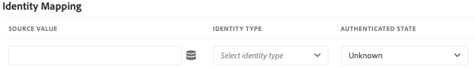

# Adobe Experience Platform 演示扩展

>[!NOTE]
>
>Adobe Experience Platform Launch已經過品牌重塑，現在是Adobe Experience Platform中的一套資料收集技術。 因此，产品文档中的术语有一些改动。有关术语更改的综合参考，请参阅以下[文档](../../../term-updates.md)。

>[!NOTE]
>
>此擴充功能已過時，傾向於 [Adobe Experience Platform Web SDK](../sdk/overview.md).

此扩展的功能将移植到新扩展上。以下是当前功能的快速比较。

| Platform示範擴充功能 | 平台Web SDK |
| ------------------ | ----------- |
| 支持自定义客户 ID | 支持自定义客户 ID |
| XDM的使用者端對應UI | 在 ECID 中构建（无需 visitor.js） |
| 能够创建流连接 | 选择加入支持 |
|  | XDM 支持作为数据元素 |
|  | 第一方域支持 |
|  | 内置调试工具 |
|  | 自动收集浏览器上下文 |
|  | 完全开放源 |

## 配置 Adobe Experience Platform 扩展

此部分提供有关配置 Adobe Experience Platform 扩展时可用的选项的参考。

如果尚未安裝Adobe Experience Platform擴充功能，請開啟您的屬性，然後選取「 」 **[!UICONTROL 擴充功能>目錄]**，將游標暫留在Adobe Experience Platform擴充功能上，然後選取「 」 **[!UICONTROL 安裝]**.

若要設定擴充功能，請開啟 [!UICONTROL 擴充功能] 索引標籤，將游標停留在擴充功能上，然後選取「 」 **[!UICONTROL 設定]**.

### 流连接

要开始将数据流式传输到 Adobe Experience Platform，第一步便是选择一个流连接。您可以从流连接组合框中选择一个。流连接为必填字段。如果您尚未建立任何串流連線，可以選取 **[!UICONTROL 建立串流連線]** 按鈕。

如果您選取 **[!UICONTROL 建立串流連線]** 將會出現強制回應視窗。

该模式窗口中包含预先填充了值的字段，您可以根据需要更改这些值。如果您打算建立多個串流連線，請注意 **[!UICONTROL 資料來源]** 欄位必須是唯一的。 嘗試使用建立另一個串流連線 **[!UICONTROL 資料來源]** 已用於其他連線將會失敗。

选择流端点后，您将需要提供流端点 URL 和源。

## Adobe Experience Platform 扩展操作类型

此部分介绍 Adobe Experience Platform 扩展中可用的操作类型。

### Send Beacon {#send-beacon}

这是为将数据发送到 Adobe Experience Platform 而将使用的操作类型。

您首先需要选择一个将存储数据的数据集。通常，数据集表示将存储通过流连接发送的数据的表格。使用此操作类型前，您需要在 Adobe Experience Platform 中创建数据集。

在选择了将要存储数据的数据集后，您将会看到有关已链接到选定数据集的架构的详细信息。

### 架构映射

选择数据集后，您可以定义架构映射。

源值字段可接受值或数据元素。您可以通过选择位于源值字段旁边的数据元素按钮来添加数据元素。

目標結構描述欄位包含資料集結構描述中定義的XDM欄位路徑。 對於在更深層架構階層定義的欄位，您可以在路徑各部之間使用點(例如： （例如 timeSeriesEvents.eventType）。

### 架构字段选择器

通过该扩展，还可以使用可视选择器来选择目标架构字段。如果选择位于目标架构字段输入旁边的目标按钮，则将显示一个模式窗口，您会在该窗口中看到数据集的架构树。您可以选择一个字段，然后选择 **Select** 按钮，此时目标架构字段输入将会更新，并包含正确的 XDM 路径。

### Adobe Experience Platform 内的标识字段

記錄資料結構描述和時間序列資料結構描述可能包含一或多個身分欄位。 标识字段可拼合到一起组成一个主体的单一标识表示形式，这些字段中包含如下信息：CRM 标识符、Experience Cloud ID (ECID)、浏览器 Cookie、广告 ID 或不同域中的其他 ID 等等。

可以通过以下两种方式在架构内定义标识字段：

1. 记录架构和时序架构都包含一个名为 `xdm:identityMap` 的特殊字段，该字段中可以包含标识映射。
1. 可在架构内将键字段标记为“标识”字段。

### Adobe Experience Platform 扩展内的标识字段

对于每个定义为标识字段的架构字段，都将在架构映射部分中添加一个相应行。添加的每个行中都将包含已填充了相应 XDM 架构路径的目标架构字段。如果您在某个架构字段旁边看到配置文件图标，则可以识别该字段是否还属于标识字段。

主标识字段始终是必填字段，因此不能从架构映射部分中删除包含这些字段的行。

如果某个架构字段被定义为非主标识字段，则会自动将该字段添加到架构映射部分，但源值输入可以保留为空。该字段可以删除。如果该字段对应的源值输入为空，则将丢弃该字段。

在每个不含值的非主标识字段旁边，您将看到一个警告图标。

如果您的架构中包含 `xdm:identityMap` 字段，则将显示一个标识部分。如果您希望使用 `xdm:identityMap` 发送与标识相关的数据，则可以使用此部分。

标识映射部分可以包含多个行。每行可以定义一个特定标识类型。您可以為身分定義下列屬性：型別、驗證狀態、主要身分和值。

如果标识映射部分中有多个标识，则只能将一个标识标记为主标识。

如果您的結構描述具有 `xdm:identityMap` 欄位，而同時有另一個欄位標示為主要身分欄位，則身分對應區段內的主要身分欄不會顯示。

### 必填字段

有些結構描述會有頂層必要欄位。 最常见的顶级必填字段为 `timestamp` 和 `_id`。如果未定义这两个字段，信标将无法正常运行。您可以在架構對應區段中加以定義。

如果您的架构映射部分中未包含 `timestamp` 或 `_id`，但数据集架构需要使用这两个字段，则 Adobe Experience Platform 扩展将发送包含自动生成值的信标，以便信标可以正常运行。仅当未在架构映射部分中定义这两个字段时，才会将自动生成的值添加到信标数据中。
