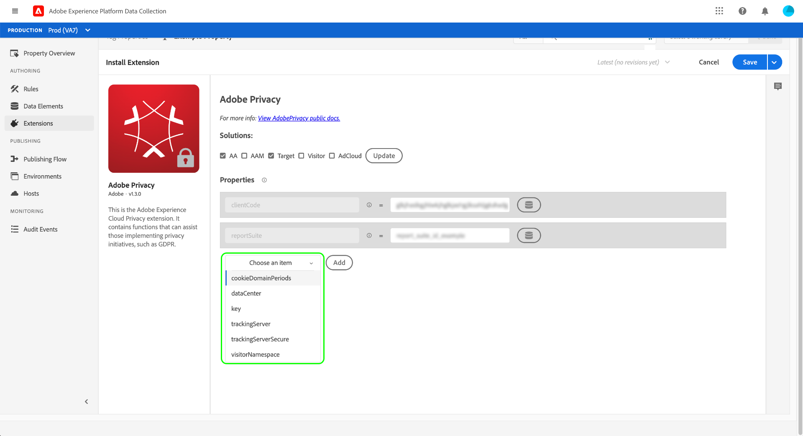

# Adobe Privacy扩展概述

Adobe Privacy标记扩展允许您收集和移除客户端设备上Adobe解决方案分配给最终用户的用户ID。 收集的ID可以发送到[Adobe Experience Platform Privacy Service](../../../../privacy-service/home.md)，以访问或删除受支持的Adobe Experience Cloud应用程序中相关个人的个人数据。

本指南介绍如何在Experience Platform UI或数据收集UI中安装和配置Adobe Privacy扩展。

>[!NOTE]
>
>如果您希望在不使用标记的情况下安装这些功能，请参阅[隐私JavaScript库概述](../../../../privacy-service/js-library.md)，以了解如何使用原始代码实施的步骤。

## 安装和配置扩展

在左侧导航中选择&#x200B;**[!UICONTROL Extensions]**，然后选择&#x200B;**[!UICONTROL Catalog]**&#x200B;选项卡。 使用搜索栏缩小可用扩展列表的范围，直到找到Adobe Privacy为止。 选择&#x200B;**[!UICONTROL Install]**&#x200B;以继续。

在下一个屏幕中，您可以配置希望扩展从哪些源和解决方案中收集ID。 扩展支持以下解决方案：

* Adobe Analytics (AA)
* Adobe Audience Manager (AAM)
* Adobe Target
* Adobe Experience Cloud Identity服务（访客或ECID）
* Adobe Advertising Cloud (AdCloud)

选择一个或多个解决方案，然后选择&#x200B;**[!UICONTROL Update]**。

屏幕会更新，以根据您选择的解决方案显示所需配置参数的输入。

使用下面的下拉菜单，您还可以向配置添加其他特定于解决方案的参数。

>[!NOTE]
>
>有关每个受支持解决方案的接受配置值的详细信息，请参阅隐私JavaScript库概述中有关[配置参数](../../../../privacy-service/js-library.md#config-params)的部分。

完成添加选定解决方案的参数后，选择&#x200B;**[!UICONTROL Save]**&#x200B;以保存配置。

## 使用扩展 {#using}

Adobe Privacy扩展提供了三种操作类型，当发生特定事件并且满足条件时，可在[规则](../../../ui/managing-resources/rules.md)中使用：

* **[!UICONTROL Retrieve Identities]**：已检索用户的存储身份信息。
* **[!UICONTROL Remove Identities]**：用户存储的身份信息已被删除。
* **[!UICONTROL Retrieve Then Remove Identities]**：检索了用户存储的身份信息，然后将其删除。

对于上述每个操作，您必须提供一个回调JavaScript函数，该函数将接受检索到的身份数据并将其作为对象参数处理。 从此处，您可以存储这些标识，显示它们，或根据需要将它们发送到[Privacy Service API](../../../../privacy-service/api/overview.md)。

在使用Adobe Privacy标记扩展时，必须以数据元素的形式提供所需的回调函数。 有关如何配置此数据元素的步骤，请参阅下一部分。

### 定义数据元素以处理身份

在左侧导航中选择&#x200B;**[!UICONTROL Data Elements]**，然后选择&#x200B;**[!UICONTROL Add Data Element]**，开始创建新数据元素的过程。 在配置屏幕上，选择&#x200B;**[!UICONTROL Core]**&#x200B;作为扩展，选择&#x200B;**[!UICONTROL Custom Code]**&#x200B;作为数据元素类型。 从这里，选择右侧面板中的&#x200B;**[!UICONTROL Open Editor]**。

在显示的对话框中，定义一个将处理检索到的身份的JavaScript函数。 回调必须接受单个对象类型参数（以下示例中为`ids`）。 然后，函数可以处理您想要的ID，并且还可以调用网站上全局可用的任何变量和函数以供进一步处理。

>[!NOTE]
>
>有关回调函数应处理的`ids`对象的结构的更多信息，请参阅隐私JavaScript库概述中提供的[代码示例](../../../../privacy-service/js-library.md#samples)。

完成后，选择&#x200B;**[!UICONTROL Save]**。

如果不同事件需要不同的回调，则可继续创建其他自定义代码数据元素。

### 创建包含隐私操作的规则

将回调数据元素配置为处理检索到的ID后，您可以创建一个规则，以便在网站上发生特定事件时，以及出现您需要的任何其他条件时，调用Adobe Privacy扩展。

为规则配置操作时，为扩展选择&#x200B;**[!UICONTROL Adobe Privacy]**。 对于操作类型，请选择扩展提供的[三个函数](#using)之一。

右侧面板提示您选择将用作操作回调的数据元素。 选择数据库图标（），然后从列表中选择您之前创建的数据元素。 选择&#x200B;**[!UICONTROL Keep Changes]**&#x200B;以继续。

在此处，您可以继续配置规则，以便Adobe隐私操作根据您所需的事件和条件触发。 如果满意，请选择&#x200B;**[!UICONTROL Save]**。

您现在可以将规则添加到库中，以便在您的网站上作为内部版本部署以进行测试。 有关详细信息，请参阅[标记发布流](../../../ui/publishing/overview.md)的概述。

## 禁用或卸载扩展

安装该扩展后，您可以禁用或删除它。选择已安装扩展中 Adobe Privacy 卡片上的 **[!UICONTROL Configure]**，然后选择 **[!UICONTROL Disable]** 或 **[!UICONTROL Uninstall]**。

## 后续步骤

本指南介绍如何在UI中使用Adobe Privacy标记扩展。 有关扩展提供的功能的更多信息，包括如何使用原始代码使用该扩展的示例，请参阅Privacy Service文档中的[隐私JavaScript库概述](../../../../privacy-service/js-library.md)。
