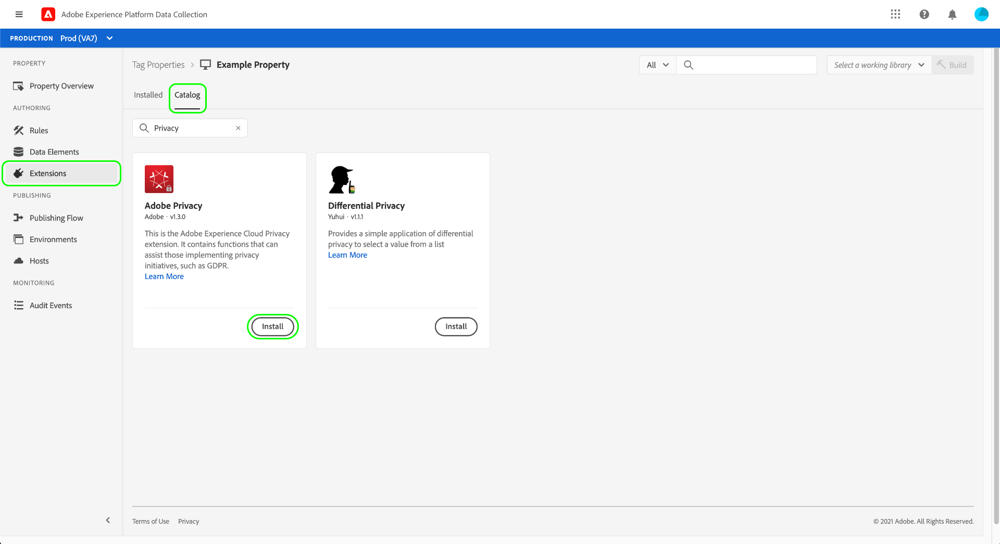
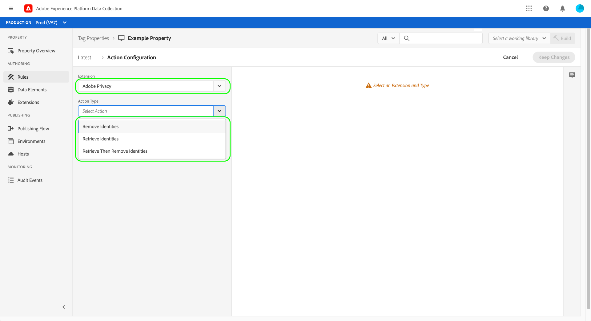

# Adobe隐私扩展概述

>[!NOTE]
>
>Adobe Experience Platform Launch已更名为Adobe Experience Platform中的一套数据收集技术。 因此，产品文档中的术语有一些改动。有关术语更改的综合参考，请参阅以下[文档](../../../term-updates.md)。

Adobe隐私标记扩展允许您收集和删除由客户端设备上的Adobe解决方案分配给最终用户的用户ID。 收集的ID可以发送到 [Adobe Experience Platform Privacy Service](../../../../privacy-service/home.md) 访问或删除受支持Adobe Experience Cloud应用程序中相关个人的个人数据。

本指南涵盖如何在Experience PlatformUI或数据收集UI中安装和配置Adobe隐私扩展。

>[!NOTE]
>
>如果您希望在不使用标记的情况下安装这些功能，请参阅 [隐私JavaScript库概述](../../../../privacy-service/js-library.md) 以了解有关如何使用原始代码实施的步骤。

## 安装和配置 扩展

选择 **[!UICONTROL 扩展]** 在左侧导航中，其后是 **[!UICONTROL 目录]** 选项卡。 使用搜索栏缩小可用扩展名的列表，直至找到Adobe隐私。 选择 **[!UICONTROL 安装]** 以继续。

在下一个屏幕中，您可以配置希望扩展从哪些源和解决方案中收集ID。 扩展支持以下解决方案：

* Adobe Analytics (AA)
* Adobe Audience Manager (AAM)
* Adobe Target
* Adobe Experience Cloud Identity服务（访客或ECID）
* Adobe Advertising Cloud (AdCloud)

选择一个或多个解决方案，然后选择 **[!UICONTROL 更新]**.

屏幕会更新，以根据您选择的解决方案显示所需配置参数的输入。

使用下面的下拉菜单，您还可以向配置添加其他特定于解决方案的参数。

>[!NOTE]
>
>请参阅以下部分： [配置参数](../../../../privacy-service/js-library.md#config-params) ，以了解有关每个受支持解决方案的接受配置值的详细信息。

为所选解决方案添加完参数后，选择 **[!UICONTROL 保存]** 以保存配置。

## 使用扩展 {#using}

Adobe隐私扩展提供了三种操作类型，它们可用于 [规则](../../../ui/managing-resources/rules.md) 当发生特定事件并且满足条件时：

* **[!UICONTROL 检索标识]**：检索用户存储的身份信息。
* **[!UICONTROL 删除身份]**：删除用户存储的身份信息。
* **[!UICONTROL Retrieve Then Remove标识]**：检索用户存储的身份信息，然后将其删除。

对于上述每个操作，必须提供一个回调JavaScript函数，该函数接受检索到的身份数据并将其作为对象参数处理。 从此处，您可以存储这些标识，显示它们，或将其发送到 [PRIVACY SERVICEAPI](../../../../privacy-service/api/overview.md) 您需要。

使用Adobe隐私标记扩展时，必须以数据元素的形式提供所需的回调函数。 有关如何配置此数据元素的步骤，请参阅下一部分。

### 定义数据元素以处理身份

通过选择开始创建新数据元素的过程 **[!UICONTROL 数据元素]** 在左侧导航中，其后是 **[!UICONTROL 添加数据元素]**. 进入配置屏幕后，选择 **[!UICONTROL 核心]** 扩展和 **[!UICONTROL 自定义代码]** （数据元素类型）。 从此处选择 **[!UICONTROL 打开编辑器]** 在右侧面板中。

在显示的对话框中，定义将处理检索到的身份的JavaScript函数。 回调必须接受单个对象类型参数(`ids` （在以下示例中）。 然后，该函数可以处理您想要的ID，并且还可以调用网站上全局可用的任何变量和函数以供进一步处理。

>[!NOTE]
>
>欲知关于 `ids` 需要回调函数处理的对象，请参见 [代码示例](../../../../privacy-service/js-library.md#samples) 在隐私JavaScript库的概述中提供。

完成后，选择 **[!UICONTROL 保存]**.

如果不同事件需要不同的回调，您可以继续创建其他自定义代码数据元素。

### 创建包含隐私操作的规则

将回调数据元素配置为处理检索到的ID后，您可以创建一个规则，以便在网站上发生特定事件时以及发生您所需的任何其他条件时调用Adobe隐私扩展。

为规则配置操作时，选择 **[!UICONTROL Adobe隐私]** 作为扩展。 对于操作类型，选择操作类型之一 [三个函数](#using) 由扩展提供。

右侧面板提示您选择将用作操作回调的数据元素。 选择数据库图标()并从列表中选择之前创建的数据元素。 选择 **[!UICONTROL 保留更改]** 以继续。

在此处，您可以继续配置规则，以便Adobe隐私操作根据您所需的事件和条件触发。 满意后，选择 **[!UICONTROL 保存]**.

您现在可以将规则添加到库中，以便在网站上作为内部版本部署以进行测试。 请参见 [标记发布流程](../../../ui/publishing/overview.md) 了解更多信息。

## 禁用或卸载扩展

安装该扩展后，您可以禁用或删除它。选择 **[!UICONTROL 配置]** Adobe ，然后选择任一 **[!UICONTROL 禁用]** 或 **[!UICONTROL 卸载]**.

## 后续步骤

本指南介绍了UI中Adobe隐私标记扩展的使用。 有关扩展提供的功能的更多信息，包括如何使用原始代码使用该功能的示例，请参阅 [隐私JavaScript库概述](../../../../privacy-service/js-library.md) 在Privacy Service文档中。
