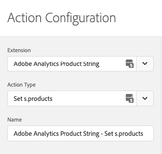
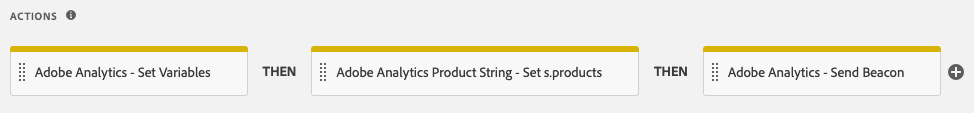

# Adobe Analytics Product String扩展概述

>[!NOTE]
>
>Adobe Experience Platform Launch已更名为Adobe Experience Platform中的一套数据收集技术。 因此，产品文档中的术语有一些改动。 有关术语更改的综合参考，请参阅以下[文档](../../../term-updates.md)。

这个 `products` 变量可跟踪用户与网站产品的交互情况。例如，`products` 变量可跟踪产品被查看、添加到购物车、结帐以及购买的次数。它也可以跟踪网站上促销类别的相对效果。

`products` 变量应当始终结合成功事件进行设置。

[!DNL Adobe Analytics Product String Builder] 扩展通过循环遍历数据层、获取所有必需的产品相关数据并使用下面显示的正确语法对其进行格式化，可以自动为您设置 `products` 变量。您不再需要编写和维护自定义 JavaScript，即可执行这些复杂的操作。

## products 变量的语法

```bash
Category;Product;Quantity;Price;eventN=X|eventN2=X2;eVarN=merch_category|eVarN2=merch_category2
```

有关完整文档，请访问[产品](https://experienceleague.adobe.com/docs/analytics/implementation/vars/page-vars/products.html?lang=zh-Hans)。

## 扩展说明

### 操作配置

将“Adobe Analytics Product String - Set s.products”操作添加到您的规则中。



### 设置标准产品数据

接下来，定义数据层变量。在按照上一步所述配置操作后，将会显示以下屏幕：


对于要包含在 Product String 中的每个数据点，请输入相应数据层变量的路径。

例如，如果数据层的结构如下所示：

```json
digitalData = {
  "transaction": {
    "item": [{
      "productInfo": {
        "productName": "My Product"
      }
    }]
  }
};
```

您应在“Variable for product ID/name”字段中输入以下路径，以获取 `productName` 变量：

```json
digitalData.transaction.item.productInfo.productName
```

>[!NOTE]
>
>如果您使用数据元素来填充该字段，那么应使用“Constant”或“Custom Code”数据元素类型对其进行配置，并且必须将上述路径作为字符串文字返回。

### 价格类型

[!DNL Adobe Analytics] Product String 中的 `price` 参数必须反映该产品购买单位总量的总价格，而非单价。在扩展操作中启用“Price”字段时，您必须指定数据层是显示总价还是单价。使用单价时，[!DNL Adobe Analytics Product String] 扩展会自动将单价乘以数量，以获得总价并正确设置 Product String。


### 自定义事件和促销 eVar


如果您的实施使用自定义事件或促销 eVar，请遵循以下步骤：

1. 选择关联的&#x200B;**[!UICONTROL 添加]**&#x200B;按钮。
1. 从下拉菜单中选择您需要设置的事件 eVar。
1. 使用上述的相同语法，输入相应数据层变量的路径。

### 操作顺序

此操作必须伴随“Adobe Analytics - Set Variables”操作（用于设置相应的成功事件）和“Adobe Analytics - Send Beacon”操作。正确的操作顺序如下所示。



### 要求

* 基于对象的[数据层](https://theblog.adobe.com/data-layers-buzzword-best-practice/)，其变量适用于所有产品相关数据（如产品 ID、数量和价格）。此扩展不适用于基于数组的数据层。
* 必须安装 [Adobe Analytics](../analytics/overview.md) 扩展。
