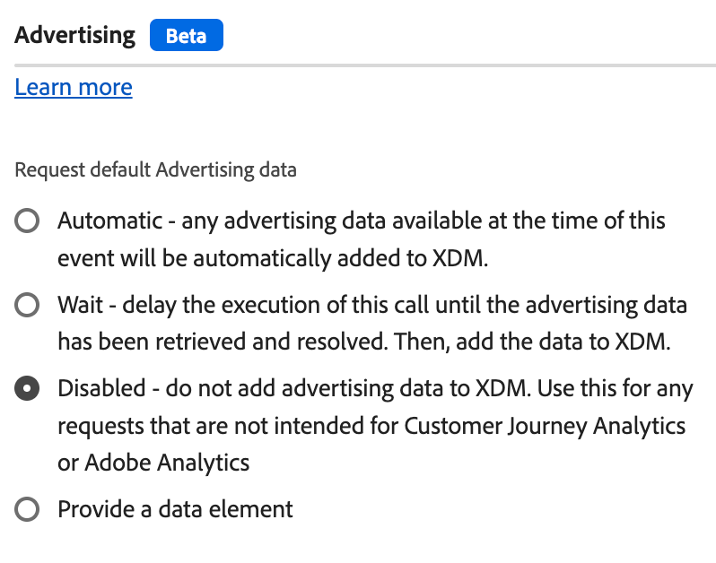

# 操作类型

配置[Adobe Experience Platform Web SDK标记扩展](web-sdk-extension-configuration.md)后，必须配置操作类型。

本页介绍[Adobe Experience Platform Web SDK标记扩展](web-sdk-extension-configuration.md)支持的操作类型。

## 应用建议 {#apply-propositions}

**[!UICONTROL 应用建议]**&#x200B;操作类型允许您在不增加量度的情况下在单页应用程序中呈现建议。

在使用单页应用程序时，如果页面的一部分被重新渲染，可能会覆盖已应用于页面的任何个性化设置，则此操作类型会很有用。

您可以将此操作类型用于各种用例，例如：

1. **呈现mbox HTML选件**。 无法自动呈现通过&#x200B;**[!UICONTROL 发送事件]**&#x200B;操作的作用域或表面显式请求的建议。 您可以使用&#x200B;**[!UICONTROL 应用建议]**&#x200B;操作类型通过指定建议元数据来告知Web SDK在何处渲染它们。
2. **在单页应用程序上渲染视图的选件**。 在呈现视图更改事件时，如果分析数据尚未准备就绪，则可以使用&#x200B;**[!UICONTROL 应用建议]**&#x200B;操作在页面顶部呈现视图建议。 有关更多详细信息，请参阅[页面事件的顶部和底部（第二个页面视图 — 选项2）](../../../../web-sdk/use-cases/top-bottom-page-events.md)。 要使用此项，请在表单中输入&#x200B;**[!UICONTROL 视图名称]**。
3. **重新呈现建议**。 当网站使用React等框架重新呈现内容时，您可能需要重新应用个性化。 在这种情况下，您可以使用&#x200B;**[!UICONTROL 应用建议]**&#x200B;操作类型来执行此操作。

此操作类型不会为渲染的建议发送显示事件。 它将跟踪渲染的建议，以便将其包含在后续&#x200B;**[!UICONTROL 发送事件]**&#x200B;调用中。

此操作类型支持以下字段：

* **[!UICONTROL 建议]**：要重新渲染的建议对象的数组。
* **[!UICONTROL 视图名称]**：要呈现的视图的名称。
* **[!UICONTROL 建议元数据]**：确定如何应用HTML选件的对象。 您可以通过表单或数据元素提供此信息。 它包含以下属性：
   * **[!UICONTROL 作用域]**
   * **[!UICONTROL 选择器]**
   * **[!UICONTROL 操作类型]**

## 应用响应 {#apply-response}

当您要根据Edge Network的响应执行各种操作时，请使用&#x200B;**[!UICONTROL 应用响应]**&#x200B;操作类型。 此操作类型通常用于混合部署，其中服务器对Edge Network进行初始调用，然后此操作类型从该调用中获取响应并在浏览器中初始化Web SDK。

使用此操作类型可能会缩短混合个性化用例的客户端加载时间。

此操作类型支持以下配置选项：

* **[!UICONTROL 实例]**：选择您正在使用的Web SDK实例。
* **[!UICONTROL 响应标头]**：选择数据元素，该数据元素将返回包含从Edge Network服务器调用返回的标头键和值的对象。
* **[!UICONTROL 响应正文]**：选择数据元素，该数据元素将返回包含Edge Network响应所提供的JSON有效负载的对象。
* **[!UICONTROL 呈现可视化个性化决策]**：启用此选项可自动呈现Edge Network提供的个性化内容，并预隐藏内容以防止闪烁。

## 评估规则集 {#evaluate-rulesets}

此操作类型手动触发规则集评估。 Adobe Journey Optimizer返回规则集以支持浏览器内消息等功能。

此操作类型支持以下选项：

* **[!UICONTROL 呈现可视化个性化决策]**：启用此选项可呈现匹配规则集项的可视个性化决策。
* **[!UICONTROL 决策上下文]**：这是键值映射，在评估设备上决策的Adobe Journey Optimizer规则集时使用。 您可以手动或通过数据元素提供决策上下文。

## 获取Media Analytics跟踪器 {#get-media-analytics-tracker}

此操作用于获取旧版Media Analytics API。 配置操作并提供对象名称时，旧版Media Analytics API将导出到该窗口对象。 如果未提供，它将像当前媒体JS库那样导出到`window.Media`。

## 带标识的重定向 {#redirect-with-identity}

使用此操作类型可将当前页面的标识共享到其他域。 此操作设计用于&#x200B;**[!UICONTROL click]**&#x200B;事件类型和值比较条件。 有关如何使用此操作类型的详细信息，请参阅[使用Web SDK扩展将标识附加到URL](../../../../web-sdk/commands/appendidentitytourl.md#extension)。

## 发送事件 {#send-event}

向Experience Platform发送事件，以便Experience Platform可以收集您发送的数据并对该信息执行相应的操作。 您要发送的任何数据均可通过&#x200B;**[!UICONTROL XDM数据]**&#x200B;字段发送。 使用符合[!DNL JSON]架构结构的[!DNL XDM]对象。 此对象可以在您的页面上创建，也可以通过&#x200B;**[!UICONTROL 自定义代码]** **[!UICONTROL 数据元素]**&#x200B;创建。

**[!UICONTROL 发送事件]**&#x200B;操作类型支持下述字段和设置。 这些字段都是可选的。

### 实例设置 {#instance}

使用&#x200B;**[!UICONTROL 实例]**&#x200B;选择器选择要配置的Web SDK实例。 如果您只有一个实例，则它是预选的。

* **[!UICONTROL 实例]**：选择要配置的Web SDK实例。 如果您只有一个实例，则将预先选择该实例。
* **[!UICONTROL 使用引导式事件]**：启用此选项可自动填写或隐藏某些字段以启用特定用例。 启用此选项将触发以下设置的显示。
   * **[!UICONTROL 请求个性化]**：此事件将在页面顶部调用。 选中后，此事件将设置以下字段：
      * **[!UICONTROL 类型]**： **[!UICONTROL 决策建议提取]**
      * **[!UICONTROL 自动发送显示事件]**： **[!UICONTROL false]**
      * 若要在此情况下自动呈现个性化，请启用&#x200B;**[!UICONTROL 呈现可视化个性化决策]**&#x200B;选项。
   * **[!UICONTROL 收集分析]**：此事件将在页面底部调用。 选中后，此事件将设置以下字段：
      * **[!UICONTROL 包含渲染的建议]**： **[!UICONTROL true]**
      * **[!UICONTROL Personalization]**&#x200B;设置已隐藏

  >[!NOTE]
  >
  >引导事件与页面事件[的](../../../../web-sdk/use-cases/top-bottom-page-events.md)顶部和底部相关。

### 数据 {#data}

* **[!UICONTROL 类型]**：此字段允许您指定将记录在XDM架构中的事件类型。 有关详细信息，请参阅[`type`](/help/web-sdk/commands/sendevent/type.md)命令中的`sendEvent`。
* **[!UICONTROL XDM]**：
* **[!UICONTROL 数据]**：使用此字段发送不符合XDM架构的数据。 如果您尝试更新Adobe Target配置文件或发送Target推荐属性，则此字段非常有用。 有关详细信息，请参阅[`data`](/help/web-sdk/commands/sendevent/data.md)命令中的`sendEvent`。
* **[!UICONTROL 包含已渲染的建议]**：启用此选项可包含已渲染但尚未发送显示事件的所有建议。 将此项与&#x200B;**[!UICONTROL 结合使用。自动发送已禁用的显示事件]**。 此设置使用有关渲染建议的信息更新`_experience.decisioning` XDM字段。
* **[!UICONTROL 文档将卸载]**：启用此选项以确保事件到达服务器，即使用户离开页面也一样。 这允许事件访问服务器，但响应将被忽略。
* **[!UICONTROL 合并ID]**： **此字段已弃用**。 这将填充`eventMergeId` XDM字段。

### 个性化 {#personalization}

* **[!UICONTROL 范围]**：选择要从个性化显式请求的范围(Adobe Target [!DNL mboxes])。 您可以手动输入范围，也可以通过提供数据元素来输入范围。
* **[!UICONTROL 界面]**：设置页面上可用于个性化的Web界面。 有关更多详细信息，请参阅[Adobe Journey Optimizer文档](https://experienceleague.adobe.com/docs/journey-optimizer/using/web/create-web.html?lang=zh-Hans)。
* **呈现可视化个性化决策：**&#x200B;如果要在页面上呈现个性化内容，请选中&#x200B;**[!UICONTROL 呈现可视化个性化决策]**&#x200B;复选框。 如有必要，您还可以指定决策范围和/或曲面。 有关呈现个性化内容的更多信息，请参阅[个性化文档](/help/web-sdk/personalization/rendering-personalization-content.md#automatically-rendering-content)。
* **[!UICONTROL 请求默认个性化]**：使用此部分控制是否请求页面范围的范围（全局mbox）和默认表面（基于当前URL的Web表面）。 默认情况下，这是在页面加载的前`sendEvent`次调用期间自动请求的。 您可以从以下选项中进行选择：
   * **[!UICONTROL 自动]**：这是默认行为。 仅在尚未请求时请求默认个性化。 这对应于Web SDK命令中未设置的`requestDefaultPersonalization`。
   * **[!UICONTROL 已启用]**：显式请求页面范围和默认表面。 这将更新SPA视图缓存。 这对应于设置为`requestDefaultPersonalization`的`true`。
   * **[!UICONTROL 已禁用]**：显式禁止请求页面范围和默认表面。 这对应于设置为`requestDefaultPersonalization`的`false`。
* **[!UICONTROL 决策上下文]**：这是键值映射，在评估设备上决策的Adobe Journey Optimizer规则集时使用。 您可以手动或通过数据元素提供决策上下文。

### Advertising {#advertising}

当您为Web SDK自定义生成组件选择&#x200B;**[!UICONTROL Advertising]**&#x200B;组件时，`sendEvent`操作的规则设置包含[!UICONTROL Advertising]部分，该部分定义如何将广告数据用于归因测量。 当规则包含一系列多个操作时，此设置非常有用。

**[!UICONTROL 请求默认Advertising数据]**&#x200B;部分提供了以下选项：

* **[!UICONTROL 自动]**：此事件时可用的任何广告数据将自动添加到XDM中。
* **[!UICONTROL 等待]**：在检索并解析广告数据之前，延迟执行此调用。 然后，将数据添加到XDM。
* **[!UICONTROL 已禁用]**：不将广告数据添加到XDM。 此函数用于任何不适用于Customer Journey Analytics或Adobe Analytics的请求。
* **[!UICONTROL 提供数据元素]**：使用数据元素在页面加载期间包含或排除广告数据。 数据元素的解析值可以包括`automatic`、`wait`和`disabled`。

如果不使用规则配置`sendEvent`操作，则广告数据将作为单独的广告扩充事件发送。

### 数据流配置覆盖 {#datastream-overrides}

数据流覆盖允许您为数据流定义其他配置，这些配置通过 Web SDK 传递到 Edge Network。

这有助于触发与默认数据流不同的数据流行为，而无需创建新数据流或修改现有设置。 有关更多详细信息，请参阅有关[配置数据流覆盖](web-sdk-extension-configuration.md#datastream-overrides)的文档。

## 发送媒体事件 {#send-media-event}

向Adobe Experience Platform和/或Adobe Analytics发送媒体事件。 当您跟踪网站上的媒体事件时，此操作很有用。 选择一个实例（如果有多个实例）。 该操作需要一个`playerId`，它表示跟踪的媒体会话的唯一标识符。 启动媒体会话时，它还需要&#x200B;**[!UICONTROL 体验质量]**&#x200B;和`playhead`数据元素。

**[!UICONTROL 发送媒体事件]**&#x200B;操作类型支持以下属性：

* **[!UICONTROL 实例]**：正在使用的Web SDK实例。
* **[!UICONTROL 媒体事件类型]**：要跟踪的媒体事件的类型。
* **[!UICONTROL 播放器ID]**：媒体会话唯一标识符。
* **[!UICONTROL 播放头]**：媒体播放的当前位置（以秒为单位）。
* **[!UICONTROL 媒体会话详细信息]**：发送媒体开始事件时，应指定所需的媒体会话详细信息。
* **[!UICONTROL 章节详细信息]**：在此部分中，您可以在发送章节开始媒体事件时指定章节详细信息。
* **[!UICONTROL Advertising详细信息]**：发送`AdBreakStart`事件时，必须指定所需的广告详细信息。
* **[!UICONTROL Advertising pod详细信息]**：发送`AdStart`事件时有关广告面板的详细信息。
* **[!UICONTROL 错误详细信息]**：有关正在跟踪的播放错误的详细信息。
* **[!UICONTROL 状态更新详细信息]**：正在更新的播放器状态。
* **[!UICONTROL 自定义元数据]**：有关正在跟踪的媒体事件的自定义元数据。
* **[!UICONTROL 体验质量]**：正在跟踪的体验数据的媒体质量。

## 设置同意 {#set-consent}

收到用户的同意后，必须使用“设置同意”操作类型将此同意告知Adobe Experience Platform Web SDK。 目前，支持两种类型的标准：“Adobe”和“IAB TCF”。请参阅[支持客户同意首选项](../../../../web-sdk/commands/setconsent.md)。 使用Adobe版本2.0时，仅支持数据元素值。 您将需要创建一个解析为同意对象的数据元素。

在此操作中，还会向您提供一个可选字段，用于包含标识映射，以便在收到同意后可以同步标识。 将同意配置为“Pending”或“Out”时，同步很有用，因为同意调用可能是第一个要触发的调用。

## 更新变量 {#update-variable}

使用此操作作为事件结果来修改XDM对象。 此操作旨在构建一个以后可以从&#x200B;**[!UICONTROL 发送事件]**&#x200B;操作引用的对象，以记录事件XDM对象。

要使用此操作类型，您必须定义一个[变量](data-element-types.md#variable)数据元素。 选择要修改的变量数据元素后，将显示一个编辑器，该编辑器类似于[XDM对象](data-element-types.md#xdm-object)数据元素的编辑器。

用于编辑器的XDM架构是对[!UICONTROL 变量]数据元素选择的架构。 您可以设置对象的一个或多个属性，方法是单击左侧的树中的其中一个属性，然后修改右侧的值。例如，在下面的屏幕快照中，productedBy属性将设置为数据元素“Producted by data element”。

更新变量操作中的编辑器与XDM对象数据元素中的编辑器之间存在一些差异。 首先，更新变量操作具有一个标记为“xdm”的根级别项。 如果单击此项目，则可以指定要用于设置整个对象的数据元素。 其次，更新变量操作包含复选框，用于清除xdm对象中的数据。 单击左侧的其中一个属性，然后选中右侧的复选框以清除值。 这将在设置变量上的任何值之前清除当前值。

## 后续步骤 {#next-steps}

阅读本文后，您应该对如何配置操作有了更好的了解。 接下来，阅读如何[配置您的数据元素类型](data-element-types.md)。
