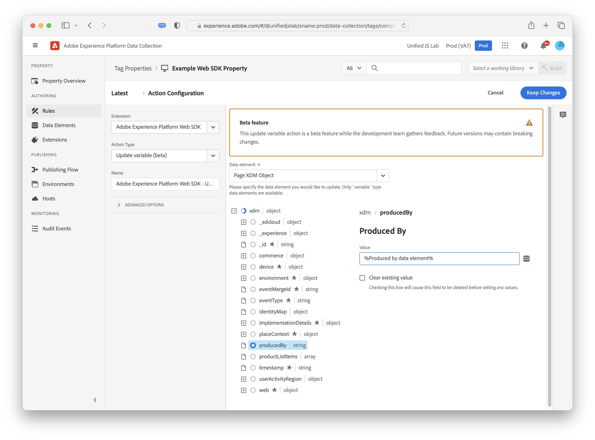

# 更新变量

**[!UICONTROL Update variable]**&#x200B;操作允许您对[变量数据元素](../data-element-types.md#variable)进行部分更改或增量更改。 您可以使用此操作来构建以后可在[[!UICONTROL Send event]](send-event.md)操作中引用的对象。 填充数据元素并将其分配给XDM对象中的属性符合大多数用例；此操作提供了更大的灵活性，允许您根据规则条件有条件地将属性设置为不同的数据元素。

在使用此操作之前，您必须已创建变量数据元素。 选择要修改的变量数据元素后，将显示一个编辑器，允许您为此操作设置任何所需的字段。

编辑器中使用的XDM架构与变量数据元素中选择的架构匹配。 通过展开对象并选择所需的属性，可以设置对象的一个或多个属性。 例如，在下面的屏幕快照中，`producedBy`属性设置为数据元素`%Produced by data element%`。

如果选择使用数据对象而不是XDM对象的变量数据元素，则可用字段取决于配置数据元素时选择的产品。 例如，如果您创建包含Adobe Analytics字段的数据对象，则在此UI中选择变量数据元素将提供可填写的特定于Adobe Analytics的字段。

