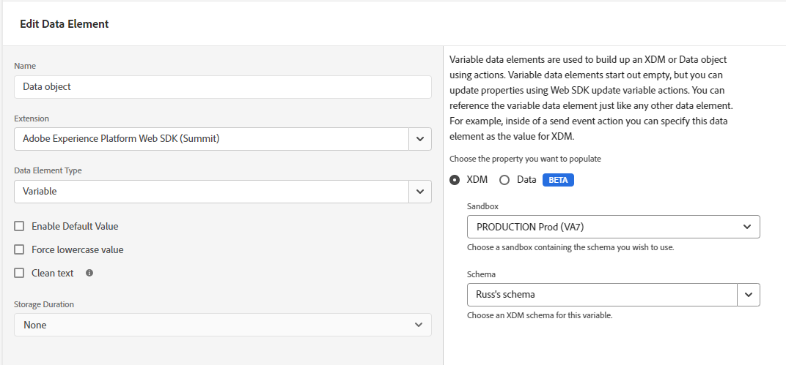

# 数据元素类型

在标记扩展中设置[操作类型](actions/actions-overview.md)后，必须配置数据元素类型。 本页介绍可用的数据元素类型。

## 标识映射 {#identity-map}

标识映射允许您为网页的访客建立标识。 标识映射由命名空间（如`CRMID`、`Phone`或`Email`）组成，每个命名空间包含一个或多个标识符。 例如，如果网站上的个人提供了两个电话号码，则您的手机命名空间应包含两个标识符。

在[!UICONTROL Identity map]数据元素中，您将为每个标识符提供以下信息：

* **[!UICONTROL ID]**：标识访客的值。 例如，如果标识符属于&#x200B;_phone_&#x200B;命名空间，[!UICONTROL ID]可以是&#x200B;_555-555-5555_。 此值通常派生自页面上的JavaScript变量或其他一些数据，因此最好创建一个引用页面数据的数据元素，然后引用[!UICONTROL ID]数据元素内[!UICONTROL Identity map]字段中的数据元素。 如果在您的页面上运行时，ID值不是填充的字符串，则将从身份映射中自动删除该标识符。
* **[!UICONTROL Authenticated state]**：用于指示访客是否已进行身份验证的选择。
* **[!UICONTROL Primary]**：指示标识符是否应用作个人的主要标识符的选择。 如果未将任何标识符标记为主标识符，则将使用ECID作为主标识符。

>[!TIP]
>
>Adobe建议将代表人员的身份（如`Luma CRM Id`）作为主要身份。
>
>如果身份映射包含人员标识符（例如`Luma CRM Id`），则人员标识符将成为主标识符。 否则，`ECID`将成为主标识。

在构建标识映射时，您不应提供[!DNL ECID]。 使用SDK时，将在服务器上自动生成[!DNL ECID]并将其包含在身份映射中。

标识映射数据元素通常与[[!UICONTROL Variable]](#variable)数据元素和[[!UICONTROL Set consent]](actions/set-consent.md)操作一起使用。

详细了解[Adobe Experience Platform Identity服务](/help/identity-service/home.md)。

## XDM对象 {#xdm-object}

使用XDM对象数据元素可更轻松地将数据格式化为XDM。 首次打开此数据元素时，请选择正确的 Adobe Experience Platform 沙盒和架构。选择架构后，您会看到架构的结构，可以轻松地在其中填写。

显示XDM对象结构的

请注意，打开架构的某些字段（如`web.webPageDetails.URL`）时，会自动收集一些项目。 即使自动收集了多个项目，您也可以根据需要覆盖任何项目。 所有值都可以手动填写或使用其他数据元素进行填写。

>[!NOTE]
>
>只填写您有兴趣收集的信息段。 将数据发送到解决方案时，会忽略未填写的任何内容。

## Variable {#variable}

您可以使用&#x200B;**[!UICONTROL Variable]**&#x200B;数据元素创建有效负荷对象。 同时支持[!UICONTROL XDM]和[!UICONTROL Data]对象。

* 当您选择[!UICONTROL XDM]时，请选择所需的[!UICONTROL Sandbox]和[!UICONTROL Schema]。
* 当您选择[!UICONTROL Data]时，请选择所需的解决方案。 可用的解决方案包括[!UICONTROL Adobe Analytics]和[!UICONTROL Adobe Target]。

创建此数据元素后，可以使用[更新变量](actions/update-variable.md)操作对其进行修改。 准备就绪后，您可以在[发送事件](actions/send-event.md)操作中包含此数据元素，以便将数据发送到数据流。

## 媒体：体验质量 {#quality-experience}

在向Adobe Experience Platform发送流媒体事件时，**[!UICONTROL Quality of Experience]**&#x200B;数据元素非常有用。 您可以在创建媒体会话时添加此元素，以下媒体事件将包含更新的体验质量数据。

显示“创建体验数据元素质量”屏幕的

## 后续步骤 {#next-steps}

了解特定用例，如[访问ECID](accessing-the-ecid.md)。
