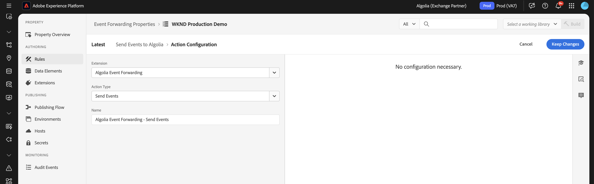

# [!DNL Algolia]事件转发扩展概述 {#overview}

>[!NOTE]
>
>Adobe Experience Platform Launch现在是Adobe Experience Platform数据收集技术的一部分。 因此，已在产品文档中更新了术语。 有关这些更改的完整列表，请参阅[术语更新指南](../../../../tags/term-updates.md)。

使用[!DNL Algolia]提供快速、相关和个性化的搜索体验。 借助AI支持的优化，您可以增强搜索结果和推荐，以帮助用户快速找到他们需要的产品、内容或信息。

使用[!DNL Algolia]事件转发扩展通过[!DNL Insights API]向[!DNL Algolia]发送用户行为事件。 此行为数据支持由AI提供支持的推荐、个性化体验和智能搜索功能。

## 先决条件 {#prerequisites}

在安装扩展之前，请确保您拥有有权访问[!DNL Insights API]的[!DNL Algolia]帐户。 如果您没有帐户，请[注册](https://dashboard.algolia.com/users/sign_up)并启用对API的访问权限。

同时确保您了解如何使用[!DNL Algolia] [!DNL Insights API]。 有关如何发送事件的概述，请参阅[使用分析API发送事件](https://www.algolia.com/doc/guides/sending-events/getting-started/)。

从您的[!DNL Algolia]帐户信息板收集以下值：
- **[!UICONTROL 应用程序ID]**
- **[!UICONTROL 搜索API密钥]**
- **[!UICONTROL 索引名称]**

## 安装扩展 {#install}

要安装[!DNL Algolia]扩展，请执行以下步骤：

在[!DNL Adobe Experience Platform]中导航到&#x200B;**[!UICONTROL 数据收集]**。 选择&#x200B;**[!UICONTROL 扩展]**&#x200B;选项卡。

打开&#x200B;**[!UICONTROL 目录]**&#x200B;并找到&#x200B;**[!UICONTROL Algolia事件转发]**&#x200B;扩展，然后选择&#x200B;**[!UICONTROL 安装]**。

### 配置扩展 {#configure-extension}

要配置[!DNL Algolia]事件转发扩展，请导航到&#x200B;**[!UICONTROL 扩展]**&#x200B;选项卡，选择&#x200B;**[!UICONTROL Algolia]**&#x200B;扩展，然后选择&#x200B;**[!UICONTROL 配置]**。

Adobe Experience Platform中的Algolia事件转发扩展的

| 属性 | 描述 |
|----------|-------------|
| **[!UICONTROL 应用程序ID]** | 输入在Algolia仪表板的[API密钥](https://www.algolia.com/account/api-keys/all)部分下找到的[!UICONTROL 应用程序ID]。 |
| **[!UICONTROL 搜索API密钥]** | 输入在“阿尔及利亚仪表板”的[API密钥](https://www.algolia.com/account/api-keys/all)部分下找到的[!UICONTROL 搜索API密钥]。 |
| **[!UICONTROL 索引名称]** | 输入包含您的产品或内容的[!UICONTROL 索引名称]。 此索引用作默认值。 |

{style="table-layout:auto"}

## [!DNL Algolia]事件转发扩展操作类型 {#action-types}

[!DNL Algolia]事件转发扩展提供了可在规则的&#x200B;**[!UICONTROL Then]**&#x200B;部分中使用的单个操作类型：

### 发送事件 {#send-event}

配置&#x200B;**[!UICONTROL 发送事件]**&#x200B;操作以将事件转发到[!DNL Algolia]：

选择&#x200B;**[!UICONTROL 规则]** > **[!UICONTROL 添加规则]**&#x200B;或选择现有规则。 在规则的&#x200B;**[!UICONTROL Then]**&#x200B;部分中，添加操作并选择&#x200B;**[!UICONTROL 扩展]**： [!DNL Algolia]事件转发> **[!UICONTROL 操作类型]**： **[!UICONTROL 发送事件]**。

## 实施[!DNL Algolia]事件字段组 {#algolia-field-group}

在使用[!DNL Algolia]事件转发扩展之前，请确保将[!DNL Algolia]事件字段组添加到架构中。 它是通过Experience Platform提供的标准字段组之一。

### 将[!DNL Algolia]事件字段组添加到您的架构 {#add-algolia-field-group}

添加[!DNL Algolia]事件字段组：

导航到&#x200B;**[!UICONTROL 架构]**&#x200B;并选择&#x200B;**[!UICONTROL 浏览]**。

添加新架构或更新用于发送Web事件的现有架构，并将鼠标悬停在&#x200B;**[!UICONTROL 添加]**&#x200B;图标上。 在搜索框中输入&#x200B;*[!DNL Algolia]*&#x200B;以缩小结果范围。

选择&#x200B;**[!DNL Algolia]事件详细信息**&#x200B;字段组> **[!UICONTROL 添加字段组]**&#x200B;按钮> **[!UICONTROL 保存]**。

Experience Platform中的

### 使用[!UICONTROL 数据收集]标记映射和发送数据

[!DNL Algolia]事件转发扩展可与&#x200B;**[!DNL Adobe Experience Platform Web SDK]**&#x200B;一起使用，以将数据从您的网站发送到[!DNL Algolia]。 这是通过创建标记属性、将数据映射到[!DNL XDM]对象并配置用于发送事件的规则来完成的。

#### 步骤1：使用Web SDK创建标记属性

1. 创建标记属性。
2. 安装[!DNL Adobe Experience Platform Web SDK]扩展。
3. 使用此扩展将数据从HTML映射到&#x200B;**[!DNL Algolia]Event**&#x200B;字段组。

#### 步骤2：为[!DNL XDM]映射创建数据元素

1. 使用&#x200B;**[!DNL Adobe Experience Platform Web SDK]**&#x200B;创建一个[!UICONTROL 数据元素]。
2. 选择&#x200B;**[!UICONTROL XDM对象]**&#x200B;作为数据元素类型。
3. 将数据映射到相应的[!DNL XDM]字段，确保填充特定于[!DNL Algolia]的字段。

#### 步骤3：创建用于发送事件的规则

1. 在标记属性中创建新规则。
2. 添加所需的事件触发器（如页面加载）或单击事件。
3. 使用&#x200B;**[!DNL Adobe Experience Platform Web SDK]**&#x200B;添加操作。
4. 选择&#x200B;**[!UICONTROL 发送事件]**&#x200B;作为操作类型。
5. 配置操作以使用您的[!DNL XDM]数据元素。

#### 步骤4：发布和测试

1. 将规则和扩展更改发布到目标环境。
2. 使用[!DNL Adobe Experience Platform Debugger]验证数据是否已发送到Adobe Experience Platform并转发到[!DNL Algolia]。

### 验证[!DNL Algolia]中的事件

配置[!DNL Algolia]事件转发扩展后，可通过执行以下步骤来验证事件是否正确发送和接收：

导航到您的[!DNL Algolia]仪表板，然后转到&#x200B;**[!UICONTROL 数据源>事件>调试器]**。

选择与从[!DNL Algolia]的事件转发扩展发送的事件匹配的事件，并验证该事件中是否存在预期的数据。

## 常见实施方案

使用[!DNL Algolia]事件转发扩展捕获和发送各种用例的用户交互数据，增强搜索相关性和个性化。

### 跟踪产品或内容视图

使用该扩展跟踪用户查看产品或内容页面的时间，以帮助[!DNL Algolia]了解用户兴趣。

### 跟踪转化事件

跟踪添加到购物车的事件、购买和其他转化事件，以优化[!DNL Algolia]的AI支持的推荐。

## 疑难解答

如果在实施[!DNL Algolia]事件转发扩展时遇到问题，请考虑以下故障排除步骤：

### 事件未出现在[!DNL Algolia]中

如果[!DNL Algolia]中未显示事件，请检查以下各项：

- **验证API凭据**：确保&#x200B;**[!UICONTROL 应用程序ID]**&#x200B;和&#x200B;**[!UICONTROL API密钥]**&#x200B;与[!DNL Algolia]仪表板中的值匹配。
- **检查事件调试器**：使用[!DNL Algolia]事件调试器确认是否接收到事件。 如果没有，请验证事件转发规则配置。
- **检查XDM映射**：确保[!DNL Algolia]架构中的所有必填字段在[!DNL XDM]对象中正确映射。

### 事件数据不正确

- 确保您的[!DNL XDM]对象数据元素准确地映射到[!DNL Algolia]架构，并带有所有必填字段。
- 确认事件参数与[!DNL Algolia]的分析API文档中列出的预期格式和结构相匹配。

## 后续步骤

本指南介绍了如何使用[!DNL Algolia Event Forwarding Extension]将数据发送到[!DNL Algolia]。 有关[!DNL Adobe Experience Platform]中事件转发功能的详细信息，请阅读[事件转发概述](../../../ui/event-forwarding/overview.md)。

有关如何使用Experience Platform Debugger和事件转发监视工具调试实施的详细信息，请阅读[Adobe Experience Platform Debugger概述](../../../../debugger/home.md)和[监视事件转发中的活动](../../../ui/event-forwarding/monitoring.md)。

## 其他资源

- [[!DNL Algolia] 分析API文档](https://www.algolia.com/doc/rest-api/insights/)
- [[!DNL Algolia] 事件文档](https://www.algolia.com/doc/guides/sending-events/getting-started/)
- [[!DNL Adobe Experience Platform] 事件转发文档](https://experienceleague.adobe.com/docs/experience-platform/tags/event-forwarding/overview.html)
- [[!DNL Algolia] AI功能概述](https://www.algolia.com/products/ai-search/)
