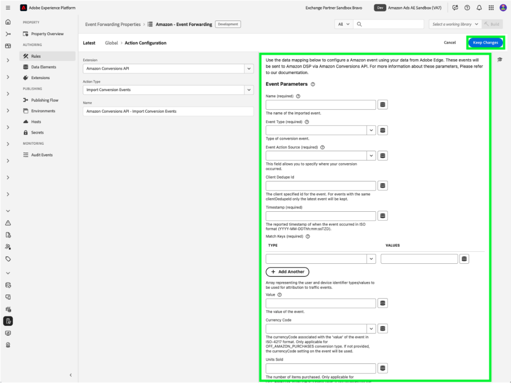

# [!DNL Amazon] Web事件API扩展概述

[!DNL Amazon]转化API扩展在来自广告商服务器的营销数据与[!DNL Amazon]之间创建直接连接。 这使广告商能够评估促销活动有效性，而不管转化位置如何，并相应地优化促销活动。 此扩展提供了更完整的归因、改进的数据可靠性以及更好的优化交付。

## [!DNL Amazon]先决条件 {#prerequisites}

在安装和配置[!DNL Amazon] Conversions API扩展之前，您需要完成多个先决条件步骤以确保正确进行身份验证和数据访问。

### 创建密码和数据元素 {#secret}

使用[!DNL Amazon]进行身份验证需要安全令牌，必须正确存储和引用：

1. 创建具有唯一名称的新[!DNL Amazon]事件转发密码以进行身份验证。
2. 使用包含&#x200B;**Secret**&#x200B;数据元素类型的&#x200B;**Core**&#x200B;扩展创建数据元素以引用您的[!DNL Amazon]密码。

此过程可确保您的身份验证凭据保持安全，同时扩展仍可在需要时访问这些凭据。

## 安装和配置[!DNL Amazon]扩展

安装该扩展需要访问Experience Platform中的事件转发属性：

- 创建或编辑事件转发属性。
- 在左侧导航中选择&#x200B;**扩展**，然后在“目录”选项卡中选择[!DNL Amazon]扩展。
- 选择&#x200B;**安装**。

在扩展目录中选择![[!DNL Amazon]扩展以及安装按钮。](../../../images/extensions/server/amazon/amazon-extension.png)

- 配置方式：

- **访问令牌**：包含OAuth 2令牌的数据元素密码

- **实体ID**：您的实体ID（可在Campaign Manager门户URL中找到，前缀为“实体”）

- 选择&#x200B;**保存**。

这些配置值在Platform和您的[!DNL Amazon]帐户之间建立连接。

### [!DNL Amazon] OAuth 2 {#oauth}

要创建[!DNL Amazon] OAuth 2密码，请执行以下操作：

- 从&#x200B;**类型**&#x200B;下拉列表中选择[!DNL Amazon] OAuth 2，然后选择&#x200B;**创建密钥**。

在下拉菜单中

- 在弹出框上选择&#x200B;**使用Amazon创建和授权密钥**&#x200B;以手动授权该密钥并继续。

- 在显示的对话框中输入[!DNL Amazon]凭据。 按照提示操作，授予数据事件转发访问权限。

完成后，您将在&#x200B;**密钥**&#x200B;选项卡中看到您的密钥及其状态和到期日期。

## 配置事件转发规则 {#config-rule}

设置完所有数据元素后，您可以创建事件转发规则，以确定将事件发送到Amazon的时间和方式。

- 导航到&#x200B;**规则**&#x200B;并创建新的事件转发规则。
- 在&#x200B;**操作**&#x200B;下，选择&#x200B;**Amazon Conversions API扩展**。
- 将&#x200B;**操作类型**&#x200B;设置为&#x200B;**导入转化事件**。

- 按照以下所述配置事件属性：

| 输入 | 描述 |
| --- | --- |
| **事件名称** | 转化事件的名称。 |
| **事件类型** | 定义跟踪的事件类型（例如，购买、购物车添加）。 |
| **时间戳** | ISO格式的事件时间。 |
| **客户端重复数据删除ID** | 重复数据删除的唯一ID。 |
| **匹配键** | 归因的用户和设备标识符。 |
| **值** | 事件的货币值。 |
| **货币代码** | ISO-4217格式的货币。 |
| **售出件数** | 已购买项目的数量。 |
| **国家/地区代码** | 发生事件的国家/地区。 |
| **数据处理选项** | 标记有限的数据使用。 |
| **同意** | 指示用户同意使用广告数据。 |

- 选择&#x200B;**保留更改**&#x200B;以保存规则。

## 事件去重 {#deduplication}

如果对相同事件同时使用[!DNL Amazon] Advertising Tag (AAT)和[!DNL Amazon]转化API扩展，则需要设置重复数据删除。 在每个共享事件中包含`clientDedupeId`以确保正确删除重复项。
如果客户端和服务器事件不重叠，则不需要删除重复项。

正确的重复数据删除可防止转化计数夸大，并确保优化数据保持准确。

有关更多详细信息，请参阅[Amazon事件重复数据删除指南](https://advertising.amazon.com/)。

## 后续步骤

本指南介绍了如何使用[!DNL Amazon]转化API扩展配置转化事件并将其发送到[!DNL Amazon]。 有关[!DNL Adobe Experience Platform]中事件转发功能的详细信息，请参阅[事件转发概述](../../../ui/event-forwarding/overview.md)

有关如何使用Experience Platform Debugger和事件转发监视工具调试实施的更多详细信息，请阅读事件转发中的[Adobe Experience Platform Debugger概述](https://experienceleague.adobe.com/zh-hans/docs/experience-platform/debugger/home)和[监视活动](https://experienceleague.adobe.com/zh-hans/docs/experience-platform/tags/event-forwarding/monitoring)。