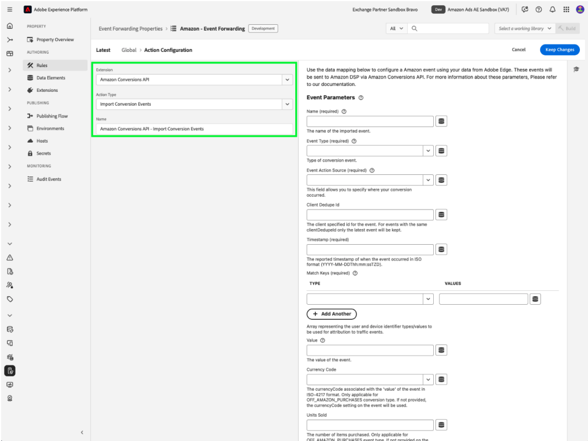
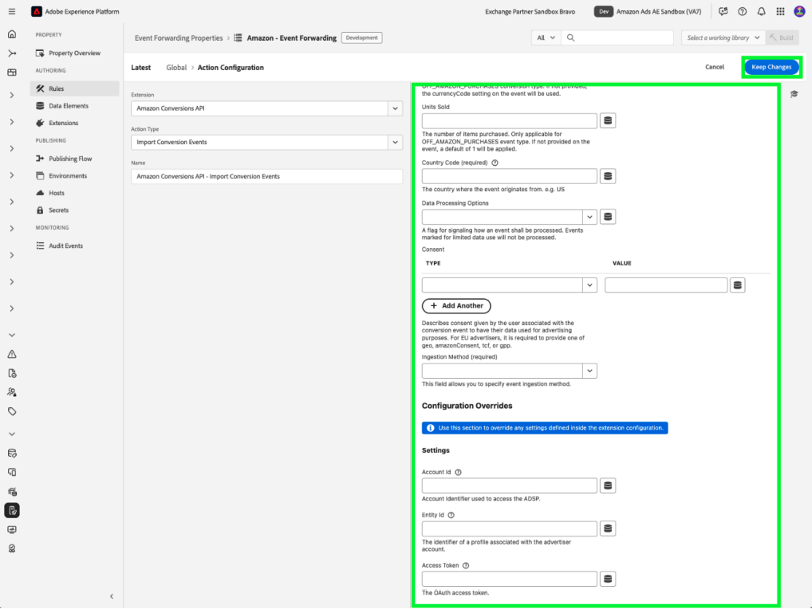

# [!DNL Amazon] Web事件API扩展概述

[!DNL Amazon]转化API扩展在来自广告商服务器的营销数据与[!DNL Amazon]之间创建直接连接。 它使广告商能够评估促销活动有效性，而不管转化位置如何，并相应地优化促销活动。 此扩展提供了完整的归因、数据可靠性和优化的交付。

## [!DNL Amazon]先决条件 {#prerequisites}

在安装和配置[!DNL Amazon]转化API扩展之前，请完成以下先决条件步骤以确保正确进行身份验证和数据访问：

### 创建密码和数据元素 {#secret}

创建新的[!DNL Amazon] [事件转发密码](../../../ui/event-forwarding/secrets.md)，并为它提供一个表示身份验证成员的唯一名称。 这将用于验证与您的帐户的连接，同时保持值的安全。

接下来，[使用[!UICONTROL Core]扩展和[!UICONTROL Secret]数据元素类型创建数据元素](../../../ui/managing-resources/data-elements.md#create-a-data-element)以引用您刚刚创建的`Amazon`密码。

### 收集所需的配置详细信息 {#configuration-details}

要将Experience Platform连接到[!DNL Amazon]，请输入以下详细信息：

| 键类型 | 描述 |
| --- | --- |
| 帐户 ID | [!DNL Amazon]帐户的唯一帐户标识符。 |
| 实体Id | 与广告商帐户关联的配置文件的标识符。 可在Campaign Manager门户URL中找到该链接，其前缀为`entity`。 |
| 访问令牌 | 您应用程序的不过期访问令牌，用于通过OAuth对[!DNL Amazon] API进行身份验证。 请参阅有关身份验证[&#128279;](https://developer.amazon.com/docs/app-porting/device-messaging-fit-obtain-api-key.html)的Amazon API文档以获取指导。 |

## 安装和配置[!DNL Amazon]扩展 {#install-configure}

按照以下步骤安装和配置[!DNL Amazon] Conversions API扩展：

1. 创建或编辑事件转发属性。
2. 在左侧导航面板中导航到&#x200B;**扩展**，然后在“目录”选项卡中选择[!DNL Amazon]扩展。
3. 选择&#x200B;**安装**。

   

4. 使用以下详细信息配置扩展：
   - **访问令牌**：包含OAuth 2令牌的数据元素密码。

     

   - **实体ID**：您的实体ID（可在带有“实体”前缀的Campaign Manager门户URL中找到）。

     

5. 选择&#x200B;**保存**&#x200B;以完成配置。

## 配置事件转发规则 {#config-rule}

设置所有数据元素后，创建事件转发规则以确定将事件发送到[!DNL Amazon]的时间和方式。

1. 导航到&#x200B;**规则**&#x200B;并创建新的事件转发规则。
2. 在&#x200B;**操作**&#x200B;下，选择&#x200B;**Amazon Conversions API扩展**。
3. 将&#x200B;**操作类型**&#x200B;设置为&#x200B;**导入转化事件**。

   

### 配置转化事件数据 {#conversion-event-data}

转化事件数据对于跟踪用户交互和衡量营销活动的有效性至关重要。 通过将此数据转发到[!DNL Amazon]，您可以深入了解用户行为、优化营销活动并确保准确归因转化。

下表概述了配置和转发转化事件数据所需的关键属性：

| 输入 | 描述 | 必需 | 示例 |
| --- | --- | --- | --- |
| `name` | 导入事件的名称。 | 是 | `My Event Name` |
| `eventType` | 与事件关联并用于报表的标准Amazon事件类型。 | 是 | `Add to Shopping Cart` |
| `eventActionSource` | 事件的来源平台。 | 是 | `WEBSITE` |
| `clientDedupeId` | 广告商为转化事件指定了`id`。 对于具有相同`clientDedupeId`的事件，仅保留第一个事件，并删除所有后续事件。 | 可选 | `3234A398932` |
| `timestamp` | 事件发生的报告时间戳。 时间戳最长可以为发送事件前7天。 超过7天的数据将不会得到处理。 | 是 | `2023-05-08T14:04:28Z` |
| `matchKeys` | 表示用于归因流量事件的客户和设备标识符类型/值的数组。 | 是 | — |
| `matchKeys > type` | 用于归因的标识符类型。 | 是 | — |
| `matchKeys > value` | 用于归因的标识符值。 | 是 | 执行事件的客户的SHA-256哈希标识符值的列表。 |
| `value` | 事件的值。 | 可选 | `5`或`0.99` |
| `currencyCode` | 与事件的`value`关联的货币代码，采用ISO-4217格式。 仅适用于“关闭Amazon购买”事件类型。 如果未提供，则将使用兑换定义上的货币代码设置。 | 可选 | `USD`、`EUR`、`GBP`等 |
| `unitsSold` | 购买的项目数。 仅适用于“关闭Amazon购买”事件类型。 如果未在转化事件中提供，则将应用默认值`1`。 | 可选 | — |
| `countryCode` | 此值基于国际标准化组织(ISO)发布的ISO 3166标准的一部分ISO 3166-1中定义的双字母国家/地区代码ISO 3166-2，以表示国家/地区、附属地区和地理利益特殊区域。 | 是 | — |
| `dataProcessingOptions` | 指示用户同意使用广告数据。 | 可选 | LIMITED_DATA_USE |

- 选择&#x200B;**[!UICONTROL 保留更改]**&#x200B;以保存规则。

## 事件去重 {#deduplication}

在使用[!DNL Amazon] Advertising Tag (AAT)和[!DNL Amazon] Conversions API扩展跟踪相同事件时，为确保报告准确并防止转化计数夸大，重复数据删除至关重要。

### 何时需要重复数据删除？

- **必需**：如果同时从客户端(AAT)和服务器（转化API）发送同一事件。
- **非必需**：如果从客户端和服务器发送的不同事件类型没有任何重叠。

### 如何启用重复数据删除

要启用重复数据删除，请在每个共享事件中包含`clientDedupeId`字段。 此唯一标识符允许[!DNL Amazon]区分客户端事件和服务器端事件，并防止重复条目。

通过正确配置重复数据删除，您可以确保优化数据保持准确，并且您的报表不会受到负面影响。

有关更多详细信息，请参阅[Amazon事件去重指南](https://advertising.amazon.com/)。

## 后续步骤 {#next-steps}

本指南介绍了如何使用[!DNL Amazon]转化API扩展配置转化事件并将其发送到[!DNL Amazon]。 有关[!DNL Adobe Experience Platform]中事件转发功能的详细信息，请参阅[事件转发概述](../../../ui/event-forwarding/overview.md)。

有关如何使用Experience Platform Debugger和事件转发监视工具调试实施的更多详细信息，请阅读事件转发中的[Adobe Experience Platform Debugger概述](/help/debugger/home.md)和[监视活动](../../../ui/event-forwarding/monitoring.md)。
