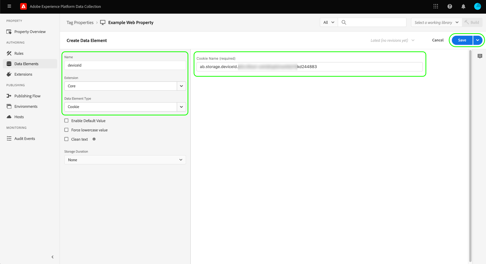
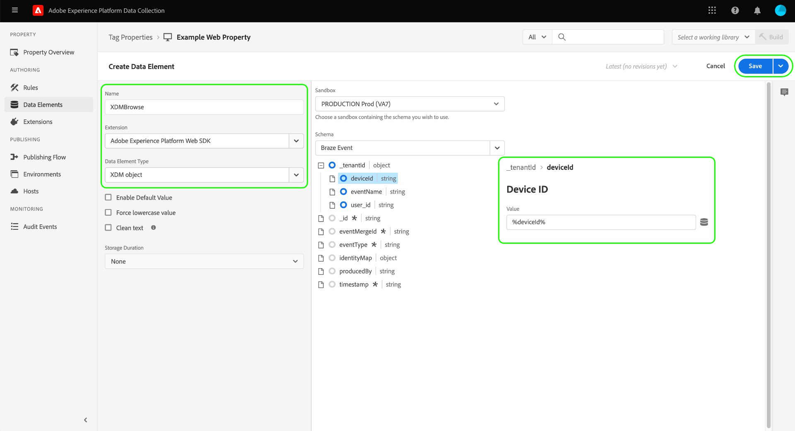
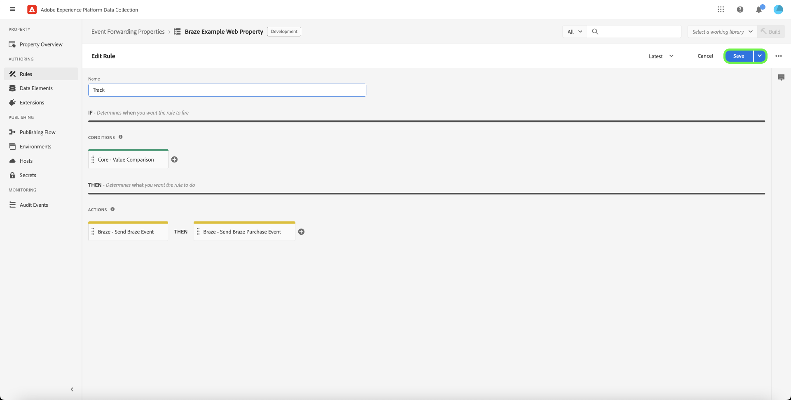

# [!DNL Braze Track Events API] 事件转发扩展

[[!DNL Braze]](https://www.braze.com) 是一个客户参与平台，可实时支持消费者和品牌之间以客户为中心的交互。 使用 [!DNL Braze]，您可以执行以下操作：

* 根据目标用户的语言偏好、位置偏好等向其提供数据（如营销消息），以提高转化率并支持关键业务目标。
* 在适当的时间以客户首选的语言，跨多个渠道向客户发送个性化的消息，包括电子邮件、推送通知和应用程序内消息。
* 为营销和促销活动定位特定用户，以增加回访客户数量。
* 研究用户行为和模式以通过自定义消息定向特定受众，这有助于增加收入。

的 [!DNL Braze Track Events API] [事件转发](../../../ui/event-forwarding/overview.md) 扩展允许您利用在Adobe Experience Platform边缘网络中捕获的数据，并将其发送到 [!DNL Braze] 以服务器端事件的形式使用 [[!DNL Braze User Identify]](https://www.braze.com/docs/api/endpoints/user_data/post_user_identify) 和 [[!DNL Braze User Track]](https://www.braze.com/docs/api/endpoints/user_data/post_user_track) API。

本文档介绍扩展的用例、如何在事件转发库中安装该扩展，以及如何在事件转发中使用其功能 [规则](../../../ui/managing-resources/rules.md).

## 用例

如果要在 [!DNL Braze] 以利用其客户分析和定位功能。

例如，假设零售组织拥有多渠道业务（网站和移动设备），并且从其网站和移动平台中捕获作为事件数据的事务性或对话式输入。 使用各种 [标记](../../../home.md) 规则，此数据会实时发送到边缘网络。 从此处， [!DNL Braze] 事件转发扩展会自动将相关事件发送到 [!DNL Braze] 从服务器端。

发送数据后，组织的分析团队便可以利用 [!DNL Braze's] 用于处理数据集和获取业务分析的功能，以生成图形、功能板或其他可视化图表，从而通知业务利益相关方。 请参阅 [[!DNL Braze] 客户](https://www.braze.com/customers) 页面，以了解有关该平台各种用例的更多详细信息。

## [!DNL Braze] 先决条件和防护 {#prerequisites}

您必须具有 [!DNL Braze] 以便使用其技术。 如果您没有帐户，请导航到 [开始页面](https://www.braze.com/get-started/) on [!DNL Braze] 连接到 [!DNL Braze Sales] 并启动帐户创建过程。

### API护栏

扩展使用 [!DNL Braze]的API及其限制如下所述：

| API | 速率限制 |
| --- | --- |
| [!DNL User Track] | 每分钟50,000个请求。  请参阅 [[!DNL User Track] API文档](https://www.braze.com/docs/api/endpoints/user_data/post_user_track#rate-limit) 以了解详细信息。 |
| [!DNL User Identify] | 每分钟20,000个请求。  请参阅 [[!DNL User Identify] API文档](https://www.braze.com/docs/api/endpoints/user_data/post_user_identify#rate-limit) 以了解详细信息。 |

>[!NOTE]
>
>请参阅 [[!DNL Braze] API限制](https://www.braze.com/docs/api/api_limits/) 有关这些限制的更多细节。

### 了解用户配置文件生命周期

[!DNL Braze] 使用唯一标识符创建匿名用户配置文件， `deviceId`，设置为 [!DNL Braze]. 通过提供用户ID来标识用户后，即会创建标识的用户配置文件。

在分配 `external_id` 将所有现有用户配置文件数据和任何匿名事件迁移到未知用户配置文件。 共享相同内容的匿名用户配置文件 `deviceId` 也别名为已标识的用户配置文件。

[!DNL Braze] 将合并并保留与仅别名配置文件关联的所有数据。 但是，任何后续的匿名用户数据都将是孤立的。 请参阅 [!DNL Braze] 文档页面 [已识别用户配置文件](https://www.braze.com/docs/user_guide/data_and_analytics/user_data_collection/user_profile_lifecycle/#identified-user-profiles) 和 [数据收集最佳实践](https://www.braze.com/docs/user_guide/data_and_analytics/user_data_collection/best_practices/#overview) 以了解更多信息。

### 计费数据点

将其他自定义属性发送到 [!DNL Braze] 可以增加 [!DNL Braze] 数据点使用情况。 咨询您的 [!DNL Braze] 帐户管理器。 请参阅 [!DNL Braze] 文档 [计费数据点](https://www.braze.com/docs/user_guide/onboarding_with_braze/data_points/#billable-data-points) 以了解更多信息。

### 收集所需的配置详细信息 {#configuration-details}

将边缘网络连接到 [!DNL Braze]，则需要输入以下数据：

| 键类型 | 描述 | 示例 |
| --- | --- | --- |
| [!DNL Braze] 实例 | 与 [!DNL Braze] 帐户。 请参阅 [!DNL Braze] 文档 [实例](https://www.braze.com/docs/user_guide/administrative/access_braze/braze_instances) 以获取指导。 | `rest.iad-03.braze.com` |
| API 密钥 | 的 [!DNL Braze] 与 [!DNL Braze] 帐户。  请参阅 [!DNL Braze] 文档位于 [REST API密钥](https://www.braze.com/docs/api/basics/#rest-api-key) 以获取指导。 | `YOUR-BRAZE-REST-API-KEY` |

## Experience Cloud先决条件

本节介绍Experience Cloud中所有实施的先决步骤。 根据您的个别实施需求，在配置扩展之前设置以下结构可能会有所帮助：

1. A [模式](../../../../xdm/schema/composition.md) 描述要摄取到Experience Cloud中的数据的结构
1. A [数据流](https://experienceleague.adobe.com/docs/platform-learn/data-collection/event-forwarding/set-up-a-datastream.html) 将传入数据路由到适当的Adobe Experience Cloud应用程序
1. A [数据集](https://experienceleague.adobe.com/docs/platform-learn/tutorials/data-ingestion/create-datasets-and-ingest-data.html) 以存储收集的数据

对于所有实施，需要在Experience Cloud端执行以下操作：

1. [创建密钥](#create-a-secret)
1. [设置标记属性](#set-up-tag-properties)
1. [在标记属性中添加数据元素](#add-data-elements-within-tag-properties)
1. [在标记属性中添加规则](#add-rules-within-tag-properties)

### 创建密钥

新建 [事件转发密钥](../../../ui/event-forwarding/secrets.md) 并将值设置为 [[!DNL Braze] API密钥](#configuration-details). 这将用于验证与帐户的连接，同时保持值的安全性。

### 设置标记属性

[创建标记属性](https://experienceleague.adobe.com/docs/platform-learn/implement-in-websites/configure-tags/create-a-property.html?lang=en) 或选择要编辑的现有属性。 此属性将配置为收集 [!DNL Braze] ，因为在使用事件转发发送边缘网络之前，会将它们引入边缘网络。

### 在标记属性中添加数据元素

如果您的网站使用 [!DNL Braze] SDK，您必须 [创建数据元素](../../../ui/managing-resources/data-elements.md) 使用 **[!UICONTROL Cookie]** 类型(由 [[!UICONTROL 核心] 标记扩展](../../client/core/overview.md))因此 [!DNL Braze] `deviceId` 可从Cookie读取。

的 **[!UICONTROL Cookie名称]** 值必须匹配 [!DNL Braze] 网站的cookie名称。 名称应具有类似于 `ab.storage.deviceId.{BRAZE_PROJECT_TOKEN_FOR_WEBSITE}`. 选择 **[!UICONTROL 保存]** 完成。

对于第二个数据元素，将类型设置为 **[!UICONTROL XDM对象]** (从 [Adobe Experience Platform Web SDK扩展](../../client/sdk/overview.md))并将其映射到之前创建的架构。 映射数据时，请确保 `deviceId` 数据元素(包含 [!DNL Braze] `deviceId` 值)作为值引用（在您的架构字段中）。

>[!NOTE]
>
>如果您的网站未运行 [!DNL Braze] SDK，Adobe Experience Cloud ID(ECID)将用作回退 `deviceId` 与事件一起传递的值 [!DNL Braze].

根据您的方案，您可能需要创建另一个数据元素，以用于映射到架构中的事件名称。 可以使用 **[!UICONTROL 常量]** 提供的类型 [!UICONTROL 核心] 扩展。

### 在标记属性中添加规则

安装之前的最后一步 [!DNL Braze] 扩展是创建标记 [规则](../../../ui/managing-resources/rules.md) （或多个标记规则），这些规则针对被跟踪的用户标识事件（如登录、注册、注册等）触发。

配置 **[!UICONTROL 事件]** 对于规则，选择将触发规则的相应事件类型。 下面显示了用户单击时触发登录规则的事件示例：

最后，在选择 **[!UICONTROL 操作]** 对于规则，选择 **[!UICONTROL 发送事件]** Web SDK扩展提供的操作类型。 在 **[!UICONTROL XDM数据]**，选择 [!UICONTROL XDM对象] 您创建的数据类型 [更早](#add-data-elements-within-tag-properties).

## 安装和配置 [!DNL Braze] 扩展 {#install}

要安装扩展，请 [创建事件转发属性](../../../ui/event-forwarding/overview.md#properties) 或选择要编辑的现有属性。

选择 **[!UICONTROL 扩展]** 中。 在 **[!UICONTROL 目录]** 选项卡，选择 **[!UICONTROL 安装]** 在 [!DNL Braze] 扩展。

![安装 [!DNL Braze] 扩展。](../../../images/extensions/server/braze/install-extension.png)

在下一个屏幕上，输入以下内容 [配置值](#configuration-details) 之前从 [!DNL Braze]:

* **[!UICONTROL Braze Rest端点URL]**:您可以输入 [!DNL Braze] rest端点URL作为提供的输入中的纯文本。
* **[!UICONTROL API密钥]**:选择 [秘密数据元素](#create-a-secret) 之前创建的，其中包含 [!DNL Braze] API密钥。

选择 **[!UICONTROL 保存]** 完成。

![的 [!DNL Braze] 扩展配置页面。](../../../images/extensions/server/braze/configure-extension.png)

## 设置事件转发数据元素

安装和配置扩展后，下一步是创建事件转发数据元素，这些数据元素将捕获将发送到的必需数据结构 [!DNL Braze].

### 创建 `deviceId` 数据元素

如果您的网站配置了 [!DNL Braze] SDK，则您已经定义了 [秘密数据元素](#add-data-elements-within-tag-properties) 包含 [!DNL Braze] `deviceId` 标记属性中。 现在，您必须在事件转发下设置一个单独的数据元素，该数据元素在以XDM格式发送时将指向此值。

创建数据元素时，选择 **[!UICONTROL 核心]** 对于扩展，选择 **[!UICONTROL 路径]** （对于数据元素类型）。 对于值，请在 `deviceId` 字段，因为该字段存在于您的架构中。 选择 **[!UICONTROL 保存]** 完成。

### 创建 `EventName` 数据元素

在事件转发属性中，创建一个使用 **[!UICONTROL 路径]** 从 **[!UICONTROL 核心]** 扩展。 对于值，请输入事件名称的点表示法路径，因为该路径存在于您的架构中。

### 为事件和购买创建数据元素

的 [[!DNL Braze User Track] API](https://www.braze.com/docs/api/endpoints/user_data/post_user_track) 支持两个不同的操作：自定义 [事件](https://www.braze.com/docs/api/objects_filters/event_object/#what-is-the-event-object) 和 [购买](https://www.braze.com/docs/api/objects_filters/purchase_object/#what-is-a-purchase-object). API还支持 [属性](https://www.braze.com/docs/api/objects_filters/user_attributes_object/) 对应 [!DNL Braze] 数据点。

的数据元素 `deviceId` 和 `EventName` 自定义事件和购买都需要，但是对于任一事件类型，都可以包含其他数据元素。 下面列出了这些内容。

>[!NOTE]
>
>下面列出的所有数据元素都应使用 **[!UICONTROL 路径]** 类型，以便它们可以映射到架构中的特定字段，如 **架构路径** 列。

#### 自定义事件

| [!DNL Braze] key | 架构路径 | 描述 | 必需 |
| --- | --- | --- | --- |
| [!DNL Braze] 设备ID | `arc.event.xdm._extconndev.brazeDeviceId` | `deviceId` 标识执行事件的用户。 `deviceId` 必须在每个事件上指定，因为它对于 [!DNL Braze] 执行分析。 | 是 |
| 事件类型 | `arc.event.xdm._extconndev.event_Type` | 事件的名称。 | 是 |
| 用户标识符 | `arc.event.xdm._extconndev.userId` | 用户的电子邮件或登录ID（如果可用）。 |  |
| 应用程序 ID | `arc.event.xdm._extconndev.appId` | 一个字符串，用于指示事件的触发位置。 |  |
| 事件字段 | `arc.event.xdm._extconndev.event_Properties` | 一个JSON对象，表示有关事件的所有属性。 |  |

{style="table-layout:auto"}

#### 购买

| [!DNL Braze] key | 架构路径 | 描述 | 必需 |
| --- | --- | --- | --- |
| [!DNL Braze] 设备ID | `arc.event.xdm._extconndev.brazeDeviceId` | `deviceId` 标识执行事件的用户。 `deviceId` 必须在每个事件上指定，因为它对于 [!DNL Braze] 执行分析。 | 是 |
| 事件类型 | `arc.event.xdm._extconndev.event_Type` | 事件的名称。 | 是 |
| 用户标识符 | `arc.event.xdm._extconndev.userId` | 用户的电子邮件或登录ID（如果可用）。 |  |
| 应用程序 ID | `arc.event.xdm._extconndev.appId` | 一个字符串，用于指示事件的触发位置。 |  |
| 产品 ID | `arc.event.xdm._extconndev.product_Id` | 购买的标识符，如UPC、ISBN、产品类别或产品名称。 | 是 |
| 货币 | `arc.event.xdm._extconndev.currency` | 用于购买的货币，以 [ISO 4217代码格式](https://www.iso.org/iso-4217-currency-codes.html). | 是 |
| 价格 | `arc.event.xdm._extconndev.price` | 购买的价值，用数字表示。 | 是 |
| 数量 | `arc.event.xdm._extconndev.quantity` | 已购产品的数量。 | 是 |
| 其他字段 | `arc.event.xdm._extconndev.event_Properties` | 一个JSON对象，表示有关该事件的其他属性。 请参阅 [[!DNL Braze] 文档](https://www.braze.com/docs/user_guide/onboarding_with_braze/data_points/#billable-data-points) 有关计费数据点的详细信息。 |  |

{style="table-layout:auto"}

## 设置事件转发规则

设置所有数据元素后，您可以开始创建事件转发规则，以确定自定义事件和购买的发送时间和方式 [!DNL Braze].

自 [!DNL Braze User Track] API支持将自定义事件和购买作为两个单独的操作，您必须至少创建两个规则，以便 [!DNL Braze's] 可以适当地利用每个变量的分析。

因此， [!DNL Braze] 扩展允许您向规则中添加以下操作类型：

* **[!UICONTROL 布雷兹事件]**
* **[!UICONTROL 品牌购买事件]**

>[!IMPORTANT]
>
>您必须至少有一个操作类型为的规则 **[!UICONTROL 布雷兹事件]**. 如果没有此规则，边缘网络将不会将事件发送到 [!DNL Braze].

### 创建 [!DNL Track Event] 规则 {#tracking-rule}

开始在事件转发属性中创建新规则。 在 **[!UICONTROL 条件]**，添加 **[!UICONTROL 值比较]** 条件类型(由 [!UICONTROL 核心] )来检查 `EventName` 不是 `Purchase`. 这将确保将事件与正确的对象有效负载一起发送到 [!DNL Braze] API。

在 **[!UICONTROL 操作]**，添加新操作并将扩展设置为 **[!UICONTROL 布雷兹]**. 接下来，将操作类型设置为 **[!UICONTROL 布雷兹事件]** 将Adobe Experience Edge Network事件发送到 [!DNL Braze].

从此处，您必须映射 **[!UICONTROL 事件名称]** 字段，以及 **[!UICONTROL 事件时间]**. 其他可选字段包括 [!UICONTROL 外部用户ID], [!UICONTROL Braze用户ID], [!UICONTROL 别名标签], [!UICONTROL 别名]和 [!UICONTROL 应用程序标识符].

>[!NOTE]
>
>的 **[!UICONTROL 布雷兹事件]** 操作只需要 **[!UICONTROL 事件名称]** 和 **[!UICONTROL 事件时间]** ，但您应在其余字段中尽可能多地包含信息。 有关 [!DNL Braze] 事件对象，请参阅 [官方文档](https://www.braze.com/docs/api/objects_filters/event_object/).

一旦 [!UICONTROL 布雷兹事件] 操作添加到规则后，您还可以 **[!UICONTROL Braze购买]** 操作。 下面显示了购买操作的示例配置：

>[!NOTE]
>
>有关 [!DNL Braze] 购买对象，请参阅 [官方文档](https://www.braze.com/docs/api/objects_filters/purchase_object/).

的 [!DNL Track Event] 规则已完成，应类似于下图。 选择 **[!UICONTROL 保存]** 将规则添加到库。

>[!IMPORTANT]
>
>如果您的网站使用 [!DNL Braze] SDK中，您可以继续执行 [验证数据 [!DNL Braze]](#validate). 如果您没有使用 [!DNL Braze] SDK，您必须 [创建单独的身份跟踪规则](#create-an-identity-tracking-rule) 确保适当的事件和 `deviceId` 值会发送到 [!DNL Braze] 用户标识事件发生时。

### 创建身份跟踪规则

如果您没有使用 [!DNL Braze SDK]，下一步是创建另一个同时使用 **[!UICONTROL 布雷兹事件]** 和 **[!UICONTROL 布雷兹别名]** 操作类型。 此规则可确保每当在网站上发生用户标识事件（例如登录、注册、注册等）时，都会发生相应的事件和 `deviceId` 值会发送到 [!DNL Braze].

开始定义新规则以跟踪身份事件。 在本例中，专门为注册事件定义规则。

与 [!DNL Track Event] 规则下 **[!UICONTROL 条件]**，包括 **[!UICONTROL 值比较]** 检查 `EventName` 等于 `Registration`. 这可确保此事件仅针对注册事件触发。

![的操作配置 [!DNL Braze] 操作类型别名和标识。](../../../images/extensions/server/braze/ef-registration-condition.png)

确保 [!DNL Braze] 可以自动合并用户标识，您必须将以下操作类型添加到规则中，这两种操作类型均由提供 [!DNL Braze] 扩展：

* **[!UICONTROL 布雷兹事件]**
* **[!UICONTROL Braze Alias事件]**

配置 **[!UICONTROL 布雷兹事件]** 操作方式与 [事件跟踪规则](#tracking-rule)，包括所提供字段中尽可能多的信息。

![配置 [!DNL Braze] 事件操作](../../../images/extensions/server/braze/registration-braze-event.png)

的  **[!UICONTROL Braze Alias事件]** 操作需要 [用户标识符](https://www.braze.com/docs/api/objects_filters/aliases_to_identify)，您可以选择提供 [应用程序标识符](https://www.braze.com/docs/api/identifier_types/) （如果适用）。

![配置 [!DNL Braze] 别名操作](../../../images/extensions/server/braze/registration-braze-alias.png)

将两个操作都添加到规则后，选择 **[!UICONTROL 保存]** 将规则添加到工作库。 从此处，您可以将库构建到其中一个环境中，以验证库是否按预期工作。

![两者兼有 [!DNL Braze] 操作将添加到规则中](../../../images/extensions/server/braze/registration-rule-complete.png)

## 在中验证数据 [!DNL Braze] {#validate}

如果事件集合和 [!DNL Adobe Experience Platform] 集成成功后，您将在 [!DNL Braze] 控制台 [查看用户配置文件](https://www.braze.com/docs/user_guide/engagement_tools/segments/user_profiles/). 具体而言，发送到的新事件数据 [!DNL Braze] 反映在 [!DNL Purchases] 特定用户的部分 [“概述”选项卡](https://www.braze.com/docs/user_guide/engagement_tools/segments/user_profiles/#overview-tab).

## 后续步骤

本指南介绍了如何将转化事件发送到 [!DNL Braze] 使用事件转发。 有关下游应用程序的更多详细信息，请参阅 [!DNL Braze]，请参阅 [官方文档](https://www.braze.com/docs).

有关Experience Platform中事件转发功能的更多信息，请参阅 [事件转发概述](../../../ui/event-forwarding/overview.md).