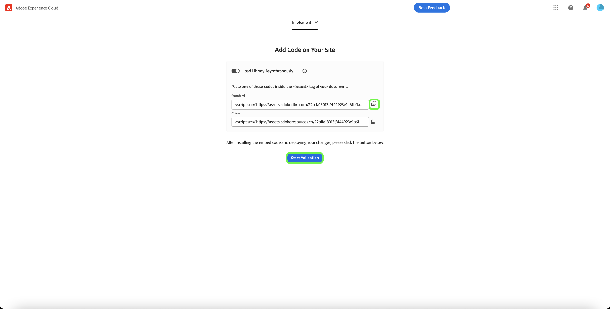

# [!DNL Meta Conversions API]扩展概述

[[!DNL Meta Conversions API]](https://developers.facebook.com/docs/marketing-api/conversions-api/)允许您将服务器端营销数据连接到[!DNL Meta]技术，以优化广告定位、降低每次操作的成本和测量结果。 事件链接到[[!DNL Meta Pixel]](https://developers.facebook.com/docs/meta-pixel/) ID，并以类似于客户端事件的方式处理。

使用[!DNL Meta Conversions API]扩展，您可以利用[事件转发](../../../ui/event-forwarding/overview.md)规则中API的功能，将数据从Adobe Experience PlatformEdge Network发送到[!DNL Meta]。 本文档介绍如何安装扩展并在事件转发[规则](../../../ui/managing-resources/rules.md)中使用其功能。

## 演示

以下视频旨在支持您了解[!DNL Meta Conversions API]。

>[!VIDEO](https://unlockmarketingdata.com/video-meta-conversions-api)

## 先决条件

强烈建议分别使用[!DNL Meta Pixel]和[!DNL Conversions API]从客户端和服务器端共享和发送相同的事件，因为这有助于恢复[!DNL Meta Pixel]未提取的事件。 在安装[!DNL Conversions API]扩展之前，请参阅[[!DNL Meta Pixel] 扩展](../../client/meta/overview.md)上的指南，以了解如何在客户端标记实施中集成扩展的步骤。

>[!NOTE]
>
>本文档后面关于[事件去重](#deduplication)的部分介绍了确保同一事件不使用两次的步骤，因为可以从浏览器和服务器接收该事件。

要使用[!DNL Conversions API]扩展，您必须具有事件转发的访问权限，并且拥有有效的[!DNL Meta]帐户，该帐户具有对[!DNL Ad Manager]和[!DNL Event Manager]的访问权限。 具体而言，您必须复制现有[[!DNL Meta Pixel]](https://www.facebook.com/business/help/952192354843755?id=1205376682832142)的ID（或[改为创建新的 [!DNL Pixel]](https://www.facebook.com/business/help/952192354843755)），以便可以为您的帐户配置该扩展。

>[!INFO]
>
>如果您计划将此扩展与移动应用程序数据一起使用，或者如果您还在[!DNL Meta]营销活动中处理离线事件数据，则需要通过现有应用程序创建数据集，并在出现提示时选择&#x200B;**从像素ID创建**。 有关详细信息，请参阅文章[确定适合您企业的数据集创建选项](https://www.facebook.com/business/help/5270377362999582?id=490360542427371)。 有关所有必需和可选的应用程序跟踪参数，请参阅[应用程序事件转化API](https://developers.facebook.com/docs/marketing-api/conversions-api/app-events)文档。

## 安装扩展

要安装[!DNL Meta Conversions API]扩展，请导航到数据收集UI或Experience PlatformUI，然后从左侧导航中选择&#x200B;**[!UICONTROL 事件转发]**。 在此处，选择要将扩展添加到的资产，或改为创建新资产。

选择或创建所需的属性后，在左侧导航中选择&#x200B;**[!UICONTROL 扩展]**，然后选择&#x200B;**[!UICONTROL 目录]**&#x200B;选项卡。 搜索[!UICONTROL Meta Conversions API]卡，然后选择&#x200B;**[!UICONTROL 安装]**。

![正在数据收集UI中为[!UICONTROL Meta Conversions API]扩展选择[!UICONTROL 安装]选项。](../../../images/extensions/server/meta/install.png)

在显示的配置视图中，必须提供您之前复制的[!DNL Pixel] ID以将扩展关联到您的帐户。 您可以将ID直接粘贴到输入中，也可以改用数据元素。

您还需要提供访问令牌以专门使用[!DNL Conversions API]。 有关如何获取此值的步骤，请参阅有关[生成访问令牌](https://developers.facebook.com/docs/marketing-api/conversions-api/get-started#access-token)的[!DNL Conversions API]文档。

完成后，选择&#x200B;**[!UICONTROL 保存]**

![在扩展配置视图中作为数据元素提供的[!DNL Pixel] ID。](../../../images/extensions/server/meta/configure.png)

扩展已安装，您现在可以在事件转发规则中使用该扩展的功能。

## 与Facebook和Instagram扩展集成 {#facebook}

使用Facebook和Instagram扩展进行的集成允许您快速对元业务帐户进行身份验证。 然后，这会自动填充您的[!UICONTROL 像素ID]和元转换API [!UICONTROL 访问令牌]，从而更轻松地安装和配置元转换API。

安装[!UICONTROL Meta Conversions API]扩展时，会出现在Facebook和Instagram中进行身份验证的对话框提示。

![&#x200B; [!UICONTROL Meta Conversions API扩展]安装页面突出显示[!UICONTROL 连接到元]。](../../../images/extensions/server/meta/mbe-extension-install.png)

在Facebook和Instagram中进行身份验证的对话框提示也会显示在事件转发的快速启动工作流UI中。

![快速启动工作流UI突出显示[!UICONTROL 连接到Meta]。](../../../images/extensions/server/meta/mbe-extension-quick-start.png)

## 与事件质量匹配分数(EMQ)集成 {#emq}

与事件质量匹配分数(EMQ)集成允许您通过显示EMQ分数来轻松查看实施的有效性。 此集成最大限度地减少了上下文切换，并帮助您提高元转换API实施的成功。 这些事件分数显示在[!UICONTROL Meta Conversions API扩展]配置屏幕中。

![Meta Conversions API扩展]配置页面突出显示[!UICONTROL 查看EMQ得分]。(../../../images/extensions/server/meta/emq-score.png)

## 与LiveRamp(Alpha)集成 {#alpha}

[!DNL LiveRamp]在其网站上部署了[!DNL LiveRamp]的经过身份验证的流量解决方案(ATS)的客户可以选择将RampID作为客户信息参数共享。 请与您的[!DNL Meta]帐户团队合作，加入此功能的Alpha计划。

![元事件转发[!UICONTROL 规则]配置页面突出显示[!UICONTROL 合作伙伴名称(alpha)]和[!UICONTROL 合作伙伴ID (alpha)]。](../../../images/extensions/server/meta/live-ramp.png)

## 配置事件转发规则 {#rule}

本节介绍如何在通用事件转发规则中使用[!DNL Conversions API]扩展。 实际上，您应该配置多个规则，以便通过[!DNL Meta Pixel]和[!DNL Conversions API]发送所有已接受的[标准事件](https://developers.facebook.com/docs/meta-pixel/reference)。 有关移动应用数据，请在[此处](https://developers.facebook.com/docs/marketing-api/conversions-api/app-events)查看必填字段、应用数据字段、客户信息参数和自定义数据详细信息。

>[!NOTE]
>
>事件应为[实时发送](https://www.facebook.com/business/help/379226453470947?id=818859032317965)或尽可能接近实时发送，以便更好地优化广告促销活动。

开始创建新的事件转发规则，并根据需要配置其条件。 为规则选择操作时，请为扩展选择&#x200B;**[!UICONTROL 元转换API扩展]**，然后为操作类型选择&#x200B;**[!UICONTROL 发送转换API事件]**。

![正在为数据收集UI中的规则选择[!UICONTROL 发送页面视图]操作类型。](../../../images/extensions/server/meta/select-action.png)

显示的控件允许您配置将通过[!DNL Conversions API]发送到[!DNL Meta]的事件数据。 这些选项可以直接输入到提供的输入中，也可以选择现有数据元素来表示值。 配置选项分为四个主要部分，如下所述。

| 配置区域 | 描述 |
| --- | --- |
| [!UICONTROL 服务器事件参数] | 有关事件的常规信息，包括发生时间和触发该事件的源操作。 有关[!DNL Conversions API]接受的[标准事件参数](https://developers.facebook.com/docs/marketing-api/conversions-api/parameters/server-event)的更多信息，请参阅[!DNL Meta]开发人员文档。  如果您同时使用[!DNL Meta Pixel]和[!DNL Conversions API]来发送事件，请确保每个事件都包含&#x200B;**[!UICONTROL 事件名称]** (`event_name`)和&#x200B;**[!UICONTROL 事件ID]** (`event_id`)，因为这些值用于[事件去重](#deduplication)。  您还可以选择&#x200B;**[!UICONTROL 启用有限数据使用]**，以帮助遵守客户选择退出的要求。 有关此功能的详细信息，请参阅有关[数据处理选项](https://developers.facebook.com/docs/marketing-apis/data-processing-options/)的[!DNL Conversions API]文档。 |
| [!UICONTROL 客户信息参数] | 用于将事件归因于客户的用户身份数据。 在将某些值发送到API之前，必须对它们进行哈希处理。  为确保良好的通用API连接和高事件匹配质量(EMQ)，建议您随服务器事件一起发送所有[接受的客户信息参数](https://developers.facebook.com/docs/marketing-api/conversions-api/parameters/customer-information-parameters)。 这些参数也应根据它们对EMQ[&#128279;](https://www.facebook.com/business/help/765081237991954?id=818859032317965)的重要性和影响进行优先级排序。 |
| [!UICONTROL 自定义数据] | 用于广告投放优化的附加数据，以JSON对象的形式提供。 请参阅[[!DNL Conversions API] 文档](https://developers.facebook.com/docs/marketing-api/conversions-api/parameters/custom-data)，了解有关此对象所接受属性的更多信息。  如果要发送购买事件，则必须使用此部分提供必需的特性`currency`和`value`。 |
| [!UICONTROL 测试事件] | 此选项用于验证您的配置是否导致[!DNL Meta]按预期接收服务器事件。 要使用此功能，请选中&#x200B;**[!UICONTROL 作为测试事件发送]**&#x200B;复选框，然后在下面的输入中提供您选择的测试事件代码。 部署事件转发规则后，如果您正确配置了扩展和操作，则应该会在[!DNL Meta Events Manager]中看到&#x200B;**[!DNL Test Events]**&#x200B;视图内出现活动。 |

{style="table-layout:auto"}

完成后，选择&#x200B;**[!UICONTROL Keep Changes]**&#x200B;以将该操作添加到规则配置中。

![[!UICONTROL 保留为操作配置选择的更改]。](../../../images/extensions/server/meta/keep-changes.png)

如果对规则满意，请选择&#x200B;**[!UICONTROL 保存到库]**。 最后，发布新的事件转发[生成](../../../ui/publishing/builds.md)以启用对库所做的更改。

## 事件去重 {#deduplication}

如[必备项部分](#prerequisites)中所述，建议您在冗余设置中同时使用[!DNL Meta Pixel]标记扩展和[!DNL Conversions API]事件转发扩展从客户端和服务器发送相同的事件。 这有助于恢复一个扩展或其他扩展未拾取的事件。

如果您从客户端和服务器发送不同的事件类型，且两者之间没有重叠，则无需进行重复数据删除。 但是，如果任何单个事件由[!DNL Meta Pixel]和[!DNL Conversions API]共享，则必须确保对这些冗余事件进行重复数据删除，以免对您的报告产生不利影响。

发送共享事件时，请确保包括事件ID和名称，以及您从客户端和服务器发送的每个事件。 收到具有相同ID和名称的多个事件时，[!DNL Meta]会自动使用多种策略来消除重复并保留最相关的数据。 有关此过程的详细信息，请参阅有关 [!DNL Meta Pixel] 和 [!DNL Conversions API] 事件的[重复数据删除](https://www.facebook.com/business/help/823677331451951?id=1205376682832142)的[!DNL Meta]文档。

## 快速入门工作流：元转化API扩展(Beta) {#quick-start}

>[!IMPORTANT]
>
>* 已购买Real-Time CDP Prime和Ultimate包的客户可以使用快速入门功能。 请联系您的Adobe代表以获取更多信息。
>* 此功能适用于全新实施，当前不支持在现有标记和事件转发属性上自动安装扩展和配置。

>[!NOTE]
>
>任何现有客户端都可以使用快速入门工作流创建可用于以下项目的参考实施：
>* 使用它作为全新实施的开始。
>* 将其用作参考实施，您可以检查该实施，以了解其配置方式，然后将其复制到当前生产实施中。

快速入门功能可帮助您通过元转化API和元像素扩展轻松高效地完成设置。 此工具可自动执行在Adobe标签和事件转发中执行的多个步骤，从而显着缩短设置时间。

此功能会在新自动生成的标记上自动安装和配置元转化API和元像素扩展，并使用必要的规则和数据元素来配置事件转发属性。 此外，它还会自动安装和配置Experience PlatformWeb SDK和数据流。 最后，快速启动功能会将库自动发布到开发环境中的指定URL，从而支持通过事件转发和Experience PlatformEdge Network进行实时客户端数据收集和服务器端事件转发。

以下视频介绍了快速入门功能。

>[!VIDEO](https://video.tv.adobe.com/v/3416939?quality=12&learn=on)

### 安装快速入门功能

>[!NOTE]
>
>此功能旨在帮助您开始实施事件转发。 它不会提供可容纳所有用例的端到端、完全正常的实施。

此设置会自动安装元转化API和元像素扩展。 Meta建议使用此混合实施来收集和转发事件转换。
快速设置功能旨在帮助客户开始事件转发实施，而不是提供可适应所有用例的端到端、功能齐全的实施。

要安装该功能，请在Adobe Experience Platform数据收集&#x200B;**[!UICONTROL 主页]**&#x200B;页面上为&#x200B;**[!DNL Send Conversions Data to Meta]**&#x200B;选择&#x200B;**[!UICONTROL 开始]**。

的数据

输入您的&#x200B;**[!UICONTROL 域]**，然后选择&#x200B;**[!UICONTROL 下一步]**。 此域将用作自动生成的标记和事件转发属性、规则、数据元素、数据流等的命名约定。

在&#x200B;**[!UICONTROL 初始设置]**&#x200B;对话框中，输入您的&#x200B;**[!UICONTROL 元像素ID]**、**[!UICONTROL 元转换API访问令牌]**&#x200B;和&#x200B;**[!UICONTROL 数据层路径]**，然后选择&#x200B;**[!UICONTROL 下一步]**。

请等待几分钟以完成初始设置过程，然后选择&#x200B;**[!UICONTROL 下一步]**。

从&#x200B;**[!UICONTROL 在您的网站上添加代码]**&#x200B;对话框中，复制使用复制函数提供的代码，并将其粘贴到源网站的`<head>`中。 实施后，选择&#x200B;**[!UICONTROL 开始验证]**

[!UICONTROL 验证结果]对话框显示元扩展实施结果。 选择&#x200B;**[!UICONTROL 下一步]**。 您还可以通过选择&#x200B;**[!UICONTROL 保证]**&#x200B;链接来查看其他验证结果。

**[!UICONTROL 后续步骤]**&#x200B;屏幕显示确认安装完成。 在此处，您可以选择通过添加新事件来优化实施，下一部分将显示这些事件。

如果不想添加其他事件，请选择&#x200B;**[!UICONTROL 关闭]**。

#### 添加其他事件

要添加新事件，请选择&#x200B;**[!UICONTROL 编辑您的标记Web属性]**。

选择与要编辑的元事件对应的规则。 例如，**MetaConversion_AddToCart**。

>[!NOTE]
>
>如果没有事件，则此规则将不会运行。 所有规则均如此，其中&#x200B;**MetaConversion_PageView**&#x200B;规则为异常。

要添加事件，请在[!UICONTROL 事件]标题下选择&#x200B;**[!UICONTROL 添加]**。

选择[!UICONTROL 事件类型]。 在此示例中，我们已选择[!UICONTROL Click]事件并将其配置为在选择&#x200B;**.add-to-cart-button**&#x200B;时触发。 选择&#x200B;**[!UICONTROL 保留更改]**。

已保存新事件。 选择&#x200B;**[!UICONTROL 选择工作库]**&#x200B;并选择要生成到的库。

接下来，选择&#x200B;**[!UICONTROL 保存到库]**&#x200B;旁边的下拉列表，然后选择&#x200B;**[!UICONTROL 保存到库并生成]**。 这会将更改发布到库中。

对要配置的任何其他元转化事件重复这些步骤。

#### 数据层配置 {#configuration}

>[!IMPORTANT]
>
>更新此全局数据层的方式取决于您的网站架构。 单页应用程序将与服务器端渲染应用程序不同。 另外，您可能将完全负责在Tags产品中创建和更新此数据。 在所有实例中，在运行`MetaConversion_* rules`的每个实例之间都需要更新数据层。 如果不更新规则之间的数据，您还可能会遇到发送当前`MetaConversion_* rule`中最后`MetaConversion_* rule`个过时的数据的情况。

在配置过程中，系统会询问您数据层的存放位置。 默认情况下，该值为`window.dataLayer.meta`，而在`meta`对象中，您的数据应如下所示。

这一点务必要理解，因为每个`MetaConversion_*`规则都使用此数据结构将相关数据段传递到[!DNL Meta Pixel]扩展和[!DNL Meta Conversions API]。 请参阅有关[标准事件](https://developers.facebook.com/docs/meta-pixel/reference#standard-events)的文档，了解有关不同元事件需要哪些数据的更多信息。

例如，如果要使用`MetaConversion_Subscribe`规则，则需要根据[标准事件](https://developers.facebook.com/docs/meta-pixel/reference#standard-events)的文档中所述的对象属性更新`window.dataLayer.meta.currency`、`window.dataLayer.meta.predicted_ltv`和`window.dataLayer.meta.value`。

以下是在执行规则之前需要在网站上运行以更新数据层的示例。

默认情况下，`<datalayerpath>.conversionData.eventId`将通过“生成新事件ID”操作在任意`MetaConversion_* rules`上随机生成。

要获取数据层外观的本地引用，您可以在属性上的`MetaConversion_DataLayer`数据元素上打开自定义代码编辑器。

## 后续步骤

本指南介绍了如何使用[!DNL Meta Conversions API]扩展将服务器端事件数据发送到[!DNL Meta]。 在此处，建议通过连接更多[!DNL Pixels]并共享更多事件（如果适用）来扩展您的集成。 执行以下任一操作均有助于进一步改善广告性能：

* 连接尚未连接到[!DNL Conversions API]集成的任何其他[!DNL Pixels]。
* 如果您专门通过客户端上的[!DNL Meta Pixel]发送某些事件，则也从服务器端将这些相同的事件发送到[!DNL Conversions API]。

有关如何有效实施集成的更多指导，请参阅有关 [!DNL Conversions API][&#128279;](https://www.facebook.com/business/help/308855623839366?id=818859032317965)的最佳实践的[!DNL Meta]文档。 有关Adobe Experience Cloud中标记和事件转发的更多常规信息，请参阅[标记概述](../../../home.md)。
