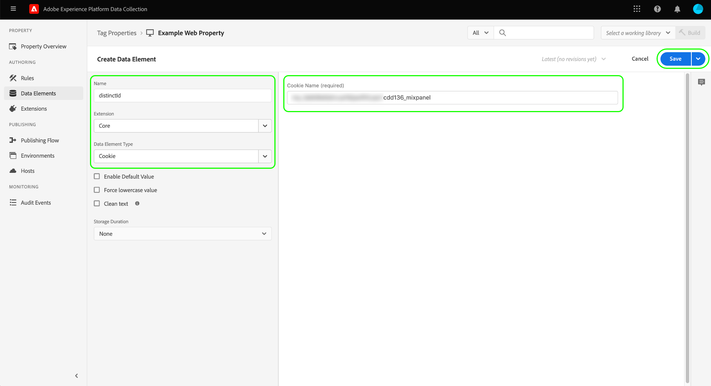

# [!DNL Mixpanel Track Events] API事件转发扩展

[[!DNL Mixpanel]](https://www.mixpanel.com) 是一款产品分析工具，可用于捕获有关用户与数字产品交互情况的数据。 您可以使用简单的交互式报表分析产品数据，通过该报表，只需单击几下即可查询和可视化数据。 [!DNL Mixpanel] 旨在通过允许每个人实时分析用户数据来识别趋势、了解用户行为并对产品做出决策，从而提高团队的效率。

[!DNL Mixpanel] 采用基于事件、以用户为中心的模型，将每次交互连接到单个用户。 的 [!DNL Mixpanel] 数据模型基于用户、事件和属性的概念构建。

>[!NOTE]
>
>请参阅 [!DNL Mixpanel] 文档 [身份管理](https://help.mixpanel.com/hc/en-us/articles/360041039771-Getting-Started-with-Identity-Management) 了解如何 [!DNL Mixpanel] 合并事件以创建身份聚类。 还建议您在 [非重复ID](https://help.mixpanel.com/hc/en-us/articles/115004509426-Distinct-ID-Creation-JavaScript-iOS-Android-) 以了解如何在事件数据中使用这些用户来标识用户。

的 [!DNL Mixpanel Track Events] API扩展允许您同时利用这两个功能 [事件转发](../../../ui/event-forwarding/overview.md) 和 [标记](../../../home.md) 以在Adobe Experience Platform Edge Network中捕获事件信息，并将其发送到 [!DNL Mixpanel] 使用 [[!DNL Track Events] API](https://developer.mixpanel.com/reference/track-event). 本文档介绍扩展的用例、如何安装该扩展，以及如何将其功能集成到事件转发中 [规则](../../../ui/managing-resources/rules.md).

## 用例

如果要在 [!DNL Mixpanel] 以利用其产品分析功能。

例如，假定零售组织拥有多渠道业务（网站和移动设备）。 该组织从其平台中捕获作为事件数据的事务性或对话式输入并将其加载到 [!DNL Mixpanel] 使用事件转发扩展。

然后，分析团队可以利用 [!DNL Mixpanel's] 用于处理数据集和获取业务分析的功能，可用于生成图形、功能板或其他可视化图表，以告知业务利益相关方。

有关特定用例的更多信息 [!DNL Mixpanel]，请参阅以下文档：

* [新 [!DNL Mixpanel]](https://help.mixpanel.com/hc/en-us/sections/360008533532-New-to-Mixpanel)
* [什么是 [!DNL Mixpanel]？](https://developer.mixpanel.com/docs)
* [12次必试 [!DNL Mixpanel] 功能](https://mixpanel.com/blog/12-things-you-probably-didnt-know-you-could-do-with-mixpanel/)

## [!DNL Mixpanel] 先决条件 {#prerequisites-mixpanel}

您必须拥有 [!DNL Mixpanel] 帐户来使用此扩展。 转到 [[!DNL Mixpanel] 注册页面](https://mixpanel.com/register/) 注册并创建帐户（如果尚未注册）。

确保 [[!DNL Identity Merge]](https://help.mixpanel.com/hc/en-us/articles/9648680824852-ID-Merge-Implementation-Best-Practices) 已为您的项目启用设置。 导航到 **[!DNL Settings]** > **[!DNL Project Setting]** > **[!DNL Identity Merge]** 和切换设置。

<!-- (If these don't apply, do we need to include here at all?)
### API guardrails {#guardrails}

Refer to the [[!DNL Mixpanel] documentation](https://developer.mixpanel.com/reference/import-events#rate-limits) for limits and response codes. As [!DNL Mixpanel] only sends live events these limits should not apply.
-->

### 收集所需的配置详细信息 {#configuration-details}

将Experience Platform连接到 [!DNL Mixpanel] 您必须输入以下内容：

| 键类型 | 描述 | 示例 |
| --- | --- | --- |
| 项目令牌 | 与 [!DNL Mixpanel] 帐户。 请参阅 [!DNL Mixpanel] 文档 [查找项目令牌](https://help.mixpanel.com/hc/en-us/articles/115004502806-Find-Project-Token-) 以获取指导。 | `25470xxxxxxxxxxxxxxxxxxx1289` |

## Experience Cloud先决条件

本节介绍Experience Cloud中所有实施的先决步骤。 根据您的个别实施需求，在配置扩展之前设置以下结构可能会有所帮助：

1. A [模式](../../../../xdm/schema/composition.md) 描述要摄取到Experience Cloud中的数据的结构
1. A [数据流](https://experienceleague.adobe.com/docs/platform-learn/data-collection/event-forwarding/set-up-a-datastream.html) 将传入数据路由到适当的Adobe Experience Cloud应用程序
1. A [数据集](https://experienceleague.adobe.com/docs/platform-learn/tutorials/data-ingestion/create-datasets-and-ingest-data.html) 以存储收集的数据

对于所有实施，需要在Experience Cloud端执行以下操作：

1. [创建密钥](#create-a-secret)
1. [设置标记属性](#set-up-tag-properties)
1. [在标记属性中添加数据元素](#add-data-elements-within-tag-properties)
1. [在标记属性中添加规则](#add-rules-within-tag-properties)

### 创建密钥

新建 [事件转发密钥](../../../ui/event-forwarding/secrets.md) 并将值设置为 [[!DNL Mixpanel] 项目令牌](#configuration-details). 这将用于验证与帐户的连接，同时保持值的安全性。

### 设置标记属性

[创建标记属性](https://experienceleague.adobe.com/docs/platform-learn/implement-in-websites/configure-tags/create-a-property.html?lang=en) 或选择要编辑的现有属性。 此属性将配置为收集 [!DNL Mixpanel] ，因为在使用事件转发发送边缘网络之前，会将它们引入边缘网络。

### 在标记属性中添加数据元素

如果您的网站使用 [[!DNL Mixpanel] SDK](https://developer.mixpanel.com/docs/nodejs)，您必须 [创建数据元素](../../../ui/managing-resources/data-elements.md) 使用 **[!UICONTROL Cookie]** 类型(由 [[!UICONTROL 核心] 标记扩展](../../client/core/overview.md))因此 [!DNL Mixpanel] `distinct_id` 可从Cookie读取。

的 **[!UICONTROL Cookie名称]** 值必须匹配 [!DNL Mixpanel] 网站的cookie名称。 名称应具有类似于 `mp_{MIXPANEL_PROJECT_TOKEN_FOR_WEBSITE}_mixpanel`. 选择 **[!UICONTROL 保存]** 完成。

>[!IMPORTANT]
>
>上述数据元素的名称(`distinctId` 在本例中)应与架构中用于相同字段的名称匹配。 这也适用于您稍后将创建的事件转发数据元素。

对于第二个数据元素，将类型设置为 **[!UICONTROL XDM对象]** (从 [Adobe Experience Platform Web SDK扩展](../../client/sdk/overview.md))并将其映射到之前创建的架构。 映射数据时，请确保 `distinct_id` 数据元素(包含 [!DNL Mixpanel] `distinct_id` 值)作为值引用（在您的架构字段中）。

>[!NOTE]
>
>如果您的网站未运行 [!DNL Mixpanel] SDK，Adobe Experience Cloud ID(ECID)将用作回退 `distinct_id` 与事件一起传递的值 [!DNL Mixpanel].

根据您的方案，您可能需要创建另一个数据元素，以用于映射到架构中的事件名称。 可以使用 **[!UICONTROL DOM属性]** 提供的类型 [!UICONTROL 核心] 扩展。

### 在标记属性中添加规则

设置数据元素后，您可以开始创建规则以确定哪些事件会导致数据被发送到 [!DNL Mixpanel].

首先，创建为用户标识事件触发的规则。 这可以表示登录、注册、注册，或您希望用于用户标识的任何其他事件。

在 **[!UICONTROL 事件]**，添加一个将触发标识事件的条件（特定于您的网站）。 以下示例显示了用户单击时触发登录规则的示例：

选择 **[!UICONTROL 保留更改]** 将事件添加到规则。

下一个，下 **[!UICONTROL 操作]**，添加您希望规则在触发时执行的结果操作。 其中必须包括 **[!UICONTROL 发送事件]** Platform Web SDK扩展提供的，该扩展会将事件发送到边缘网络，在边缘网络中，事件转发扩展（例如）可以接收该事件 [!DNL Mixpanel].

配置操作时，在 **[!UICONTROL XDM数据]** 选择 [您之前创建的数据元素](#add-data-elements-within-tag-properties) 包含 `distinct_id` 值。

选择 **[!UICONTROL 保留更改]** 要将事件添加到规则，请选择 **[!UICONTROL 保存]** 将规则添加到标记库。 从这里，您可以 [创建新内部版本并将其部署到您的网站](../../../ui/publishing/overview.md).

## 安装和配置 [!DNL Mixpanel] 扩展 {#install}

要安装扩展，请 [创建事件转发属性](../../../ui/event-forwarding/overview.md#properties) 或选择要编辑的现有属性。

选择 **[!UICONTROL 扩展]** 中。 在 **[!UICONTROL 目录]** 选项卡，选择 **[!UICONTROL 安装]** 在 [!DNL Mixpanel] 扩展。

![安装 [!DNL Mixpanel] 扩展。](../../../images/extensions/server/mixpanel/install-extension.png)

## 设置事件转发数据元素

安装扩展后，下一步是创建事件转发数据元素，这些数据元素将捕获将发送到的必需数据结构 [!DNL Mixpanel].

### 创建 `distinctId` 数据元素

在事件转发下添加数据元素。 如果网站配置了 [[!DNL Mixpanel] SDK](https://developer.mixpanel.com/docs/nodejs) the [标记属性数据元素](#setup-tag-properties-data-element) 会被定义。 对于事件转发数据元素，您现在将提供 **[!UICONTROL 路径]** 中。

### 创建 `event_type` 数据元素

以下是为事件类型定义的数据元素示例：

### 创建其他数据元素映射

的 `distinctId` 和 `event_type` 数据元素都需要将数据发送到 [!DNL Mixpanel]，但是也建议在每个事件中包含已知用户ID和自定义数据对象（如果可用）。 请参阅 [[!DNL Mixpanel Track Events] REST API](https://developer.mixpanel.com/reference/track-event) 以获取其他指导。

建议的数据元素映射如下所述。

>[!IMPORTANT]
>
>下面列出的所有数据元素都应使用 **[!UICONTROL 路径]** 类型，以便它们可以映射到架构中的特定字段，如 **架构路径** 列。
>
>对于架构路径，必须将 `{TENANT_ID}` 使用您的唯一占位符 [租户ID](../../../../xdm/api/getting-started.md#know-your-tenant_id)，充当由您的组织定义的自定义字段的命名空间。

| [!DNL Mixpanel] key | 架构路径 | 描述 | 必需 |
| --- | --- | --- | --- |
| [!DNL Mixpanel Distinct ID] | `arc.event.xdm._{TENANT_ID}.distinct_id` | `distinct_id` 标识执行事件的用户。 `distinct_id` 必须在每个事件上指定，因为它对于 [!DNL Mixpanel] 以正确高效地执行行为分析，包括独特用户、漏斗、维系、同类群组等。 | 是 |
| [!DNL Event Type] | `arc.event.xdm._{TENANT_ID}.event_type` | 这是事件的名称。 [!DNL Mixpanel] 建议保持唯一事件名称的数量相对较小，并对附加到事件的任何变量上下文使用属性。  例如，建议跟踪名为“Signup”的事件，并具有名为“Account Type”的属性（具有潜在值“paid”和“free”），而不是使用“Paid Signup”和“Free Signup”等名称跟踪事件。 | 是 |
| [!DNL Known User ID] | `arc.event.xdm._{TENANT_ID}.LoginID` | 用户的电子邮件或登录ID（如果可用）。 | 否 |
| [!DNL Data] | `arc.event.xdm._{TENANT_ID}.properties` | 一个JSON对象，表示有关该事件的所有属性。 数据将被截断为255个字符。 | 否 |

{style="table-layout:auto"}

## 设置事件转发规则

设置所有数据元素后，您可以开始创建事件转发规则，以确定事件何时以及如何发送到 [!DNL Mixpanel]. 但是，在配置规则之前，请务必了解标识群集在中的工作方式 [!DNL Mixpanel] 以便将您发送的事件正确分配给个人用户。

### 了解中的身份聚类 [!DNL Mixpanel]

在 [!DNL Mixpanel]，标识群集包含 `distinct_id` 连接到单个用户的值。 [!DNL Mixpanel] 处理每个用户的身份聚类，解析单个规范 `distinct_id` 从每个群集中报告。 您还可以包含自己的标识符（称为本地标识符） `distinct_id`)，用于用户标识事件之前发生的匿名事件。

[!DNL Mixpanel] 通过两种方法解析身份聚类：

* **识别** : [!DNL Mixpanel] 将您选择的标识符与匿名标识符关联 `distinct_id`. 如果 [!DNL Mixpanel] SDK是在您的网站上配置的，平台将使用 `distinct_id` 分配给当前登录用户。
* **别名**: [!DNL Mixpanel] 合并两个非匿名 `distinct_id`如果传递了其他合并条件，则会一起使用。

>[!NOTE]
>
>请参阅 [!DNL Mixpanel] 文档 [身份管理](https://help.mixpanel.com/hc/en-us/articles/360041039771-Getting-Started-with-Identity-Management#user-identification) 以了解有关这些方法的更多详细信息。
>
>确认您已启用 [[!DNL Mixpanel] 身份合并功能](#prerequisites-mixpanel) 以确保正确解析身份群集。

因此， [!DNL Mixpanel] 事件转发扩展支持 **[!UICONTROL 跟踪事件]** 规则配置的操作类型。

>[!IMPORTANT]
>
>对于每个规则，无论使用的身份群集解析方法如何，其中一个操作都必须使用 **[!UICONTROL 跟踪事件]** 类型。 如果没有此操作类型，规则将不会将Adobe Experience Edge Network事件发送到 [!DNL Mixpanel].

### 创建事件跟踪规则

开始在事件转发属性中创建新规则。 在 **[!UICONTROL 操作]**，添加新操作并将扩展设置为 **[!UICONTROL Mixpanel]**. 接下来，将操作类型设置为 **[!UICONTROL 跟踪事件]** 将Adobe Experience Edge Network事件发送到 [!DNL Mixpanel].

| 输入 | 描述 |
| --- | --- |
| [!UICONTROL 项目令牌] | 此字段应映射到与 [!DNL Mixpanel] 帐户。 |
| [!UICONTROL 事件类型] | 事件名称。 |
| [!UICONTROL 事件时间] | 事件时间。 |
| [!UICONTROL Mixpanel Distinct ID] | 此字段应映射到 `distinctId` 您之前创建的数据元素。 |
| [!UICONTROL 插入ID] | 此字段应映射到 `insertId` 数据元素。 |
| [!UICONTROL 事件属性] | 从提供原始JSON或使用一组简化的键值输入中进行选择。 |

>[!NOTE]
>
>有关 [!DNL Mixpanel] 事件，请参阅 [官方文档](https://developer.mixpanel.com/reference/import-events#event).

一旦 [!UICONTROL 跟踪事件] 操作会添加到规则中，您可以配置规则的条件，以便该规则仅针对某些事件触发，或者将条件部分留空，以使规则针对所有事件触发。

>[!IMPORTANT]
>
>如果您的网站使用 [!DNL Mixpanel] SDK中，您可以继续执行 [验证数据 [!DNL Mixpanel]](#validate). 如果您没有使用 [!DNL Mixpanel] SDK，您必须 [创建单独的身份跟踪规则](#create-an-identity-tracking-rule) 确保适当的事件和 `distinct_id` 值会发送到 [!DNL Mixpanel] 用户标识事件发生时。

### 创建身份跟踪规则

如果您没有使用 [!DNL Mixpanel SDK]，则下一步是创建另一个规则。 此规则可确保每当在网站上发生用户标识事件（例如登录、注册、注册等）时，都会发生相应的事件和 `distinct_id` 值会发送到 [!DNL Mixpanel].

启动创建新规则的过程。 对于 [!UICONTROL 条件] 部分添加一个条件以检查事件是否是用户标识事件。 在以下示例中，条件使用 [!UICONTROL 值比较] (从 [!UICONTROL 核心] 扩展)来检查传入事件的事件名称是否等于 `signin`，表示用户登录事件。

![展示操作配置 [!DNL Mixpanel] 操作类型别名和标识。](../../../images/extensions/server/mixpanel/ef-rule-condition.png)

向规则添加相应条件后，必须创建 [!UICONTROL 发送事件] 将Adobe Experience Edge Network事件发送到 [!DNL Mixpanel].

>[!NOTE]
>
>有关 [!DNL Mixpanel]，请参阅 [官方文档](https://developer.mixpanel.com/reference/create-identity).

将操作添加到规则后，选择 **[!UICONTROL 保存]** 将规则添加到事件转发库。 从这里，您可以 [创建新内部版本并激活更改](../../../ui/publishing/overview.md).

![为添加事件转发规则 [!DNL Mixpanel] 操作类型别名和标识。](../../../images/extensions/server/mixpanel/ef-rule-complete.png)

## 在中验证数据 [!DNL Mixpanel] {#validate}

如果您的实施成功且收集了事件，您将在 [[!DNL Mixpanel] 控制台](https://help.mixpanel.com/hc/en-us/articles/4402837164948).

检查 [!DNL Mixpanel] 已合并使用电子邮件值填充的登录后事件以及使用 **[!UICONTROL 发送事件]**. 如果实施正确， [!DNL Mixpanel] 将他们与 [用户配置文件](https://help.mixpanel.com/hc/en-us/articles/115004501966).

## 后续步骤

本指南介绍了如何将转化事件发送到 [!DNL Mixpanel] 使用事件转发。 此事件转发扩展可利用 [!DNL Mixpanel] SDK和JavaScript API。 有关这些基础技术的更多信息，请参阅官方文档：

* [[!DNL Mixpanel] SDK](https://developer.mixpanel.com/docs/nodejs)
* [[!DNL Mixpanel] JavaScript API](https://developer.mixpanel.com/docs/javascript-full-api-reference#mixpanelidentify)

有关Experience Platform中事件转发功能的更多信息，请参阅 [事件转发概述](../../../ui/event-forwarding/overview.md).
