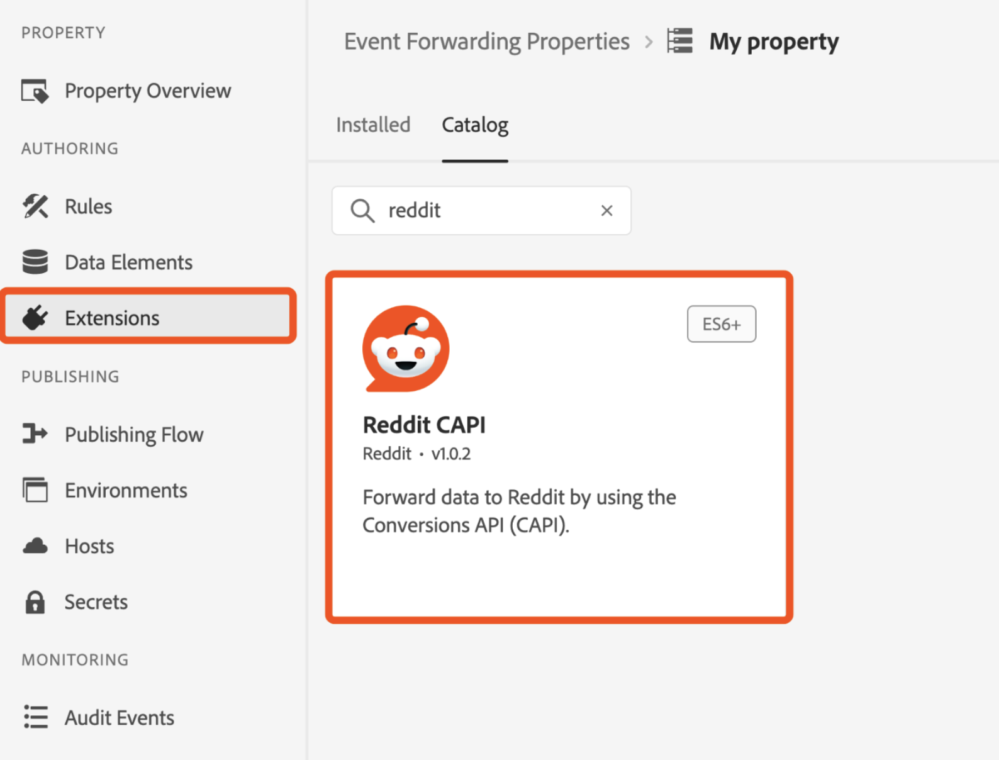

# [!DNL Reddit]转化API扩展概述

Reddit是一个拥有多元化用户群的社交媒体平台，非常适合面向特定受众的广告商。

使用[[!DNL Reddit] Conversions API扩展](https://ads-api.reddit.com/docs/v2/#tag/Conversions-API)将Adobe Experience Platform Edge Network中捕获的用户交互事件发送到[!DNL Reddit Ads]。 使用此扩展帮助您的品牌触及超过3.79亿每周活跃用户的受众，并更好地了解用户行为并运行有针对性的广告。

阅读本指南，了解如何在事件转发[规则](https://experienceleague.adobe.com/en/docs/experience-platform/tags/ui/rules)中安装、配置和使用[!DNL Reddit] Conversions API扩展。

## 主要优点 {#benefits}

使用Reddit Conversions API扩展可以：

- **触及您的受众**：在[!DNL Reddit]上每周与超过3.79亿活跃用户互动。
- **分析用户行为**：利用用户交互数据了解行为并优化营销活动。
- **投放目标广告**：根据Adobe Experience Platform中捕获的用户交互运行个性化广告。

## 先决条件 {#prerequisites}

您必须拥有有效的Reddit Ads帐户才能使用此扩展。 转到[[!DNL Reddit Ads] 注册页面](https://business.reddithelp.com/s/article/Create-and-manage-your-Reddit-Ads-account)进行注册并创建帐户（如果还没有帐户）。 设置帐户后，[请求访问Ads API](https://www.redditforbusiness.com/api-partnership)。

### 收集所需的配置详细信息 {#configuration-details}

要将Experience Platform连接到[!DNL Reddit]，需要以下输入：

| 凭据 | 描述 | 示例 |
| --- | --- | --- |
| 像素Id | 像素ID是与您的[!DNL Reddit Ads]帐户关联的唯一标识符。 它用于跟踪您的网站或应用程序上的用户交互和转化事件。 您可以在[!DNL Reddit Ads] [帐户](https://ads.reddit.com/accounts)中找到像素ID。 | 123456789012 |
| 转化访问令牌 | 您的[!DNL Reddit]转化访问令牌。 请参阅[[!DNL Reddit] 转化API](https://business.reddithelp.com/s/article/conversion-access-token)文档以获取指导。  **由于此令牌未过期，因此您只需执行一次此过程。** | {YOUR_REDDIT_BEARER_TOKEN} |

## 安装和配置[!DNL Reddit]扩展 {#install-configure}

按照以下步骤安装和配置[!DNL Reddit] Conversions API扩展：

1. 在Experience Platform数据收集UI中，从左侧导航中选择[!UICONTROL 扩展]以访问[!UICONTROL 扩展]目录。 然后[创建新的事件转发属性](https://experienceleague.adobe.com/en/docs/experience-platform/tags/event-forwarding/overview#properties)或选择现有属性。
2. 在左侧导航面板中导航到&#x200B;**[!UICONTROL 扩展]**。 选择&#x200B;**[!UICONTROL 目录]**，然后选择&#x200B;**[!DNL Reddit]**&#x200B;扩展。
   
3. 提供以下配置详细信息：
   - **像素ID**：输入您的[!DNL Reddit Ads]像素ID。
   - **转化访问令牌**：输入在您的[!DNL Reddit Ads]帐户中生成的令牌，然后在完成时选择&#x200B;**[!UICONTROL 保存]**。

     

## 配置事件转发规则 {#config-rule}

设置数据元素后，创建事件转发规则以确定将事件发送到[!DNL Reddit Ads]的时间和方式。

1. 导航到事件转发属性中的&#x200B;**规则**&#x200B;并创建新的[规则](https://experienceleague.adobe.com/en/docs/experience-platform/tags/ui/rules)。
2. 在&#x200B;**操作**&#x200B;下，添加新操作并将扩展设置为&#x200B;**[!DNL Reddit CAPI]**。
3. 将&#x200B;**操作类型**&#x200B;设置为&#x200B;**发送事件**。
   
4. 为事件配置其他控件，如下表所示：

   | 字段名称 | 描述 | 示例 |
   | --- | --- | --- |
   | `Event Name` | 指定转化事件的名称。 | `Purchase` |
   | `Event Type` | 定义事件类型，该类型可以是[支持的Reddit转换事件](https://business.reddithelp.com/s/article/supported-conversion-events#supported-conversion-events)或自定义事件。 | `SignUp`、`MyCustomEvent` |
   | `Timestamp` | 以ISO格式提供事件时间或纪元时间。 | `2025-04-15T16:01:00.000Z`、`1744742460000` |
   | `Client Dedupe ID` | 为重复数据删除添加唯一ID。 | `abc123` |
   | `Match Keys` | 包括归因的用户和设备标识符。 | `{"email":"hashed_email@example.com", "phone":"hashed_phone"}` |
   | `Value` | 指定事件的货币值。 | `99.99` |
   | `Currency Code` | 使用ISO-4217格式作为货币。 | `USD` |
   | `Units Sold` | 输入采购项目的数量。 | `3` |
   | `Country Code` | 指定发生事件的国家/地区。 | `US` |
   | `Data Processing Options` | 添加隐私标志，如LDU（有限数据使用）。 | `{"modes":["LDU"],"country":"US","region":"US-NY"}` |
   | `Consent` | 指示用户同意使用广告数据。 | `true` |

5. 选择&#x200B;**保留更改**&#x200B;以保存规则。

## 事件元数据 {#event-metadata}

请阅读此部分，了解事件元数据和用户数据字段的详细细分，确保您了解配置事件所需的和可选的参数。 显示的字段可能会因所选的事件类型而异。

>[!NOTE]
>
>若要从转化事件中获得最佳结果，请确保在设置[动态产品广告](https://business.reddithelp.com/s/article/dynamic-product-ads)时填写所有字段。

### 事件元数据字段

| 字段名称 | 描述 | 示例 |
| --- | --- | --- |
| `Conversion ID` （必需） | 转化事件的唯一ID，用于删除重复项。 | `abc123` |
| `Item Count` | 转化事件的项目总数。 | `6` |
| `Currency` | 以[ISO-4217](https://www.iso.org/iso-4217-currency-codes.html)格式提供值的货币。 | `USD` |
| `Value` | 转化事件的总货币值，包括小数。 | `1.23` |
| `Products` | JSON对象数组，其中包含与事件关联的产品的详细信息。 每个对象必须至少包含一个`id`。 | `[{"id":"SKU123","name":"ProductName","category":"CategoryName"},{"id":"SKU456","name":"ProductName","category":"CategoryName"}]` |

### 用户数据字段

以下参数是可选的，但建议使用：

| 字段名称 | 描述 | 示例 |
| --- | --- | --- |
| `Email` （强烈建议） | 经过哈希处理或未经过哈希处理的用户电子邮件。 | `example@email.com` |
| `External ID` | 经过哈希处理或未经过哈希处理的广告商分配的用户ID。 | `customer12345` |
| `UUID` （强烈建议） | 网站上的Reddit Pixel生成的ID。 | `1677712978045.b8f7eb7d-b357-437b-8bd3-e1c8166c7132` |
| `IP Address` （强烈建议） | 用户的设备IP地址。 | `192.168.0.1` |
| `User Agent` （强烈建议） | 用户使用的浏览器或应用程序。 | `Chrome/98.0.4758.102` |
| `IDFA` | 适用于广告商的哈希或未经哈希处理的Apple标识符。 | `8A2E4F6D-0852-4B2A-B9D5-79334DE14B16` |
| `AAID` | 经过哈希处理或未经过哈希处理的Android Advertising ID。 | `38400000-8cf0-11bd-b23e-10b96e40000d` |
| `Screen Width` | 用户显示的宽度。 | `1920` |
| `Screen Height` | 用户显示的高度。 | `1080` |
| `Data Processing Options` （JSON格式） | 用户隐私设置。 仅支持LDU（有限数据使用）。 | `{"modes":["LDU"],"country":"US","region":"US-NY"}` |

### 重要注意事项

在将数据发送到[!DNL Reddit Ads]之前，扩展对以下字段的值进行哈希处理并规范化： `Email`、`External ID`、`IDFA`和`AAID`。 如果这些值已在[!DNL SHA-256]中进行哈希处理，则扩展不会重新对这些值进行哈希处理。

## 验证和部署 {#validate-deploy}

配置扩展和规则后，通过检查[[!DNL Reddit Ads] 事件管理器](https://business.reddithelp.com/s/article/Events-Manager)中的事件数据来验证集成。 使用[匹配质量分数(MQS)](https://business.reddithelp.com/s/article/match-quality-score)评估信号集成的准确性和可靠性。

有关[!DNL Reddit Ads]的其他详细信息，请访问[Reddit广告文档](https://ads.reddit.com/)。

## 后续步骤 {#next-steps}

阅读本文档后，您现在应该了解如何配置和使用[!DNL Reddit] Conversions API扩展。 有关Adobe Experience Platform中事件转发功能的更多信息，请参阅[事件转发概述](../../../ui/event-forwarding/overview.md)或以下资源：

- [共享匹配键](https://business.reddithelp.com/s/article/about-attribution-matching-signals)和[事件元数据](https://business.reddithelp.com/s/article/about-event-metadata)：了解如何有效地共享匹配键和事件元数据。
- [删除重复事件](https://business.reddithelp.com/s/article/event-deduplication)：通过删除重复事件以确保事件跟踪准确无误。
- [创建转化访问令牌](https://business.reddithelp.com/helpcenter/s/article/conversion-access-token)：按照以下步骤创建安全API身份验证的转化访问令牌。
