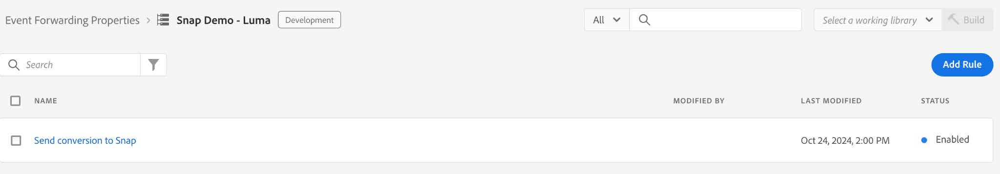

# [!DNL Snapchat]转化API扩展概述

[!DNL Snap]转换API扩展是一个安全的[Edge Network服务器API](/help/server-api/overview.md)接口，它允许您直接与[!DNL Snapchat]共享有关您网站上的用户操作的信息。 您可以使用&#x200B;**[!DNL Snap]**&#x200B;转换API扩展利用事件转发规则将数据从&#x200B;**[!DNL Adobe Experience Platform Edge Network]**&#x200B;发送到&#x200B;**[!DNL Snapchat]**。

## [!DNL Snapchat]先决条件 {#prerequisites}

要使用[!DNL Snapchat]转化API，请执行以下操作：

* 您必须在Adobe Experience Platform中设置[事件转发属性](/help/tags/ui/event-forwarding/getting-started.md)。
* 您还必须具有[所需的权限](/help/collection/permissions.md)才能编辑该属性。

创建[数据流](/help/tags/ui/event-forwarding/getting-started.md)并将[事件转发服务](/help/tags/ui/event-forwarding/getting-started.md#enable-event-forwarding)添加到其中。

需要&#x200B;**[!DNL Snapchat]** [Business Manager](https://business.snapchat.com/)帐户才能使用转化API。 Business Manager帮助广告商将&#x200B;**[!DNL Snapchat]**&#x200B;的营销工作整合到其整个业务中并与外部合作伙伴集成。 请参阅有关创建Business Manager帐户的&#x200B;**[!DNL Snapchat]** [帮助中心文章](https://businesshelp.snapchat.com/s/article/get-started?language=en_US)（如果没有）。

必须在Snapchat广告管理器中设置[!DNL [Snap Pixel]](https://businesshelp.snapchat.com/s/article/pixel-website-install?language=en_US)，并且您必须有权查看`Pixel ID`。 可以在[!UICONTROL [事件管理器]](https://businesshelp.snapchat.com/s/article/events-manager?language=en_US)部分找到`Pixel ID`。

您需要一个静态、生命周期较长的API令牌。 请参阅[[!DNL Snapchat] 转化API文档](https://developers.snap.com/api/marketing-api/Conversions-API/GetStarted#access-token)以获取此令牌。

## 安装和配置[!DNL Snapchat] Web事件API扩展 {#install}

要安装扩展，请导航到&#x200B;**[!UICONTROL 数据收集]**>**[!UICONTROL 事件转发]**。 选择要安装扩展的资产。

选择所需的属性后，请执行以下步骤：

1. 在左侧导航面板中，选择&#x200B;**[!UICONTROL 扩展]**。
2. 搜索&#x200B;**[!UICONTROL 快照转换API扩展]**&#x200B;并选择&#x200B;**[!UICONTROL 安装]**。

   

3. 在配置屏幕上，输入以下值：

* **[!UICONTROL 像素ID]**
* **[!UICONTROL API令牌]**

完成后，选择&#x200B;**[!UICONTROL 保存]**。


<!-- 
![[!DNL Snap] configuration screen for the [!DNL Snap] conversion API extension.](../../../images/extensions/server/snap/configure.png) -->

## 创建数据元素 {#create-data-elements}

若要将数据发送到[!DNL Snapchat]转化API扩展，请为每个数据参数创建[数据元素](https://experienceleague.adobe.com/en/docs/platform-learn/implement-web-sdk/event-forwarding/setup-event-forwarding#create-an-event-forwarding-data-element)。 执行以下步骤：

1. 在属性的&#x200B;**[!UICONTROL 属性信息]**&#x200B;屏幕中导航到&#x200B;**[!UICONTROL 创作]**>**[!UICONTROL 数据元素]**，然后选择&#x200B;**[!UICONTROL 添加数据元素]**。

   

2. 输入数据元素的名称。

3. 选择&#x200B;**[!UICONTROL Core]**&#x200B;作为扩展，选择&#x200B;**[!UICONTROL Path]**&#x200B;作为数据元素类型。

4. 从下拉菜单中，选择相应的项，并填写右侧面板中的[!UICONTROL 路径]字段以在架构中引用所需的数据。

   

例如，如果您创建的数据元素在下面显示的架构中引用`snapClickId`：

的图像

您必须配置数据元素，因为`snapClickId`位于XDM架构中的`_snap.inc.exchange`下。


有关创建数据元素的更多详细信息，请参阅[事件转发属性文档](/help/tags/ui/event-forwarding/overview.md#data-elements)。

## 创建规则以将转换事件发送到Snap {#create-snap-rules}

[规则](https://experienceleague.adobe.com/en/docs/platform-learn/implement-web-sdk/event-forwarding/setup-event-forwarding#create-an-event-forwarding-rule)用于在Experience Platform中触发扩展。 本节概述如何使用转化API扩展在事件转发属性中创建规则以将转化事件发送到快照。

### 创建新规则

1. 导航到事件转发属性，然后从“创作”菜单中选择&#x200B;**[!UICONTROL 规则]**。 然后，单击&#x200B;**[!UICONTROL 创建新规则]**。

   

2. 命名规则并配置触发快照事件的条件。 例如，要在事件包含订单编号时发送`PURCHASE`事件，请设置条件以检查用户交互是否包含有效的采购订单编号。

   

3. 保存条件后，添加操作以触发快照转换API。 在左侧面板中：

   * 将[!UICONTROL 扩展]下拉菜单设置为[!UICONTROL 快照转换API扩展]。

   * 将[!UICONTROL 操作类型]下拉菜单设置为[!UICONTROL 报告Web转换]。

   * 相应地命名规则。

   

4. 在右侧面板的&#x200B;**[!UICONTROL 数据绑定]**&#x200B;部分中为事件配置要发送的[CAPI参数值](https://developers.snap.com/api/marketing-api/Conversions-API/Parameters)。 扩展中的字段映射到CAPI参数，如下所示。 有关每个参数的详细信息，请参阅[Snapchat转换API文档](https://developers.snap.com/api/marketing-api/Conversions-API/Parameters)。

| 数据绑定字段 | 对齐CAPI参数 |
| --- | --- |
| 事件类型（必需） | `event_name` |
| 电子邮件 | `em` |
| 电话号码 | `ph` |
| 用户代理 | `client_user_agent` |
| IP地址 | `client_ip_address` |
| 点击ID | `sc_click_id` |
| Cookie1 | `so_cookie1` |
| 名字 | `fn` |
| 姓氏 | `ln` |
| 性别 | `ge` |
| 城市 | `ph` |
| State | `st` |
| Zip | `zp` |
| 国家/地区 | `country` |
| 外部 ID | `external_id` |
| 合作伙伴ID | `partner_id` |
| 订阅ID | `subscription_id` |
| 商机ID | `lead_id` |
| 项目或类别 | `content_category` |
| 内容名称 | `content_ids` |
| 内容类型 | `content_name` |
| 目录 | `contents` |
| 描述 | `description` |
| 事件标记 | `event_tag` |
| 项数 | `num_items` |
| 价格 | `value` |
| 货币 | `currency` |
| Transaction ID | `order_id` （也为`event_id`发送以代替`client dedup idD`） |
| 预测的LTV | `predicted_ltv` |
| 搜索字符串 | `search_string` |
| 注册方法 | `sign_up_method` |
| 客户端重复数据删除ID | `event_id` |
| 有限的数据使用 | `data_processing_options` |
| 页面Url | `event_source_url` |

{style="table-layout:auto"}

### 必需和可选字段

每个事件都需要`event_source`，它始终设置为`WEB.`为了匹配，还需要以下字段或组合中的至少一个：

* 电子邮件
* 电话号码
* IP地址和用户代理

**其他备注：**

* 对于`Purchase`事件，`Currency`和`Price`字段为必填字段。

* 启用&#x200B;**[!UICONTROL 测试模式]**&#x200B;复选框会将事件作为测试事件发送，这些事件显示在测试事件工具中，而不是标准报告中。 有关更多详细信息，请参阅此[商业帮助中心文章](https://businesshelp.snapchat.com/s/article/capi-event-testing?language=en_US#:~:text=Snap&#39;s%20Conversions%20API%20(CAPI)%20Test,being%20processed%20as%20production%20results.)。

* `contents`参数应为至少包含以下字段之一的JSON字符串：

   * `id`
   * `item_category`
   * `brand`
   * `delivery_category`
   * `item_price`
   * `quantity`

示例：

```json
{
  "id": "id1",
  "brand": "brand1",
  "delivery_category": "c1",
  "item_price": 2.00,
  "quantity": 2
}
```

要使用[自定义转化值和ROAS报告](https://businesshelp.snapchat.com/s/article/custom-conversions-value-roas?language=en_US)，请在`contents`字段中包含相关参数。 购买事件的示例配置可能如下所示： `brand`、`item_price`、`id`。

`Purchase`事件的配置示例：


可设置以下可选字段：


按如上所述设置规则的名称、条件和操作后，保存规则并确保其处于启用状态。



您现在可以将这些更改发布到资产。 有关详细信息，请参阅有关[发布流](/help/tags/ui/publishing/overview.md)的文档。

## 疑难解答 {#troubleshoot}

要排除故障并优化设置，请查看[事件质量得分建议](https://businesshelp.snapchat.com/s/article/event-quality-score)，以确保您的事件获得尽可能高的匹配率和性能结果。

如果您遇到有关&#x200B;**事件质量分数**&#x200B;的问题，请在[此处](https://businesshelp.snapchat.com/s/article/esq-issues-recommendations?language=en_US)详细了解我们的改进建议。

## 后续步骤 {#next-steps}

本指南介绍了如何使用&#x200B;**[!DNL Snap Conversions API]**&#x200B;扩展将服务器端事件数据发送到&#x200B;**[!DNL Snap]**。 有关Experience Platform中事件转发功能的更多信息，请参阅[事件转发概述](../../../ui/event-forwarding/overview.md)。
