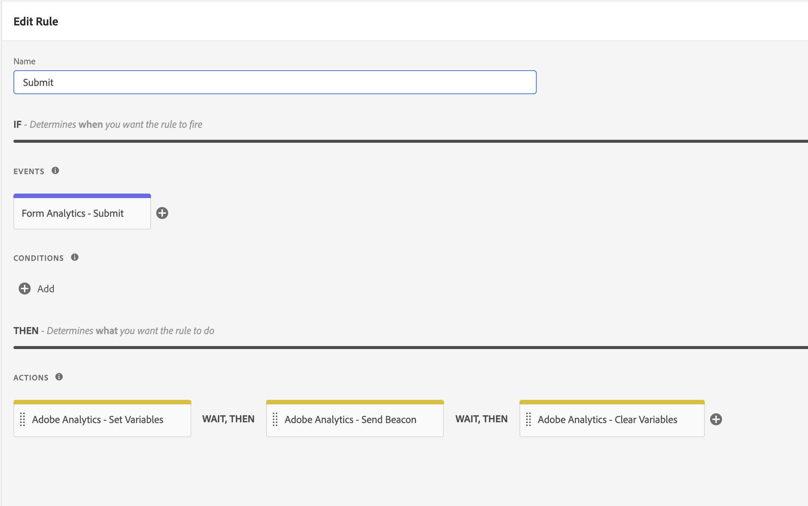

# Adobe Experience Manager Forms扩展概述

本文档概述了Adobe Experience Platform中的Adobe Experience Manager Forms标记扩展。

## 事件

扩展提供了以下事件类型：

1. **呈现**:用户呈现（打开）表单时触发。
1. **错误**:用户在表单上出现验证错误时触发。
1. **帮助**:用户单击字段的帮助图标时触发。
1. **提交**:表单提交时触发。
1. **字段访问**:访问字段时触发。
1. **放弃**:用户关闭选项卡或导航到其他URL时触发。
1. **保存**:表单保存到门户时触发。

>[!IMPORTANT]
>
>“保存”事件当前不适用于表单as a cloud service。 可以使用核心事件“捕获自定义事件”来捕获由自适应Forms中的规则编辑器调度的自定义事件。

## 数据元素

该扩展提供了多个数据元素，可用于发送Analytics调用中的属性。

## 入门指南

请按照以下步骤开始使用扩展。

1. 从扩展目录安装Adobe Experience Manager Forms扩展。 安装后无需进一步配置。
2. 安装和配置[Adobe Analytics扩展](../analytics/overview.md#Configure-the-Adobe-Analytics-extension)。

## 创建规则

利用Experience ManagerForms扩展的规则如下所示：

请按照以下所述步骤为您的实施创建类似规则。

### 添加事件

1. 在扩展下拉列表中选择&#x200B;**Adobe Experience Manager Forms**。
2. 选择要捕获的事件。

### 添加操作

1. 在扩展下拉菜单中选择“Adobe Analytics”。
2. 在操作类型下拉菜单中选择“设置变量”。
3. 在配置视图中，选择要发送的属性和事件。
4. 添加“发送信标”操作，以发送在步骤3中设置事件和属性的分析调用
   
5. 添加“clear variable”操作。

