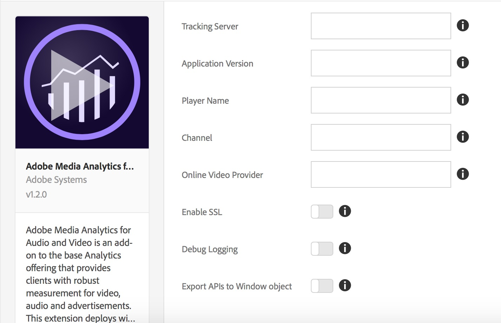

# Adobe MediumAnalytics for Audio and Video扩展概述

>[!NOTE]
>
>Adobe Experience Platform Launch正在Experience Platform中被重新命名为一套数据收集技术。 因此，在产品文档中推出了一些术语更改。 有关术语更改的统一参考，请参阅以下[文档](../../../term-updates.md)。

使用本文档了解有关安装、配置和实施 Adobe Media Analytics for Audio and Video 扩展（Media Analytics 扩展）的信息。其中包括使用此扩展构建规则时可用的选项，以及一些示例和指向示例的链接。

Media Analytics (MA) 扩展添加了核心 JavaScript Media SDK (Media 2.x SDK)。此扩展提供了将`MediaHeartbeat`跟踪器实例添加到标记站点或项目的功能。 MA 扩展需要使用其他两个扩展：

* [Analytics 扩展](../analytics/overview.md)
* [Experience Cloud ID 扩展](../id-service/overview.md)

>[!IMPORTANT]
>
>音频跟踪要求使用 Analytics 扩展 v1.6 或更高版本。

在标记项目中包含上述所有三个扩展后，可以采用以下两种方式之一继续操作：

* 使用您的 Web 应用程序中的 `MediaHeartbeat` API
* 包含或构建特定于播放器的扩展，以便将特定媒体播放器事件映射到 `MediaHeartbeat` 跟踪器实例上的 API。此实例将通过 MA 扩展公开。

## 安装和配置 MA 扩展

* **安装 —** 要安装MA扩展，请打开您的扩展属性，选择 **[!UICONTROL 扩展>目录]**，将鼠标悬停在 **[!UICONTROL Analytics for Audio and Videoextension上，然]** 后选择 **[!UICONTROL 安装]**。

* **配置 —** 要配置MA扩展，请打开扩展  选项卡，将鼠标悬停在该扩展上，然后选择 **[!UICONTROL 配置]**:



### 配置选项：

| 选项 | 描述 |
| :--- | :--- |
| Tracking Server | 定义用于跟踪媒体心率的服务器（这与您的分析跟踪服务器不同） |
| Application Version | 媒体播放器应用程序/SDK 的版本 |
| Player Name | 正在使用的媒体播放器的名称（例如“AVPlayer”、“HTML5 播放器”、“我的自定义视频播放器”） |
| Channel | 渠道名称属性 |
| Online Video Provider | 用于分发内容的在线视频平台的名称 |
| Debug Logging | 启用或禁用日志记录 |
| Enable SSL | 允许或禁止通过 HTTPS 发送 ping |
| Export APIs to Window Object | 允许或禁止将 Media Analytics API 导出到全局范围 |
| Variable Name | `window` 对象下用于导出 Media Analytics API 的变量 |

**提醒：** MA 扩展要求使用 [Analytics](../analytics/overview.md) 和 [Experience Cloud ID](../id-service/overview.md) 扩展。您还必须将这些扩展添加到您的扩展资产并对其进行配置。

## 使用 MA 扩展

### 通过网页/JS 应用程序使用

MA扩展通过启用[!UICONTROL Configuration]页面中的“Export APIs to Window Object”设置，在全局窗口对象中导出MediaHeartbeat API。 它将在配置的变量名称下导出 API。例如，如果变量名称配置为 `ADB`，则 `window.ADB.MediaHeartbeat` 可以访问 MediaHeartbeat。

>[!IMPORTANT]
>
>MA 扩展仅在 `window["CONFIGURED_VARIABLE_NAME"]` 未定义时才导出 API，并且不会覆盖现有变量。

1. **创建 MediaHeartbeat 实例：**`window["CONFIGURED_VARIABLE_NAME"].MediaHeartbeat.getInstance`

   **参数：**&#x200B;公开这些函数的有效委托对象。

   | 方法 |  描述   |
   | :--- | :--- |
   | `getQoSObject()` | 返回包含当前 QoS 信息的 `theMediaObject` 实例。在播放会话期间，此方法将被调用多次。播放器实施必须始终返回最新的可用 QoS 数据。 |
   | `getCurrentPlaybackTime()` | 返回播放头的当前位置。对于 VOD 跟踪，该值以秒为单位，从媒体项目的开头起计算。对于 LIVE/LIVE 跟踪，该值以秒为单位，从计划的开头起计算。 |

   **返回值：**&#x200B;使用 `MediaHeartbeat` 实例解析或使用错误消息拒绝的承诺。

1. **访问 MediaHeartbeat 常量：**`window["CONFIGURED_VARIABLE_NAME"].MediaHeartbeat`

   这会公开 [`MediaHeartbeat`](https://adobe-marketing-cloud.github.io/media-sdks/reference/javascript/MediaHeartbeat.html) 类中的所有常量和静态方法。

   您可在此处获得示例播放器：[MA 示例播放器](https://github.com/Adobe-Marketing-Cloud/media-sdks/tree/master/samples/launch/js/2.x)。示例播放器作为参考，展示了如何使用 MA 扩展直接从 Web 应用程序支持 Media Analytics。

1. 按如下方式创建 MediaHeartbeat 跟踪器实例：

   ```javascript
   var MediaHeartbeat = window["CONFIGURED_VARIABLE_NAME"].MediaHeartbeat;
   
   var delegate = {
       getCurrentPlaybackTime: this._getCurrentPlaybackTime.bind(this),
       getQoSObject: this._getQoSObject.bind(this),
   };
   
   var config = {
       playerName: "Custom Player",
       ovp: "Custom OVP",
       channel: "Custom Channel"
   };
   
   var self = this;
   MediaHeartbeat.getInstance(delegate, config).then(function(instance) {
       self._mediaHeartbeat = instance;
       // Do Tracking using the MediaHeartbeat instance.
   }).catch(function(err){
       // Getting MediaHeartbeat instance failed.
   });
   ```

### 通过其他扩展使用

MA 扩展会将 `get-instance` 和 `media-heartbeat` 共享模块公开给其他扩展。（有关共享模块的其他信息，请参阅[共享模块文档](../../../extension-dev/web/shared.md)。）

>[!IMPORTANT]
>
>只能从其他扩展访问共享模块。也就是说，网页/JS 应用程序既无法访问共享模块，也无法在扩展之外使用 `turbine`（请参阅下面的代码示例）。

1. **创建 MediaHeartbeat 实例：**`get-instance` 共享模块

   **参数：**

   * 公开这些函数的有效委托对象。

      | 方法 |  描述   |
      | :--- | :--- |
      | `getQoSObject()` | 返回包含当前 QoS 信息的 `MediaObject` 实例。在播放会话期间，此方法将被调用多次。播放器实施必须始终返回最新的可用 QoS 数据。 |
      | `getCurrentPlaybackTime()` | 返回播放头的当前位置。对于 VOD 跟踪，该值以秒为单位，从媒体项目的开头起计算。对于 LIVE/LIVE 跟踪，该值以秒为单位，从计划的开头起计算。 |

   * 公开这些属性的可选配置对象：

      | 属性 | 描述 | 必需 |
      | :--- | :--- | :--- |
      | 在线视频提供商 | 用于分发内容的在线视频平台的名称。 | 否。如果存在，则覆盖扩展配置期间定义的值。 |
      | 播放器名称 | 正在使用的媒体播放器的名称（例如“AVPlayer”、“HTML5 播放器”、“我的自定义视频播放器”） | 否。如果存在，则覆盖扩展配置期间定义的值。 |
      | 渠道 | 渠道名称属性 | 否。如果存在，则覆盖扩展配置期间定义的值。 |
   **返回值：**&#x200B;使用 `MediaHeartbeat` 实例解析或使用错误消息拒绝的承诺。

1. **访问 MediaHeartbeat 常量：**`media-heartbeat` 共享模快

   此模块会公开以下类中的所有常量和静态方法：[https://adobe-marketing-cloud.github.io/media-sdks/reference/javascript/MediaHeartbeat.html](https://adobe-marketing-cloud.github.io/media-sdks/reference/javascript/MediaHeartbeat.html)。

1. 按如下方式创建 MediaHeartbeat 跟踪器实例：

   ```javascript
   var getMediaHeartbeatInstance =
     turbine.getSharedModule('adobe-video-analytics', 'get-instance');
   
   var MediaHeartbeat =
     turbine.getSharedModule('adobe-video-analytics', 'media-heartbeat');
     ...
   
   var delegate = {
       getCurrentPlaybackTime: this._getCurrentPlaybackTime.bind(this),
       getQoSObject: this._getQoSObject.bind(this),
   }
   
   var config = {
       playerName: "Custom Player",
       ovp: "Custom OVP",
       channel: "Custom Channel"
   }
   ...
   
   var self = this;
   getMediaHeartbeatInstance(delegate, config).then(function(instance) {
       self._mediaHeartbeat = instance;
       ...
       // Do Tracking using the MediaHeartbeat instance.
   }).catch(function(err){
       // Getting MediaHeartbeat instance failed.
   });
   
   ...
   ```

1. 使用媒体心率实例，按照[媒体 SDK JS 文档](https://experienceleague.adobe.com/docs/media-analytics/using/sdk-implement/setup/setup-javascript/set-up-js-2.html)和 [JS API 文档](https://adobe-marketing-cloud.github.io/media-sdks/reference/javascript/index.html)中的说明，实施媒体跟踪。

>[!NOTE]
>
>**测试：**&#x200B;对于此版本，要测试您的扩展，必须将其上传到 [ Platform ](../../../extension-dev/submit/upload-and-test.md)，您可以在其中访问所有依赖的扩展。


<!--
## Leveraging the sample HTML5 player

You can obtain the MA extension sample HTML5 player here: [HTML5 Sample Player](https://github.com/adobe/reactor-adobe-va-sample-player). The sample player acts as a reference to create video player extensions and to showcase using the MA extension to support media tracking.

### Sample player extension action types

This section describes the action types available in the Sample Player extension.

#### Open Video

The _Open Video_ action provides various configurations for creating and customizing an HTML5 player, providing a video to play and enabling/disabling Adobe Video Analytics tracking.

**Action Configuration / Player Settings:** Note the CSS Selector setting which specifics the `<div>` in the web page where the player is added. Note also that the _Enable Adobe Analytics_ checkbox is checked in the Analytics Settings pane.


* [\[...\]/openVideo/openVideo.jsx](https://github.com/adobe/reactor-adobe-va-sample-player/blob/master/src/view/actions/openVideo/openVideo.jsx) -

  UI Code to configure the Action is defined here.

* [\[...\]/actions/openVideo.js](https://github.com/adobe/reactor-adobe-va-sample-player/blob/master/src/lib/actions/openVideo.js) - This file exports a function that gets executed when the Action is triggered as part of the tag rule.

  This is a code snippet from `openVideo.js` where the `openVideo` Action is executed:

  ```javascript
    function openVideo(settings) {
        let player;
        try {
            Logger.info(LOG_TAG, `Executing action with ${JSON.stringify(settings)}`);

            player = new PlayerFacade(settings);
            PlayerStore.registerPlayer(player);
            player.load(settings.media);
        } catch (ex) {
            Logger.error(LOG_TAG, `Creating player for action openVideo failed with error ${ex.message}`);

            // Cleanup from DOM.
            if (player) {
                player.destroy();
            }
        }
    }
    ...
  ```

* [\[...\]/analytics/adobeAnalyticsProvider.js](https://github.com/adobe/reactor-adobe-va-sample-player/blob/master/src/lib/helpers/analytics/adobeAnalyticsProvider.js) - This file implements Video Analytics tracking by using Shared Modules exposed by the VA extension.

### Sample player extension basic deployment

Once the Sample Player extension is installed, you'll need to create at least one rule to properly deploy it. The Image below shows a sample rule that opens the specified video when the core extension fires the `DOMLoaded` event.


After you have saved this rule, you will need to add it to a Library, and then build and deploy so that you can test the behavior.

-->
