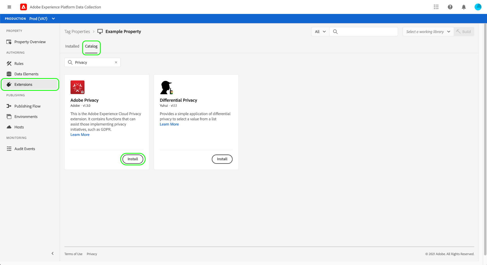
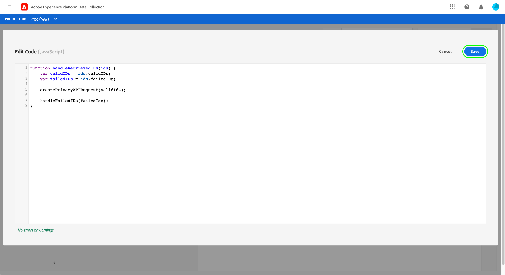

# Adobe隐私扩展概述

>[!NOTE]
>
>Adobe Experience Platform Launch已在Adobe Experience Platform中重新命名为一套数据收集技术。 因此，产品文档中的术语有一些改动。有关术语更改的综合参考，请参阅以下[文档](../../../term-updates.md)。

Adobe隐私标签扩展允许您收集和删除通过客户端设备上的Adobe解决方案分配给最终用户的用户ID。 然后，收集的ID可以发送到 [Adobe Experience Platform Privacy Service](../../../../privacy-service/home.md) 访问或删除受支持的Adobe Experience Cloud应用程序中相关个人的个人数据。

本指南介绍如何在AdobeUI或数据收集UI中安装和配置Experience Platform隐私扩展。

>[!NOTE]
>
>如果您希望在不使用标记的情况下安装这些功能，请参阅 [隐私JavaScript库概述](../../../../privacy-service/js-library.md) 以了解有关如何使用原始代码实施的步骤。

## 安装和配置 扩展

选择 **[!UICONTROL 扩展]** 在左侧导航中，接下来是 **[!UICONTROL 目录]** 选项卡。 使用搜索栏可缩小可用扩展的列表，直到您找到Adobe隐私。 选择 **[!UICONTROL 安装]** 继续。

在下一个屏幕中，您可以配置您希望扩展从中收集ID的源和解决方案。 扩展支持以下解决方案：

* Adobe Analytics(AA)
* Adobe Audience Manager(AAM)
* Adobe Target
* Adobe Experience Cloud Identity Service（访客或ECID）
* Adobe Advertising Cloud(AdCloud)

选择一个或多个解决方案，然后选择 **[!UICONTROL 更新]**.

屏幕会更新，以根据您选择的解决方案显示所需配置参数的输入。

使用下面的下拉菜单，您还可以向配置添加其他特定于解决方案的参数。

>[!NOTE]
>
>请参阅 [配置参数](../../../../privacy-service/js-library.md#config-params) 隐私JavaScript库概述中，了解有关每个受支持解决方案已接受配置值的详细信息。

完成为所选解决方案添加参数后，请选择 **[!UICONTROL 保存]** 以保存配置。

## 使用扩展 {#using}

Adobe隐私扩展提供了三种可在 [规则](../../../ui/managing-resources/rules.md) 当发生特定事件并满足条件时：

* **[!UICONTROL Retrieve Identities]**:检索用户存储的身份信息。
* **[!UICONTROL 删除标识]**:删除用户存储的身份信息。
* **[!UICONTROL 检索，然后删除标识]**:检索用户存储的身份信息，然后删除。

对于上述每个操作，您必须提供一个回调JavaScript函数，该函数将接受检索到的身份数据并将其作为对象参数进行处理。 从此处，您可以存储、显示这些身份，或将它们发送到 [Privacy ServiceAPI](../../../../privacy-service/api/overview.md) 根据需要。

使用Adobe隐私标记扩展时，必须以数据元素的形式提供所需的回调函数。 有关如何配置此数据元素的步骤，请参阅下一节。

### 定义用于处理身份的数据元素

通过选择 **[!UICONTROL 数据元素]** 在左侧导航中，然后是 **[!UICONTROL 添加数据元素]**. 进入配置屏幕后，选择 **[!UICONTROL 核心]** 对于扩展和 **[!UICONTROL 自定义代码]** （对于数据元素类型）。 从此处选择 **[!UICONTROL Open Editor]** 中。

在出现的对话框中，定义一个JavaScript函数，该函数将处理检索到的标识。 回调必须接受单个对象类型参数(`ids` )。 随后，函数可以随意处理ID，还可以调用网站上全局可用的任何变量和函数以进一步处理。

>[!NOTE]
>
>有关 `ids` 回调函数应处理的对象，请参阅 [代码示例](../../../../privacy-service/js-library.md#samples) 在隐私JavaScript库概述中提供。

完成后，选择 **[!UICONTROL 保存]**.

如果您需要对不同事件进行不同的回调，则可以继续创建其他自定义代码数据元素。

### 创建具有隐私操作的规则

在配置一个回调数据元素以处理检索到的ID之后，您可以创建一个规则，当您的网站上发生特定事件以及您所需的任何其他条件时，该规则将调用Adobe隐私扩展。

为规则配置操作时，选择 **[!UICONTROL Adobe隐私]** 的子项。 对于操作类型，选择 [三个函数](#using) 由扩展提供。

右侧面板会提示您选择将用作操作回调的数据元素。 选择数据库图标()，然后从列表中选择之前创建的数据元素。 选择 **[!UICONTROL 保留更改]** 继续。

从此处，您可以继续配置规则，以便Adobe隐私操作根据所需的事件和条件触发。 当您满意时，选择 **[!UICONTROL 保存]**.

您现在可以将规则添加到库中，以在网站上部署为内部版本以进行测试。 请参阅 [标记发布流程](../../../ui/publishing/overview.md) 以了解更多信息。

## 禁用或卸载扩展

安装该扩展后，您可以禁用或删除它。选择 **[!UICONTROL 配置]** 在已安装扩展的Adobe隐私卡上，选择 **[!UICONTROL 禁用]** 或 **[!UICONTROL 卸载]**.

## 后续步骤

本指南介绍了如何在UI中使用Adobe隐私标记扩展。 有关扩展提供的功能（包括如何使用原始代码使用扩展的示例）的更多信息，请参阅 [隐私JavaScript库概述](../../../../privacy-service/js-library.md) (在Privacy Service文档中)。
