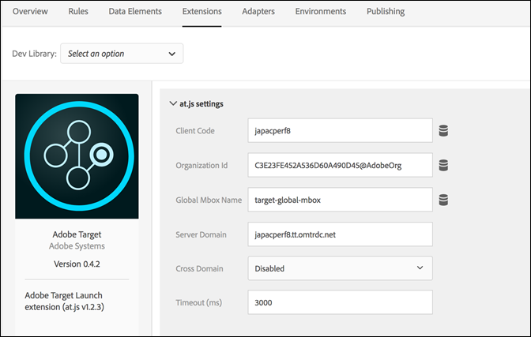
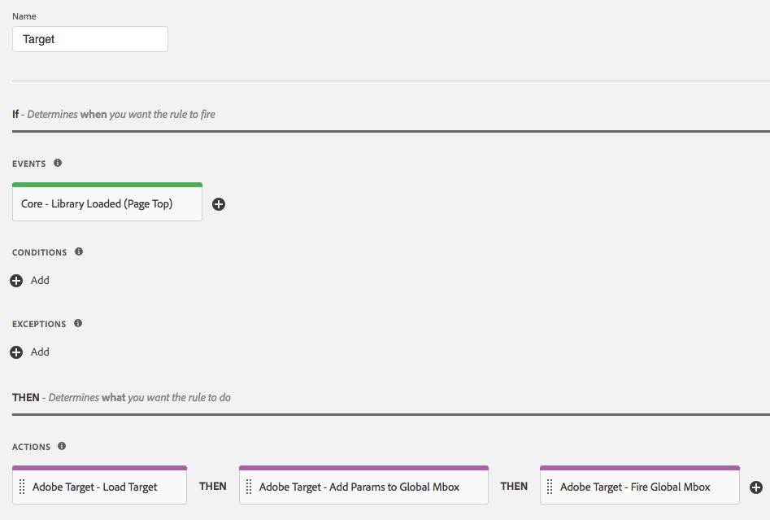

# Adobe Target扩展概述

>[!NOTE]
>
>Adobe Experience Platform Launch已在Adobe Experience Platform中重新命名为一套数据收集技术。 因此，在产品文档中推出了一些术语更改。 有关术语更改的统一参考，请参阅以下[文档](../../../term-updates.md)。

使用本参考可了解有关使用此扩展构建规则时可用的选项的信息。

## 配置 Adobe Target 扩展

>[!IMPORTANT]
>
> Adobe Target 扩展需要使用 at.js。它不支持 mbox.js。

如果尚未安装Adobe Target扩展，请打开您的资产，选择&#x200B;**[!UICONTROL Extensions > Catalog]**，将鼠标悬停在Target扩展上，然后选择&#x200B;**[!UICONTROL Install]**。

要配置该扩展，请打开[!UICONTROL Extensions]选项卡，将鼠标悬停在该扩展上，然后选择&#x200B;**[!UICONTROL Configure]**。



### at.js 设置

除超时之外，您的所有at.js设置都会自动从Target用户界面的at.js配置中进行检索。 该扩展仅在首次添加时才会从Target用户界面中检索设置，因此如果需要进行其他更新，则应在数据收集UI中管理所有设置。

可以使用以下配置选项：

#### Client Code

客户端代码是 Target 帐户标识符。此选项几乎应始终保留为默认值。

可使用数据元素进行更改。

#### Organization ID

此 ID 可将您的实施绑定到 Adobe Experience Cloud 帐户。此选项几乎应始终保留为默认值。

可使用数据元素进行更改。

#### Global Mbox Name

显示全局 Target 请求的名称。默认情况下，此名称为 target-global-mbox，除非您在添加该扩展之前更改了 Target 用户界面中的名称。

可使用数据元素进行更改。

#### Server Domain

发送 Target 请求的域。此选项几乎应始终保留为默认值。

#### Cross Domain

确定 Target 在浏览器中设置 Cookie 的位置。

* **Disabled：**&#x200B;仅在第一方域上设置 Cookie。这是典型设置。
* **Enabled：**&#x200B;同时在第一方域和第三方 Target 域（“服务器域”）上设置 Cookie。

#### Timeout (ms)

如果在定义的时间段内未收到来自 Target 的响应，则请求会超时并显示默认内容。在访客会话期间会继续尝试发起其他请求。默认值为 3000 毫秒，这可能与 Target 用户界面中配置的超时不同。

有关超时设置的工作方式的更多信息，请参阅 [Adobe Target 帮助](https://experienceleague.adobe.com/docs/target/using/implement-target/client-side/deploy-at-js/implementing-target-without-a-tag-manager.html)。

#### Target 用户界面中可用的其他 at.js 设置

Target UI的[!UICONTROL 编辑at.js设置]页面上提供的一些设置未包含在Target扩展中。 下面列出了建议的解决方法：

* 自动创建全局 mbox：此设置将在 Target 扩展中替换为 Fire Global Mbox 操作。
* 库标题：此设置未包含在 Target 扩展中。可在使用 Load Target 操作之前，将需要在 at.js 之前加载的代码置于核心扩展的 Custom Code 操作中。
* 库页脚：此设置未包含在 Target 扩展中。可在使用 Load Target 操作之后，将需要在 at.js 之后加载的代码置于核心扩展的 Custom Code 操作中。

## Target 扩展操作类型

此部分介绍 Target 扩展中可用的操作类型。

Target 扩展在规则的 Then 部分中提供了以下操作：

### Load Target

将此操作添加到适合在上下文中加载Target的标记规则中。 这会将 at.js 库加载到页面中。在大多数实施中，应在您网站的每个页面上加载 Target。

无需进行配置。

### Add Mbox Params

向所有 mbox 请求添加参数。必须先使用 Load Target 操作。

1. 指定要添加的任意参数的名称和值。
1. 选择 **加号 (+)** 图标以添加更多参数。

### Add Global Mbox Params

仅向全局 mbox 请求添加参数。必须先使用 Load Target 操作。

1. 指定要添加的任意参数的名称和值。
1. 选择 **加号 (+)** 图标以添加更多参数。

### Fire Global Mbox

在页面上触发全局 mbox。必须先使用 Load Target 操作。

指定是否启用可防止闪烁的主体隐藏，以及隐藏主体元素时所使用的样式。

可以使用以下选项：

* **Body Hiding：**&#x200B;您可以启用或禁用此设置。默认值为 Enabled，表示隐藏 HTML 主体。
* **Body Hidden Style：**&#x200B;默认值为 `body{opacity:0}`。此值可更改为其他内容，如 `body{display:none}`。

有关更多信息，请参阅 [Target 联机帮助文档](https://experienceleague.adobe.com/docs/target/using/implement-target/client-side/mbox-implement/advanced-mboxjs-settings.html)。

## Adobe Target 基本部署

安装 Target 扩展后，您将需要创建至少一个规则才能正确部署该扩展。您首先需要加载 Target 库 (at.js)，指定要与全局 mbox 一起使用的参数，然后触发全局 mbox。

具有此基本实施的 Target 规则如下所示：



保存此规则后，您需要将其添加到库并进行生成/部署，以便测试该行为。

## 使用异步部署的 Adobe Target 扩展

标记可以异步部署。 如果您异步加载包含Target的标记库，则也将会异步加载Target。 这是一个完全支持的方案，但有一个额外的注意事项必须加以处理。

在异步部署中，页面可以在Target库完全加载并执行内容交换之前完成默认内容渲染。 这可能会导致所谓的“闪烁”，在这种情况下，会先短暂显示默认内容，然后再将该内容替换为 Target 指定的个性化内容。如果要避免出现这种闪烁情况，我们建议您使用预隐藏代码片段并异步加载标记包来避免任何内容闪烁。

在使用预隐藏代码片段时，请谨记以下事项：

* 必须先添加代码片段，然后再加载标记标题嵌入代码。
* 标记无法管理此代码，因此必须将其直接添加到页面。
* 当发生以下事件时（以最先发生者为准），将显示该页面：
   * 收到全局 mbox 响应
   * 全局 mbox 请求超时
   * 代码片段本身超时
* 应在所有使用预隐藏代码片段的页面上使用“Fire Global Mbox”操作，以最大程度地缩短预隐藏的持续时间。

预隐藏代码片段如下所示，该代码片段可以缩小。可配置的选项位于末尾：

```javascript
;(function(win, doc, style, timeout) {
  var STYLE_ID = 'at-body-style';

  function getParent() {
    return doc.getElementsByTagName('head')[0];
  }

  function addStyle(parent, id, def) {
    if (!parent) {
      return;
    }

    var style = doc.createElement('style');
    style.id = id;
    style.innerHTML = def;
    parent.appendChild(style);
  }

  function removeStyle(parent, id) {
    if (!parent) {
      return;
    }

    var style = doc.getElementById(id);

    if (!style) {
      return;
    }

    parent.removeChild(style);
  }

  addStyle(getParent(), STYLE_ID, style);
  setTimeout(function() {
    removeStyle(getParent(), STYLE_ID);
  }, timeout);
}(window, document, "body {opacity: 0 !important}", 3000));
```

默认情况下，该代码片段会预先隐藏整个 HTML 主体。在某些情况下，您可能只想预先隐藏某些 HTML 元素，而不是整个页面。您可以通过自定义样式参数来实现这一点。可将其替换为只预先隐藏页面特定区域的内容。

例如，如果您有两个分别采用 ID container-1 和 container-2 进行标识的区域，则可以将样式替换为以下内容：

```css
#container-1, #container-2 {opacity: 0 !important}
```

而不是默认内容：

```css
body {opacity: 0 !important}
```

默认情况下，代码片段会在 3000 毫秒或 3 秒后超时。此值可进行自定义。
