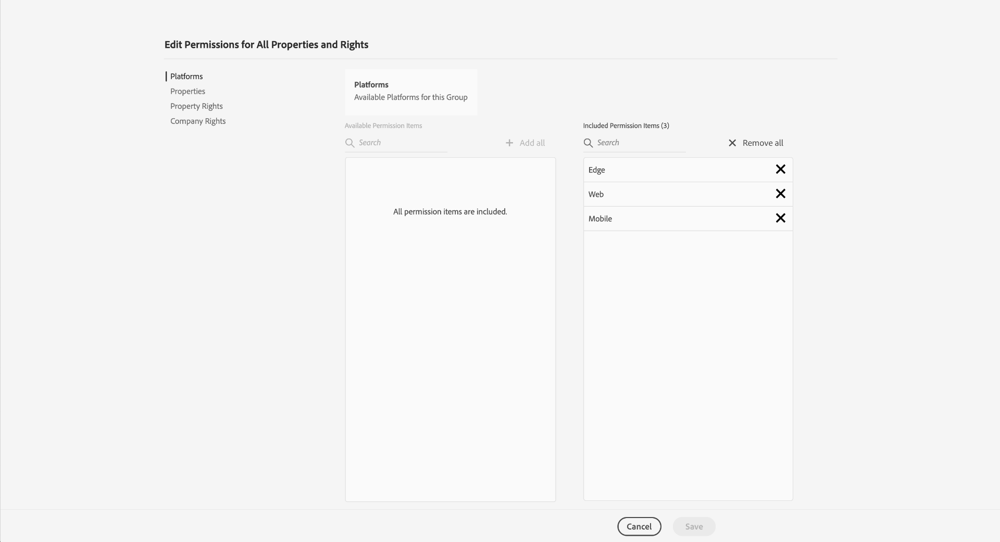
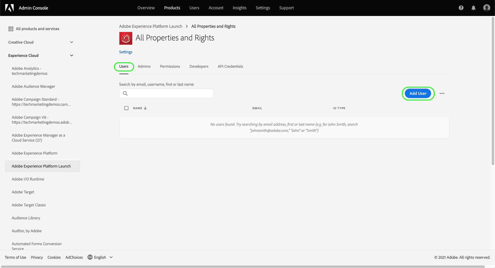

# 管理标记的权限

>[!NOTE]
>
>Adobe Experience Platform Launch已在Adobe Experience Platform中重新命名为一套数据收集技术。 因此，在产品文档中推出了一些术语更改。 有关术语更改的统一参考，请参阅以下[文档](../../term-updates.md)。

要在Adobe Experience Platform中使用标记，您必须获得通过Adobe Admin Console至少访问一个Adobe Experience Cloud产品的权限。 此外，还必须在产品配置文件级别为您授予标记的权限，才能在登录到数据收集UI时执行某些操作。

本指南介绍如何使用Admin Console将这些权限授予用户。

>[!NOTE]
>
>有关本指南中提及的各种可用标记权限类型的详细信息，请参阅[用户权限概述](./user-permissions.md)。

## 获取标记产品配置文件的管理权限

要管理标记的用户权限，您必须至少是Adobe Admin Console中标记的产品配置文件管理员。 系统管理员和产品管理员还可以管理标记产品配置文件的权限。

有关不同管理级别以及如何管理组织内这些角色的更多信息，请参阅[管理角色](https://helpx.adobe.com/enterprise/admin-guide.html/enterprise/using/admin-roles.ug.html)上的Admin Console文档。

## 选择产品配置文件以管理

拥有管理员权限后，登录Admin Console，然后从顶部导航中选择&#x200B;**[!UICONTROL Products]**。 从显示的产品列表中，选择&#x200B;**[!UICONTROL Adobe Experience Platform Launch]**。

此时会显示产品配置文件列表。 产品配置文件是将一组权限链接到一组用户的结构。 在此，您可以创建新配置文件以进行配置，也可以从列表中选择现有产品配置文件进行编辑（假定您拥有该配置文件的管理员权限）。

### 创建产品配置文件

>[!NOTE]
>
>如果您选择了要编辑的现有配置文件，请跳到[下一节](#permissions)。

要创建新的产品配置文件，请选择&#x200B;**[!UICONTROL 新建配置文件]**。

此时会显示一个对话框，用于为用户档案提供名称和可选描述。 您还可以切换在添加用户或从此用户档案中删除用户时是否应收到电子邮件。 完成后，选择&#x200B;**[!UICONTROL Save]**。

## 配置产品配置文件的权限 {#permissions}

此时会显示产品配置文件的详细信息页面。 使用提供的选项卡，您可以管理分配给配置文件的用户，并配置配置文件将授予这些用户的特定属性和权限。

本指南](#users)后面提供了有关如何添加用户的步骤。 [现在，选择&#x200B;**[!UICONTROL Permissions]**。

下一个屏幕显示了当前分配给配置文件的平台、属性和权限数量的概述。 选择其中一行旁边的&#x200B;**[!UICONTROL 编辑]**&#x200B;以开始配置用户档案的权限。

此时会出现[!UICONTROL Edit Permissions]屏幕，用于添加和删除产品配置文件中的权限。 从&#x200B;**[!UICONTROL Platforms]**&#x200B;部分中，您可以看到所有平台默认已添加到配置文件。

### 分配属性

要为此配置文件分配属性，请在左侧导航中选择&#x200B;**[!UICONTROL 属性]**。

默认情况下，系统会自动为新产品配置文件授予对贵组织可用的所有属性的访问权限。 这包括当前可用的属性以及将来提供的任何属性。

如果要限制可用属性，请选择&#x200B;**[!UICONTROL 自动包含]**&#x200B;切换开关。 这允许您根据需要手动添加和删除资产的属性。

如果禁用自动包含，则左侧将列出所有当前可用的属性。 您可以通过选择左列中相关属性旁边的加号(**+**)图标，将属性添加到配置文件。 要删除属性，请在右列中选择该属性旁边的&#x200B;**X**&#x200B;图标。

>[!IMPORTANT]
>
>禁用自动包含功能意味着将来创建的任何属性都必须手动添加到产品配置文件中，才能获得对这些属性的访问权限。

### 分配权限

默认情况下，产品配置文件的所有权限均处于禁用状态，且必须手动添加才能启用。 如果您属于自动包含资产的产品配置文件，但没有权限，则您对所有资产具有只读访问权限。

>[!NOTE]
>
>一个用户可以属于Admin Console中的多个产品配置文件，但来自这些配置文件的权限不会合并到主控权限集中。 该用户仍然只拥有每个组明确授予的权限。
>
>例如，如果组1授予资产A的开发权限，而组2授予资产B的发布权限，则资产A和资产B的开发和发布权限不会合并。您只能在资产A上进行开发，并在资产B上发布。

在左侧导航中选择&#x200B;**[!UICONTROL 属性权限]**。 与资产一样，您可以选择资产右侧旁边的加号(**+**)图标，以将其添加到配置文件。 如果要向配置文件添加所有资产权限，还可以选择&#x200B;**[!UICONTROL Add all]**。

接下来，在左侧导航中选择&#x200B;**[!UICONTROL 公司权限]**。 添加或删除您需要的权限，完成后，选择&#x200B;**[!UICONTROL Save]**。

## 将用户分配到配置文件 {#users}

要将用户分配到产品配置文件，请选择[!UICONTROL 用户]选项卡，然后选择[!UICONTROL 添加用户]。

在显示的对话框中，输入要添加到用户档案的用户的名称、用户组或电子邮件地址。 如果用户是您组织的一部分，则其信息将显示在自动完成下拉菜单中，您可以选择该下拉菜单以填写详细信息。 如果这些用户不属于您的组织，您可以手动输入其信息。

完成后，选择&#x200B;**[!UICONTROL Save]**&#x200B;以将指定的用户添加到产品配置文件中。

将用户添加到配置文件后，他们会收到一封电子邮件，告知他们现在拥有数据收集UI的权限。

## 后续步骤

本文档介绍了如何使用Adobe Admin Console管理数据收集UI的属性和权限。 有关可用权限及其授予访问权限的功能的更多信息，请参阅[用户权限](./user-permissions.md)的概述。
