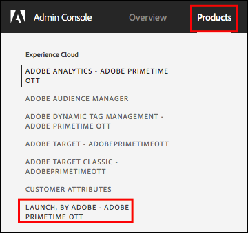
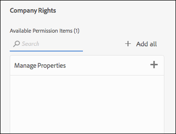

# 用户权限

>[!NOTE]
>
>Adobe Experience Platform Launch已在Adobe Experience Platform中重新命名为一套数据收集技术。 因此，在产品文档中推出了一些术语更改。 有关术语更改的统一参考，请参阅以下[文档](../../term-updates.md)。

## 权限类型

要了解与Adobe Experience Platform中的标记一起使用的用户权限有两个：

* **Experience Cloud 权限：**&#x200B;可在公司级别的 Admin Console 中找到。[!DNL Experience Cloud] 权限可管理谁可以控制所有 [!DNL Experience Cloud] 产品的组权限和组成员资格。
* **标记的权限：** 标记的权限位于产品配置文件级别的Admin Console中。这些权限可管理哪些用户在登录到数据收集UI后可以实际执行某些操作。

本文详细介绍了这些不同的权限类型。

### Experience Cloud 权限

本节讨论在使用Platform时务必要了解的因素。 要全面了解 [!DNL Experience Cloud] 的权限，请参阅[“企业用户指南”中的管理角色“](https://helpx.adobe.com/cn/enterprise/using/admin-roles.html)。

#### 组织管理员

组织管理员 (Organization Administrator) 通常称为“Org Admin”。组织管理员的主要功能是为其他用户分配权限。他们通过创建包含特定产品中特定权限集的产品配置文件（或组），然后将用户（现有或新建）分配给该产品配置文件来实现此功能。

企业组织管理员不会继承Platform中标记的任何权限。 如果客户想要在数据收集UI中执行任何操作，则必须将自己添加到具有相应权限的产品配置文件中。

#### 产品管理员

产品管理员类似于组织管理员，只是其拥有的权限范围更小。产品管理员仅具有修改特定 [!DNL Adobe] 产品的产品配置文件的权限，而无法修改公司有权访问的所有 [!DNL Adobe] 产品的产品配置文件。

### 标记的权限

在 [!DNL Experience Cloud] 内，不会向个人用户分配权限，而是会向产品配置文件分配权限（请参阅上面的“Experience Cloud 权限”）。然后，会将个人用户分配到一个或多个产品配置文件。

在产品配置文件中，标记的权限分为四个维度。

1. 平台
1. 属性
1. 资产权限
1. 公司权限

#### 平台

每个属性都有一个平台。当前，可以对标记使用两个平台：*Web*&#x200B;和&#x200B;*Mobile*。 您可以使用此权限类型来限制或授予对特定类型属性的访问权限。当管理移动应用程序的团队与管理网站的团队不同时，此功能会非常有用。

#### 属性

这是公司内存在的所有属性的列表。您可以使用此权限类型来限制或授予对特定现有属性（按名称）的访问权限。

#### 资产权限

您在数据收集UI中创建的任何资产都将在Admin Console中可用，以供您分配权限。 如果给定的产品配置文件无权访问资产 A1，则属于该配置文件的用户将无法查看或修改资产 A1 中的任何设置。

假设用户属于有权访问资产 A1 的配置文件，那么他们在资产 A1 中可以执行的操作取决于权限组向他们授予的资产权限。拥有资产 A1 权限但未分配任何资产权限的用户具有只读访问权限。

此组中的可用权限包括：

* **开发：** 这允许您创建规则和数据元素。您还可以在现有的开发环境中创建并生成库。准备就绪后，您可以提交库以供审批。数据收集UI中的大多数日常任务都需要此权限。
* **批准：** 这允许您获取已提交的库并将其生成到暂存环境。测试完成后，您还可以批准库以进行发布。
* **发布：** 这允许您将已批准的库发布到生产环境。
* **管理扩展：** 这授予了将新扩展安装到资产、修改已安装扩展的扩展配置以及删除扩展的功能。有关扩展](../managing-resources/extensions/overview.md)的更多信息，请参阅扩展概述文档。 [此角色通常属于 IT 或营销组，具体取决于您的组织。
* **管理环境：** 这允许您创建和修改环境。有关更多信息，请参阅[环境文档](../publishing/environments.md)。 此角色通常属于 IT 组。

#### 公司权限

公司权限适用于跨多个资产的权限。目前有三个：

* **管理属性：** 这允许您在数据收集UI中创建新属性，并在属性级别修改元数据和设置。您还可以删除资产。有关更多信息，请阅读[属性文档](companies-and-properties.md)。 管理员通常执行此角色。
* 授予创建新属性以及在属性级别修改元数据和设置的能力。 您还可以删除资产。有关资产的更多信息，请参阅[此处](companies-and-properties.md)。管理员通常执行此角色。
* **开发扩展：**&#x200B;授予创建和修改公司拥有的扩展包（包括私有版本和公共发布请求）的能力。
* **管理应用程序配置：** 此设置仅适用于已获得Adobe Journey Optimizer许可的客户，或某些允许他们访问移动应用程序内消息和推送消息的其他解决方案。这允许您管理Experience Cloud了解的应用程序以及与Firebase Cloud Messaging服务和Apple推送通知服务通信所需的推送凭据。

### 用户总权限

单个用户的总权限取决于其在不同产品配置文件中的总成员资格。如果用户属于多个产品配置文件，则其总权限等于每个配置文件的权限总和，而不是乘积。

例如：产品配置文件 A 授予 Henry 资产 1 的开发权限。产品配置文件 B 授予 Henry 资产 2 的发布权限。在这种情况下，Henry 可以在资产 1 中开发并在资产 2 中发布，但他不能在资产 1 中发布或在资产 2 中开发，因为他没有被授予执行此操作的明确权限。

## 权限方案

创建新的产品配置文件时，不同的公司具有不同的需求。这些需求因公司规模、组织结构、网站数量、参与标记管理的人员数量等因素而异。

在创建产品配置文件并向其中添加用户时，您需要考虑以下一些常见方案和建议起点。

### 独掌大权

如果您经营一家小型公司，该公司的所有事务均由一人全权负责，在这种情况下，应授予此用户对所有资产的权限，并将上面列出的所有权限分配给此用户。

### 职责分离

许多人参与标记管理。您有一组人员（可能是一位外部顾问）负责创建规则和数据元素，但您不希望他们有权访问生产环境。您希望确保除了 IT 团队之外，任何人都不能部署到生产环境。

1. 在这种情况下，请为您的顾问创建一个帐户，并仅向其授予开发权限。
1. 该顾问会在您设定的范围内进行生成和测试。
1. 如果该顾问需要新扩展，或已准备好进行发布，您组织的代表（拥有适当的权限）将会执行这些操作。

### 企业

企业公司可能已按地理区域划分其多个网站，每个地理区域由不同的团队负责。在这些团队中，开发和发布均由不同的人员负责。

这类似于上面的“职责分明”，不同之处在于企业是按地理区域进行组织的。

* 北美洲
   * 开发组
   * 发布组
* 欧洲
   * 开发组
   * 发布组
* ...
   * 开发组
   * 发布组

## 示例

您在组织中可能拥有的角色类型以及您应该为这些角色分配的权限的一些示例，可能有助于阐明此概念。

下面简单描述了可以在您的组织中应用的不同角色，并且还提供了一个表格，显示他们完成工作所需的权限。

* 经理：想要了解正在发生的事情，但不能做任何更改。
* 营销人员：可以安装扩展并为现有资产设置新标记，但无法发布到暂存或生产环境。
* 移动设备应用程序开发人员：负责在本机移动设备应用程序中实施 Adobe 和第三方解决方案。
* IT 团队：不会实际修改任何标记，但他们可以完全控制暂存环境和生产环境及其包含的内容。
* “多面手”人员：执行所有操作。

| 角色 | 资产 | 公司权限 | 资产权限 |
|--- |--- |--- |--- |
| 经理 | 自动包含 |  |  |
| 营销人员 | 自动包含 | 管理资产 | 开发 管理扩展 |
| 移动设备应用程序开发人员 | 自动包含 | 管理资产 管理应用程序配置 | 开发 管理扩展 |
| IT 团队 | 自动包含 | 批准 发布 管理环境 |
| “多面手”人员 | 自动包含 | 管理资产 | 开发 批准 发布 管理扩展 管理环境 |
| 扩展开发人员 | 自动包含 | 管理资产 开发扩展 | 开发 |

## 分配用户权限

以下步骤将指导您完成分配权限的过程。您还可以在[视频](https://www.youtube.com/watch?v=ba28BHX8cwU)观看这个过程。

可直接导航到 [Adobe Admin Console](https://adminconsole.adobe.com/enterprise/products)，以绕过步骤 1-3。如果您属于多个组织，请从右侧的顶部导航中选择正确的组织。

### 1. 登录到 Experience Cloud

使用您的Adobe ID登录到[https://experiencecloud.adobe.com/](https://experiencecloud.adobe.com/)，然后从[!UICONTROL Navigation]菜单中选择要在数据收集UI中使用的组织。

从[!UICONTROL Navigation]菜单中选择9个圆点图标，然后选择&#x200B;**[!UICONTROL Administration]**，打开解决方案选取器。

如果您看不到此链接，则属于以下两种情况：

* 您不是组织管理员。
* 您不是任何 [!DNL Experience Cloud] 产品的产品管理员。

无论哪种情况，都请要求组织管理员为您执行这些步骤，或者让您成为标记的产品管理员，以便您自己执行这些步骤。

>[!NOTE]
>
>如果您不知道组织管理员是谁，请联系客户关怀团队。

### 2. 打开 Admin Console

选择&#x200B;**Admin Console**。

选择 **[!DNL Experience Platform Launch]-`Company Name`** 卡片。

<!-- Scott, update above image. Rebranding. -->

您还可以在顶部导航中选择&#x200B;**[!UICONTROL Products]** ，然后从左侧导航中选择&#x200B;**[!DNL Experience Platform Launch]-`Company Name`**。

如果您看不到 [!DNL Experience Platform Launch] 卡片，或者 [!DNL Experience Platform Launch] 未出现在此列表中，则表明您不是组织管理员，而是其他 Experience Cloud 产品的产品管理员。由于您不是 Experience Platform Launch 的管理员，因此您需要找到一位组织管理员，该管理员可以为您执行这些步骤或者将您设为 [!DNL Platform Launch] 的产品管理员。

选择 Platform Launch 后，将会显示产品配置文件列表。请将这些配置文件视为权限组。系统会为您创建一个名为“[!DNL Platform Launch] - `Company Name`”的配置文件。

### 3. 创建产品配置文件

如果您正在编辑现有产品配置文件，请跳过此步骤。

选择编辑此产品配置文件，或创建一个新配置文件。

要创建新的产品配置文件，请选择&#x200B;**[!UICONTROL 新建配置文件]**。

为新配置文件指定名称和描述，配置用户在添加或从此配置文件中删除时是否应收到电子邮件，然后选择&#x200B;**[!UICONTROL Done]**。

### 4. 编辑产品配置文件

从列表中选择产品配置文件，然后打开&#x200B;**[!UICONTROL Permissions]**&#x200B;选项卡。 您可以跨两个维度分配权限：资产和权限。

要为此组定义分配属性，请打开&#x200B;**[!UICONTROL Properties]**&#x200B;部分。

此时列表会显示您的标记属性。

默认情况下，新的产品配置会自动包含资产。这意味着所有资产（当前和将来）都包含在组定义中。

如果禁用 Auto-include，则左侧将列出所有当前可用的资产。通过选择&#x200B;**[!UICONTROL Add]**，可以将属性移入此组定义中。

完成后，选择&#x200B;**[!UICONTROL 保存]**。

### 5. 分配权限

分配您希望成为组定义一部分的权限。打开&#x200B;**[!UICONTROL Rights]**&#x200B;部分。

权限不会自动包含在内。您必须为配置文件分配每个权限。您可以使用[!UICONTROL + Add All]按钮快速向此配置文件添加所有权限，也可以使用单个+（添加）按钮分配单个权限。 有关哪些用户权限与每个配置文件权限关联的更多信息，请参阅[权限方案](#rights-scenarios)。完成后，选择&#x200B;**[!UICONTROL 保存]**。 如果[!UICONTROL Save]不可用，则未进行任何更改，并且您将不会获得任何新权限。

首先，分配资产权限：

然后，分配公司权限。

在分配权利时要牢记一些重要注意事项：

* 缺少权限意味着仅具有只读访问权限。如果您属于具有自动包含属性的产品配置且未分配任何权限，则您对所有标记属性具有只读访问权限。
* 如果您未正确分配管理资产，则在登录时将无法添加任何资产。
* 一个用户可以属于多个组，但来自这些组的权限不会合并到主权限集中。该用户仍然只拥有每个组明确授予的权限。

   例如，如果组 1 授予资产 A 的开发权限，而组 2 授予资产 B 的发布权限，则资产 A 和资产 B 的开发和发布权限不会合并。您只能在资产 A 中进行开发，在资产 B 中进行发布。

### 6. 将用户分配到组

要将用户分配到组，请打开[!UICONTROL Users]选项卡，然后选择[!UICONTROL Add User]。

选择省略号(...)以获取其他选项，例如批量用户操作。

>[!NOTE]
>
>成为组织管理员或产品管理员不会授予您在标记产品中的任何权限。 您必须至少属于一个产品配置文件。

搜索您要添加到组中的用户。您可以按名称或按电子邮件地址进行搜索。这会从您组织的现有用户中自动填充用户。找到所需用户后，选择其名称。

添加用户后，用户会收到一封电子邮件，告知他们现在有权限。 要登录，请访问[数据收集UI](https://launch.adobe.com)的链接。

>[!NOTE]
>
>如果用户不存在，您只需键入其完整电子邮件地址，然后提供名字和姓氏即可。新用户会收到一封电子邮件，当他们从该电子邮件邀请中创建 [!DNL Adobe] ID 时，他们会与您为其创建的用户帐户相关联。如果您为自己分配权限，则没有此问题。

## 常见问题

### 加载帐户时出错

登录Data Collection UI时，您会收到一条消息，显示“加载帐户时出错”。

解决办法：您的用户不属于任何标记产品配置文件。 请参阅上述步骤以创建配置文件并为其分配权限，然后将用户分配到配置文件。

### 资产按钮灰显

登录后，无法添加任何资产。

解决方案：您的用户帐户不属于具有“管理资产”权限的产品配置。请返回到上面的步骤 5。
