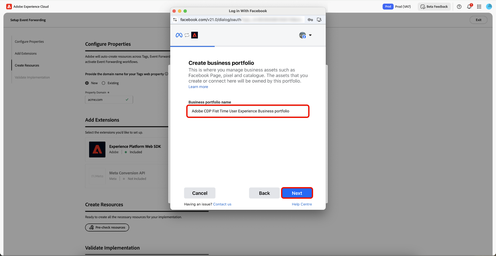

# 事件转发引导式设置概述

>[!IMPORTANT]
>
>已购买Real-Time CDP Prime和Ultimate软件包的客户可以使用引导式设置功能。 有关更多信息，请与您的 Adobe 代表联系。

>[!NOTE]
>
>任何现有客户端都可以使用引导式设置工作流创建可用于以下内容的参考实施：
>
>* 使用它作为全新实施的开始。
>* 将其用作参考实施，您可以检查该实施，以了解其配置方式，然后将其复制到当前生产实施中。

引导式设置功能可帮助您轻松高效地完成设置。 此工具可自动执行在Adobe标记和事件转发中执行的多个步骤，从而显着缩短设置时间。

此安装程序可以自动安装扩展。 [!DNL Meta]建议使用此混合实现来收集和转发事件转换。 引导式设置功能旨在帮助您开始实施事件转发，而不是提供可适应所有用例的端到端、功能齐全的实施。

## 引导式设置入门 {#guided-setup}

要开始使用该功能，请在&#x200B;**[!UICONTROL Get Started]**&#x200B;数据收集UI中选择&#x200B;**[!UICONTROL Event Forwarding]**。

### 创建新的标记属性 {#new-property}

在配置属性部分中，选择&#x200B;**[!UICONTROL New]**&#x200B;并输入新的&#x200B;**[!UICONTROL Property Domain]**&#x200B;详细信息。

在Add Extensions部分为&#x200B;**[!UICONTROL Add]**&#x200B;选择[!DNL Meta Conversion API]。 在“配置[!DNL Meta]信息”页中，您可以选择手动输入您的&#x200B;**[!UICONTROL Meta Pixel ID]**、**[!UICONTROL Meta System User Access Token]**&#x200B;和&#x200B;**[!UICONTROL Data Layer Path]**，也可以使用&#x200B;**[!UICONTROL Connect to Meta]**&#x200B;选项。

#### 使用您的凭据连接到[!DNL Meta] {#meta-credentials}

选择&#x200B;**[!UICONTROL Connect to Meta]**，输入您的[!DNL Meta]凭据并选择&#x200B;**[!UICONTROL Log in]**，然后选择&#x200B;**[!UICONTROL Next]**。

现在将请求您&#x200B;**创建业务组合**。 输入&#x200B;**[!UICONTROL Business portfolio name]**&#x200B;并选择&#x200B;**[!UICONTROL Next]**。

从列表中选择您的业务组合，然后选择&#x200B;**[!UICONTROL Next]**。 您可以查看业务Portfolio、广告帐户和[!DNL Meta Pixel]的设置。 选择&#x200B;**[!UICONTROL Continue]**&#x200B;以确认设置，然后选择&#x200B;**[!UICONTROL Next]**。

请等待几分钟以完成设置过程，然后选择&#x200B;**[!UICONTROL Done]**。

将自动填充您的&#x200B;**[!UICONTROL Meta Pixel ID]**、**[!UICONTROL Meta System User Access Token]**&#x200B;和&#x200B;**[!UICONTROL Data Layer Path]**。 选择 **[!UICONTROL Save]**。

#### 为新标记属性创建资源 {#create-resources}

在“创建资源”部分中，选择&#x200B;**[!UICONTROL Pre-check resources]**&#x200B;以检查您的组织和属性是否存在冲突，或者您的实施是否存在必要的资源。

“任务操作”页显示任务和操作的列表。 选择&#x200B;**[!UICONTROL Create Resources]**&#x200B;以创建这些任务。

请留出几分钟时间，让所需的规则、数据元素、扩展、库、SDK等完成安装。 “创建资源”部分提供指向已创建的属性和资源的链接。

#### 验证实施 {#validate-implementation}

验证实施部分提供了可在网站上使用的嵌入链接。 **[!UICONTROL Start Validation]**&#x200B;在此引导式设置页面上的当前浏览器会话中运行测试。 如果在此处验证成功，则在网站上部署嵌入链接时，相同的实施应该也可以正常工作。

选择&#x200B;**[!UICONTROL Send PageView Event]**&#x200B;以通过Adobe Experience Platform Edge Network发送测试事件。 然后，服务器端转发到[!DNL Meta]。 选择&#x200B;**[!UICONTROL Finished Validation]**&#x200B;以完成设置。

>[!NOTE]
>
>如果在验证过程中发生任何故障，请选择&#x200B;**[!UICONTROL Assurance]**&#x200B;链接以查看可能已失败的事件。

### 使用现有标记属性 {#existing-property}

在配置属性部分中，选择&#x200B;**[!UICONTROL Existing]**，然后从下拉菜单中选择标记属性。 系统尝试通过数据流查找已附加到此属性的事件转发属性。 您现在可以继续重新配置[!DNL Meta Conversion API]，然后预先检查并创建资源。

如果selected tags属性未连接到事件转发属性，或者如果缺少数据流，则将自动创建数据流。

要配置您的[!DNL Meta Conversion API]，请使用您的凭据[按照上面在 [!DNL Meta] 连接到](#meta-credentials)中突出显示的流程操作。

现在您已生成&#x200B;**[!UICONTROL Meta Pixel ID]**、**[!UICONTROL Meta System User Access Token]**&#x200B;和&#x200B;**[!UICONTROL Data Layer Path]**，请选择&#x200B;**[!UICONTROL Pre-Check resources]**&#x200B;以创建事件转发工作流。

由于您使用的是现有的标记属性，因此设置过程与新的属性工作流略有不同。 您可以看到，系统将跳过创建Web属性、主机和环境，因为这些属性已存在。 最后，选择&#x200B;**[!UICONTROL Create Resources]**&#x200B;以创建尚未可用的任务。

>[!INFO]
>
>引导式设置会自动将注释添加到流程中更新的属性。 在编辑模式下，您可以在tags属性的右侧面板的“注释”部分中查看这些标记。 您可以使用引导式设置工具查看资产的更新或创建时间。 此审核记录可帮助您跟踪引导式设置功能所做的修改。

请留出几分钟时间，让所需的规则、数据元素、扩展、库、SDK等完成安装。 “创建资源”部分提供指向已创建的属性和资源的链接。

验证实施部分提供了可在网站上使用的嵌入链接。 **[!UICONTROL Start Validation]**&#x200B;在此引导式设置页面上的当前浏览器会话中运行测试。 如果在此处验证成功，则在网站上部署嵌入链接时，相同的实施应该也可以正常工作。

选择&#x200B;**[!UICONTROL Send PageView Event]**&#x200B;以通过Adobe Experience Platform Edge Network发送测试事件。 然后，服务器端转发到[!DNL Meta]。 选择&#x200B;**[!UICONTROL Finished Validation]**&#x200B;以完成设置。

>[!NOTE]
>
>如果在验证过程中发生任何故障，请选择&#x200B;**[!UICONTROL Assurance]**&#x200B;链接以查看可能已失败的事件。

## 后续步骤 {#next-steps}

本指南介绍了如何使用引导式设置工具创建和配置[!DNL Meta Conversions API]的属性。

有关如何有效实施集成的更多指导，请参阅有关[!DNL Meta][的 [!DNL Conversions API]最佳实践的](https://www.facebook.com/business/help/308855623839366?id=818859032317965)文档。 有关Adobe Experience Cloud中标记和事件转发的更多常规信息，请参阅[标记概述](../../home.md)。
