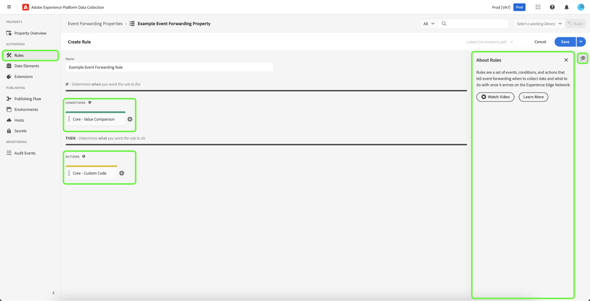

# 事件转发概述

>[!NOTE]
>
>事件转发是一项付费功能，包含在Adobe Real-Time Customer Data Platform连接、Prime或Ultimate产品中。

>[!NOTE]
>
>经过品牌重塑，Adobe Experience Platform Launch 已变为 Adobe Experience Platform 中的一套数据收集技术。因此，产品文档中的术语有一些改动。有关术语更改的综合参考，请参阅以下[文档](../../term-updates.md)。

Adobe Experience Platform中的事件转发允许您将收集的事件数据发送到目标以进行服务器端处理。 事件转发通过使用Adobe Experience Platform Edge Network执行通常在客户端上完成的任务，减轻了网页和应用程序的负担。 通过与标记类似的方式实施，事件转发规则可以转换数据并将数据发送到新目标，但不会从Web浏览器等客户端应用程序发送此数据，而是从Adobe的服务器发送。

本文档全面概述了Experience Platform中的事件转发。

>[!NOTE]
>
>有关事件转发如何适应Experience Platform中的数据收集生态系统的信息，请参阅[数据收集概述](../../../collection/home.md)。

与Adobe Experience Platform [Web SDK](/help/web-sdk/home.md)和[Mobile SDK](https://experienceleague.adobe.com/docs/platform-learn/data-collection/mobile-sdk/overview.html)结合使用的事件转发具有以下优点：

**性能**：

* 从包含数据有效负载的页面发出单个调用，然后这些有效负载会在服务器端联合，以减少客户端网络流量，并为客户提供更快的体验。
* 缩短加载网页所需的时间以提高网站性能。
* 减少提供体验和将数据发送到许多目标所需的客户端技术的数量。

**数据管理**：

* 增加透明度和控制跨所有资产将哪些数据发送到何处。

## 事件转发和标记之间的区别 {#differences-from-tags}

在配置方面，事件转发使用许多与标记相同的概念，如[规则](../managing-resources/rules.md)、[数据元素](../managing-resources/data-elements.md)和[扩展](../managing-resources/extensions/overview.md)。 两者主要区别可概括如下：

* 标记&#x200B;**从网站或本机移动设备应用程序中收集**&#x200B;事件数据并将这些数据发送至Experience Platform Edge Network。
* 事件转发&#x200B;**将**&#x200B;传入的事件数据从Experience Platform Edge Network发送到一个端点，该端点表示最终目标或提供要用于扩充原始有效负载的数据的端点。

虽然标记使用Experience Platform Web和Mobile SDK直接从您的网站或本机移动应用程序收集事件数据，但事件转发要求已通过Experience Platform Edge Network发送事件数据，才能将其转发到目标。 换言之，您必须在数字资产上实施Experience Platform Web或Mobile SDK（通过标记或使用原始代码），才能使用事件转发。

### 属性 {#properties}

事件转发会维护其自身与标记分开的属性存储，您可以通过选择左侧导航中的&#x200B;**[!UICONTROL Event Forwarding]**，在Experience Platform UI或数据收集UI中查看这些属性。

>[!TIP]
>
>使用右侧面板中的产品帮助中的，了解有关事件转发的更多信息并查看其他可用资源。

所有事件转发属性都将&#x200B;**[!UICONTROL Edge]**&#x200B;列为其平台。 它们不会区分Web或移动，因为它们仅处理从Experience Platform Edge Network接收的数据，后者本身可以接收来自Web和移动平台的事件数据。

### 扩展 {#extensions}

事件转发具有自己的兼容扩展目录，如[Core](../../extensions/server/core/overview.md)扩展和[Adobe Cloud Connector](../../extensions/server/cloud-connector/overview.md)扩展。 您可以在左侧导航中选择&#x200B;**[!UICONTROL Extensions]**，然后选择&#x200B;**[!UICONTROL Catalog]**，来查看UI中事件转发属性的可用扩展。

您可以从右侧面板中选择，以查看其他可用资源以了解有关此功能的更多信息。

### 数据元素 {#data-elements}

事件转发中可用的数据元素类型仅限于提供这些数据的兼容[扩展](#extensions)的目录。

尽管创建和配置数据元素本身的方式与创建和配置标记的方式相同，但在如何引用来自Experience Platform Edge Network的数据方面，它们存在一些重要的语法差异。

#### 引用Experience Platform Edge Network中的数据 {#data-element-path}

要引用Experience Platform Edge Network中的数据，您必须创建一个数据元素，以便提供指向该数据的有效路径。 在UI中创建数据元素时，请为扩展选择&#x200B;**[!UICONTROL Core]**，为类型选择&#x200B;**[!UICONTROL Path]**。

数据元素的&#x200B;**[!UICONTROL Path]**&#x200B;值必须遵循模式`arc.event.{ELEMENT}`（例如： `arc.event.xdm.web.webPageDetails.URL`）。 必须正确指定此路径才能发送数据。

您可以从右侧面板中选择，以查看其他可用资源以了解有关此功能的更多信息。

### 规则 {#rules}

在事件转发属性中创建规则的工作方式与标记类似，主要区别在于您不能选择事件作为规则组件。 相反，事件转发规则会处理从[数据流](../../../datastreams/overview.md)接收的所有事件，并在满足某些条件时将这些事件转发到目标。

此外，还有30秒的超时时间，适用于单个事件，因为会在一个事件转发属性内的所有规则（以及因此产生的所有操作）中处理该事件。 这意味着必须在此时间范围内完成单个事件的所有规则和所有操作。

您可以从右侧面板中选择，以查看其他可用资源以了解有关此功能的更多信息。

#### 数据元素标记化 {#tokenization}

在标记规则中，数据元素在数据元素名称的开头和结尾使用`%`进行标记（例如： `%viewportHeight%`）。 在事件转发规则中，数据元素使用数据元素名称的开头`{{`和结尾`}}`进行标记（例如： `{{viewportHeight}}`）。

您可以从右侧面板中选择，以查看其他可用资源以了解有关此功能的更多信息。

#### 规则的操作顺序 {#action-sequencing}

事件转发规则的[!UICONTROL Actions]部分始终按顺序执行。 例如，如果规则具有两个操作，则第二个操作将直到上一个操作完成才会开始执行（并且在需要从端点响应的情况下，该端点已响应）。 您在保存规则时，应确保操作顺序正确。无法像使用标记规则那样异步执行此执行序列。

## 密钥 {#secrets}

事件转发允许您创建、管理和存储可用于向要向其发送数据的服务器进行身份验证的密钥。 请参阅有关[密钥](./secrets.md)的指南，了解不同类型的可用密钥类型以及它们在UI中的实现方式。

## 视频概述 {#video}

以下视频旨在帮助您更好地了解事件转发和Real-Time CDP连接。

>[!VIDEO](https://video.tv.adobe.com/v/3429308)

## 后续步骤

本文档简要介绍事件转发。 有关如何为您的组织设置此功能的详细信息，请参阅[快速入门指南](./getting-started.md)。
