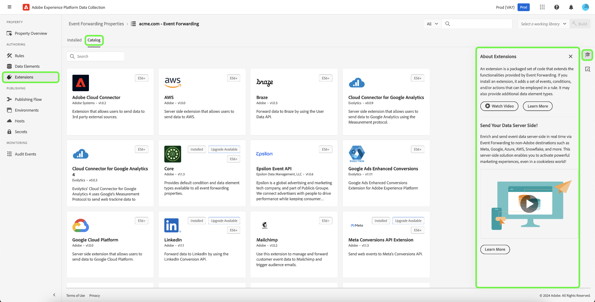

# 事件转发概述

>[!NOTE]
>
>Adobe Experience Platform Launch已在Adobe Experience Platform中重新命名为一套数据收集技术。 因此，产品文档中的术语有一些改动。有关术语更改的综合参考，请参阅以下[文档](../../term-updates.md)。

Adobe Experience Platform中的事件转发允许您将收集的事件数据发送到服务器端处理的目标。 事件转发使用Adobe Experience Platform边缘网络执行在客户端上正常完成的任务，从而减少网页和应用程序重量。 事件转发规则以与标记类似的方式实施，可以转换数据并将其发送到新目标，但是，它不是从客户端应用程序（如Web浏览器）发送此数据，而是从Adobe的服务器发送。

本文档简要概述了Platform中的事件转发。

>[!NOTE]
>
>有关事件转发如何在Platform的数据收集生态系统中发挥作用的信息，请参阅 [数据收集概述](../../../collection/home.md).

事件转发与Adobe Experience Platform结合 [Web SDK](../../../edge/home.md) 和 [Mobile SDK](https://aep-sdks.gitbook.io/docs/) 提供以下优势：

**性能**:

* 从包含数据有效负载的页面进行单次调用，该负载随后会联合到服务器端，以减少客户端网络流量并为客户提供更快的体验。
* 减少网页加载所花费的时间，以提高网站性能。
* 减少提供体验并将数据发送到多个目标所需的客户端技术数量。

**数据管理**:

* 提高透明度并控制在所有属性中发送哪些数据。

## 事件转发和标记之间的差异 {#differences-from-tags}

在配置方面，事件转发使用与标记相同的许多概念，例如 [规则](../managing-resources/rules.md), [数据元素](../managing-resources/data-elements.md)和 [扩展](../managing-resources/extensions/overview.md). 二者之间的主要区别可概括如下：

* 标记 **收集** 网站或本机移动应用程序中的事件数据，并将其发送到Platform Edge Network。
* 事件转发 **发送** 将事件数据从Platform Edge Network发送到端点，该端点表示最终目标或端点，提供要用来扩充原始有效负载的数据。

当标记使用Platform Web和Mobile SDK直接从您的网站或本机移动应用程序收集事件数据时，事件转发要求事件数据已通过Platform Edge Network发送，以将其转发到目标。 换言之，您必须在数字资产（通过标记或使用原始代码）上实施Platform Web或Mobile SDK，才能使用事件转发。

### 属性 {#properties}

事件转发会维护其自身的属性存储，这些属性与标记分开，您可以通过选择 **[!UICONTROL 事件转发]** 中。

所有事件转发属性列表 **[!UICONTROL Edge]** 作为平台。 它们不区分Web和移动设备，因为它们只处理从平台边缘网络接收的数据，而平台边缘网络本身可以从Web平台和移动平台接收事件数据。

### 扩展 {#extensions}

事件转发有其自己的兼容扩展目录，如 [核心](../../extensions/web/core/event-forwarding.md) 扩展和 [Adobe云连接器](../../extensions/web/cloud-connector/overview.md) 扩展。 您可以通过选择 **[!UICONTROL 扩展]** 在左侧导航中，然后是 **[!UICONTROL 目录]**.

### 数据元素 {#data-elements}

事件转发中可用的数据元素类型仅限于兼容的目录 [扩展](#extensions) 提供它们。

虽然数据元素本身在事件转发中的创建和配置方式与标记相同，但在涉及如何引用来自Platform Edge Network的数据时，仍存在一些重要的语法差异。

#### 从Platform Edge Network引用数据 {#edge}

要引用来自Platform Edge Network的数据，必须创建一个数据元素，以提供该数据的有效路径。 在UI中创建数据元素时，选择 **[!UICONTROL 核心]** 对于扩展和 **[!UICONTROL 路径]** 的子项。

的 **[!UICONTROL 路径]** 数据元素的值必须遵循模式 `arc.event.{ELEMENT}` (例如： `arc.event.xdm.web.webPageDetails.URL`)。 必须正确指定此路径才能发送数据。

### 规则 {#rules}

在事件转发属性中创建规则的方式与标记类似，主要区别在于您无法选择事件作为规则组件。 事件转发规则而是会处理它从 [数据流](../../../edge/datastreams/overview.md) 并在满足某些条件时将这些事件转发到目标。

#### 数据元素标记化 {#tokenization}

在标记规则中，数据元素使用 `%` 数据元素名称的开头和结尾(例如： `%viewportHeight%`)。 在事件转发规则中，数据元素使用进行标记 `{{` 开始时和 `}}` 数据元素名称的末尾(例如： `{{viewportHeight}}`)。

#### 规则的操作顺序 {#action-sequencing}

的 [!UICONTROL 操作] 事件转发规则的部分始终按顺序执行。 您在保存规则时，应确保操作顺序正确。无法像使用标记一样异步执行此执行序列。

## 秘密 {#secrets}

事件转发允许您创建、管理和存储可用于对要向其发送数据的服务器进行身份验证的密钥。 请参阅 [秘密](./secrets.md) 不同类型的可用密钥类型及其在UI中的实施方式。

## 后续步骤

本文档简要介绍了事件转发。 有关如何为贵组织设置此功能的更多信息，请参阅 [入门指南](./getting-started.md).
