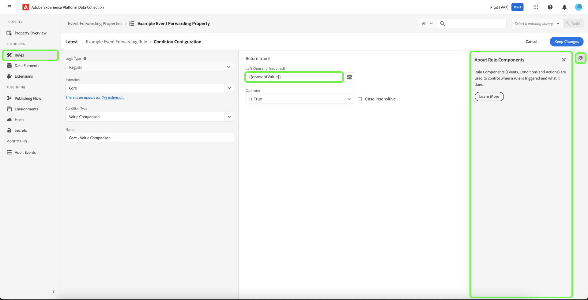

# 事件转发概述

>[!NOTE]
>
>事件转发是一项付费功能，包含在Adobe Real-time Customer Data Platform Connections、Prime或Ultimate产品中。

>[!NOTE]
>
>Adobe Experience Platform Launch已更名为Adobe Experience Platform中的一套数据收集技术。 因此，产品文档中的术语有一些改动。有关术语更改的综合参考，请参阅以下[文档](../../term-updates.md)。

Adobe Experience Platform中的事件转发允许您将收集的事件数据发送到目标以进行服务器端处理。 事件转发通过使用Adobe Experience Platform Edge Network执行通常在客户端上完成的任务，减轻了网页和应用程序的负担。 通过与标记类似的方式实施，事件转发规则可以转换数据并将其发送到新目标，但不会从Web浏览器等客户端应用程序发送此数据，而是从Adobe的服务器发送。

本文档提供了Platform中事件转发的高级概述。

>[!NOTE]
>
>有关事件转发如何适应Platform中数据收集生态系统的信息，请参阅 [数据收集概述](../../../collection/home.md).

与Adobe Experience Platform结合的事件转发 [Web SDK](../../../edge/home.md) 和 [移动SDK](https://experienceleague.adobe.com/docs/platform-learn/data-collection/mobile-sdk/overview.html) 具有以下优势：

**性能**：

* 从包含数据有效负载的页面发出单个调用，然后数据集在服务器端联合，以减少客户端网络流量，并为客户提供更快的体验。
* 缩短加载网页所需的时间以提高网站性能。
* 减少交付您的体验并将数据发送到多个目标所需的客户端技术的数量。

**数据治理**：

* 提高透明度并控制跨所有资产将哪些数据发送到何处。

## 事件转发和标记之间的区别 {#differences-from-tags}

在配置方面，事件转发使用许多与标记相同的概念，例如 [规则](../managing-resources/rules.md)， [数据元素](../managing-resources/data-elements.md)、和 [扩展](../managing-resources/extensions/overview.md). 两者之间的主要区别可以概括如下：

* 标记 **收集** 网站或本机移动应用程序中的事件数据，并将其发送到Platform Edge Network。
* 事件转发 **发送** 从Platform Edge Network将事件数据传入一个端点，该端点表示最终目标或提供要用于扩充原始有效负载的数据的端点。

虽然标记使用Platform Web和Mobile SDK直接从您的网站或本机移动应用程序收集事件数据，但事件转发要求事件数据必须已通过Platform Edge Network发送，才能转发到目标。 换言之，您必须在数字资产上实施Platform Web或Mobile SDK（通过标记或使用原始代码），才能使用事件转发。

### 属性 {#properties}

事件转发会维护其自身与标记分开的属性存储，您可以通过选择，在Experience PlatformUI或数据收集UI中查看这些属性 **[!UICONTROL 事件转发]** 左侧导航栏中。

所有事件转发属性列表 **[!UICONTROL Edge]** 作为他们的平台。 它们不会区分Web或移动设备，因为它们只处理从Platform Edge Network接收的数据，而该平台本身可以接收来自Web和移动平台的事件数据。

### 扩展 {#extensions}

事件转发具有其自身的兼容扩展目录，例如 [核心](../../extensions/server/core/overview.md) 扩展和 [Adobe云连接器](../../extensions/server/cloud-connector/overview.md) 扩展。 您可以通过选择，在UI中查看事件转发属性的可用扩展 **[!UICONTROL 扩展]** 在左侧导航中，其后是 **[!UICONTROL 目录]**.

### 数据元素 {#data-elements}

事件转发中可用的数据元素类型仅限于兼容的目录 [扩展](#extensions) 提供这些服务的。

尽管创建和配置数据元素本身的方式与创建和配置标记的方式相同，但是当它们引用来自Platform Edge Network的数据时，语法有一些重要差异。

#### 引用来自Platform Edge Network的数据 {#data-element-path}

要引用来自Platform Edge Network的数据，您必须创建一个数据元素，以提供指向该数据的有效路径。 在UI中创建数据元素时，选择 **[!UICONTROL 核心]** 扩展和 **[!UICONTROL 路径]** 类型。

此 **[!UICONTROL 路径]** 数据元素的值必须遵循以下模式 `arc.event.{ELEMENT}` (例如： `arc.event.xdm.web.webPageDetails.URL`)。 必须正确指定此路径才能发送数据。

### 规则 {#rules}

在事件转发属性中创建规则的工作方式与标记类似，主要区别在于您不能选择事件作为规则组件。 相反，事件转发规则会处理它从收到的所有事件 [数据流](../../../datastreams/overview.md) 并在满足特定条件时将事件转发到目标。

此外，有一个30秒的超时，适用于单个事件，因为它是在事件转发属性内的所有规则（以及由此产生的所有操作）中处理的。 这意味着必须在此时间范围内完成单个事件的所有规则和所有操作。

#### 数据元素标记化 {#tokenization}

在标记规则中，数据元素使用 `%` 位于数据元素名称的开头和结尾处(例如： `%viewportHeight%`)。 在事件转发规则中，数据元素改用进行标记 `{{` 于期初及 `}}` 在数据元素名称末尾(例如： `{{viewportHeight}}`)。

#### 规则的操作顺序 {#action-sequencing}

此 [!UICONTROL 操作] 事件转发规则的部分始终按顺序执行。 例如，如果规则具有两个操作，则第二个操作将直到上一个操作完成才会开始执行（如果预期端点会做出响应，则该端点已做出响应）。 您在保存规则时，应确保操作顺序正确。无法像使用标记规则那样异步执行此执行序列。

## 密钥 {#secrets}

事件转发允许您创建、管理和存储可用于对要将数据发送到的服务器进行身份验证的密钥。 请参阅指南，网址为 [密钥](./secrets.md) 不同类型的可用密钥类型以及它们在UI中的实现方式。

## 后续步骤

本文档简要介绍事件转发。 有关如何为您的组织设置此功能的更多信息，请参阅 [快速入门指南](./getting-started.md).
