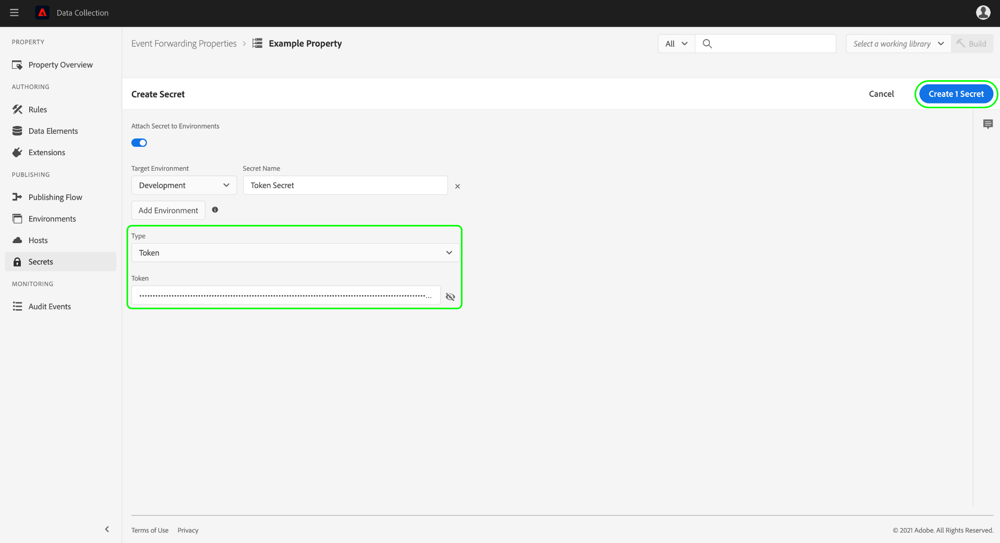

# 在事件转发中配置密钥

在事件转发中，密码是表示另一个系统的身份验证凭据的资源，允许安全交换数据。 只能在事件转发属性中创建密钥。

当前支持以下密钥类型：

| 密码类型 | 描述 |
| --- | --- |
| [!UICONTROL Amazon OAuth 2] | 启用[!DNL Amazon]服务的安全身份验证。 系统安全地存储该令牌并按指定的时间间隔处理其续订。 |
| [!UICONTROL Google OAuth 2] | 包含多个特性，可支持用于[Google Ads API](https://developers.google.com/google-ads/api/docs/oauth/overview)和[Pub/Sub API](https://cloud.google.com/pubsub/docs/reference/service_apis_overview)的[OAuth 2.0](https://datatracker.ietf.org/doc/html/rfc6749)身份验证规范。 系统会要求您提供所需信息，然后在指定的时间间隔内为您处理这些令牌的续订。 |
| [!UICONTROL HTTP] | 包含用户名和密码的两个字符串属性。 |
| [!UICONTROL [!DNL LinkedIn] OAuth 2] | 系统会要求您提供所需信息，然后在指定的时间间隔内为您处理这些令牌的续订。 |
| [!UICONTROL OAuth 2] | 包含多个特性以支持[OAuth 2.0](https://datatracker.ietf.org/doc/html/rfc6749)身份验证规范的[客户端凭据授权类型](https://datatracker.ietf.org/doc/html/rfc6749#section-1.3.4)。 系统会要求您提供所需信息，然后在指定的时间间隔内为您处理这些令牌的续订。 |
| [!UICONTROL OAuth 2 JWT] | 包含多个属性以支持[OAuth 2.0授权](https://datatracker.ietf.org/doc/html/rfc7523#section-2.1)授予的JSON Web令牌(JWT)配置文件。 系统会要求您提供所需信息，然后在指定的时间间隔内为您处理这些令牌的续订。 |
| [!UICONTROL 令牌] | 表示两个系统都已知和理解的身份验证令牌值的单个字符串。 |

{style="table-layout:auto"}

本指南提供了有关如何在Experience Platform UI或数据收集UI中为事件转发([!UICONTROL Edge])属性配置密码的高级概述。

>[!NOTE]
>
>有关如何在Reactor API中管理密钥的详细指导，包括密钥结构的JSON示例，请参阅[密钥API指南](../../api/guides/secrets.md)。

## 先决条件

本指南假定您已经熟悉如何在UI中管理标记和事件转发的资源，包括如何创建数据元素和事件转发规则。 如果需要简介，请参阅有关[管理资源](../managing-resources/overview.md)的指南。

您还应该实际了解标记和事件转发的发布流程，包括如何向库添加资源并在您的网站上安装内部版本以进行测试。 有关详细信息，请参阅[发布概述](../publishing/overview.md)。

## 创建密钥 {#create}

>[!CONTEXTUALHELP]
>id="platform_eventforwarding_secrets_environments"
>title="密钥的环境"
>abstract="要使某个密钥可由事件转发使用，必须将此密钥分配给现有环境。如果您未为事件转发属性创建任何环境，则必须先配置它们，然后再继续。"
>additional-url="https://experienceleague.adobe.com/docs/experience-platform/tags/publish/environments/environments.html#" text="环境概述"

要创建密码，请在左侧导航中选择&#x200B;**[!UICONTROL 事件转发]**，然后打开要在其下添加密码的事件转发属性。 接下来，在左侧导航中选择&#x200B;**[!UICONTROL 密钥]**，然后选择&#x200B;**[!UICONTROL 新建密钥]**。

下一个屏幕允许您配置密码的详细信息。 要使某个密钥可由事件转发使用，必须将此密钥分配给现有环境。如果您没有为事件转发属性创建任何环境，请参阅[环境](../publishing/environments.md)上的指南以了解如何在继续之前配置这些环境的指南。

>[!NOTE]
>
>如果仍要在将密码添加到环境之前创建和保存密码，请在填写其余信息之前禁用&#x200B;**[!UICONTROL 将密码附加到环境]**&#x200B;切换开关。 请注意，如果要使用密钥，则以后必须将其分配给环境。
>
>

在&#x200B;**[!UICONTROL 目标环境]**&#x200B;下，使用下拉菜单选择要为其分配密钥的环境。 在&#x200B;**[!UICONTROL 机密名称]**&#x200B;下，提供环境上下文中的机密名称。 在事件转发属性下的所有密钥中，此名称必须是唯一的。

一个密钥一次只能分配给一个环境，但您可以根据需要跨不同环境为多个密钥分配相同的凭据。 选择&#x200B;**[!UICONTROL 添加环境]**&#x200B;以向列表中添加另一行。

对于您添加的每个环境，必须为关联的密钥提供另一个唯一名称。 如果您耗尽了所有可用的环境，**[!UICONTROL 添加环境]**&#x200B;按钮将不可用。

在此，创建密码的步骤因您创建的密码类型而异。 有关详细信息，请参阅下面的子部分：

* [[!UICONTROL 令牌]](#token)
* [[!UICONTROL HTTP]](#http)
* [[!UICONTROL OAuth 2]](#oauth2)
* [[!UICONTROL OAuth 2 JWT]](#oauth2jwt)
* [[!UICONTROL Google OAuth 2]](#google-oauth2)
* [[!UICONTROL [!DNL LinkedIn] OAuth 2]](#linkedin-oauth2)
* [[!UICONTROL [!DNL Amazon] OAuth 2]](#amazon-oauth2)

### [!UICONTROL 令牌] {#token}

要创建令牌密码，请从&#x200B;**[!UICONTROL 类型]**&#x200B;下拉列表中选择&#x200B;**[!UICONTROL 令牌]**。 在显示的&#x200B;**[!UICONTROL 令牌]**&#x200B;字段中，提供由要验证的系统识别的凭据字符串。 选择&#x200B;**[!UICONTROL 创建密钥]**&#x200B;以保存密钥。

### [!UICONTROL HTTP] {#http}

要创建HTTP密钥，请从&#x200B;**[!UICONTROL 类型]**&#x200B;下拉列表中选择&#x200B;**[!UICONTROL 简单HTTP]**。 在下面显示的字段中，为凭据提供用户名和密码，然后选择&#x200B;**[!UICONTROL 创建密钥]**&#x200B;以保存密钥。

>[!NOTE]
>
>保存后，将使用[“基本”HTTP身份验证方案](https://www.rfc-editor.org/rfc/rfc7617.html)对凭据进行编码。

### [!UICONTROL OAuth 2] {#oauth2}

要创建OAuth 2密码，请从&#x200B;**[!UICONTROL 类型]**&#x200B;下拉列表中选择&#x200B;**[!UICONTROL OAuth 2]**。 在下面显示的字段中，为您的OAuth集成提供您的[[!UICONTROL 客户端ID]和[!UICONTROL 客户端密钥]](https://www.oauth.com/oauth2-servers/client-registration/client-id-secret/)，以及您的[[!UICONTROL 令牌URL]](https://www.oauth.com/oauth2-servers/access-tokens/client-credentials/)。 UI中的[!UICONTROL 令牌URL]字段是授权服务器主机和令牌路径之间的串联。

在&#x200B;**[!UICONTROL 凭据选项]**&#x200B;下，您可以提供其他凭据选项，例如`scope`和`audience`，其形式为键值对。 要添加更多键值对，请选择&#x200B;**[!UICONTROL 添加其他]**。

最后，您可以为密码配置&#x200B;**[!UICONTROL 刷新偏移]**&#x200B;值。 这表示系统执行自动刷新的令牌到期前的秒数。 等效时间（小时和分钟）显示在字段的右侧，并会在您键入时自动更新。

例如，如果将刷新偏移设置为默认值`14400` （4小时），并且访问令牌的`expires_in`值为`86400` （24小时），则系统将在20小时内自动刷新密码。

>[!IMPORTANT]
>
>OAuth密钥在刷新之间至少需要四小时，并且必须至少八小时有效。 此限制为您提供了至少四个小时时间，以在生成的令牌出现问题时进行干预。
>
>例如，如果偏移设置为`28800`（8小时），并且访问令牌的`expires_in`为`36000`（10小时），则交换将失败，因为生成的差异不到4小时。

完成后，选择&#x200B;**[!UICONTROL 创建密钥]**&#x200B;以保存密钥。

### [!UICONTROL OAuth 2 JWT] {#oauth2jwt}

要创建OAuth 2 JWT密码，请从&#x200B;**[!UICONTROL 类型]**&#x200B;下拉列表中选择&#x200B;**[!UICONTROL OAuth 2 JWT]**。

![在[!UICONTROL 类型]下拉列表中突出显示OAuth 2 JWT密码的[!UICONTROL 创建密码]选项卡。](../../images/ui/event-forwarding/secrets/oauth-jwt-secret.png)

>[!NOTE]
>
>当前唯一支持对JWT签名的[!UICONTROL 算法]是RS256。

在下面显示的字段中，提供您的[!UICONTROL 颁发者]、[!UICONTROL 主题]、[!UICONTROL 受众]、[!UICONTROL 自定义声明]、[!UICONTROL TTL]，然后从下拉列表中选择[!UICONTROL 算法]。 接下来，为您的OAuth集成输入[!UICONTROL 私钥ID]以及[[!UICONTROL 令牌URL]](https://www.oauth.com/oauth2-servers/access-tokens/client-credentials/)。 [!UICONTROL 令牌URL]字段不是必填字段。 如果提供了值，则使用访问令牌交换JWT。 将根据响应中的`expires_in`属性和[!UICONTROL Refresh Offset]值刷新密码。 如果未提供值，则推送到边缘的密钥为JWT。 将根据[!UICONTROL TTL]和[!UICONTROL 刷新偏移]值刷新JWT。

![[!UICONTROL 创建密钥]选项卡，其中选中的输入字段突出显示。](../../images/ui/event-forwarding/secrets/oauth-jwt-information.png)

在&#x200B;**[!UICONTROL 凭据选项]**&#x200B;下，您可以提供其他凭据选项，例如`jwt_param`形式的键值对。 要添加更多键值对，请选择&#x200B;**[!UICONTROL 添加其他]**。

![[!UICONTROL 创建密钥]选项卡突出显示[!UICONTROL 凭据选项]字段。](../../images/ui/event-forwarding/secrets/oauth-jwt-credential-options.png)

最后，您可以为密码配置&#x200B;**[!UICONTROL 刷新偏移]**&#x200B;值。 这表示系统执行自动刷新的令牌到期前的秒数。 等效时间（小时和分钟）显示在字段的右侧，并会在您键入时自动更新。

![突出显示[!UICONTROL 刷新偏移]字段的[!UICONTROL 创建密钥]选项卡。](../../images/ui/event-forwarding/secrets/oauth-jwt-refresh-offset.png)

例如，如果将刷新偏移设置为默认值`1800` （30分钟），并且访问令牌的`expires_in`值为`3600` （一小时），则系统将在一小时内自动刷新密码。

>[!IMPORTANT]
>
>OAuth 2 JWT密钥在刷新之间至少需要30分钟，并且必须至少在一小时内有效。 此限制为您提供至少30分钟的时间，以便在生成的令牌出现问题时进行干预。
>
>例如，如果偏移设置为`1800` （30分钟）并且访问令牌的`expires_in`为`2700` （45分钟），则交换将失败，因为产生的差异小于30分钟。

完成后，选择&#x200B;**[!UICONTROL 创建密钥]**&#x200B;以保存密钥。

![ [!UICONTROL 创建密钥]选项卡突出显示[!UICONTROL 创建密钥]](../../images/ui/event-forwarding/secrets/oauth-jwt-create-secret.png)

### [!UICONTROL Google OAuth 2] {#google-oauth2}

要创建Google OAuth 2密码，请从&#x200B;**[!UICONTROL 类型]**&#x200B;下拉列表中选择&#x200B;**[!UICONTROL Google OAuth 2]**。 在&#x200B;**[!UICONTROL 范围]**&#x200B;下，选择要使用此密钥授予访问权限的Google API。 当前支持以下产品：

* [Google Ads API](https://developers.google.com/google-ads/api/docs/oauth/overview)
* [Pub/Sub API](https://cloud.google.com/pubsub/docs/reference/service_apis_overview)

完成后，选择&#x200B;**[!UICONTROL 创建密钥]**。

此时会出现一个弹出窗口，通知您需要通过Google手动授权密钥。 选择&#x200B;**[!UICONTROL 创建并授权]**&#x200B;以继续。

此时将显示一个对话框，允许您输入Google帐户的凭据。 按照提示操作，授予所选范围内数据的事件转发访问权限。 授权过程完成后，将创建密钥。

>[!IMPORTANT]
>
>如果您的组织为Google Cloud应用程序设置了重新身份验证策略，则创建的密钥在身份验证过期后不会成功刷新（根据策略配置，在1到24小时之间）。
>
>要解决此问题，请登录到Google Admin Console并导航到&#x200B;**[!DNL App access control]**&#x200B;页面，以便您可以将事件转发应用程序(Adobe Real-Time CDP事件转发)标记为[!DNL Trusted]。 请参阅有关Google文档[为Google云服务设置会话长度](https://support.google.com/a/answer/9368756)以了解更多信息。

### [!UICONTROL [!DNL LinkedIn] OAuth 2] {#linkedin-oauth2}

要创建[!DNL LinkedIn] OAuth 2密码，请从&#x200B;**[!UICONTROL 类型]**&#x200B;下拉列表中选择&#x200B;**[!UICONTROL [!DNL LinkedIn]OAuth 2]**。 接下来，选择&#x200B;**[!UICONTROL 创建密钥]**。

![突出显示了[!UICONTROL 类型]字段的[!UICONTROL 创建密钥]选项卡。](../../images/ui/event-forwarding/secrets/linkedin-oauth.png)

此时会出现一个弹出窗口，通知您需要通过[!DNL LinkedIn]手动授权密钥。 选择&#x200B;**[!UICONTROL 使用[!DNL LinkedIn]]**&#x200B;创建并授权密钥以继续。

出现一个对话框，提示您输入[!DNL LinkedIn]凭据。 按照提示操作，授予数据事件转发访问权限。

授权过程完成后，您将返回&#x200B;**[!UICONTROL 密码]**&#x200B;选项卡，您可以在其中查看新创建的密码。 您可以在此处查看密钥的状态和到期日期。

![突出显示新创建密码的[!UICONTROL 密码]选项卡。](../../images/ui/event-forwarding/secrets/linkedin-new-secret.png)

#### 重新授权[!UICONTROL [!DNL LinkedIn] OAuth 2]密码

>重要
>
>您需要每365天重新授权使用您的[!DNL LinkedIn]凭据。 如果您没有在适当时候重新授权，您的密钥将不会刷新，并且[!DNL LinkedIn]转换请求将失败。

三个月前，该机密需要重新授权，当您导航资产的任意页面时，将会开始显示弹出窗口。 选择&#x200B;**[!UICONTROL 单击此处转到您的密码]**。

![突出显示密码重新授权弹出窗口的[!UICONTROL 属性概述]选项卡。](../../images/ui/event-forwarding/secrets/linkedin-reauthorization-popup.png)

您将被重定向到[!UICONTROL 密钥]选项卡。 将过滤此页面上列出的密钥，以仅显示需要重新授权的密钥。 为需要重新授权的密码选择&#x200B;**[!UICONTROL 需要身份验证]**。

![密码的[!UICONTROL 密码]选项卡突出显示[!DNL LinkedIn]密码需要[!UICONTROL 身份验证]。](../../images/ui/event-forwarding/secrets/linkedin-reauthorization.png)

将出现一个对话框，提示您输入[!DNL LinkedIn]凭据。 按照提示重新授权您的密钥。

### [!UICONTROL [!DNL Amazon] OAuth 2] {#amazon-oauth2}

要创建[!DNL Amazon] OAuth 2密码，请从&#x200B;**[!UICONTROL 类型]**&#x200B;下拉列表中选择&#x200B;**[!UICONTROL [!DNL Amazon]OAuth 2]**。 接下来，选择&#x200B;**[!UICONTROL 创建密钥]**。

![突出显示了[!UICONTROL 类型]字段的[!UICONTROL 创建密钥]选项卡。](../../images/ui/event-forwarding/secrets/amazon-oauth.png)

此时会出现一个弹出窗口，通知您需要通过[!DNL Amazon]手动授权密钥。 选择&#x200B;**[!UICONTROL 使用[!DNL Amazon]]**&#x200B;创建并授权密钥以继续。

出现一个对话框，提示您输入[!DNL Amazon]凭据。 按照提示操作，授予数据事件转发访问权限。

授权过程完成后，您将返回&#x200B;**[!UICONTROL 密码]**&#x200B;选项卡，您可以在其中查看新创建的密码。 您可以在此处查看密钥的状态和到期日期。

![突出显示新创建密码的[!UICONTROL 密码]选项卡。](../../images/ui/event-forwarding/secrets/amazon-new-secret.png)

## 编辑密码

为属性创建密码后，即可在&#x200B;**[!UICONTROL 密码]**&#x200B;工作区中找到这些密码。 要编辑现有密钥的详细信息，请从列表中选择其名称。

下一个屏幕允许您更改密码的名称和凭据。

>[!NOTE]
>
>如果密钥与现有环境相关联，则无法将该密钥重新分配给其他环境。 如果要在不同的环境中使用相同的凭据，则必须[改为创建新密钥](#create)。 从此屏幕重新分配环境的唯一方法是，如果事先未将密码分配给环境，或者删除了密码附加到的环境。

### 重试密钥交换

您可以从编辑屏幕重试或刷新密钥交换。 此过程因所编辑的密钥类型而异：

| 密码类型 | 重试协议 |
| --- | --- |
| [!UICONTROL 令牌] | 选择&#x200B;**[!UICONTROL Exchange密码]**&#x200B;以重试密码交换。 此控件仅在有环境附加到密钥时可用。 |
| [!UICONTROL HTTP] | 如果未将环境附加到密钥，请选择&#x200B;**[!UICONTROL Exchange Secret]**&#x200B;以将凭据交换到base64。 如果附加了环境，请选择&#x200B;**[!UICONTROL Exchange并部署密钥]**&#x200B;以交换到base64并部署密钥。 |
| [!UICONTROL OAuth 2] | 选择&#x200B;**[!UICONTROL 生成令牌]**&#x200B;以交换凭据并从身份验证提供程序返回访问令牌。 |

## 删除密码

要删除&#x200B;**[!UICONTROL 密钥]**&#x200B;工作区中的现有密钥，请在选择&#x200B;**[!UICONTROL 删除]**&#x200B;之前选中其名称旁边的复选框。

## 在事件转发中使用密钥

为了在事件转发中使用密码，您必须首先创建引用密码本身的[数据元素](../managing-resources/data-elements.md)。 保存数据元素后，您可以将其包含在事件转发[规则](../managing-resources/rules.md)中，并将这些规则添加到[库](../publishing/libraries.md)，然后该库可以作为[内部版本](../publishing/builds.md)部署到Adobe的服务器。

创建数据元素时，请选择&#x200B;**[!UICONTROL Core]**&#x200B;扩展，然后为数据元素类型选择&#x200B;**[!UICONTROL 密码]**。 右侧面板将更新并提供下拉控件，以便最多为数据元素分配三个密钥：一个分别用于[!UICONTROL 开发]、[!UICONTROL 暂存]和[!UICONTROL 生产]。

>[!NOTE]
>
>只有附加到开发、暂存和生产环境的密钥才会显示在其各自的下拉列表中。

通过将多个密钥分配给单个数据元素并将其包含到规则中，您可以根据[发布流](../publishing/publishing-flow.md)中包含的库所处的位置来更改数据元素的值。

>[!NOTE]
>
>创建数据元素时，必须分配开发环境。 暂存环境和生产环境的密钥不是必需的，但如果其密钥类型数据元素没有为相关环境选择密钥，则尝试迁移到这些环境的构建将失败。

## 后续步骤

本指南介绍如何在UI中管理密钥。 有关如何使用Reactor API与密码交互的信息，请参阅[密码端点指南](../../api/endpoints/secrets.md)。
