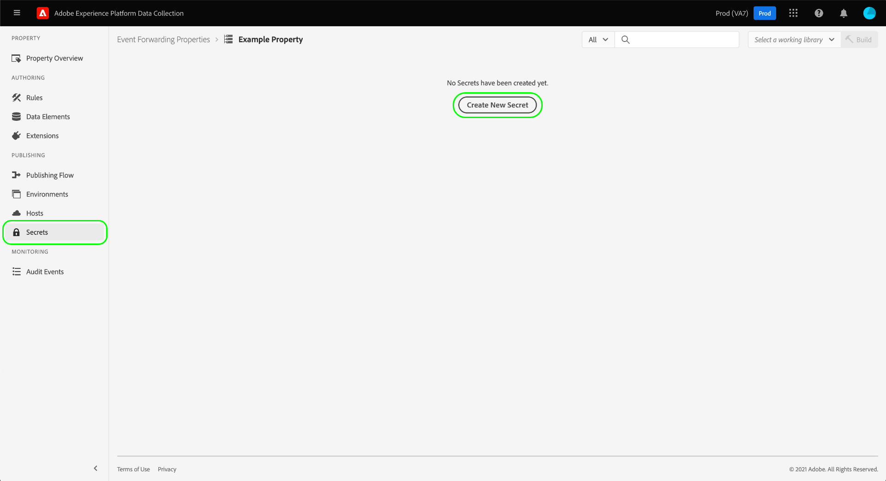

# 在事件转发中配置密钥

在事件转发中，密码是表示另一个系统的身份验证凭据的资源，允许安全交换数据。 只能在事件转发属性中创建密钥。

当前支持以下密钥类型：

| 密码类型 | 描述 |
| --- | --- |
| [!UICONTROL Google OAuth 2] | 包含多个属性以支持 [OAuth 2.0](https://datatracker.ietf.org/doc/html/rfc6749) 身份验证规范，用于 [Google Ads API](https://developers.google.com/google-ads/api/docs/oauth/overview) 和 [发布/订阅API](https://cloud.google.com/pubsub/docs/reference/service_apis_overview). 系统会要求您提供所需信息，然后在指定的时间间隔内为您处理这些令牌的续订。 |
| [!UICONTROL HTTP] | 包含用户名和密码的两个字符串属性。 |
| [!UICONTROL OAuth 2] | 包含多个属性以支持 [客户端凭据授权类型](https://datatracker.ietf.org/doc/html/rfc6749#section-1.3.4) 对于 [OAuth 2.0](https://datatracker.ietf.org/doc/html/rfc6749) 身份验证规范。 系统会要求您提供所需信息，然后在指定的时间间隔内为您处理这些令牌的续订。 |
| [!UICONTROL OAuth 2 JWT] | 包含多个属性以支持的JSON Web令牌(JWT)配置文件 [OAuth 2.0授权](https://datatracker.ietf.org/doc/html/rfc7523#section-2.1) 格兰茨。 系统会要求您提供所需信息，然后在指定的时间间隔内为您处理这些令牌的续订。 |
| [!UICONTROL 令牌] | 表示两个系统都已知和理解的身份验证令牌值的单个字符串。 |

{style="table-layout:auto"}

本指南提供了有关如何为事件转发配置密码的高级概述([!UICONTROL Edge]Experience Platform )属性。

>[!NOTE]
>
>有关如何在Reactor API中管理机密的详细指导，包括机密结构的JSON示例，请参阅 [secrets API指南](../../api/guides/secrets.md).

## 先决条件

本指南假定您已经熟悉如何在UI中管理标记和事件转发的资源，包括如何创建数据元素和事件转发规则。 请参阅指南，网址为 [管理资源](../managing-resources/overview.md) 如果您需要了解简介。

您还应该实际了解标记和事件转发的发布流程，包括如何向库添加资源并在您的网站上安装内部版本以进行测试。 请参阅 [发布概述](../publishing/overview.md) 以了解更多详细信息。

## 创建密码 {#create}

>[!CONTEXTUALHELP]
>id="platform_eventforwarding_secrets_environments"
>title="密钥的环境"
>abstract="要使某个密钥可由事件转发使用，必须将此密钥分配给现有环境。如果您未为事件转发属性创建任何环境，则必须先配置它们，然后再继续。"
>additional-url="https://experienceleague.adobe.com/docs/experience-platform/tags/publish/environments/environments.html?lang=zh-Hans" text="环境概述"

要创建密码，请选择 **[!UICONTROL 事件转发]** 在左侧导航中，打开要向其添加密码的事件转发属性。 接下来，选择 **[!UICONTROL 密钥]** 在左侧导航中，随后是 **[!UICONTROL 创建新密码]**.

下一个屏幕允许您配置密码的详细信息。 要使某个密钥可由事件转发使用，必须将此密钥分配给现有环境。如果您没有为事件转发资产创建任何环境，请参阅上的指南 [环境](../publishing/environments.md) 以获取有关如何在继续操作之前配置这些受众的指导。

>[!NOTE]
>
>如果您仍要在将密码添加到环境之前创建和保存该密码，请禁用 **[!UICONTROL 将密码附加到环境]** 在填写其余信息之前进行切换。 请注意，如果要使用密钥，则以后必须将其分配给环境。
>
>

下 **[!UICONTROL 目标环境]**，使用下拉菜单选择要为其分配密钥的环境。 下 **[!UICONTROL 机密名称]**，在环境的上下文中提供密码的名称。 在事件转发属性下的所有密钥中，此名称必须是唯一的。

一个密钥一次只能分配给一个环境，但您可以根据需要跨不同环境为多个密钥分配相同的凭据。 选择 **[!UICONTROL 添加环境]** 以向列表中添加另一行。

对于您添加的每个环境，必须为关联的密钥提供另一个唯一名称。 如果您耗尽了所有可用环境， **[!UICONTROL 添加环境]** 按钮将不可用。

在此，创建密码的步骤因您创建的密码类型而异。 有关详细信息，请参阅下面的子部分：

* [[!UICONTROL 令牌]](#token)
* [[!UICONTROL HTTP]](#http)
* [[!UICONTROL OAuth 2]](#oauth2)
* [[!UICONTROL OAuth 2 JWT]](#oauth2jwt)
* [[!UICONTROL Google OAuth 2]](#google-oauth2)

### [!UICONTROL 令牌] {#token}

要创建令牌密码，请选择 **[!UICONTROL 令牌]** 从 **[!UICONTROL 类型]** 下拉菜单。 在 **[!UICONTROL 令牌]** 显示的字段，提供您验证的系统可识别的凭据字符串。 选择 **[!UICONTROL 创建密钥]** 以保存密码。

### [!UICONTROL HTTP] {#http}

要创建HTTP密钥，请选择 **[!UICONTROL 简单HTTP]** 从 **[!UICONTROL 类型]** 下拉菜单。 在下面显示的字段中，为凭据提供用户名和密码，然后再选择 **[!UICONTROL 创建密钥]** 以保存密码。

>[!NOTE]
>
>保存后，凭证将使用 [“基本”HTTP身份验证方案](https://www.rfc-editor.org/rfc/rfc7617.html).

### [!UICONTROL OAuth 2] {#oauth2}

要创建OAuth 2密码，请选择 **[!UICONTROL OAuth 2]** 从 **[!UICONTROL 类型]** 下拉菜单。 在下面显示的字段中，提供您的 [[!UICONTROL 客户端ID] 和 [!UICONTROL 客户端密码]](https://www.oauth.com/oauth2-servers/client-registration/client-id-secret/)，以及您的 [[!UICONTROL 令牌URL]](https://www.oauth.com/oauth2-servers/access-tokens/client-credentials/) 用于您的OAuth集成。 此 [!UICONTROL 令牌URL] UI中的字段是授权服务器主机和令牌路径之间的连接。

下 **[!UICONTROL 凭据选项]**，您可以提供其他凭据选项，例如 `scope` 和 `audience` 键值对的形式。 要添加更多键值对，请选择 **[!UICONTROL 添加其他]**.

最后，您可以配置 **[!UICONTROL 刷新偏移]** 密码的值。 这表示系统执行自动刷新的令牌到期前的秒数。 等效时间（小时和分钟）显示在字段的右侧，并会在您键入时自动更新。

例如，如果将刷新偏移设置为缺省值 `14400` （4小时）并且访问令牌具有 `expires_in` 值 `86400` （24小时），系统将在20小时内自动刷新密码。

>[!IMPORTANT]
>
>OAuth密钥在刷新之间至少需要四小时，并且必须至少八小时有效。 此限制为您提供了至少四个小时时间，以在生成的令牌出现问题时进行干预。
>
>例如，如果偏移设置为 `28800` （8小时）并且访问令牌具有 `expires_in` 之 `36000` （十个小时），交换将失败，因为由此产生的差异不到四个小时。

完成后，选择 **[!UICONTROL 创建密钥]** 以保存密码。

### [!UICONTROL OAuth 2 JWT] {#oauth2jwt}

要创建OAuth 2 JWT密码，请选择 **[!UICONTROL OAuth 2 JWT]** 从 **[!UICONTROL 类型]** 下拉菜单。

![此 [!UICONTROL 创建密钥] 选项卡，其中的OAuth 2 JWT密钥突出显示 [!UICONTROL 类型] 下拉菜单。](../../images/ui/event-forwarding/secrets/oauth-jwt-secret.png)

>[!NOTE]
>
>唯一 [!UICONTROL 算法] 当前支持签署JWT的为RS256。

在下面显示的字段中，提供您的 [!UICONTROL 发行者]， [!UICONTROL 主题]， [!UICONTROL 受众]， [!UICONTROL 自定义声明]， [!UICONTROL TTL]，然后选择 [!UICONTROL 算法] 从下拉菜单中查找。 接下来，输入 [!UICONTROL 私钥ID]，以及您的 [[!UICONTROL 令牌URL]](https://www.oauth.com/oauth2-servers/access-tokens/client-credentials/) 用于您的OAuth集成。 此 [!UICONTROL 令牌URL] 字段不是必填字段。 如果提供了值，则使用访问令牌交换JWT。 机密将根据 `expires_in` 响应和 [!UICONTROL 刷新偏移] 值。 如果未提供值，则推送到边缘的密钥为JWT。 JWT将根据 [!UICONTROL TTL] 和 [!UICONTROL 刷新偏移] 值。

![此 [!UICONTROL 创建密钥] 选项卡，其中选中的输入字段会突出显示。](../../images/ui/event-forwarding/secrets/oauth-jwt-information.png)

下 **[!UICONTROL 凭据选项]**，您可以提供其他凭据选项，例如 `jwt_param` 键值对的形式。 要添加更多键值对，请选择 **[!UICONTROL 添加其他]**.

![此 [!UICONTROL 创建密钥] 选项卡高亮显示 [!UICONTROL 凭据选项] 字段。](../../images/ui/event-forwarding/secrets/oauth-jwt-credential-options.png)

最后，您可以配置 **[!UICONTROL 刷新偏移]** 密码的值。 这表示系统执行自动刷新的令牌到期前的秒数。 等效时间（小时和分钟）显示在字段的右侧，并会在您键入时自动更新。

![此 [!UICONTROL 创建密钥] 选项卡高亮显示 [!UICONTROL 刷新偏移] 字段。](../../images/ui/event-forwarding/secrets/oauth-jwt-refresh-offset.png)

例如，如果将刷新偏移设置为缺省值 `1800` （30分钟）并且访问令牌具有 `expires_in` 值 `3600` （1小时），系统将在1小时内自动刷新密码。

>[!IMPORTANT]
>
>OAuth 2 JWT密钥在刷新之间至少需要30分钟，并且必须至少在一小时内有效。 此限制为您提供至少30分钟的时间，以便在生成的令牌出现问题时进行干预。
>
>例如，如果偏移设置为 `1800` （30分钟）并且访问令牌具有 `expires_in` 之 `2700` （45分钟）时，交换将失败，因为由此产生的差异不超过30分钟。

完成后，选择 **[!UICONTROL 创建密钥]** 以保存密码。

![此 [!UICONTROL 创建密钥] 选项卡突出显示 [!UICONTROL 创建密钥]](../../images/ui/event-forwarding/secrets/oauth-jwt-create-secret.png)

### [!UICONTROL Google OAuth 2] {#google-oauth2}

要创建Google OAuth 2密码，请选择 **[!UICONTROL Google OAuth 2]** 从 **[!UICONTROL 类型]** 下拉菜单。 下 **[!UICONTROL 范围]**&#x200B;中，选择要使用此密钥授予访问权限的Google API。 当前支持以下产品：

* [Google Ads API](https://developers.google.com/google-ads/api/docs/oauth/overview)
* [发布/订阅API](https://cloud.google.com/pubsub/docs/reference/service_apis_overview)

完成后，选择 **[!UICONTROL 创建密钥]**.

此时会出现一个弹出窗口，通知您需要通过Google手动授权密钥。 选择 **[!UICONTROL 创建并授权]** 以继续。

此时将显示一个对话框，允许您输入Google帐户的凭据。 按照提示操作，授予所选范围内数据的事件转发访问权限。 授权过程完成后，将创建密钥。

>[!IMPORTANT]
>
>如果您的组织为Google Cloud应用程序设置了重新身份验证策略，则创建的密钥在身份验证过期后不会成功刷新（根据策略配置，在1到24小时之间）。
>
>要解决此问题，请登录到Google Admin Console，然后导航至 **[!DNL App access control]** 页面，以便将事件转发应用程序(Adobe Real-Time CDP事件转发)标记为 [!DNL Trusted]. 请参阅Google文档，了解有关 [为Google云服务设置会话长度](https://support.google.com/a/answer/9368756) 以了解更多信息。

## 编辑密码

为资产创建密码后，您可在以下位置找到它们： **[!UICONTROL 密钥]** 工作区。 要编辑现有密钥的详细信息，请从列表中选择其名称。

下一个屏幕允许您更改密码的名称和凭据。

>[!NOTE]
>
>如果密钥与现有环境相关联，则无法将该密钥重新分配给其他环境。 如果您希望在不同的环境中使用相同的凭据，则必须 [创建新密码](#create) 而是。 从此屏幕重新分配环境的唯一方法是，如果事先未将密码分配给环境，或者删除了密码附加到的环境。

### 重试密钥交换

您可以从编辑屏幕重试或刷新密钥交换。 此过程因所编辑的密钥类型而异：

| 密码类型 | 重试协议 |
| --- | --- |
| [!UICONTROL 令牌] | 选择 **[!UICONTROL 交换密码]** 以重试密钥交换。 此控件仅在有环境附加到密钥时可用。 |
| [!UICONTROL HTTP] | 如果未将环境附加到密钥，请选择 **[!UICONTROL 交换密码]** 将凭据交换给base64。 如果附加了环境，请选择“选择” **[!UICONTROL Exchange和部署密钥]** 交换到base64并部署密钥。 |
| [!UICONTROL OAuth 2] | 选择 **[!UICONTROL 生成令牌]** 以交换凭据并从身份验证提供程序返回访问令牌。 |

## 删除密码

要删除中的现有密钥，请执行以下操作  **[!UICONTROL 密钥]** ，请先选中其名称旁边的复选框，然后再选择 **[!UICONTROL 删除]**.

## 在事件转发中使用密钥

为了在事件转发中使用密钥，您必须首先创建 [数据元素](../managing-resources/data-elements.md) 那个秘密本身。 保存数据元素后，您可以将其包含在事件转发中 [规则](../managing-resources/rules.md) 并将这些规则添加到 [库](../publishing/libraries.md)，这随之可以部署到Adobe的服务器，作为 [生成](../publishing/builds.md).

创建数据元素时，选择 **[!UICONTROL 核心]** 扩展，然后选择 **[!UICONTROL 密码]** （对于数据元素类型）。 右侧面板将更新并提供下拉控件，以便最多为数据元素分配三个密钥：一个用于 [!UICONTROL 开发]， [!UICONTROL 暂存]、和 [!UICONTROL 生产] 的量度。

>[!NOTE]
>
>只有附加到开发、暂存和生产环境的密钥才会显示在其各自的下拉列表中。

通过将多个密钥分配给单个数据元素并将其包含到规则中，您可以让数据元素的值根据包含库的库在 [发布流](../publishing/publishing-flow.md).

>[!NOTE]
>
>创建数据元素时，必须分配开发环境。 暂存环境和生产环境的密钥不是必需的，但如果其密钥类型数据元素没有为相关环境选择密钥，则尝试迁移到这些环境的构建将失败。

## 后续步骤

本指南介绍如何在UI中管理密钥。 有关如何使用Reactor API与机密进行交互的信息，请参阅 [密钥端点指南](../../api/endpoints/secrets.md).
