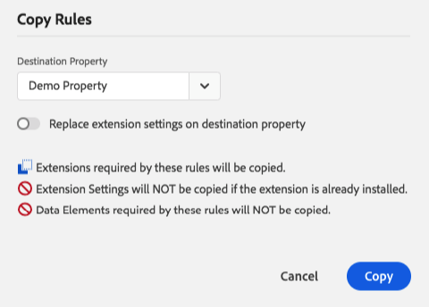

# 複製資源

>[!NOTE]
>
>Adobe Experience Platform Launch已經過品牌重塑，現在是Adobe Experience Platform中的一套資料收集技術。 因此，产品文档中的术语有一些改动。有关术语更改的综合参考，请参阅以下[文档](../../term-updates.md)。

有时，使用现有资源的设置制作新资源会很方便。在这些情况下，您可以制作副本。

属性、扩展、规则和数据元素都可以复制。

复制资源会在指定目标中创建该资源的副本。此操作为一次性操作，需谨慎执行，且原始资源与已创建的任何副本之间不存在任何持续关系。

## 启动复制操作

您可以檢視已安裝的擴充功能，並選取 **[!UICONTROL 設定]** 按鈕並選取 **[!UICONTROL 複製]**.

若是屬性、規則和資料元素，只要選取您要複製的資源，然後選取「 」即可 **[!UICONTROL 複製]** （在動作功能表中）。

如果要复制规则或数据元素，您可以在复制对话框中，使用下拉菜单选择要复制到的目标属性（默认设置是当前属性）。由于不能将扩展复制到同一属性，因此扩展将不提供该选项。

>[!NOTE]
>
>如果一個屬性設定為擴充開發，而另一個屬性並未設定，則無法將資源複製到另一個屬性。

設定您要的行為之後，請選取 **[!UICONTROL 複製]**.

## 复制资产

制作完整资产的副本时，关于此过程，您应了解以下几点。

* 将按原样复制资产设置（域、高级设置等）
* 将规则、数据元素和扩展会从原始资产复制到新的目标资产中。不会复制适配器、环境和库。
* 所需的扩展（任何现有数据元素或规则组件所需的扩展）即使已从原始资产中卸载，也会复制到目标资产中。
* 复制资产可能需要一些时间。此过程将在后台完成。您可以监视复制进度，也可以在复制过程中继续执行其他任务。
* 如果在单个资源已复制到目标资产后（但在复制完成之前）对其进行了修改，则新修改将不会被复制。

## 复制扩展

将扩展复制到另一个资产时，您需要了解以下事项。

* 如果目标资产未安装扩展，则将使用与原始资产相同的设置进行安装。
* 如果目标资产已安装扩展，则会仅复制设置。
* 如果目标资产安装了较低版本的扩展，您将收到一条通知，指出您需要升级目标资产上的扩展才能执行复制操作。扩展开发人员会随着时间的推移向其扩展添加设置，因此较新扩展的设置无法可靠地应用于旧版本。
* 如果目标资产安装了较高版本的扩展，则会复制设置，但不会执行降级操作。目标资产仍将保留其当前版本号。

## 复制规则和数据元素

所有規則和資料元素都由擴充功能提供，因此當您跨屬性複製時，Platform必須考慮這些基礎擴充功能。

「複製」對話方塊會提供開始複製前將發生的確切情況的說明。 上面显示的是规则的复制对话框，但同样也适用于数据元素。

1. **Extensions required by these rules are copied。**&#x200B;这告知您所需的扩展将随规则一起复制。这些复制操作遵循的规则与上面概述的常规扩展复制操作相同。
1. **Extension settings will NOT be copied if the extension is already installed。**&#x200B;这表示如果目标资产上已存在所需的扩展，则扩展将保持不变。如果您还希望复制扩展设置，则可以使用 **Replace extension settings on destination property** 切换开关，此时显示的说明将会相应地更新。
1. **Data Elements required by these Rules will NOT be copied。**&#x200B;此说明仅适用于规则。规则通常依赖于数据元素才能正常运行。如果将规则复制到新资产，则还需要单独复制所有必需的数据元素。
