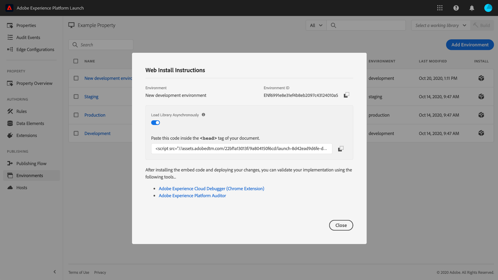

# 环境

标记环境定义了您在网站或应用程序上部署的库内部版本的几个关键方面：

* 内部版本的文件名。
* 内部版本的域和路径，具体取决于为环境分配的主机。
* 内部版本的文件格式，具体取决于选择的存档选项。

在创建库内部版本时，必须将其分配给环境。 然后，将会编译该内部版本的扩展、规则和数据元素，并将这些内容放入分配的环境。每个环境都提供了一个唯一的嵌入代码，从而允许您将其分配的内部版本集成到网站中。

每个环境中可以存在不同的工件。 这允许您在工作流程中推送库时，在不同的环境中测试不同的库。

本文档提供了有关如何在“数据收集”用户界面中安装、配置和创建不同环境的步骤。

## 环境类型

标记支持三种不同的环境类型，每种类型与[发布工作流](./publishing-flow.md)中的不同状态相对应：

| 环境类型 | 描述 |
| --- | --- |
| 开发 | 此环境与发布工作流程中的&#x200B;**开发**&#x200B;列相对应。 |
| 暂存 | 此环境与发布工作流程中的&#x200B;**已提交**&#x200B;和&#x200B;**已批准**&#x200B;列相对应。 |
| 生产 | 此环境与发布工作流程中的&#x200B;**已发布**&#x200B;列相对应。 |

每个环境中可以存在不同的工件。 这允许您在通过发布工作流程推送库时，在不同的环境中测试不同的库。

>[!NOTE]
>
>每个环境一次只能分配一个库内部版本。但是，预计随着时间的推移，单个环境将包含许多不同的内部版本，因为您将通过发布工作流程移动这些内部版本，并根据需要在各个环境之间重新分配内部版本。

## 安装 {#installation}

每个环境都有一组用于将其连接到应用程序的说明。对于 Web 资产，这些说明会提供嵌入代码。对于移动资产，这些说明会提供实例化您所使用的库以及在运行时检索配置所需的代码。

>[!IMPORTANT]
>
>每个环境类型都有其自己相应的安装说明。根据您所使用的环境，必须确保使用正确的相应嵌入代码和/或依赖项。
>
>例如，Web 资产的生产嵌入代码支持浏览器缓存，而开发嵌入代码和暂存嵌入代码则不支持。因此，您不应在高流量或生产环境中使用开发或暂存嵌入代码。

要访问环境的安装说明，请导航到资产的 **[!UICONTROL Environments]** 选项卡，然后选择该环境的 **[!UICONTROL Install]** 图标。

如果使用 Web 资产，将为您提供一个在文档的 `<head>` 标记中使用的嵌入代码。您还可以选择在运行时同步或异步部署库文件。根据您选择的设置，显示的安装说明将有所不同。本文档的后面部分将进一步详细说明嵌入代码。

如果您使用移动资产，将分别为您提供关于安装 Android（通过 [Gradle](https://gradle.org/)）和 iOS（通过 [CocoaPods](https://cocoapods.org/)）依赖项的说明。

## 移动配置

对于移动属性，您可以通过选择列表中的某个环境来查看其配置选项。从此处，您可以更改环境的名称。移动环境当前只能使用由 Adobe 管理的主机。

有关更多信息，请参阅有关[主机](./hosts/hosts-overview.md)的概述。

## Web 配置

所分配环境中的设置决定了Web属性的以下内容：

* **主机**：您希望部署内部版本的服务器位置。
* **存档设置**：系统应输出一组可部署的文件，还是应将其压缩为存档格式。
* **嵌入代码**：要嵌入到网站页面 HTML 中的 `<script>` 代码，用于在运行时部署库内部版本。

在 [!UICONTROL Environments] 选项卡中，选择一个列出的环境以显示其配置控件。

### Host {#host}

选择 **[!UICONTROL Host]**，以便从下拉菜单中为环境选择预配置的主机。

创建内部版本后，该内部版本将交付到您为分配的主机指定的位置。 有关如何创建和配置标记主机的信息，请参阅[主机概述](./hosts/hosts-overview.md)。

### 存档设置 {#archive}

大多数内部版本由多个文件组成。多文件内部版本包含一个主库文件（已链接到嵌入代码中），该文件包含根据需要纳入的对其他文件的内部引用。

通过 **[!UICONTROL Create archive]** 按钮可切换环境的存档设置。默认情况下，存档选项处于关闭状态，内部版本以按原样执行的格式交付（Web 资产采用 JavaScript 格式，移动资产则采用 JSON 格式）。

如果选择打开存档设置，则 UI 中会显示其他配置设置，这样一来，如果您使用的是自托管，则可以选择性地加密存档文件并定义库路径。

路径可以是完整的 URL，也可以是可跨多个域使用的相对路径。此路径很重要，因为大多数内部版本都有多个文件，这些文件包含对彼此的内部引用。

如果使用存档选项，则所有内部版本文件都将以 ZIP 文件形式交付。该选项在以下情况下很有用：

1. 您要自托管库，但不希望设置 SFTP 主机以进行交付。
1. 您需要在部署之前对内部版本运行代码分析。
1. 您只想查看内部版本内容以了解其中包含的内容。

### 嵌入代码 {#embed-code}

嵌入代码是一个`<script>`标记，必须将其放置在网站页面的`<head>`部分中，才能加载和执行您构建的代码。 每个环境配置都会自动生成自己的嵌入代码，因此您只需将该代码复制并粘贴到您希望运行标记的页面上。

查看安装说明时，您可以选择让脚本同步或异步加载库文件。此设置不是持久性的，且不会反映您在网站上实际实施标记的方式。 它而是仅用于显示安装环境的适当方式。

>[!WARNING]
>
>根据标记库的内容，规则和其他元素的行为在同步部署和异步部署之间可能会发生更改。 因此，务必彻底测试您所做的任何更改。

#### 异步部署

异步部署允许浏览器在检索库时继续加载页面的其余部分。使用此设置时只有一个嵌入代码，该嵌入代码必须放置在文档 `<head>` 中。

有关此设置的更多信息，请参阅[异步部署](../client-side/asynchronous-deployment.md)指南。

#### 同步部署

当浏览器使用同步部署读取嵌入代码时，它会先检索并执行标记库，然后再继续加载页面。

同步嵌入代码由两个 `<script>` 标记组成，这些标记必须放置在网站的 HTML 中。必须将其中一个 `<script>` 标记放置在文档 `<head>` 中，同时将另一个标记放置在紧靠结束标记 `</body>` 之前。

#### 嵌入代码更新

由于嵌入代码是根据您的环境配置生成的，因此，某些配置更改将自动更新相关环境的嵌入代码。这些更改包括：

* 从 Adobe 管理的主机切换到 SFTP 主机，或从 SFTP 主机切换到 Adobe 管理的主机。
* 更改存档设置。
* 在启用了存档设置时，更新路径字段。

>[!WARNING]
>
>当标签环境的嵌入代码发生更改时，您必须手动更新HTML中的嵌入代码。 为避免高昂的维护成本，您应该只在绝对必要时才更新嵌入代码。

## 创建环境

首次创建资产时会为该资产自动分配三个环境：开发、暂存和生产。这些环境足以运行发布工作流程。但是，您可以根据需要添加其他开发环境，因为这对于同时有多个开发人员处理不同项目的较大团队而言非常有用。

在资产的 [!UICONTROL Environments] 选项卡上，选择 **[!UICONTROL Add Environment]**。

在下一个屏幕上，选择 **[!UICONTROL Development]** 选项。

在下一个屏幕上，您可以命名新环境，选择主机，并选择存档设置。完成后，选择 **[!UICONTROL Save]** 以创建环境。

此时会重新出现 [!UICONTROL Environments] 选项卡，并显示新环境的安装说明。

## 后续步骤

通过阅读本文档，您应当对于在 UI 中配置环境并将其安装到网站或应用程序中有了一定的了解。现在，您可以开始发布库内部版本。

随着时间推移发布库的迭代版本时，您可能会发现有必要跟踪和存档以前的版本，以便进行故障诊断和回滚。有关更多信息，请参阅[重新发布旧版库](./republish.md)指南。
