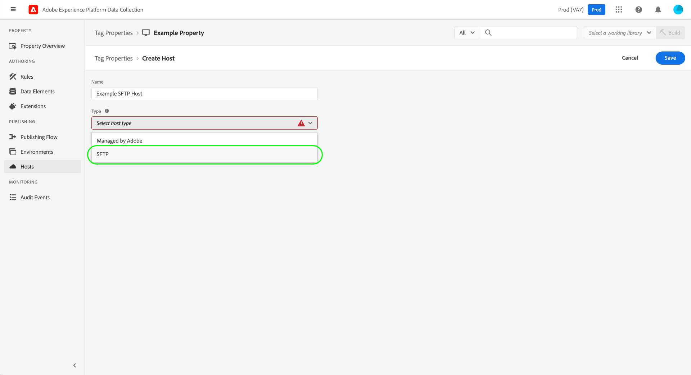

# SFTP主机

Experience Platform允许您将标记库内部版本传输到您托管的安全SFTP服务器，让您能够更好地控制如何存储和管理内部版本。 本指南介绍如何在Experience Platform UI或数据收集UI中为标记属性设置SFTP主机。

>[!NOTE]
>
>您还可以选择改用Adobe管理的主机。 有关详细信息，请参阅[Adobe-managed主机](./managed-by-adobe-host.md)上的指南。
>
>有关自托管库的好处和限制的信息，请参阅[自托管指南](./self-hosting-libraries.md)。

## 为您的服务器设置访问密钥 {#access-key}

Experience Platform使用加密密钥连接到SFTP站点。 可以通过以下几步来正确设置此操作：

### 创建公钥/私钥对

您必须在SFTP服务器上安装公钥/私钥对。 您可以在服务器上生成这些密钥，也可以在其他位置生成这些密钥并将其安装在服务器上。 有关详细信息，请参阅有关[如何生成SSH密钥](https://help.github.com/cn/github/authenticating-to-github/generating-a-new-ssh-key-and-adding-it-to-the-ssh-agent#generating-a-new-ssh-key)的GitHub文档。

### 加密密钥

私钥用于加密公钥。 在SFTP主机创建过程中，您需要提供私钥。 有关加密公钥的说明，请参阅Reactor API指南中有关[加密值](../../../api/guides/encrypting-values.md)的部分。 除非您知道自己需要特定密钥，否则请使用生产环境的GPG密钥。 最后，您可以从任何计算机加密私钥，因此无需在服务器上安装GPG即可完成此步骤。

### 允许列表Experience Platform IP地址

您可能需要批准一组要在公司防火墙中使用的IP地址，以便Experience Platform能够访问您的SFTP服务器并与之建立连接。 这些IP地址包括：

* `34.227.138.75`
* `44.194.43.191`
* `3.215.163.18`

>[!NOTE]
>
>标记构建的结构会随着时间的推移而不断变化。 它们在内部使用符号链接来保持向后兼容性，以便之前嵌入的代码可以继续与最新的内部版本结构配合使用。 您的SFTP服务器必须支持使用符号链接，才能用作标记构建的有效目标。

有关更多详细信息，请参阅以下Medium文章： [如何设置SFTP服务器以交付内部版本](https://medium.com/launch-by-adobe/configuring-an-sftp-server-for-use-with-adobe-launch-bc626027e5a6)。

## 创建 SFTP 主机 {#create}

在左侧导航中选择&#x200B;**[!UICONTROL Hosts]**，然后选择&#x200B;**[!UICONTROL Add Host]**。

此时将显示主机创建对话框。 提供主机的名称，并在&#x200B;**[!UICONTROL Type]**&#x200B;下选择&#x200B;**[!UICONTROL SFTP]**。

### 配置SFTP主机 {#configure}

该对话框将展开以包含用于SFTP主机的其他配置选项。 下文对此进行解释。

| 配置字段 | 描述 |
| --- | --- |
| [!UICONTROL Don't Use Symlinks] | 默认情况下，所有SFTP主机都使用符号链接来引用保存到服务器的库[内部版本](../builds.md)。 但是，并非所有服务器都支持使用符号链接。 当选择此选项时，主机会使用复制操作直接更新构建资产，而不是使用符号链接。 |
| [!UICONTROL SFTP Server URL] | 服务器的URL基本路径。 |
| [!UICONTROL Path] | 附加到此主机的基本服务器URL的路径。 |
| [!UICONTROL Port] | 端口必须是以下端口之一：<ul><li>`21`</li><li>`22`</li><li>`201`</li><li>`200`</li><li>`2002`</li><li>`2018`</li><li>`2022`</li><li>`2200`</li><li>`2222`</li><li>`2333`</li><li>`2939`</li><li>`443`</li><li>`4343`</li><li>`80`</li><li>`8080`</li><li>`8888`</li></ul>作为最佳安全做法，Adobe 会限制用于传出流量的端口数量。通常允许所选端口通过公司防火墙，这些端口包括一些灵活性范围。 |
| [!UICONTROL Username] | 访问服务器时要使用的用户名。 |
| [!UICONTROL Encrypted Private Key] | 您在[上一步](#access-key)中创建的加密私钥。 |

选择&#x200B;**[!UICONTROL Save]**&#x200B;以创建具有所选配置的主机。

选择&#x200B;**[!UICONTROL Save]**&#x200B;后，将测试向SFTP服务器传送文件的连接和能力。 Experience Platform会创建一个文件夹，并在该文件夹中写入文件，然后检查以确保该文件存在，最后自行清理。 如果SFTP服务器上的用户帐户(连接到您提供给Experience Platform的安全证书的用户帐户)没有执行此操作所需的权限，则主机将进入“失败”状态。

## 后续步骤

本指南介绍了如何设置用于在标记中使用的自托管SFTP服务器。 建立主机后，您可以将其与用于发布标记库的一个或多个[环境](../environments.md)相关联。 有关在Web或移动资产上激活标记功能的高级过程的详细信息，请参阅[发布概述](../overview.md)。
