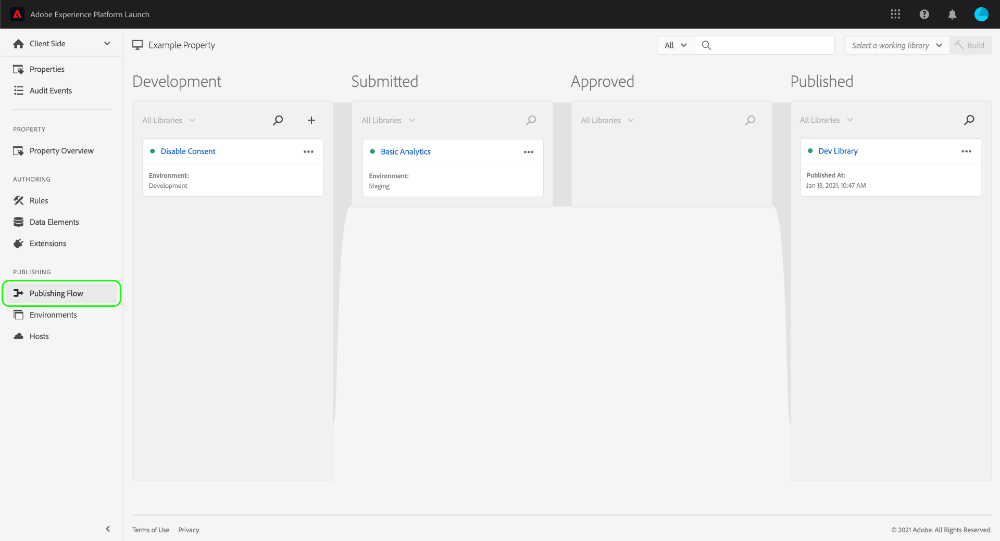
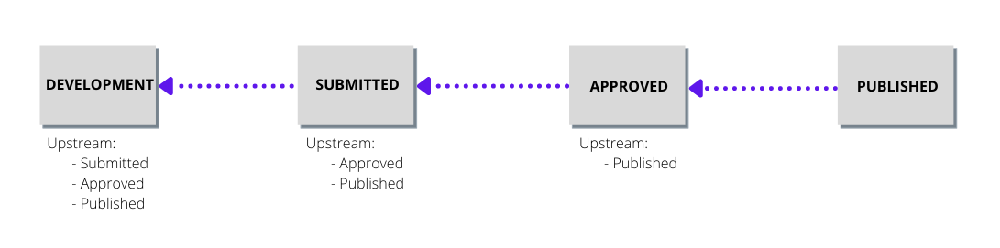

# 发布流

>[!NOTE]
>
>Adobe Experience Platform Launch已經過品牌重塑，現在是Adobe Experience Platform中的一套資料收集技術。 因此，产品文档中的术语有一些改动。有关术语更改的综合参考，请参阅以下[文档](../../term-updates.md)。

Adobe Experience Platform中的標籤發佈流程是指建立程式庫、測試組建及核准以供生產的程式。

您可以对库执行的操作取决于库的状态以及您具有的权限级别。此外，根据发布流中上游的内容，库的状态还影响到其中包含的资源（规则、数据元素以及扩展）。

以下部分介绍了与发布流相关的权限、库状态以及上游的详细信息。

## 权限 {#permissions}

發佈流程有不同的重要使用者許可權層級；具體而言， [!UICONTROL 開發]， [!UICONTROL 核准]、和 [!UICONTROL 發佈] 屬性權利：

* **[!UICONTROL 開發]**：包括建立程式庫、建置以供開發，以及提交以進行核准的能力。
* **[!UICONTROL 核准]**：包括建置中繼用並核准中繼組建的功能。
* **[!UICONTROL 發佈]**：包括發佈已核准程式庫的能力。

这些权限不相互包含。对于执行整个工作流程的个人，必须向该人员授予给定资产内的所有三个权限。

請參閱 [使用者許可權指南](../administration/user-permissions.md) 有關管理標籤許可權的詳細資訊。

## 库状态 {#state}

对于发布流，库可以处于四种基本状态：

* [[!UICONTROL 开发]](#development)
* [[!UICONTROL 已提交]](#submitted)
* [[!UICONTROL 已批准]](#approved)
* [[!UICONTROL 已发布]](#published)

這四種狀態在中以欄的形式呈現 **[!UICONTROL 發佈流程]** 標籤。

必须执行特定操作才能在这些状态之间移动库。下图概述了将库在不同状态之间移动的各种操作：

### [!UICONTROL 开发] {#development}

建立新程式庫時，它們會從 [!UICONTROL 開發] 州別。 程式庫的任何變更都必須在程式庫處於狀態時進行 [!UICONTROL 開發]. 开发和测试完成后，可以提交库进行审批。

下表概述中程式庫的可用動作 [!UICONTROL 開發] 狀態：

| 操作 | 描述 |
| --- | --- |
| [!UICONTROL 编辑] | 使用 [!UICONTROL 編輯程式庫] 熒幕來新增或移除程式庫的元件。 |
| [!UICONTROL 建置到開發] | 为库创建内部版本。编译内部版本并将内部版本部署到库所分配到的环境。如果库尚未分配到某个环境，或者包含已在上游中定义的更改，此步骤将失败。 |
| [!UICONTROL Submit for Approval] | 從開發環境中取消指派程式庫，然後將程式庫移至 [!UICONTROL 已提交] 欄，以供具有核准許可權的使用者處理。 程式庫的最新組建必須成功，才能啟用此選項。 |
| [!UICONTROL 提交並建置至測試環境] | 這只能由同時具有開發及核准許可權的使用者執行。 此動作會從開發環境中取消指派程式庫，並將程式庫移動到 [!UICONTROL 已提交] 並將程式庫建置到中繼環境。 程式庫的最新組建必須成功，才能啟用此選項。 |
| [!UICONTROL Approve for Publishing] | 這只能由同時具有開發及核准許可權的使用者執行。 此動作會從開發環境中取消指派程式庫，並將其移動到 [!UICONTROL 已核准] state — 略過中繼環境和 [!UICONTROL 已提交] 州別。 程式庫的最新組建必須成功，才能啟用此選項。 |
| [!UICONTROL 核准並發佈至生產環境] | 這只能由擁有開發、核准和發佈許可權的使用者執行。 此動作會從開發環境中取消指派程式庫，並將其移動到 [!UICONTROL 已核准] 州別名稱，並發佈至生產環境。 生產建置完成後，程式庫將移至 [!UICONTROL 已發佈] 州別。 程式庫的最新組建必須成功，才能啟用此選項。 |
| [!UICONTROL 删除] | 從系統中移除程式庫。 这不会从环境中删除内部版本。 |

### [!UICONTROL 已提交] {#submitted}

當程式庫位於 [!UICONTROL 已提交] 州別，擁有核准許可權的使用者可以在中繼環境中測試程式庫。 测试完成时，可以批准或拒绝库。已拒絕的組建會回到 [!UICONTROL 開發] 因此，在重新啟動發佈流程之前，可以進行其他變更。

下表概述中程式庫的可用動作 [!UICONTROL 已提交] 狀態：

| 操作 | 描述 |
| --- | --- |
| [!UICONTROL Open] | 查看库的内容。外部的程式庫不允許變更 [!UICONTROL 開發] 欄。 如果需要變更，則應拒絕程式庫，以便在下列位置進行變更： [!UICONTROL 開發]. |
| [!UICONTROL Build for Staging] | 在暂存环境中构建库以用于部署。 |
| [!UICONTROL Approve for Publishing] | 將程式庫移至 [!UICONTROL 已核准] 欄，以供具有發佈許可權的使用者處理。 |
| [!UICONTROL 核准並發佈至生產環境] | 這只能由同時擁有核准和發佈許可權的使用者執行。 此動作會從預備環境中取消指派程式庫，並將其移動到 [!UICONTROL 已核准] 州別名稱，並發佈至生產環境。 生產建置完成後，程式庫將移至 [!UICONTROL 已發佈] 州別。 不需要在中繼環境中成功建置，即可使用我們的來執行。 |
| [!UICONTROL Reject] | 從中繼環境解除程式庫的指派，並將程式移回 [!UICONTROL 開發] 欄，以取得進一步的變更。 |

### [!UICONTROL 已批准] {#approved}

当库经过批准之后，具有发布权限的用户可以发布或拒绝该库。已拒絕的組建會回到 [!UICONTROL 開發] 以便在發佈流程重新開始之前進行進一步的變更。

下表概述中程式庫的可用動作 [!UICONTROL 已核准] 狀態：

| 操作 | 描述 |
| --- | --- |
| [!UICONTROL Open] | 查看库的内容。外部的程式庫不允許變更 [!UICONTROL 開發] 欄。 如果需要變更，則應拒絕程式庫，以便在下列位置進行變更： [!UICONTROL 開發]. |
| [!UICONTROL Build and Publish to Production] | 从暂存环境中取消分配库，将库分配到生产环境，然后部署库。  **重要提示**：选择此选项时，您的库将在生产环境中处于活动状态。在选择此选项之前，请确保库包含了您需要进行的更改。 |
| [!UICONTROL Reject] | 從中繼環境解除程式庫的指派，並將程式移至 [!UICONTROL 開發] 欄，以取得進一步的變更。 |

### [!UICONTROL 已发布] {#published}

此 [!UICONTROL 已發佈] 欄會顯示已發佈的程式庫及其發佈日期。 目前發佈的程式庫旁邊會顯示一個綠色圓點。 除非您已在先前的程式庫上執行重新發佈，否則這永遠是欄頂端的程式庫。

| 操作 | 描述 |
| --- | --- |
| [!UICONTROL Open] | 查看库的内容。外部的程式庫不允許變更 [!UICONTROL 開發] 欄。 如果您希望更改生产环境中的库，则必须创建新库并让该库经过完整的发布流程。 |
| [!UICONTROL 重新發佈] | 此動作僅適用於最近發佈的五個程式庫，且僅當生產環境為(A)並關閉封存選項設定且(b)使用 [!UICONTROL 由Adobe管理] 建置時的主機。 |
| [!UICONTROL 下载] | 此動作僅適用於最近發佈的五個程式庫，且僅限於生產環境(A)已在上設定封存選項，且(b)使用 [!UICONTROL 由Adobe管理] 建置時的主機。 |

## 上游 {#upstream}

在您发布首个库之后，务必要了解上游的角色，因为您通过发布流来处理较新的库。

如果程式庫目前位於 [!UICONTROL 開發]， [!UICONTROL 已提交]，或 [!UICONTROL 已核准] 階段，該程式庫將會繼承上游任一程式庫的規則、資料元素和擴充功能。 这些继承的资源构成了各个库在发布流中移动时的“基线”。本质上，您可以将各个新库简单地视为对上游所建立的基线的一系列更改。这确保在发布新迭代时，不会意外地覆盖以前库中的任何内容。

包括在上游中的内容取决于库的当前阶段。例如，程式庫位於 [!UICONTROL 已核准] 欄只會繼承以下專案的資源： [!UICONTROL 已發佈] 程式庫，而下的程式庫 [!UICONTROL 開發] 從所有其他欄繼承資源。

在UI中編輯程式庫時，從上游繼承的所有資源都會在 **[!UICONTROL 上游資源]** 區段。 要查看这些资源，请选择展开部分标题下的选项卡。

该部分将会展开，显示从上游继承的各个资源。您可以使用左側邊欄來篩選 [!UICONTROL 規則]， [!UICONTROL 資料元素]、和 [!UICONTROL 擴充功能]，或使用搜尋列依名稱查詢特定資源。

## 后续步骤

本指南提供Adobe Experience Platform中程式庫發佈流程的整體概觀。 如需了解如何发布库的详细信息，请参阅[发布概述](./overview.md)。
