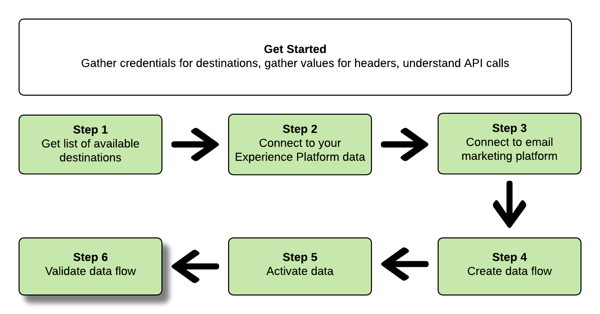

# 在Adobe实时客户数据平台中创建电子邮件营销目标并激活数据

本教程演示了如何使用API调用连接到您的Adobe Experience Platform数据、创建电子邮件营销目标 [](../../rtcdp/destinations/email-marketing-destinations.md)、创建到新创建目标的数据流以及将数据激活到新创建的目标。

本教程在所有示例中都使用Adobe Campaign目标，但所有电子邮件营销目标的步骤都相同。


如果您希望使用Adobe实时CDP中的用户界面连接目标并激活数据，请参阅 [Connect目标](../../rtcdp/destinations/connect-destination.md)[和激活用户档案和区段到目标教程](../../rtcdp/destinations/activate-destinations.md) 。

## 快速入门

本指南需要对Adobe Experience Platform的以下组件有充分的了解：

* [体验数据模型(XDM)系统](../../xdm/home.md):Experience Platform组织客户体验数据的标准化框架。
* [目录服务](../../catalog/home.md):Catalog是Experience Platform中用于数据位置和世系的记录系统。
* [沙箱](../../sandboxes/home.md):Experience Platform提供虚拟沙箱，将单个Platform实例分为单独的虚拟环境，以帮助开发和发展数字体验应用程序。

以下各节提供了在Adobe实时CDP中将数据激活到电子邮件营销目标时需要了解的其他信息。

### 收集所需的凭据

要完成本教程中的步骤，您应准备好以下凭据，具体取决于要连接和激活区段的目标类型。

* 对于Amazon S3与电子邮件营销平台的连接： `accessId`, `secretKey`
* 对于与电子邮件营销平台的SFTP连接： `domain`、 `port`、 `username`或( `password``ssh key` 取决于到FTP位置的连接方法)

### 读取示例API调用

本教程提供示例API调用，以演示如何设置请求的格式。 这些包括路径、必需的标题和格式正确的请求负载。 还提供API响应中返回的示例JSON。 有关示例API调用文档中使用的惯例的信息，请参阅Experience Platform疑难解答指南 [中有关如何阅读示例API调用的部分](../../landing/troubleshooting.md#how-do-i-format-an-api-request) 。

### 收集必需和可选标题的值

要调用平台API，您必须首先完成身份验证 [教程](../authentication.md)。 完成身份验证教程后，将为所有Experience Platform API调用中的每个所需标头提供值，如下所示：

* 授权：承载人 `{ACCESS_TOKEN}`
* x-api-key: `{API_KEY}`
* x-gw-ims-org-id: `{IMS_ORG}`

Experience Platform中的资源可以隔离到特定虚拟沙箱。 在对平台API的请求中，您可以指定操作将在其中进行的沙箱的名称和ID。 这些是可选参数。

* x-sandbox-name: `{SANDBOX_NAME}`

>[!Note]
>有关Experience Platform中沙箱的详细信息，请参阅沙 [箱概述文档](../../sandboxes/home.md)。

所有包含有效负荷(POST、PUT、PATCH)的请求都需要额外的媒体类型标题：

* 内容类型： `application/json`

<!--

### Definitions

Before starting this tutorial, familiarize yourself with the following terms which we'll use throughout the tutorial:

**Flow**: 

**Base Connection**: 

**Target Connection**: 

**Source Connection**: 

-->

### Swagger文档

您可以在Swagger的本教程中找到所有API调用的随附参考文档。 请参阅https://platform.adobe.io/data/foundation/flowservice/swagger#/。 我们建议您并行使用本教程和Swagger文档页面。

## 获取可用目标的列表 {#get-the-list-of-available-destinations}


首先，您应确定要将数据激活到的电子邮件营销目标。 首先，请发出呼叫，请求列表可连接和激活区段的可用目标。 对端点执行以下GET请 `connectionSpecs` 求以返回可用目标的列表:

**API格式**

```http
GET /connectionSpecs
```

**请求**

<!--

```shell
curl -X GET \
    'http://platform.adobe.io/data/foundation/flowservice/connectionSpecs' \
    -H 'Authorization: Bearer {ACCESS_TOKEN}' \
    -H 'x-api-key: {API_KEY}' \
    -H 'x-gw-ims-org-id: {IMS_ORG}' \
    -H 'x-sandbox-name: {SANDBOX_NAME}' \
    -H 'x-sandbox-id: {SANDBOX_ID}' \    
    -H 'Content-Type: application/json' \
```

-->

```
curl --location --request GET 'https://platform.adobe.io/data/foundation/flowservice/connectionSpecs' \
--header 'accept: application/json' \
--header 'x-gw-ims-org-id: {IMS_ORG}' \
--header 'x-api-key: {API_KEY}' \
--header 'x-sandbox-name: {SANDBOX_NAME}' \
--header 'Authorization: Bearer {ACCESS_TOKEN}'
```


**响应**

成功的响应包含可用目标及其唯一标识符的列表(`id`)。 存储您计划使用的目标的值，因为在后续步骤中需要该值。 例如，如果要将区段连接并传送到Adobe Campaign，请在响应中查找以下代码片断：

```json
{
    "id": "0b23e41a-cb4a-4321-a78f-3b654f5d7d97",
  "name": "Adobe Campaign",
  ...
  ...
}
```

## 连接到您的Experience Platform数据 {#connect-to-your-experience-platform-data}


接下来，您必须连接到Experience Platform数据，以便导出用户档案数据并在首选目标中激活它。 这包括两个子步骤，如下所述。

1. 首先，您必须通过设置基本连接来执行调用，以授权访问Experience Platform中的数据。
2. 然后，使用基本连接ID，您将再进行一次调用，在其中创建源连接，从而建立与Experience Platform数据的连接。


### 授权访问Experience Platform中的数据

**API格式**

```http
POST /connections
```

**请求**

<!--

```shell
curl -X POST \
    'http://platform.adobe.io/data/foundation/flowservice/connections' \
    -H 'Authorization: Bearer {ACCESS_TOKEN}' \
    -H 'x-api-key: {API_KEY}' \
    -H 'x-gw-ims-org-id: {IMS_ORG}' \
    -H 'x-sandbox-name: {SANDBOX_NAME}' \
    -H 'x-sandbox-id: {SANDBOX_ID}' \ 
    -H 'Content-Type: application/json' \
    -d  '{
            
            "name": "Base connection to Experience Platform",
            "description": "This call establishes the connection to Experience Platform data",
            "connectionSpec": {
                "id": "{CONNECTION_SPEC}",
                "version": "1.0"
            }
           }'
```

-->

```
curl --location --request POST 'https://platform.adobe.io/data/foundation/flowservice/connections' \
--header 'Authorization: Bearer {ACCESS_TOKEN}' \
--header 'x-api-key: {API_KEY}' \
--header 'x-gw-ims-org-id: {IMS_ORG}' \
--header 'x-sandbox-name: {SANDBOX_NAME} \
--header 'Content-Type: application/json' \
--data-raw '{
            "name": "Base connection to Experience Platform",
            "description": "This call establishes the connection to Experience Platform data",
            "connectionSpec": {
                "id": "{CONNECTION_SPEC_ID}",
                "version": "1.0"
            }
}'
```


* `{CONNECTION_SPEC_ID}`:使用连接规范ID进行统一用户档案服务- `8a9c3494-9708-43d7-ae3f-cda01e5030e1`。

**响应**

成功的响应包含基本连接的唯一标识符(`id`)。 按照下一步创建源连接时的要求存储此值。

```json
{
    "id": "1ed86558-59b5-42f7-9865-5859b552f7f4"
}
```

### 连接到您的Experience Platform数据

**API格式**

```http
POST /sourceConnections
```

**请求**

<!--

```shell
curl -X POST \
    'http://platform.adobe.io/data/foundation/flowservice/sourceConnections' \
    -H 'Authorization: Bearer {ACCESS_TOKEN}' \
    -H 'x-api-key: {API_KEY}' \
    -H 'x-gw-ims-org-id: {IMS_ORG}' \
    -H 'x-sandbox-id: {SANDBOX_ID}' \ 
    -H 'x-sandbox-name: {SANDBOX_NAME}' \
    -H 'Content-Type: application/json' \
    -d  '{
  "name": "Connecting to Unified Profile Service",
  "description": "Optional",
  "baseConnectionId": "{BASE_CONNECTION_ID}",
  "connectionSpec": {
    "id": "{CONNECTION_SPEC}",
    "version": "1.0"
  },
  "data": {
    "format": "CSV",
    "schema": null
  }
  }
```

-->

```
curl --location --request POST 'https://platform.adobe.io/data/foundation/flowservice/sourceConnections' \
--header 'Authorization: Bearer {ACCESS_TOKEN}' \
--header 'x-api-key: {API_KEY}' \
--header 'x-gw-ims-org-id: {IMS_ORG}' \
--header 'x-sandbox-name: {SANDBOX_NAME}' \
--header 'Content-Type: application/json' \
--data-raw '{
            "name": "Connecting to Unified Profile Service",
            "description": "Optional",
            "connectionSpec": {
                "id": "{CONNECTION_SPEC_ID}",
                "version": "1.0"
            },
            "baseConnectionId": "{BASE_CONNECTION_ID}",
            "data": {
                "format": "CSV",
                "schema": null
            },
            "params" : {}
}'
```

* `{BASE_CONNECTION_ID}`:使用您在上一步中获得的Id。
* `{CONNECTION_SPEC_ID}`:使用连接规范ID进行统一用户档案服务- `8a9c3494-9708-43d7-ae3f-cda01e5030e1`。

**响应**

成功的响应会返回新创建的源连接到统`id`一用户档案服务的唯一标识符()。 这将确认您是否已成功连接到Experience Platform数据。 按照后续步骤中的要求存储此值。

```json
{
    "id": "ed48ae9b-c774-4b6e-88ae-9bc7748b6e97"
}
```


## 连接到电子邮件营销目标 {#connect-to-email-marketing-destination}


在此步骤中，您将设置到所需电子邮件营销目标的连接。 这包括两个子步骤，如下所述。

1. 首先，您必须通过设置基本连接来执行授权访问电子邮件服务提供商的调用。
2. 然后，使用基本连接ID，您将再次进行调用，以在其中创建目标连接，该连接指定将传送导出数据的存储帐户中的位置以及将导出的数据的格式。

### 授权访问电子邮件营销目标

**API格式**

```http
POST /connections
```

**请求**

<!--

```shell
curl -X POST \
    'http://platform.adobe.io/data/foundation/flowservice/connections' \
    -H 'Authorization: Bearer {ACCESS_TOKEN}' \
    -H 'x-api-key: {API_KEY}' \
    -H 'x-gw-ims-org-id: {IMS_ORG}' \
    -H 'x-sandbox-name: {SANDBOX_NAME}' \
    -H 'x-sandbox-id: {SANDBOX_ID}' \ 
    -H 'Content-Type: application/json' \
    -d  '{
            
            "name": "S3 Connection for Adobe Campaign",
            "description": "ACME company holiday campaign",
            "connectionSpec": {
                "id": "{CONNECTION_SPEC}",
                "version": "1.0"
            },
            "auth": {
                "specName": "{S3 or SFTP}",
                "params": {
                    "accessId": "{ACCESS_ID}",
                    "secretKey": "{SECRET_KEY}"
                }
            }
           }'
```

-->

```
curl --location --request POST 'https://platform.adobe.io/data/foundation/flowservice/connections' \
--header 'Authorization: Bearer {ACCESS_TOKEN}' \
--header 'x-api-key: {API_KEY}' \
--header 'x-gw-ims-org-id: {IMS_ORG}' \
--header 'x-sandbox-name: {SANDBOX_NAME}' \
--header 'Content-Type: application/json' \
--data-raw '{
    "name": "S3 Connection for Adobe Campaign",
    "description": "your company's holiday campaign",
    "connectionSpec": {
        "id": "{_CONNECTION_SPEC_ID}",
        "version": "1.0"
    },
    "auth": {
        "specName": "{S3 or SFTP}",
        "params": {
            "accessId": "{ACCESS_ID}",
            "secretKey": "{SECRET_KEY}"
        }
    }
}'
```

* `{CONNECTION_SPEC_ID}`:使用在获取可用目标的列表步骤中 [获得的连接规范ID](#get-the-list-of-available-destinations)。
* `{S3 or SFTP}`:为此目标填写所需的连接类型。 在目 [标目录中](../../rtcdp/destinations/destinations-catalog.md)，滚动到首选目标，查看是否支持S3和／或SFTP连接类型。
* `{ACCESS_ID}`:您的Amazon S3存储位置的访问ID。
* `{SECRET_KEY}`:您的Amazon S3存储位置的密钥。

**响应**

成功的响应包含基本连接的唯一标识符(`id`)。 根据下一步创建目标连接时的需要存储此值。

```json
{
    "id": "1ed86558-59b5-42f7-9865-5859b552f7f4"
}
```

### 指定存储位置和数据格式

**API格式**

```http
POST /targetConnections
```

**请求**

<!--

```shell
curl -X POST \
    'http://platform.adobe.io/data/foundation/flowservice/targetConnections' \
    -H 'Authorization: Bearer {ACCESS_TOKEN}' \
    -H 'x-api-key: {API_KEY}' \
    -H 'x-gw-ims-org-id: {IMS_ORG}' \
    -H 'x-sandbox-name: {SANDBOX_NAME}' \    
    -H 'x-sandbox-id: {SANDBOX_ID}' \ 
    -H 'Content-Type: application/json' \
    -d  '{
   "baseConnectionId": "{BASE_CONNECTION_ID}",
   "name": "TargetConnection for Adobe Campaign",
   "data": {
       "format": "CSV",
       "schema": {
           "id": "1.0",
           "version": "1.0"
       },
    "connectionSpec": {
    "id": "{CONNECTION_SPEC_ID}",
    "version": "1.0"
   },
   "params": {
       "mode": "S3",
       "bucketName": "{BUCKETNAME}",
       "path": "{FILEPATH}"
    }
    }
```

-->

```
curl --location --request POST 'https://platform.adobe.io/data/foundation/flowservice/targetConnections' \
--header 'Authorization: Bearer {ACCESS_TOKEN}' \
--header 'x-api-key: {API_KEY}' \
--header 'x-gw-ims-org-id: {IMS_ORG}' \
--header 'Content-Type: application/json' \
--data-raw '{
    "name": "TargetConnection for Adobe Campaign",
    "description": "Connection to Adobe Campaign",
    "baseConnection": "{BASE_CONNECTION_ID}",
    "connectionSpec": {
        "id": "{CONNECTION_SPEC_ID}",
        "version": "1.0"
    },
    "data": {
        "format": "json",
        "schema": {
            "id": "1.0",
            "version": "1.0"
        }
    },
    "params": {
        "mode": "S3",
        "bucketName": "{BUCKETNAME}",
        "path": "{FILEPATH}",
        "format": "CSV"
    }
}'
```

* `{BASE_CONNECTION_ID}`:使用您在上述步骤中获得的基本连接ID。
* `{CONNECTION_SPEC_ID}`:使用在获取可用目标的列表步骤 [中获得的连接规范](#get-the-list-of-available-destinations)。
* `{BUCKETNAME}`:您的Amazon S3存储段，实时CDP将存储数据导出。
* `{FILEPATH}`:Amazon S3存储段目录中的路径，实时CDP将保存数据导出。

**响应**

成功的响应会返回新创建的目标到您的电子邮件营销目标的唯一标识符(`id`)。 按照后续步骤中的要求存储此值。

```json
{
    "id": "12ab90c7-519c-4291-bd20-d64186b62da8"
}
```

## 创建数据流


使用您在以前步骤中获得的ID，您现在可以在Experience Platform数据与要激活数据的目标之间创建数据流。 将此步骤想象为构建管道，通过该管道，数据稍后将在Experience Platform和您的目标之间流动。

要创建数据流，请执行POST请求（如下所示），同时在有效负荷中提供以下所述的值。

执行以下POST请求以创建数据流。

**API格式**

```http
POST /flows
```

**请求**

```shell
curl -X POST \
'https://platform.adobe.io/data/foundation/flowservice/flows' \
-H 'Authorization: Bearer {ACCESS_TOKEN}' \
-H 'x-api-key: {API_KEY}' \
-H 'x-gw-ims-org-id: {IMS_ORG}' \
-H 'x-sandbox-name: {SANDBOX_NAME}' \
-H 'Content-Type: application/json' \
-d  '{
   
        "name": "Activate segments to Adobe Campaign",
        "description": "This operation creates a dataflow which we will later use to activate segments to Adobe Campaign",
        "flowSpec": {
            "id": "{FLOW_SPEC_ID}",
            "version": "1.0"
        },
        "sourceConnectionIds": [
            "{SOURCE_CONNECTION_ID}"
        ],
        "targetConnectionIds": [
            "{TARGET_CONNECTION_ID}"
        ],
        "transformations": [
            {
                "name": "GeneralTransform",
                "params": {
                    "segmentSelectors": {
                        "selectors": []
                    },
                    "profileSelectors": {
                        "selectors": []
                    }
                }
            }
        ]
    }
```

* `{FLOW_SPEC_ID}`:使用要连接到的电子邮件营销目标的流程。 要获取流规范，请在端点上执行GET操 `flowspecs` 作。 请参阅此处的Swagger文档：https://platform.adobe.io/data/foundation/flowservice/swagger#/Flow%20Specs%20API/getFlowSpecs。 在响应中，查找并 `upsTo` 复制要连接到的电子邮件营销目标的相应ID。 例如，对于Adobe Campaign，请查找并 `upsToCampaign` 复制该 `id` 参数。
* `{SOURCE_CONNECTION_ID}`:使用在步骤 [Connect到您的Experience Platform中获得的源连](#connect-to-your-experience-platform-data)接ID。
* `{TARGET_CONNECTION_ID}`:使用您在步骤 [Connect中获取的目标连接ID](#connect-to-email-marketing-destination)到电子邮件营销目标。

**响应**

成功的响应会返回新创`id`建的数据流的ID()和 `etag`。 记下这两个值。 正如您在下一步中将其激活区段一样。

```json
{
    "id": "8256cfb4-17e6-432c-a469-6aedafb16cd5",
    "etag": "8256cfb4-17e6-432c-a469-6aedafb16cd5"
}
```


## 将数据激活到新目标


创建了所有连接和数据流后，您现在可以将用户档案数据激活到电子邮件营销平台。 在此步骤中，您可以选择要发送到目标的区段和用户档案属性，并可以计划数据和将数据发送到目标。

要将区段激活到新目标，您必须执行JSON修补程序操作，如下例所示。 您可以在一次调用中激活多个段和用户档案属性。 要进一步了解JSON修补程序，请参阅 [RFC规范](https://tools.ietf.org/html/rfc6902)。

**API格式**

```http
PATCH /flows
```

**请求**

```
curl --location --request PATCH 'https://platform.adobe.io/data/foundation/flowservice/flows/{DATAFLOW_ID}' \
--header 'Authorization: Bearer {ACCESS_TOKEN}' \
--header 'x-api-key: {API_KEY}' \
--header 'x-gw-ims-org-id: {IMS_ORG}' \
--header 'Content-Type: application/json' \
--header 'x-sandbox-name: {SANDBOX_NAME}' \
--header 'If-Match: "{ETAG}"' \
--data-raw '[
    {
        "op": "add",
        "path": "/transformations/0/params/segmentSelectors/selectors/-",
        "value": {
            "type": "PLATFORM_SEGMENT",
            "value": {
                "name": "Name of the segment that you are activating",
                "description": "Description of the segment that you are activating",
                "id": "{SEGMENT_ID}"
            }
        }
    },
        {
        "op": "add",
        "path": "/transformations/0/params/segmentSelectors/selectors/-",
        "value": {
            "type": "PLATFORM_SEGMENT",
            "value": {
                "name": "Name of the segment that you are activating",
                "description": "Description of the segment that you are activating",
                "id": "{SEGMENT_ID}"
            }
        }
    },
        {
        "op": "add",
        "path": "/transformations/0/params/profileSelectors/selectors/-",
        "value": {
            "type": "JSON_PATH",
            "value": {
                "operator": "EXISTS",
                "path": "{PROFILE_ATTRIBUTE}"
            }
        }
    }
]
```

* `{DATAFLOW_ID}`:使用您在上一步中获得的数据流。
* `{ETAG}`:使用您在上一步中获得的标签。
* `{SEGMENT_ID}`:提供要导出到此目标的区段ID。 要检索要激活的区段的区段ID，请转到https://www.adobe.io/apis/experienceplatform/home/api-reference.html#/并查找操 `GET /segment/jobs` 作。
* `{PROFILE_ATTRIBUTE}`:例如， `"person.lastName"`

**响应**

查找202 OK响应。 不返回响应主体。 要验证请求是否正确，请参阅下一步验证数据流。

## 验证数据流



作为教程的最后一步，您应验证区段和用户档案属性确实已正确映射到数据流。

要验证此信息，请执行以下GET请求：

**API格式**

```http
GET /flows
```

**请求**

```
curl --location --request PATCH 'https://platform.adobe.io/data/foundation/flowservice/flows/{DATAFLOW_ID}' \
--header 'Authorization: Bearer {ACCESS_TOKEN}' \
--header 'x-api-key: {API_KEY}' \
--header 'x-gw-ims-org-id: {IMS_ORG}' \
--header 'Content-Type: application/json' \
--header 'x-sandbox-name: prod' \
--header 'If-Match: "{ETAG}"' 
```

* `{DATAFLOW_ID}`:使用上一步中的数据流。
* `{ETAG}`:使用上一步中的标记。

**响应**

返回的响应应包括您在上 `transformations` 一步中提交的区段和用户档案属性。 响应中 `transformations` 的示例参数可能如下所示：

```
"transformations": [
    {
        "name": "GeneralTransform",
        "params": {
            "profileSelectors": {
                "selectors": []
            },
            "segmentSelectors": {
                "selectors": [
                    {
                        "type": "PLATFORM_SEGMENT",
                        "value": {
                            "name": "Men over 50",
                            "description": "",
                            "id": "72ddd79b-6b0a-4e97-a8d2-112ccd81bd02"
                        }
                    }
                ]
            }
        }
    }
],
```

## 后续步骤

通过本教程，您已成功地将实时CDP连接到您喜欢的电子邮件营销目标之一，并设置到相应目标的数据流。 传出数据现在可用于电子邮件活动、目标广告和许多其他使用案例的目标位置。 有关更多详细信息，请参阅以下页面：

* [目标概述](../../rtcdp/destinations/destinations-overview.md)
* [目标目录概述](../../rtcdp/destinations/destinations-catalog.md)