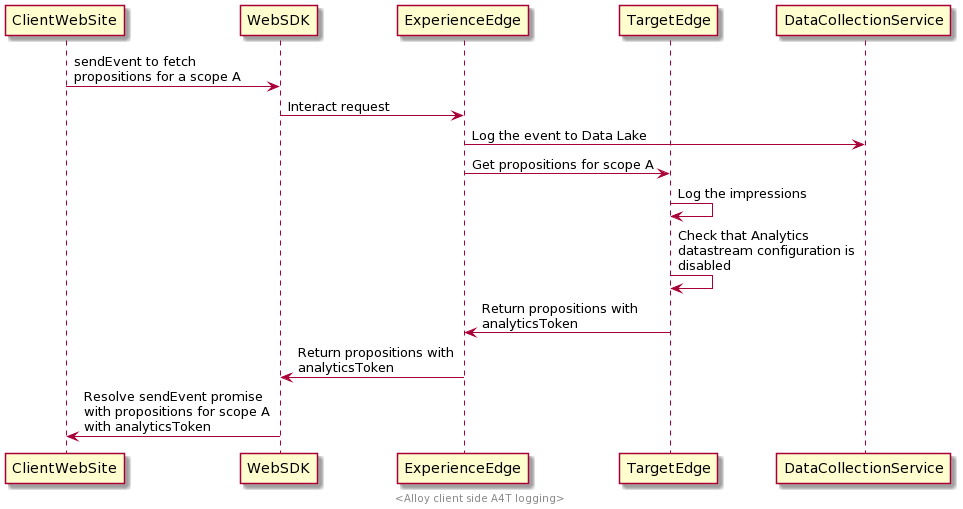

# Experience Platform Web SDK中的A4T数据的客户端日志记录

## 概述 {#overview}

Adobe Experience Platform Web SDK允许您在Web应用程序的客户端收集[Adobe Analytics for Target (A4T)](https://experienceleague.adobe.com/docs/target/using/integrate/a4t/a4t.html)数据。

客户端日志记录意味着相关[!DNL Target]数据将在客户端返回，允许您收集这些数据并与Analytics共享。 如果您打算使用[数据插入API](https://experienceleague.adobe.com/docs/analytics/import/c-data-insertion-api.html)手动将数据发送到Analytics，则应启用此选项。

>[!NOTE]
>
>使用[AppMeasurement.js](https://experienceleague.adobe.com/docs/analytics/implementation/js/overview.html)执行此操作的方法目前正在开发中，将在不久的将来提供。

本文档介绍了为Web SDK设置客户端A4T日志记录的步骤，并提供一些常见用例的实施示例。

## 先决条件 {#prerequisites}

本教程假设您熟悉与使用Web SDK进行个性化相关的基本概念和流程。 如果您需要了解简介，请查看以下文档：

* [配置Web SDK](/help/web-sdk/commands/configure/overview.md)
* [发送事件](/help/web-sdk/commands/sendevent/overview.md)
* [呈现个性化内容](../../rendering-personalization-content.md)

## 设置Analytics客户端日志记录 {#set-up-client-side-logging}

以下子部分概述了如何为Web SDK实施启用Analytics客户端日志记录。

### 启用Analytics客户端日志 {#enable-analytics-client-side-logging}

若要考虑为实施启用Analytics客户端日志记录，您必须在[数据流](../../../../datastreams/overview.md)中禁用Adobe Analytics配置。


### 从SDK检索[!DNL A4T]数据并将其发送到Analytics {#a4t-to-analytics}

为了使此报告方法正常工作，您必须发送从Analytics点击中的[`sendEvent`](/help/web-sdk/commands/sendevent/overview.md)命令检索到的[!DNL A4T]相关数据。

当Target Edge计算建议响应时，它会检查是否启用Analytics客户端日志记录（即，是否在数据流中禁用Analytics）。 如果启用了客户端日志记录，则系统会向响应中的每个建议添加一个Analytics令牌。

该流量与以下内容类似：



以下是启用Analytics客户端日志记录时的`interact`响应示例。 如果建议适用于具有Analytics报表的活动，则它将具有`scopeDetails.characteristics.analyticsToken`属性。

```json
{
  "requestId": "1234",
  "handle": [
    {
      "payload": [
        {
          "id": "AT:eyJhY3Rpdml0eUlkIjoiNDM0Njg5IiwiZXhwZXJpZW5jZUlkIjoiMCJ9",
          "scope": "a4t-test",
          "scopeDetails": {
            "decisionProvider": "TGT",
            "activity": {
              "id": "434689"
            },
            "experience": {
              "id": "0"
            },
            "strategies": [
              {
                "algorithmID": "0",
                "trafficType": "0"
              }
            ],
            "characteristics": {
              "eventToken": "2lTS5KA6gj4JuSjOdhqUhGqipfsIHvVzTQxHolz2IpTMromRrB5ztP5VMxjHbs7c6qPG9UF4rvQTJZniWgqbOw==",
              "analyticsToken": "434689:0:0|2,434689:0:0|1"
            }
          },
          "items": [
            {
              "id": "1184844",
              "schema": "https://ns.adobe.com/personalization/html-content-item",
              "meta": {
                "geo.state": "bucuresti",
                "activity.id": "434689",
                "experience.id": "0",
                "activity.name": "a4t test form based activity",
                "offer.id": "1184844",
                "profile.tntId": "04608610399599289452943468926942466370-pybgfJ"
              },
              "data": {
                "id": "1184844",
                "format": "text/html",
                "content": "<div> analytics impressions </div>"
              }
            }
          ]
        },
        {
          "id": "AT:eyJhY3Rpdml0eUlkIjoiNDM0Njg5IiwiZXhwZXJpZW5jZUlkIjoiMCJ9",
          "scope": "a4t-test",
          "scopeDetails": {
            "decisionProvider": "TGT",
            "activity": {
              "id": "434689"
            },
            "characteristics": {
              "eventToken": "E0gb6q1+WyFW3FMbbQJmrg==",
              "analyticsToken": "434689:0:0|32767"
            }
          },
          "items": [
            {
              "id": "434689",
              "schema": "https://ns.adobe.com/personalization/measurement",
              "data": {
                "type": "click",
                "format": "application/vnd.adobe.target.metric"
              }
            }
          ]
        }
      ],
      "type": "personalization:decisions",
      "eventIndex": 0
    }
  ]
}
```

基于表单的体验编辑器活动的建议可以同时包含同一建议下的内容和点击量度项目。 因此，它们可以相应地在`scopeDetails.characteristics.analyticsDisplayToken`和`scopeDetails.characteristics.analyticsClickToken`属性中同时指定显示和点击分析令牌，而不是在`scopeDetails.characteristics.analyticsToken`属性中只显示一个分析令牌。

```json
{
  "requestId": "1234",
  "handle": [
    {
      "payload": [
        {
          "id": "AT:eyJhY3Rpdml0eUlkIjoiNDM0Njg5IiwiZXhwZXJpZW5jZUlkIjoiMCJ9",
          "scope": "a4t-test",
          "scopeDetails": {
            "decisionProvider": "TGT",
            "activity": {
              "id": "434689"
            },
            "experience": {
              "id": "0"
            },
            "strategies": [
              {
                "algorithmID": "0",
                "trafficType": "0"
              }
            ],
            "characteristics": {
               "displayToken": "2lTS5KA6gj4JuSjOdhqUhGqipfsIHvVzTQxHolz2IpTMromRrB5ztP5VMxjHbs7c6qPG9UF4rvQTJZniWgqbOw==",
               "clickToken": "E0gb6q1+WyFW3FMbbQJmrg==",
               "analyticsDisplayToken": "434689:0:0|2,434689:0:0|1", 
               "analyticsClickToken": "434689:0:0|32767"
            }
          },
          "items": [
            {
              "id": "1184844",
              "schema": "https://ns.adobe.com/personalization/html-content-item",
              "meta": {
                "geo.state": "bucuresti",
                "activity.id": "434689",
                "experience.id": "0",
                "activity.name": "a4t test form based activity",
                "offer.id": "1184844",
                "profile.tntId": "04608610399599289452943468926942466370-pybgfJ"
              },
              "data": {
                "id": "1184844",
                "format": "text/html",
                "content": "<div> analytics impressions </div>"
              }
            },
            {
              "id": "434689",
              "schema": "https://ns.adobe.com/personalization/measurement",
              "data": {
                "type": "click",
                "format": "application/vnd.adobe.target.metric"
              }
            }
          ]
        }
      ],
      "type": "personalization:decisions",
      "eventIndex": 0
    }
  ]
}
```

来自`scopeDetails.characteristics.analyticsToken`、`scopeDetails.characteristics.analyticsDisplayToken`（用于显示的内容）和`scopeDetails.characteristics.analyticsClickToken`（用于点击量度）的所有值都是需要收集的A4T负载，并将它们作为`tnta`标记包含在[数据插入API](https://github.com/AdobeDocs/analytics-1.4-apis/blob/master/docs/data-insertion-api/index.md)调用中。

>[!IMPORTANT]
>
>`analyticsToken`、`analyticsDisplayToken`、`analyticsClickToken`属性可以包含多个令牌，并作为单个以逗号分隔的字符串连接。
>
>在下一部分提供的实施示例中，将迭代收集多个Analytics令牌。 要连接一组Analytics令牌，请使用类似于以下内容的函数：
>
>```javascript
>var concatenateAnalyticsPayloads = function concatenateAnalyticsPayloads(analyticsPayloads) {
>   if (analyticsPayloads.size > 1) {
>       return [].concat(analyticsPayloads).join(',');
>   }
>   return [].concat(analyticsPayloads).join();
>};
>```

## 实施示例 {#implementation-examples}

以下子部分演示了如何为常见用例实施Analytics客户端日志记录。

### 基于表单的体验编辑器活动 {#form-based-composer}

您可以使用Web SDK控制[Adobe Target基于表单的体验编辑器](https://experienceleague.adobe.com/docs/target/using/experiences/form-experience-composer.html)活动中建议的执行。

在为特定决策范围请求建议时，返回的建议包含其相应的Analytics令牌。 最佳实践是将Experience Platform Web SDK `sendEvent`命令链结在一起并在收集Analytics令牌时循环遍历返回的建议以执行它们。

您可以为基于表单的体验编辑器活动范围触发`sendEvent`命令，如下所示：

```javascript
alloy("sendEvent", {
    "decisionScopes": ["a4t-test"],
    "xdm": {
      "web": {
        "webPageDetails": {
          "name": "Home Page"
        }
      }
    }
  }
).then(function(results) {
  for (var i = 0; i < results.propositions.length; i++) {
    //Execute the propositions and collect the Analytics payload
  }
});
```

从此处，您必须实施代码以执行建议并构建最终发送到Analytics的有效负载。 这是`results.propositions`可能包含的内容的示例：

```json
[
  {
    "id": "AT:eyJhY3Rpdml0eUlkIjoiNDM0Njg5IiwiZXhwZXJpZW5jZUlkIjoiMCJ9",
    "scope": "a4t-test",
    "scopeDetails": {
      "decisionProvider": "TGT",
      "activity": {
        "id": "434689"
      },
      "experience": {
        "id": "0"
      },
      "strategies": [
        {
          "algorithmID": "0",
          "trafficType": "0"
        }
      ],
      "characteristics": {
        "eventToken": "2lTS5KA6gj4JuSjOdhqUhGqipfsIHvVzTQxHolz2IpTMromRrB5ztP5VMxjHbs7c6qPG9UF4rvQTJZniWgqbOw==",
        "analyticsToken": "434689:0:0|2,434689:0:0|1"
      }
    },
    "items": [
      {
        "id": "1184844",
        "schema": "https://ns.adobe.com/personalization/html-content-item",
        "meta": {
          "geo.state": "bucuresti",
          "activity.id": "434689",
          "experience.id": "0",
          "activity.name": "a4t test form based activity",
          "offer.id": "1184844",
          "profile.tntId": "04608610399599289452943468926942466370-pybgfJ"
        },
        "data": {
          "id": "1184844",
          "format": "text/html",
          "content": "<div> analytics impressions </div>"
        }
      }
    ]
  },
  {
    "id": "AT:eyJhY3Rpdml0eUlkIjoiNDM0Njg5IiwiZXhwZXJpZW5jZUlkIjoiMCJ9",
    "scope": "a4t-test",
    "scopeDetails": {
      "decisionProvider": "TGT",
      "activity": {
        "id": "434689"
      },
      "characteristics": {
        "eventToken": "E0gb6q1+WyFW3FMbbQJmrg==",
        "analyticsToken": "434689:0:0|32767"
      }
    },
    "items": [
      {
        "id": "434689",
        "schema": "https://ns.adobe.com/personalization/measurement",
        "data": {
          "type": "click",
          "format": "application/vnd.adobe.target.metric"
        }
      }
    ]
  },
  {
    "id": "AT:eyJhY3Rpdml0eUlkIjoiNDM0Njg5IiwiZXhwZXJpZW5jZUlkIjoiMCJ9",
    "scope": "a4t-test",
    "scopeDetails": {
      "decisionProvider": "TGT",
      "activity": {
        "id": "434688"
      },
      "experience": {
        "id": "0"
      },
      "strategies": [
        {
          "algorithmID": "0",
          "trafficType": "0"
        }
      ],
      "characteristics": {
          "displayToken": "91TS5KA6gj4JuSjOdhqUhGqipfsIHvVzTQxHolz2IpTMromRrB5ztP5VMxjHbs7c6qPG9UF4rvQTJZniWgqgEt==",
          "clickToken": "Tagb6q1+WyFW3FMbbQJrtg==",
          "analyticsDisplayTokens": "434688:0:0|2,434688:0:0|1",
          "analyticsClickTokens": "434688:0:0|32767"
        }
      }
    },
    "items": [
      {
        "id": "1184845",
        "schema": "https://ns.adobe.com/personalization/html-content-item",
        "meta": {
          "geo.state": "bucuresti",
          "activity.id": "434688",
          "experience.id": "0",
          "activity.name": "a4t test form based activity 1",
          "offer.id": "1184845"
        },
        "data": {
          "id": "1184845",
          "format": "text/html",
          "content": "<div> analytics impressions 1</div>"
        }
      },
      {
        "id": "434688",
        "schema": "https://ns.adobe.com/personalization/measurement",
        "data": {
          "type": "click",
          "format": "application/vnd.adobe.target.metric"
        }
      }
    ]
  }
]
```

要从包含内容项目的建议中提取Analytics令牌，您可以实施类似于以下内容的函数：

```javascript
function getDisplayAnalyticsPayload(proposition) {
  if (!proposition || !proposition.scopeDetails || !proposition.scopeDetails.characteristics) {
    return;
  }
  var characteristics = proposition.scopeDetails.characteristics;
  if (characteristics.analyticsDisplayToken) {
    return characteristics.analyticsDisplayToken;
  }
  return characteristics.analyticsToken;
}
```

建议可以具有不同类型的项目，如所讨论项目的`schema`属性所指示。 基于表单的体验编辑器活动支持四种建议项目架构：

```javascript
var HTML_SCHEMA = "https://ns.adobe.com/personalization/html-content-item";
var MEASUREMENT_SCHEMA = "https://ns.adobe.com/personalization/measurement";
var JSON_SCHEMA = "https://ns.adobe.com/personalization/json-content-item";
var REDIRECT_SCHEMA = "https://ns.adobe.com/personalization/redirect-item";
```

`HTML_SCHEMA`和`JSON_SCHEMA`是反映选件类型的架构，而`MEASUREMENT_SCHEMA`反映应附加到DOM元素的量度。

当访客实际点击先前显示的内容时，点击量度的Analytics负载应收集并与内容项目分开发送到Analytics。

在这种情况下，可以使用以下帮助程序函数来获取点击量度A4T负载：

```javascript
function getClickAnalyticsPayload(proposition) {
  if (!proposition || !proposition.scopeDetails || !proposition.scopeDetails.characteristics) {
    return;
  }
  var characteristics = proposition.scopeDetails.characteristics;
  if (characteristics.analyticsClickToken) {
    return characteristics.analyticsClickToken;
  }
  return characteristics.analyticsToken;
}
```

#### 实施摘要 {#implementation-summary}

总之，在Experience Platform Web SDK中应用基于表单的体验编辑器活动时，必须执行以下步骤：

1. 发送获取基于表单的体验编辑器活动选件的事件；
1. 将内容更改应用到页面；
1. 发送`decisioning.propositionDisplay`通知事件；
1. 从SDK响应中收集Analytics显示令牌，并为Analytics点击构建有效负载；
1. 使用[数据插入API](https://github.com/AdobeDocs/analytics-1.4-apis/blob/master/docs/data-insertion-api/index.md)将有效负载发送到Analytics；
1. 如果投放的建议中包含任何点击量度，则应设置点击侦听器，以便在执行点击时，发送`decisioning.propositionInteract`通知事件。 应配置`onBeforeEventSend`处理程序，以便在拦截`decisioning.propositionInteract`事件时执行以下操作：
   1. 正在从`xdm._experience.decisioning.propositions`中收集Analytics点击令牌
   1. 通过[数据插入API](https://github.com/AdobeDocs/analytics-1.4-apis/blob/master/docs/data-insertion-api/index.md)，使用收集的Analytics有效负载发送点击Analytics点击；

```javascript
alloy("sendEvent", {
    "decisionScopes": ["a4t-test"],
    "xdm": {
      "web": {
        "webPageDetails": {
          "name": "Home Page"
        }
      }
    }
  }
).then(function(results) {
  var analyticsPayload = new Set();
  results.propositions.forEach(function (proposition) {
    proposition.items.forEach(function (item) {
      if (item.schema === HTML_SCHEMA) {
        // 1. Apply offer
        // 2. Collect executed propositions and send the decisioning.propositionDisplay notification event
        // 3. Collect the display Analytics tokens
      }
      if (item.schema === MEASUREMENT_SCHEMA) {
        // Setup click listener, so that when clicked:
        // 1. Collect clicked propositions and send the decisioning.propositionInteract notification event
        // Note: onBeforeEventSend handler should be configured, so that when intercepting decisioning.propositionInteract events:
        //   1. Collect the click Analytics tokens from xdm._experience.decisioning.propositions
        //   2. Send the click Analytics hit with the collected Analytics payload via Data Insertion API
      }
    });
  });
  // Send the page view Analytics hit with the collected display Analytics payload via Data Insertion API
});
```

### 可视化体验编辑器活动 {#visual-experience-composer-acitivties}

Web SDK允许您处理使用[可视化体验编辑器(VEC)](https://experienceleague.adobe.com/docs/target/using/experiences/vec/visual-experience-composer.html)编写的选件。

>[!NOTE]
>
>实施此用例的步骤与[基于表单的体验编辑器活动](#form-based-composer)的步骤非常相似。 请查看上一部分以了解更多详细信息。

启用自动渲染后，您可以从页面上执行的建议中收集Analytics令牌。 最佳实践是将Experience Platform Web SDK `sendEvent`命令链结在一起并对返回的建议进行迭代，以筛选Web SDK尝试渲染的建议。

**示例**

```javascript
alloy("sendEvent", {
    "renderDecisions": true,
    "xdm": {
      "web": {
        "webPageDetails": {
          "name": "Home Page"
        }
      }
    }
  }
).then(function (results) {
  var analyticsPayloads = new Set();
  
  for (var i = 0; i < results.propositions.length; i++) {
  
    var proposition = propositions[i];
    var renderAttempted = proposition.renderAttempted;

    if (renderAttempted === true) {
      var analyticsPayload = getDisplayAnalyticsPayload(proposition);
      
      if (analyticsPayload !== undefined) {
        analyticsPayloads.add(analyticsPayload);
      }
    }
  }
  var analyticsPayloadsToken = concatenateAnalyticsPayloads(analyticsPayloads);
  // Send the page view Analytics hit with collected Analytics payload via Data Insertion API
});
```

### 使用`onBeforeEventSend`处理页面量度 {#using-onbeforeeventsend}

使用Adobe Target活动，您可以在页面上设置不同的量度，手动附加到DOM或自动附加到DOM（VEC创作活动）。 这两种类型都是网页上延迟的最终用户交互。

要解决此问题，最佳实践是使用`onBeforeEventSend` Adobe Experience Platform Web SDK挂接收集Analytics负载。 `onBeforeEventSend`挂接应使用`configure`命令进行配置，并将反映在通过数据流发送的所有事件中。

以下是如何配置`onBeforeEventSent`以触发Analytics点击的示例：

```javascript
alloy("configure", {
  datastreamId: "datastream configuration ID",
  orgId: "adobe ORG ID",
  onBeforeEventSend: function(options) {
    const xdm = options.xdm;
    const eventType = xdm.eventType;
    if (eventType === "decisioning.propositionInteract") {
      const analyticsPayloads = new Set();
      const propositions = xdm._experience.decisioning.propositions;

      for (var i = 0; i < propositions.length; i++) {
        var proposition = propositions[i];
        analyticsPayloads.add(getClickAnalyticsPayload(proposition));
      }
      // Trigger the Analytics hit
    }
  }
});
```

## 后续步骤 {#next-steps}

本指南介绍Web SDK中A4T数据的客户端日志记录。 有关如何在Edge Network上处理A4T数据的更多信息，请参阅[服务器端日志记录](server-side.md)指南。
