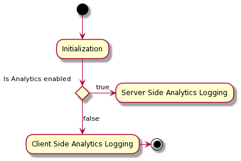

# Experience Platform Web SDK中的Adobe Analytics for Target (A4T)日志记录

使用Adobe Target进行个性化时，您可以选择用于性能测量的系统。 每个[Target活动](https://experienceleague.adobe.com/docs/target/using/activities/target-activities-guide.html?lang=zh-Hans)都允许您在Target报表和Adobe Analytics报表之间进行选择。

如果您使用的是Analytics报表，则Adobe Target必须向Analytics传达以下信息：

* 访客已进入哪个Adobe Target活动
* 他们看到的体验
* 已达到哪个转化

Adobe Experience Platform Web SDK支持Analytics for Target (A4T)用例中的两种类型的Analytics日志记录：

| 日志记录方法 | 描述 |
| --- | --- |
| 服务器端Analytics日志 | 通过Edge Network发送的所有Analytics点击量在服务器端都通过Target详细信息进行增强，而无需经过点击拼合过程。 |
| 客户端Analytics日志 | Target数据在客户端返回，允许您使用[数据插入API](https://experienceleague.adobe.com/docs/analytics/import/c-data-insertion-api.html?lang=zh-Hans)手动扩充数据并将其发送到Analytics。 |

日志记录方法取决于您是否对配置的[数据流](../../../../datastreams/overview.md)启用了Adobe Analytics：

## 后续步骤

本文档简要介绍Web SDK中A4T数据的各种记录方法。 有关每种方法的更多详细信息，请参阅以下文档：

* [Experience Platform Web SDK中的A4T数据的服务器端日志记录](./server-side.md)
* [Experience Platform Web SDK中的A4T数据的客户端日志记录](./client-side.md)
