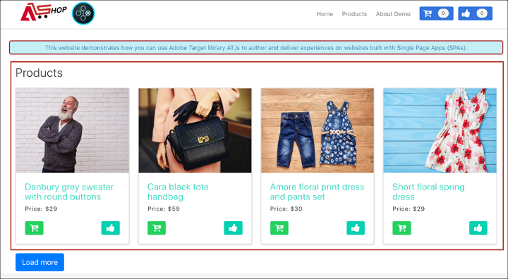
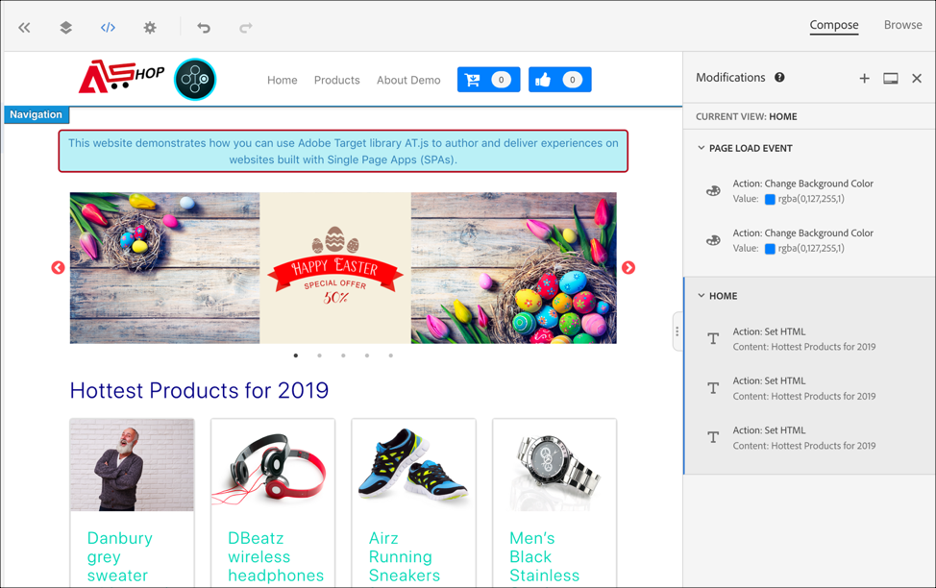

# 单页应用程序实施

Adobe Experience Platform Web SDK提供了丰富的功能，使您的企业能够在下一代客户端技术(如单页应用程序(SPA))上实现个性化。

传统网站使用的是“页面到页面”导航模型，也称为多页应用程序，其中网站设计与URL紧密耦合，并且从一个网页转换到另一个网页时，需要页面加载。

而现代Web应用程序（如单页应用程序）采用的模型可以提高浏览器UI渲染的速度，这种渲染通常与页面重新加载无关。 这些体验可以通过客户交互触发，例如滚动、点击和光标移动。 随着现代Web范例的不断发展，传统的通用事件（如页面加载）与部署个性化和实验不再具有相关性。


## 适用于SPA的Experience Platform Web SDK的优势

在单页应用程序中使用Adobe Experience Platform Web SDK具有以下好处：

* 能够在页面加载时缓存所有选件，将多次服务器调用减少至一次服务器调用。
* 由于选件是通过缓存立即显示的，不存在传统服务器调用引入的时间延迟，因此极大地提升了网站上的用户体验。
* 通过一行代码和一次性开发人员设置，营销人员能够通过SPA上的可视化体验编辑器(VEC)创建和运行A/B和体验定位(XT)活动。

## XDM视图和单页应用程序

适用于SPA的Adobe Target VEC利用了称为“视图”的概念，即视觉元素的逻辑组合，这些元素共同构成了SPA体验。 因此，单页应用程序可以被视为基于用户交互通过视图（而不是URL）进行转换。 “视图”通常可以表示整个站点或某个站点中分组的可视化元素。

为了进一步说明视图是什么，以下示例使用在React中实施的假想在线电子商务网站来探索示例视图。

导航到主页后，主页图像会宣传复活节促销活动以及网站上提供的最新产品。 在这种情况下，可以为整个主屏幕定义视图。 此视图可以简单地称为“home”。


随着客户对该企业销售的产品越来越感兴趣，他们决定单击&#x200B;**产品**&#x200B;链接。 与主页站点类似，可将整个产品站点定义为视图。 此视图可命名为“products-all”。


由于视图可以定义为整个站点或站点上的一组可视化元素，因此产品站点上显示的四个产品可以分组并视为视图。 此视图可命名为“products”。



当客户决定单击&#x200B;**Load More**&#x200B;按钮浏览站点上的更多产品时，在此情况下，网站URL不会更改，但可以在此处创建视图以仅表示显示的第二行产品。 视图名称可以是“products-page-2”。


客户决定从站点购买一些产品并进入结账屏幕。 在结账站点上，客户可以选择正常递送或快递。 “视图”可以是网站上的任意一组可视化元素，因此可以为投放首选项创建一个视图，并将其称为“投放首选项”。


视图的概念可以进一步扩展。 这些只是可以在网站上定义的视图的几个示例。

## 实施XDM视图

在Adobe Target中可利用XDM视图，以使营销人员能够通过可视化体验编辑器在SPA上运行A/B和XT测试。 这需要执行以下步骤以完成一次性开发人员设置：

1. 安装[Adobe Experience Platform Web SDK](/help/web-sdk/install/overview.md)
2. 确定单页应用程序中要个性化的所有XDM视图。
3. 定义XDM视图后，为了交付AB或XT VEC活动，请在单页应用程序中实施`sendEvent()`函数并将`renderDecisions`设置为`true`以及相应的XDM视图。 必须在`xdm.web.webPageDetails.viewName`中传递XDM视图。 此步骤允许营销人员利用可视化体验编辑器为这些XDM启动A/B和XT测试。

   ```javascript
   alloy("sendEvent", { 
     "renderDecisions": true, 
     "xdm": { 
       "web": { 
         "webPageDetails": { 
         "viewName":"home" 
         }
       } 
     } 
   });
   ```

>[!NOTE]
>
>在第一个`sendEvent()`调用中，将获取并缓存所有应该呈现给最终用户的XDM视图。 将从缓存中读取后续的`sendEvent()`调用（已传入XDM视图），并在没有服务器调用的情况下进行渲染。

## `sendEvent()`函数示例

本节概述了三个示例，说明如何在React中为假定的电子商务SPA调用`sendEvent()`函数。

### 示例1：A/B测试主页

营销团队想要在整个主页上运行A/B测试。


要在整个主页网站上运行A/B测试，必须在将XDM `viewName`设置为`home`的情况下调用`sendEvent()`：

```jsx
function onViewChange() { 
  
  var viewName = window.location.hash; // or use window.location.pathName if router works on path and not hash 

  viewName = viewName || 'home'; // view name cannot be empty 

  // Sanitize viewName to get rid of any trailing symbols derived from URL 

  if (viewName.startsWith('#') || viewName.startsWith('/')) { 
    viewName = viewName.substr(1); 
  }
   
  alloy("sendEvent", { 
    "renderDecisions": true, 
    "xdm": { 
      "web": { 
        "webPageDetails": { 
          "viewName":"home" 
        } 
      } 
    }
  }); 
} 

// react router v4 

const history = syncHistoryWithStore(createBrowserHistory(), store); 

history.listen(onViewChange); 

// react router v3 

<Router history={hashHistory} onUpdate={onViewChange} > 
```

### 示例2：个性化产品

营销团队想要在用户单击&#x200B;**加载更多**&#x200B;后将价格标签颜色更改为红色，以对第二行产品进行个性化。


```jsx
function onViewChange(viewName) { 

  alloy("sendEvent", { 
    "renderDecisions": true, 
    "xdm": { 
      "web": { 
        "webPageDetails": { 
          "viewName": viewName
        }
      } 
    } 
  }); 
} 

class Products extends Component { 
  
  render() { 
    return ( 
      <button type="button" onClick={this.handleLoadMoreClicked}>Load more</button> 
    ); 
  } 

  handleLoadMoreClicked() { 
    var page = this.state.page + 1; // assuming page number is derived from component's state 
    this.setState({page: page}); 
    onViewChange('PRODUCTS-PAGE-' + page); 
  } 

} 
```

### 示例3：A/B测试投放首选项

营销团队想要运行A/B测试，以查看在选择&#x200B;**快递**&#x200B;后将按钮的颜色从蓝色更改为红色是否可以提高转化率（与将两个交付选项的按钮颜色保持为蓝色相反）。


要根据所选的投放首选项来对网站上的内容进行个性化，可以为每个投放首选项创建一个视图。 选择&#x200B;**Normal Delivery**&#x200B;时，可以将视图命名为“checkout-normal”。 如果选择&#x200B;**Express Delivery**，则可以将视图命名为“checkout-express”。

```jsx
function onViewChange(viewName) { 
  alloy("sendEvent", { 
    "renderDecisions": true, 
    "xdm": { 
      "web": { 
        "webPageDetails": { 
          "viewName": viewName 
        }
      }
    }
  }); 
} 

class Checkout extends Component { 

  render() { 
    return ( 
      <div onChange={this.onDeliveryPreferenceChanged}> 
        <label> 
          <input type="radio" id="normal" name="deliveryPreference" value={"Normal Delivery"} defaultChecked={true}/> 
          <span> Normal Delivery (7-10 business days)</span> 
        </label> 
        <label> 
          <input type="radio" id="express" name="deliveryPreference" value={"Express Delivery"}/> 
          <span> Express Delivery* (2-3 business days)</span> 
        </label> 
      </div> 
    ); 
  } 

  onDeliveryPreferenceChanged(evt) { 
    var selectedPreferenceValue = evt.target.value; 
    onViewChange(selectedPreferenceValue); 
  } 

} 
```

## 使用适用于SPA的可视化体验编辑器

当您完成定义XDM视图并使用传入的XDM视图实施`sendEvent()`时，VEC将能够检测到这些视图，并允许用户为A/B或XT活动创建操作和修改。

>[!NOTE]
>
>要将VEC用于SPA，您必须安装并激活[Firefox](https://addons.mozilla.org/en-US/firefox/addon/adobe-target-vec-helper/)或[Chrome](https://chrome.google.com/webstore/detail/adobe-target-vec-helper/ggjpideecfnbipkacplkhhaflkdjagak) VEC Helper扩展。

### “修改”面板

修改面板可捕获为特定视图创建的操作。 视图的所有操作将分组到该视图下。


### 操作

单击某个操作会突出显示将应用此操作的网站上的元素。 在视图下创建的每个VEC操作都具有以下图标： **信息**、**编辑**、**克隆**、**移动**&#x200B;和&#x200B;**删除**。 下表将更详细地解释这些图标。


| 图标 | 描述 |
|---|---|
| 信息 | 显示操作的详细信息。 |
| Edit | 允许您直接编辑操作的属性。 |
| 克隆 | 将操作克隆到位于“修改”面板上的一个或多个视图，或者您在VEC中浏览并导航到的一个或多个视图。 该操作不一定存在于修改面板中。<br/><br/>**注意：**&#x200B;完成克隆操作后，必须通过“浏览”导航到VEC中的视图，以查看克隆操作是否有效。 如果该操作未应用到视图，您将看到一个错误。 |
| 移动 | 将操作移动到页面加载事件或修改面板中已存在的任何其他视图。<br/><br/>**页面加载事件：**&#x200B;与页面加载事件对应的任何操作会应用于Web应用程序的初始页面加载。 <br/><br/>**注意：**&#x200B;完成移动操作后，必须通过“浏览”导航到VEC中的视图，以查看移动操作是否有效。 如果该操作未应用到视图，您将看到一个错误。 |
| Delete | 删除操作。 |

## 使用SPA VEC示例

此部分概述了三个使用可视化体验编辑器为A/B或XT活动创建操作和修改的示例。

### 示例1：更新“主页”视图

在本文档之前，为整个home站点定义了一个名为“home”的视图。 现在，营销团队想要通过以下方式更新“主页”视图：

* 将&#x200B;**添加到购物车**&#x200B;和&#x200B;**类似**&#x200B;按钮更改为较浅的蓝色部分。 此操作应在页面加载期间发生，因为它涉及更改页眉的组件。
* 将&#x200B;**2019年最新产品**&#x200B;标签更改为&#x200B;**2019年最畅销产品**，并将文本颜色更改为紫色。

要在VEC中进行这些更新，请选择&#x200B;**撰写**&#x200B;并将这些更改应用于“主页”视图。



### 示例2：更改产品标签

对于“products-page-2”视图，营销团队希望将&#x200B;**Price**&#x200B;标签更改为&#x200B;**Sale Price**，并将标签颜色更改为红色。

要在VEC中进行这些更新，需要执行以下步骤：

1. 在VEC中选择&#x200B;**浏览**。
2. 在网站的顶部导航中选择&#x200B;**产品**。
3. 选择&#x200B;**Load More** once查看第二行产品。
4. 在VEC中选择&#x200B;**撰写**。
5. 应用操作以将文本标签更改为&#x200B;**销售价格**，并将颜色更改为红色。


### 示例3：个性化投放偏好设置样式

可以在粒度级别定义视图，如单选按钮中的状态或选项。 本文档前面为投放首选项“checkout-normal”和“checkout-express”定义了视图。 营销团队想要将“checkout-express”视图的按钮颜色更改为红色。

要在VEC中进行这些更新，需要执行以下步骤：

1. 在VEC中选择&#x200B;**浏览**。
2. 将产品添加到网站上的购物车。
3. 选择网站右上角的购物车图标。
4. 选择&#x200B;**结帐订单**。
5. 选择&#x200B;**递送首选项**&#x200B;下的&#x200B;**快递**&#x200B;单选按钮。
6. 在VEC中选择&#x200B;**撰写**。
7. 将&#x200B;**付费**&#x200B;按钮颜色更改为红色。

>[!NOTE]
>
>在选择&#x200B;**Express Delivery**&#x200B;单选按钮之前，“checkout-express”视图不会出现在“修改”面板中。 这是因为在选择&#x200B;**Express Delivery**&#x200B;单选按钮时执行`sendEvent()`函数，因此，在选择单选按钮之前，VEC不会察觉“checkout-express”视图。


