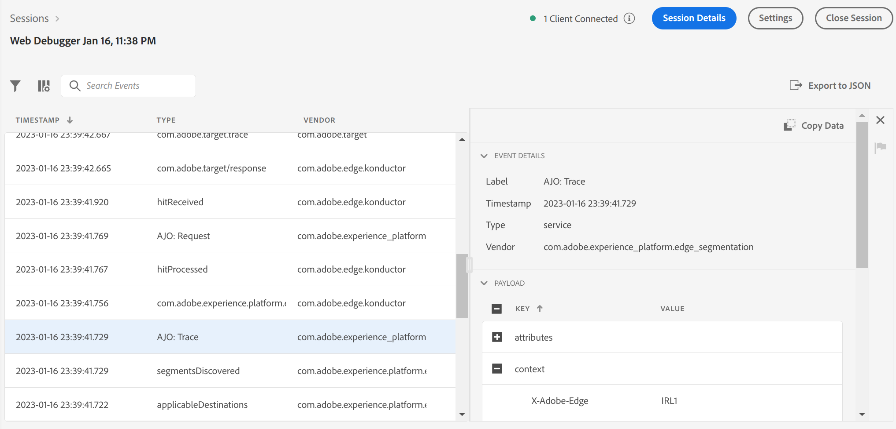

# 将[!DNL Adobe Journey Optimizer]与[!DNL Experience Platform Web SDK]一起使用

[!DNL Adobe Experience Platform] [!DNL Web SDK]可以将在[!DNL Adobe Journey Optimizer]中管理的个性化体验交付并渲染到Web渠道。 您可以使用WYSIWYG编辑器[!DNL Adobe Journey Optimizer] [Web渠道](https://experienceleague.adobe.com/docs/journey-optimizer/using/web/create-web.html)或非可视化界面[基于代码的体验渠道](https://experienceleague.adobe.com/en/docs/journey-optimizer/using/code-based-experience/get-started-code-based)创建、激活和提供[!DNL Journey Optimizer Web]营销活动和个性化体验。

>[!IMPORTANT]
>
>阅读[Adobe Journey Optimizer Web渠道文档](https://experienceleague.adobe.com/docs/journey-optimizer/using/web/get-started-web.html?lang=zh-Hans)以了解有关[!DNL Journey Optimizer Web]体验创作和报告快速入门的信息。

## 术语 {#terminology}

**[!UICONTROL 表面]**： Web表面是通过URI标识的页面上的网页或位置，将在其中传递[!DNL Adobe Journey Optimizer]体验内容。

**[!UICONTROL 建议]**：在[!DNL Adobe Journey Optimizer]中，建议与从[!DNL Journey Optimizer Campaign]中选择的体验相关联。

## 正在启用[!DNL Adobe Journey Optimizer] {#enable-ajo}

要开始使用[!DNL Adobe Journey Optimizer]，请执行以下步骤。

1. 从[!DNL Adobe Journey Optimizer] [Web体验指南](https://experienceleague.adobe.com/docs/journey-optimizer/using/web/create-web.html)中查看[先决条件](https://experienceleague.adobe.com/docs/journey-optimizer/using/web/create-web.html#prerequesites)，具体为：
   * 设置[!DNL Adobe Experience Cloud Visual Editing Helper]。
   * 在[数据流](../../../datastreams/overview.md)中启用[!DNL Adobe Journey Optimizer]。
   * 启用[!UICONTROL Edge上的活动合并策略]选项。

2. 将`renderDecisions`选项添加到您的事件。 将`renderDecisions`设置为`true`以在网页表面上自动呈现已交付的Journey Optimizer内容建议。

   ```javascript
   alloy("sendEvent", {
       ...,
       "renderDecisions": true
   })
   ```

3. （可选）在事件中指定其他表面。 默认情况下，Web SDK将自动为当前网页生成Web表面，并将其包含在Edge Network请求中。 如果需要，可以通过在`sendEvent`命令的`personalization.surfaces`选项中或在Web SDK扩展的相应&#x200B;**[!UICONTROL Surfaces]** [[!UICONTROL 发送事件]操作](../../../tags/extensions/client/web-sdk/action-types.md#send-event)配置中指定这些表面来在请求中包含其他表面。

   ```javascript
   alloy("sendEvent", {
       ...
       "personalization": {
           "surfaces": [ "web://my.site.com/about.html", "web://my.site.com/contact.html" ]
       }
   })
   ```

   

   事件表面包含在`query.personalization.surfaces`请求字段中：

   ```json
   {
   "events": [
       {
           "query": {
               "personalization": {
               "schemas": [
                   ...
               ],
               "decisionScopes": [
                   "__view__"
               ],
               "surfaces": [
                   "web://ajostage.weebly.com/"
               ]
               }
           },
           ...
       }
   ]
   }
   ```

4. 与其他个性化功能类似，您可以添加&#x200B;**[预隐藏代码片段](../manage-flicker.md)**，以便在获取体验时仅隐藏页面的某些部分。

## 创建Adobe Journey Optimizer Web体验 {#create-ajo-web-experiences}

按照[!DNL Adobe Journey Optimizer] [Web体验指南](https://experienceleague.adobe.com/docs/journey-optimizer/using/web/create-web.html)中的[Web营销活动创作](https://experienceleague.adobe.com/docs/journey-optimizer/using/web/create-web.html#create-web-campaign)说明创建[!DNL Journey Optimizer Web]营销活动和体验。

## 呈现个性化内容 {#rendering-personalized-content}

有关详细信息，请参阅有关[渲染个性化内容](../rendering-personalization-content.md)的文档。

Web表面的Adobe Journey Optimizer建议的处理方式与`__view__`决策范围建议类似。 具体而言，当`sendEvent`命令中的`renderDecisions`选项设置为`true`时，Web SDK将自动渲染这些选项。

Journey Optimizer内容建议示例：

```json
{
    "scope": "web://ajostage.weebly.com/",
    "scopeDetails": {
        "correlationID": "ccfaf19c-6360-4aea-b464-0cf924db5da7",
        "characteristics": {
            "eventToken": "eyJtZXNzYWdlRXhlY3V0aW9uIjp7Im1lc3NhZ2VFeGVjdXRpb25JRCI6ImEzNDYxYTMzLTc5MjktNGQyNS1hNmMxLTVkYzM2YWY1NzRmMyIsIm1lc3NhZ2VJRCI6ImNjZmFmMTljLTYzNjAtNGFlYS1iNDY0LTBjZjkyNGRiNWRhNyIsIm1lc3NhZ2VUeXBlIjoibWFya2V0aW5nIiwiY2FtcGFpZ25JRCI6IjEzN2JmMzllLWM1ODgtNGI1My1iODQxLTJiMWZiZDYxM2JkYiIsImNhbXBhaWduVmVyc2lvbklEIjoiMTA1NzY1MmEtZWYwNS00YjE3LWExMmUtY2FlOTQyOTFhMWFjIiwiY2FtcGFpZ25BY3Rpb25JRCI6ImViNTlmODQ4LTk5ZDYtNGE1OC05YmU4LTk4MjIxODU0NmYzNiIsIm1lc3NhZ2VQdWJsaWNhdGlvbklEIjoiYzg2NzFjZmItNDdjYS00YTVjLTg4Y2YtNzYwZDFlZjU1MzQyIn0sIm1lc3NhZ2VQcm9maWxlIjp7ImNoYW5uZWwiOnsiX2lkIjoiaHR0cHM6Ly9ucy5hZG9iZS5jb20veGRtL2NoYW5uZWxzL3dlYiIsIl90eXBlIjoiaHR0cHM6Ly9ucy5hZG9iZS5jb20veGRtL2NoYW5uZWwtdHlwZXMvd2ViIn0sIm1lc3NhZ2VQcm9maWxlSUQiOiI2YTViY2I3ZC02MmYxLTQ5NDItODRkMC02MzE5ZjM5Zjk1ZGUifX0="
        },
        "decisionProvider": "AJO",
        "activity": {
            "id": "137bf39e-c588-4b53-b841-2b1fbd613bdb#eb59f848-99d6-4a58-9be8-982218546f36"
        }
    },
    "id": "002321c0-dff5-4153-b171-a9dfb70b9750",
    "items": [
        {
            "schema": "https://ns.adobe.com/personalization/dom-action",
            "data": {
                "uiData": {
                    "tagType": "Text",
                    "actionType": "changed"
                },
                "content": "Welcome AJO!",
                "prehidingSelector": "#wsite-content > DIV:nth-of-type(2) > DIV:nth-of-type(1) > DIV:nth-of-type(1) > DIV:nth-of-type(1) > DIV:nth-of-type(1) > DIV:nth-of-type(3) > FONT:nth-of-type(1) > SPAN:nth-of-type(1)",
                "type": "setHtml",
                "selector": "#wsite-content > DIV.wsite-section-wrap:eq(1) > DIV.wsite-section:eq(0) > DIV.wsite-section-content:eq(0) > DIV.container:eq(0) > DIV.wsite-section-elements:eq(0) > DIV.paragraph:eq(0) > FONT:nth-of-type(1) > SPAN:nth-of-type(1)"
            },
            "id": "0a522f66-9e6a-4ded-b1d0-e9167f103290"
        },
        {
            "schema": "https://ns.adobe.com/personalization/dom-action",
            "data": {
                "uiData": {
                    "tagType": "Text",
                    "actionType": "changed"
                },
                "content": {
                    "font-weight": "bold"
                },
                "prehidingSelector": "#wsite-content > DIV:nth-of-type(2) > DIV:nth-of-type(1) > DIV:nth-of-type(1) > DIV:nth-of-type(1) > DIV:nth-of-type(1) > DIV:nth-of-type(3) > FONT:nth-of-type(1) > SPAN:nth-of-type(1)",
                "type": "setStyle",
                "selector": "#wsite-content > DIV.wsite-section-wrap:eq(1) > DIV.wsite-section:eq(0) > DIV.wsite-section-content:eq(0) > DIV.container:eq(0) > DIV.wsite-section-elements:eq(0) > DIV.paragraph:eq(0) > FONT:nth-of-type(1) > SPAN:nth-of-type(1)"
            },
            "id": "66216ca5-5d0f-4239-a8c8-6bc4a5a7cbdb"
        }
    ]
}
```

## 调试 {#debugging}

要调试Adobe Journey Optimizer个性化实施，请使用[Web SDK调试](/help/web-sdk/use-cases/debugging.md)。 使用[[!DNL Adobe Experience Platform Assurance]](https://developer.adobe.com/client-sdks/documentation/platform-assurance/)进行故障排除时，有[!DNL Adobe Journey Optimizer]调试跟踪可用。 检查前缀为`AJO:`的事件。


