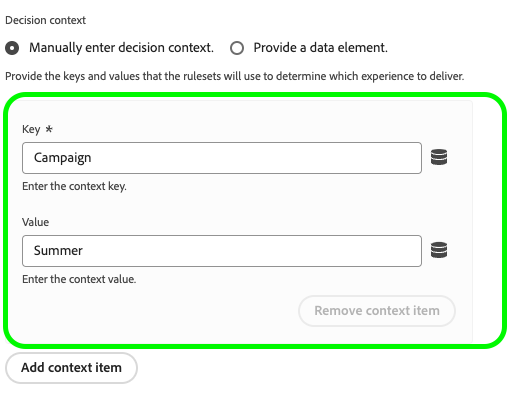

# 在Web SDK中配置Web应用程序内消息传送支持

应用程序内消息是指通知，您可以在Web应用程序中向用户发送这些通知，可引导用户访问特定的目标点。

您可以将这些通知用于不同的目的，例如推广新功能、提供特殊优惠或帮助用户入门。

通过使用应用程序内消息，您可以有效地与受众互动，并引导他们了解应用程序的重要方面。

>[!IMPORTANT]
>
>Web应用程序内消息传送是[Adobe Journey Optimizer](https://experienceleague.adobe.com/docs/journey-optimizer/using/ajo-home.html?lang=zh-Hans)功能，它使用Web SDK提供个性化内容。
>
>有关如何配置Web应用程序内消息传送活动的详细说明，请参阅[Adobe Journey Optimizer文档](https://experienceleague.adobe.com/docs/journey-optimizer/using/in-app/create-in-app-web.html)。


## 先决条件 {#prerequisites}

### Web SDK标记扩展版本 {#extension-version}

Web应用程序内消息传送功能需要最新版本的Web SDK标记扩展。

### 为Web应用程序内消息传递配置CSP {#csp}

在配置[Web应用程序内消息传送](../personalization/web-in-app-messaging.md)时，必须在CSP中包含以下指令：

```
default-src  blob:;
```

有关配置CSP的详细信息，请参阅[专用文档](../use-cases/configuring-a-csp.md)。

## 使用Web SDK标记扩展配置Web应用程序内消息传递 {#tag-extension}

请参阅[Web SDK标记扩展配置页面](../../tags/extensions/client/web-sdk/web-sdk-extension-configuration.md)，了解可在何处找到下述设置。

在您[安装](../../tags/extensions/client/web-sdk/web-sdk-extension-configuration.md#install-the-web-sdk-tag-extension) Web SDK标记扩展后，请按照以下步骤配置Web应用程序内消息传送的扩展。

在&#x200B;**[!UICONTROL Personalization]**&#x200B;部分中，选中&#x200B;**[!UICONTROL 启用个性化存储]**&#x200B;选项。 此选项允许Web SDK跟踪用户在页面加载过程中看到了哪些体验。


Web应用程序内消息传送支持两种类型的触发器：

* [将数据发送到Experience Platform](#send-data-platform)
* [手动触发消息](#manual-trigger)

请参阅以下部分，以根据要使用的触发器配置Web SDK标记扩展。

### **[!UICONTROL 将数据发送到Experience Platform]**&#x200B;触发器的配置步骤 {#send-data-platform}

选择包含您的Web SDK扩展的标记属性，然后[使用以下设置创建一个新规则](../../tags/ui/managing-resources/rules.md##create-a-rule)：

1. **[!UICONTROL 扩展]**： [!UICONTROL 核心]
2. **[!UICONTROL 事件类型]**：[!UICONTROL 已加载库（页面顶部）]

   

3. 选择&#x200B;**[!UICONTROL 保留更改]**&#x200B;以保存事件配置。

接下来，必须将操作添加到您创建的规则中。

1. 在[!DNL Actions]部分中，选择&#x200B;**[!UICONTROL 添加]**。
   

2. 使用以下&#x200B;**[!UICONTROL 操作]**&#x200B;设置：
   * **[!UICONTROL 扩展]**：[!UICONTROL Adobe Experience Platform Web SDK]
   * **[!UICONTROL 操作类型]**： [!UICONTROL 发送事件]

     

3. 在屏幕右侧的&#x200B;**[!UICONTROL Personalization]**&#x200B;部分中，启用&#x200B;**[!UICONTROL 呈现可视化个性化决策]**选项。
   

4. 在屏幕右侧的&#x200B;**[!UICONTROL 决策上下文]**&#x200B;部分中，定义您在促销活动配置中使用的&#x200B;**[!UICONTROL 键]**/**[!UICONTROL 值]**对，以符合应用程序内消息的条件。
   

5. 选择&#x200B;**[!UICONTROL 保留更改]**&#x200B;以保存您的配置。


接下来，必须将新创建的规则添加到标记属性库中。 为此，请转到&#x200B;**[!UICONTROL 发布流]**&#x200B;并选择您之前创建的规则。


将规则添加到库后，选择&#x200B;**[!UICONTROL Save &amp; Build to Development]**。


配置过程现已完成，您的消息已准备好向用户显示。

### 使用手动触发器的配置步骤 {#manual-trigger}

选择包含您的Web SDK扩展的标记属性，然后[使用以下设置创建一个新规则](../../tags/ui/managing-resources/rules.md##create-a-rule)：

1. **[!UICONTROL 扩展]**： [!UICONTROL 核心]
2. **[!UICONTROL 事件类型]**：[!UICONTROL 点击]
3. 为页面上的特定元素设置触发器，该触发器由您选择的CSS选择器标识。

   


接下来，必须将操作添加到您创建的规则中。

1. 在[!DNL Actions]部分中，选择&#x200B;**[!UICONTROL 添加]**。
   

2. 使用以下&#x200B;**[!UICONTROL 操作]**&#x200B;设置：
   * **[!UICONTROL 扩展]**：[!UICONTROL Adobe Experience Platform Web SDK]
   * **[!UICONTROL 操作类型]**： [!UICONTROL 评估规则集]

     

3. 在屏幕右侧，启用&#x200B;**[!UICONTROL 呈现可视化个性化决策]**选项。
   


4. 在屏幕右侧的&#x200B;**[!UICONTROL 决策上下文]**&#x200B;部分中，定义您在促销活动配置中使用的&#x200B;**[!UICONTROL 键]**/**[!UICONTROL 值]**对，以符合应用程序内消息的条件。
   

5. 选择&#x200B;**[!UICONTROL 保留更改]**&#x200B;以保存您的配置。

接下来，必须将新创建的规则添加到标记属性库中。 为此，请转到&#x200B;**[!UICONTROL 发布流]**&#x200B;并选择您之前创建的规则。


将规则添加到库后，选择&#x200B;**[!UICONTROL Save &amp; Build to Development]**。


配置过程现已完成，您的消息已准备好向用户显示。

## 使用Web SDK JavaScript库配置Web应用程序内消息传送 {#js-library}

除了使用Web SDK标记扩展之外，您还可以直接从Web SDK JavaScript库配置Web应用程序内消息传送。


您可以通过两种方式显示来自Adobe Journey Optimizer的Web应用程序内消息。

### 方法1：自动获取个性化内容 {#automatic}

要让Web SDK在页面加载时自动获取个性化内容，请使用`sendEvent`命令，如以下示例所示。

```js
  alloy("sendEvent", {
      renderDecisions: true,
      personalization: {
          surfaces: ['#welcome']
      }
  });
```

### 方法2：根据用户操作手动获取个性化内容 {#manual}

要仅在用户执行特定操作后显示个性化内容，请使用`evaluateRulesets`命令，如下面的示例所示。

在此示例中，当用户单击您网站上的&#x200B;**[!UICONTROL 立即购买]**&#x200B;按钮时，会显示个性化内容。

```js
 alloy("evaluateRulesets", {
     renderDecisions: true,
     personalization: {
         decisionContext: {
             "userAction": "buy_now"
         }
     }
 });
```

### 配置个性化存储 {#personalization-storage}

通过`personalizationStorageEnabled`配置选项，您可以选择向用户显示设置的次数或每次访问页面时显示的应用程序内消息。

在[Web SDK配置](../commands/configure/overview.md)中，根据需要设置`personalizationStorageEnabled`选项：

* `personalizationStorageEnabled: true`将按您在[Adobe Journey Optimizer促销活动](https://experienceleague.adobe.com/docs/journey-optimizer/using/in-app/create-in-app-web.html#configure-inapp)中定义的频率触发应用程序内消息。
* 每次加载页面时，`personalizationStorageEnabled: false`都会触发应用程序内消息。
