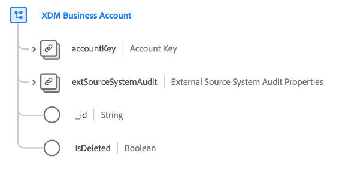

# [!UICONTROL XDM业务帐户] 类

>[!IMPORTANT]
>
>此类由具有访问权限的组织使用 [Adobe Real-time Customer Data Platform B2B版本](../../../rtcdp/b2b-overview.md). 您必须有权访问Real-Time CDP B2B版本，此类才能参与 [Real-time Customer Profile](../../../profile/home.md).

[!UICONTROL XDM业务帐户] 是一个标准体验数据模型(XDM)类，可捕获企业帐户的最低要求属性。

| 属性 | 数据类型 | 描述 |
| --- | --- | --- |
| `accountKey` | [[!UICONTROL B2B源]](../../data-types/b2b-source.md) | 帐户实体的复合标识符。 |
| `extSourceSystemAudit` | [[!UICONTROL 外部源系统审计属性]](../../data-types/external-source-system-audit-attributes.md) | 如果帐户来自外部源系统，则此对象将捕获该系统的审核属性。 |
| `_id` | 字符串 | 记录的唯一标识符。 这是系统生成的值，与 `accountKey` 标识符。 |
| `isDeleted` | 布尔值 | 指示此帐户实体是否已在Marketo Engage中删除。  使用时 [Marketo源连接器](../../../sources/connectors/adobe-applications/marketo/marketo.md)，则在Marketo中删除的任何记录都会自动反映在实时客户档案中。 但是，与这些用户档案相关的记录仍可能会保留在数据湖中。 通过设置 `isDeleted` 到 `true`中，您可以使用字段在查询数据湖时筛选出已从源中删除的记录。 |

{style="table-layout:auto"}

请参阅指南，网址为 [Real-Time CDP B2B版本中的架构关系](../../tutorials/relationship-b2b.md) 了解此类在概念上如何与其他B2B类相关联，以及如何在Adobe Experience Platform UI中建立这些关系。
