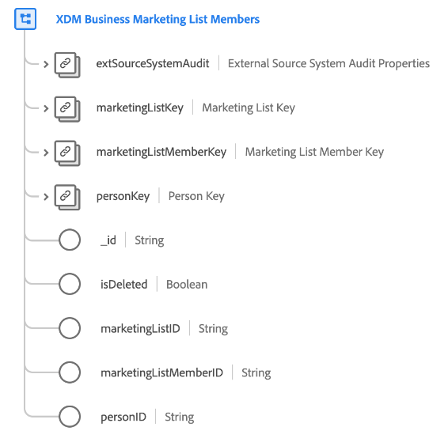

# [!UICONTROL XDM商业营销列表成员]类

>[!IMPORTANT]
>
>此类供具有[Adobe Real-time Customer Data Platform B2B版本](../../../rtcdp/b2b-overview.md)访问权限的组织使用。 您必须有权访问Real-Time CDP B2B版本，此类才能参与[实时客户个人资料](../../../profile/home.md)。

[!UICONTROL XDM业务营销列表成员]是一个标准的体验数据模型(XDM)类，用于描述与营销列表关联的成员、人员或联系人。

| 属性 | 数据类型 | 描述 |
| --- | --- | --- |
| `extSourceSystemAudit` | [[!UICONTROL 外部Source系统审核属性]](../../data-types/external-source-system-audit-attributes.md) | 如果营销列表成员资格来自外部源系统，则此对象将捕获该系统的审核属性。 |
| `marketingListKey` | [[!UICONTROL B2B Source]](../../data-types/b2b-source.md) | 人员所属的营销列表的复合标识符。 |
| `marketingListMemberKey` | [[!UICONTROL B2B Source]](../../data-types/b2b-source.md) | 营销列表成员资格实体的复合标识符。 |
| `personKey` | [[!UICONTROL B2B Source]](../../data-types/b2b-source.md) | 营销列表成员的人员的复合标识符。 |
| `_id` | 字符串 | 记录的唯一标识符。 这是系统生成的值，与`marketingListMemberID`不同。 |
| `isDeleted` | 布尔值 | 指示此营销列表成员实体是否已在Marketo Engage中删除。  使用[Marketo源连接器](../../../sources/connectors/adobe-applications/marketo/marketo.md)时，在Marketo中删除的任何记录都会自动反映在实时客户配置文件中。 但是，与这些用户档案相关的记录仍可能会保留在数据湖中。 通过将`isDeleted`设置为`true`，您可以在查询数据湖时使用该字段过滤出已从源中删除的记录。 |
| `marketingListID` | 字符串 | 营销列表的唯一ID。 |
| `marketingListMemberID` | 字符串 | 营销列表成员资格实体的唯一ID。 |
| `personId` | 字符串 | 人员的唯一ID。 |

{style="table-layout:auto"}

请参阅有关Real-Time CDP B2B版本[&#128279;](../../tutorials/relationship-b2b.md)中的架构关系的指南，以了解此类如何在概念上与其他B2B类相关联，以及如何在Adobe Experience Platform UI中建立这些关系。
